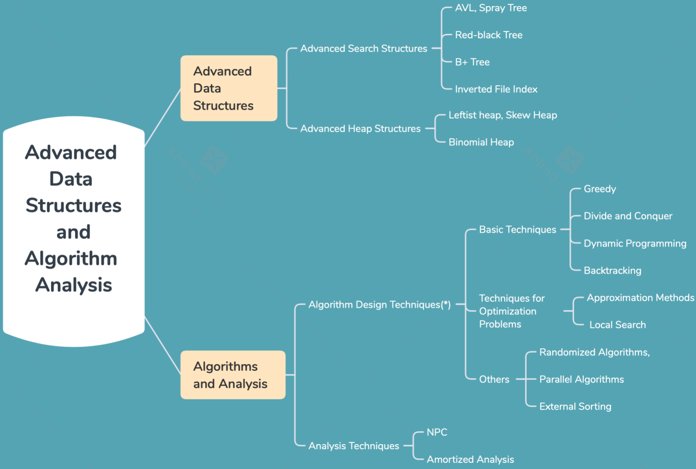
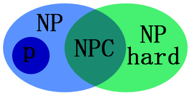
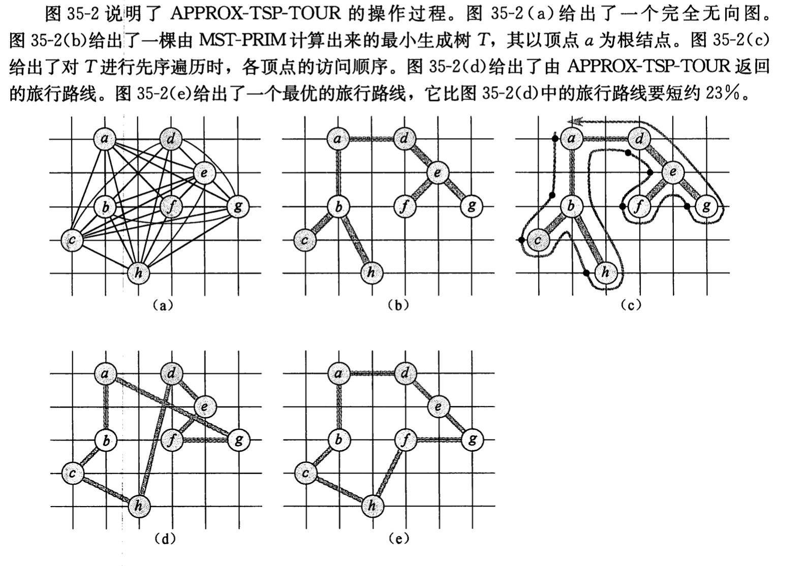
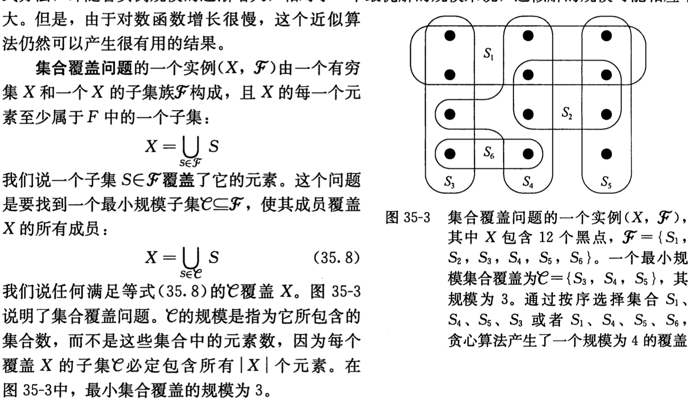
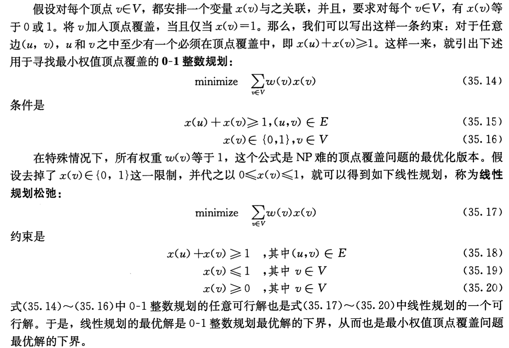
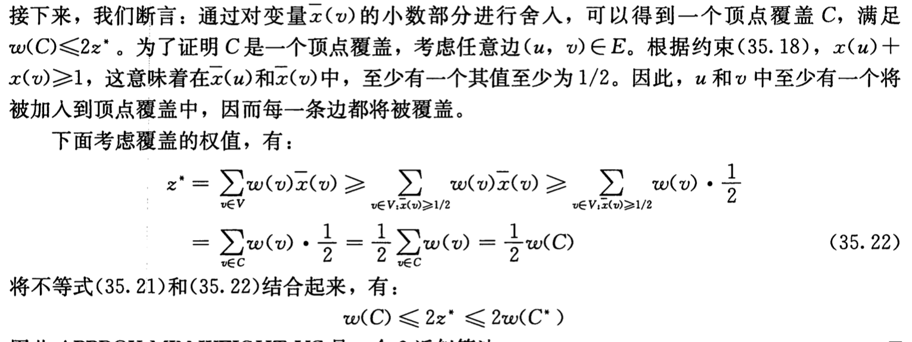

[TOC]

# Outline



# NPC

## Computational Complexity

https://blog.csdn.net/huang1024rui/article/details/49154507

相似

| P             | NP           |
| ------------- | ------------ |
| Euler         | Hamilton     |
| Shortest Path | Longest Path |
| 2-CNF         | 3-CNF        |

**可计算理论(Computability Theory**)

* 可计算性Computability
* 计算复杂性Computational Complexity

**Piano公理，实数完备性**

Hilbert 23问之一：Question of **Decidability**: Could there exist, at least in principle, any definite method or process by which all mathematical questions could be decided?

Kurt Gödel不完备定理: not all true statements that evolve from an axiomatic system can be proven – we can never know everything nor prove everything we discover.

不可判断问题

> Ex. Halting problem：能否写出一个程序，判断给定程序是否会死循环？
>
> 不存在。反证：假设存在，则必能自查，无穷套娃(recursively undecidable)
>
> \\	下面这个Loop不是停机程序。。。停机程序是在"P(P) loops?"这边用到的
>
> ```cpp
> Loop( P ) {
> /* 1：若会死循环则输出"Yes" */
>  if ( P(P) loops )
>      print (YES);
> /* 2：为什么要这样？而不是print(NO) */
>  else
>      infinite_loop();	// 如 while(1){}
> }
> // 若 &P = Loop
> // Terminate --> 2 --> 意味着是Loops
> // Loops --> 1 --> 意味着是Terminate
> // 效果同“这句话是假话”
> // 出错的地方只能在于 "P(P) loops"(其他地方不可能有错)，因为这是无法判断的
> ```
>
> 类似于理发师悖论

## 计算模型

* 递归函数

    * 分为初始函数、递归算子(用于构造复杂函数的递推关系)
    * Ex. 加法：`f(m,0)=m; f(m,n+1)=s(f(m,n)); s(i)=i+1;/*后继函数*/`

* λ算法

    * 变量替换
    * 将所有函数定义为一元函数
        * 多元函数可以转化为一元函数的组合

    ```cpp
        f (x) = x + 1:		λ x. x + 1    
        f(2):				(λ x. x + 1) 2
        f(x, y) = x - y:	λ x. λ y. x – y
    ```

* 图灵机

    * 模型：一个无限的存储带，一个可左右移动的读写头，一个有穷控制器(FSM，控制读写头，相当于指令存储)
    * 能够抽象出模型，并且定义计算过程，就是可计算的
        * 与前两者不同，前两者都是数学方法
    * Deterministic Turing Machine
        * 就像上面x+1这种，可以按照确定好的方法一步一步来
    * Nondeterministic Turing Machine
        * free to choose its next step from a finite set. And if one of these steps leads to a solution, it will always choose the correct one (自动从k个选择中找到对的那个)

### Complexity Type

**NP**:

* Nondeterministic Polynomial-time ==≠ non-polynomial-time==
* 非确定图灵机能在多项式时间内计算 / 在多项式时间内能验证答案正确与否的问题
    * 汉密尔顿回路问题就是NP的
    * 但是像”给定一个图，是否**不**存在汉密尔顿回路“就是 非NP 问题(可以判断但不是NP)

[**NP-C**](# NPC): NP-Complete

* An NP-complete problem has the property that **any** problem in NP can be **polynomially reduced** to it. (所有NP可在多项式时间内归约为NPC)
    * If we can solve any(任意一个) NP-complete problem in polynomial time, then we will be able to solve, in polynomial time, all the problems in NP!
* ==若NPC和P有交集，则NP=P==
    * $已知P \subseteq NP，未知 P \subset NP$
* Not all decidable problems are in NP
    * 一个图是否没有HC？
    * 这个问题给不出答案—— 无法验证 —— 非NP

**co-NP**：补问题属于NP的问题

即$L \in co-NP \Leftrightarrow \bar{L} \in NP$

---

```mermaid
graph TB

subgraph all
    subgraph UNDECIDABLE
        如Halting
    end
	subgraph DECIDABLE
        subgraph 非NP
            1["如“不存在HCP”"]
        end
        subgraph NP
            subgraph NP-C
            end
            0["是否有重叠？"]
            subgraph P
            end
        end
	end
end
```



---

## 多项式归约

* 定义：Given any instance α ∈ Problem A, if we can find a program R(α) -> β ∈ Problem B with T~R~(N) = O(N^k1^), and another program D(β) to get an answer in time O(N^k2^).  And more, if the answer for β is the same as the answer for α. 

    多项式转换时间算法R能将α转化为问题β，D(β)为多项式复杂度的<u>decision problem(Yes or No)</u>

* **<u>由此，若能找到一个Poly的NP问题，则可证明所有NP都是Poly的</u>**

* 第一个NPC问题：电路可满足性问题(布尔运算式)

    * Cook定理：证明了所有NP问题可以多项式归约到电路可满足性问题——通过Nondeterministic Turing machine in polynomial time

    ### 例子

    * Example:Suppose that we already know that the Hamiltonian cycle problem is NP-complete.  Prove that the traveling salesman problem is NP-complete as well. (in polynomial time)

        \	Traveling salesman problem(判定问题版本，优化问题版本是求最小值): Given a complete graph G=(V, E), with edge costs, and an integer K, <u>is there</u> a simple cycle that visits all vertices and has total cost <= K?(本质上就是**完全图(两两连线)中最小代价的汉密尔顿问题**

        * 证明NP：显然，可在多项式时间内验证答案正确性
    * ​	

        * **<u>G 有 HC 等价于 G‘有weight|V|（顶点数）的TST</u>**


## A Formal-language Framework

* **Abstract problem**

    an <u>abstract problem Q</u> is a binary relation on a <u>set I</u> of problem <u>instances</u> and a <u>set S</u> of problem <u>solutions</u>.

    Q为问题实例集I与问题解集S之间的二元关系

    Ex1. Optimization

    * Q = SHORTEST-PATH
    * I = { <G, u, v>: G=(V, E) is an undirected graph; u, v ∈ V };
    * S = { <u, w1, w2, …, wk, v>: <u, w1>, …, <wk, v> ∈ E }

    Ex2. Decision **<u>（决策问题）</u>**(基本上通过加个k都能转换)

    * Q = PATH
    * I = { <G, u, v, k>: G=(V, E) is an undirected graph; u, v ∈ V; k ≥ 0 is an integer };
    * S = { 0, 1 }.

* **Encoding**

    一个Q对应的I可以被映射到{0, 1}构成的二进制串(binary string)，则Q为**Concrete problem**

    如binary representaion: 19=10011, unary representation: 19=1111111111111111111

### Formal-language Theory 

* <u>An alphabet Σ is a finite set of symbols</u> (For dicision problem, **∑ = { 0, 1 }**)

* <u>A language L over Σ is any set of strings made up of symbols from Σ</u> (For dicision problem, **L = { x ∈ Σ\*: Q(x) = 1 }**) (对应就是问题，例如TSP问题、HCP问题等等都是一种language

* Denote empty string by ε

* Denote empty language by Ø

* <u>Language of **all** strings over Σ is denoted by Σ\*</u> (这是无穷的吗？应该是，反正他没有实际意义)

* <u>The complement of L is denoted by Σ\*-L</u>

* The *concatenation* of two languages L~1~ and L~2~ is the language
    \\	L = { x~1~x~2~ : x~1~ ∈ L~1~ and x~2~ ∈ L~2~ }.

* The *closure* or Kleene star of a language L is the language
    \\	L*= {ε} ∪ L ∪ L^2^ ∪ L^3^ ∪ ···,
    where L^k^ is the language obtained by concatenating L to itself k times

* 用判定算法定义P

    * Algorithm A *accepts* a string x ∈ {0, 1}\* if A(x) = 1
    * Algorithm A *rejects* a string x if A(x) = 0
    * **<u>A language L is *decided* by an algorithm A if every binary string *in* L is *accepted* by A and every binary string *not in* L is *rejected* by A</u>**
        * To accept a language, an algorithm need only worry about strings in L; But **<u>to decide a language, it must correctly accept or reject every string in {0, 1}\*</u>**
    * <u>P = { L ⊆ {0, 1}\* : there exists an algorithm A that **decides** L in polynomial time }</u> (可以在多项式时间内被某算法decides的语言L)

* 用验证算法定义NP

  * A verification algorithm is a two-argument algorithm A, where one argument is an ordinary *input* string *x*(Language) and the other is a binary string  *y* called a *certificate*. (x是个Instance，y是x的一个可能解)

      * certificate实际也是给Nondeterministic图灵机的一个额外输入，以帮助其"always choose the correct one"

      

  * A two-argument algorithm A verifies an input string x if there exists a certificate y such that A(x, y) = 1.

  * The language verified by a verification algorithm A is 
      \\	L = { x ∈ {0, 1}\* : there exists y ∈ {0, 1}* such that A(x, y) = 1}.

  * A language L belongs to NP iff there exist a two-input <u>polynomial-time</u> algorithm A and a constant c such that <u>L = { x ∈ {0, 1}\* : there exists a certificate y with |y| = O(|x|^c^) such that A(x, y) = 1 }</u>.  We say that **<u>algorithm A verifies language L in polynomial time.</u>** 

  ---

  NP对取补操作是否封闭

  $(L \in NP \Longrightarrow \overline{L} \in NP) ?$

  co-NP = the set of languages L such that $\overline{L} \in NP$

  Possibilities:

  

### Karp Reductions

图灵归约的特殊情况，<u>基于判定问题</u>

**定义<u>语言</u>的多项式归约方法**

A language L1 is polynomial-time reducible to a language L2 ( L1 ≤~P~ L2，called *<u>no harder than</u>*，==注意方向==) if there exists a polynomial-time computable function  f : {0, 1}\* → {0,1}\* such that <u>for all x ∈ {0, 1}\*, x ∈ L~1~ iff f (x) ∈ L~2~</u>.

We call the function f the *reduction function*, and a polynomial-time algorithm F that computes  f  is called a *reduction algorithm*.

#### NPC

A language L ⊆ {0, 1}* is *NP-complete* if

1. L ∈ NP
2. L’ ≤~P~ L for **every** L’ ∈ NP.

#### NP-Hard

A language L ⊆ {0, 1}* is *NP-hard* if

1.  L’ ≤~P~ L for **every** L’ ∈ NP.

### 归约例

Ex. 子团问题与顶点覆盖

已知子团问题(存在至少有k个顶点的完全子图(子团)？)是NPC，问顶点覆盖(存在至少k个顶点的子图，使得原图中每条边至少有一个顶点在子图中(即覆盖了所有的边)？)是不是NPC？

Proof1：顶点覆盖是NP(视V=E^2^，则为O(N^3^))

Proof2：用补图(点不变，边集的补)，f(G)=$\rm \overline G$

1. G has a *clique* of size K $\Longleftrightarrow$ $\rm \overline G$ has a *vertex cover* of size |V|-K

    

    * $\Longrightarrow$：设G的子团为V'，则显然V-V'为$\rm \overline G$的一个顶点覆盖，得证
    * $\Longleftarrow$：设$\rm \overline G$的顶点覆盖为V'，则V-V'是G的一个子团
        * 对**所有**u,v属于V
            * 若u∈V'或v∈V'，则(u,v)∈$\rm \overline G$
            * 若u∉V'且v∉V'，则(u,v)∈G
        * 由此可见<u>所有</u>两个顶点都不在V'中(都在V-V'中)的边都在G中，此即完全子图的定义，得证

2. F显然是O(E)=**<u>O(N^2^)</u>**的


## NPC & Approximation Algorithm

==**<u>如何计算近似率：通过将返回结果的规模（上界）和最优解的下界进行比较</u>**==

### 顶点覆盖问题


* 设A为第4行选出的边的集合
* 由于至少A中每条边的一个顶点在最优解中：$|C*| >= |A|$
* 顶点覆盖返回的规模上界：$|C|=2|A|$
* ==$|C|=2|A|<= 2|C*|$ —— ρ = 2==

### TSP-TOUR旅行商问题

* 操作过程
    * 设最优解H* ，则删除最优解H* 中任意一条边得到的生成树，那么最小生成树T有：$c(T)<= c(H* )$
    * 对T进行完全遍历W（即在初次访问该节点时输出，在访问完子树后再输出），发现该遍历正好经过T中的每条边两次：$c(W) = 2c(T)$ $c(W)<= 2c(H *)$
    * 但W并不是一个访问次序（因为其访问了每个顶点两次），但根据**<u>三角不等式，从W中去掉一次对任意顶点的访问，代价不会增加。</u>**通过这个操作，可以将非第一次访问的顶点都去掉，得到旅行次序
       * 这个次序与preorder次序相同，为H，有$c(H)<=c(W)$
       * ==$c(H)<=2c(H* )$ —— ρ = 2==

* 不满足三角不等式的TSP-TOUR旅行商问题

    * ==如果P ≠ NP，对于任何常数ρ≥1，一般旅行商问题不能找到近似比率为ρ的多项式时间近似算法==


### 集合覆盖问题

* 
    * 贪心近似

    * H表示调和级数		


### MAX-k-CNF可满足性问题 —— 随机化近似算法

* 找出变量赋值，使得K-CNF满足的clauses最多
* 以k=3为例，以1/2的概率独立地将每个变量设置为1/0
    * 设$Y_i = I${字句i被满足}，易证E(Y) = $E(\Sigma Y_i)$= 7/8m
    * ==近似比最多为$ m/(7/8m) = 8/7$==

### 带权顶点覆盖问题 —— 线性规划

* 给定一个无向图，每个顶点有一个正的权值w(v)，目标是找出权值最小的顶点覆盖
* 

* 操作：注意，利用线性规划中**“四舍五入”**得到0-1整数规划的阶

    

    * C* 是此问题最优解，z* 是动态规划中的得到的最优解，由于最优顶点覆盖也是线性规划的可行解：$z* <= w(C*)$
    * 
    * **<u>APPROX-MIN-WEIGHT-VC是一个==ρ=2的多项式时间近似算法==</u>**

### 子集和问题

* 对（S,t），S为一个正整数集合。判定是否存在S的子集使其元素和正好等于给定值t —— NPC
* 

* ==APPROX-SUBSET-SUM是一个FPTAS==

### 结论

* **<u>==顶点覆盖问题==，第4行跳出来的边集合是图G的一个极大匹配</u>**
* **<u>有贪心算法可以在==线性时间==内给出==一====棵树==的最优顶点覆盖</u>**
* 顶点覆盖问题和最大团问题互补,==是否存在多项式时间内的近似算法,对于最大团问题有固定近似比呢?==
* ==瓶颈旅行商问题==的目标是找出一个哈密尔顿回路, 使得回路中代价最大的边的代价相对于其他回路较小, 这可以找出==多项式时间内近似比为3的近似算法== （证明方法类似，完全遍历瓶颈生成树及跳过某些顶点）
* 假设旅行商问题是平面上的点，且c(u,v)满足欧几里得距离，则==最优旅行路线不会交叉==
* 在MAX-3-CNF可满足性问题中，即使==允许一个字句既包含变量又包含其否定形式==，仍然对每个变量随机置0/1，仍然是一个==8/7近似算法==
* 对于MAX-CNF可满足性问题中，可以给出==近似比为2的近似算法==
* 在MAX-CUT问题中，定义一个割（V, S-V) ,割的权为通过该割的边数，找最大割。假设对任意点以1/2概率随机放入V/S-V，这是一个==近似比为2的随机化算法==
* ==并行机调度问题==，
* ==近似最大生成树，==
* ==背包问题==，给一个可分背包问题的最优解Q，通过在Q删除任意装载的物品来构造解R，P为0-1背包问题最优解。则$v(R)>=1/2v(Q)>=1/2v(P)$
* 从{R1, R2,... Rn}中返回最大值解的多项式算法，0-1背包问题是==多项式时间的2近似算法==

# Amortized Analysis

[algorithm - Difference among amortized cost, average cost, and expected cost - Stack Overflow](https://stackoverflow.com/questions/36196062/difference-among-amortized-cost-average-cost-and-expected-cost)

https://gist.github.com/jconnolly/5acf05f279a7e9e40371

* Target : 证明**任意M个**连续操作需要最多O(M log N)时间 —— **<u>Amortized time bound</u>** (均摊分析没有概率分布假设)
* ==Worst case bound ≥ amortized bound ≥ average-case bound==

|      |                                                              |
| ---- | ------------------------------------------------------------ |
|   聚合法   | 这种方法用来确定一个n个操作序列的总代价的**<u>上界T(n)</u>**，因此每个操作的平均代价为T(n)/n |
|  核算法    | 用来分析每个操作的摊还代价。核算法将序列中某些较早的操作的“余额”作为“预付信用”存储起来，与数据结构中的特定对象相关联。在操作序列中随后的部分，存储的信用即可用来为拿些缴费少于实际代价的操作支付差额 |
|  势能法    | 也是分析每个操作的摊还代价，也是通过较早的操作的余额来补偿稍后操作的差额。势能法将信用作为数据结构的势能存储起来，且**将势能作为一个整体存储**，而**不是将信用与数据结构中单个对象关联分开存储**。 |

## Aggregate analysis 聚合分析

n个操作（任意操作）序列worst是T(n)，则摊还代价为T(n)/n

### Example: 拥有Multipop的stack

考虑在一个初始为空的栈上的一序列n个POP，PUSH和MULTIPOP操作

* 粗略分析：每个multipop花费O(N），则$T(n) = \Sigma^n_{i=1}C_i = O(n^2)$ ,对于单一操作的分析会给出过于消极的边界

* 对于每一个操作，我们希望能够赋予其一个均摊的成本来对实际的总的成本进行定界。对于n个操作的任意序列，我们有  这里，是表示第i步的实际成本

    使用聚类分析使得有更加紧凑的边界分析，**<u>对于所有的操作都有相同的均摊成本</u>**.

    不管是Pop还是multipop首先需要push的支持：**We can** **pop** **each object** **from the stack** **at most once** **for each** **time we have** **pushed** **it** **onto the stack**$T(n) = \Sigma^n_{i=1}C_i = pushNum + popNum <= 2*pushNum <= 2n$

    $T_{amortized} = O(n)/n = O(1)$

### Example: Binary counter

考虑一个从0开始计数的k位的二进制计数器。使用位的数组A[0,…, k-1]来记录计数。存储在计数器中的二进制数在A[0]有最低阶的位，在A[k-1]有最高阶的位，并且有

  

初始时，x=0, 对于i = 0,… k-1， 都有A[i]=0

INCREMENT算法是用来在计数器中加1(2^k)到一个值上


考虑从0开始计数的n个操作的一个序列

* 粗略计算，我们可以得到T(n)<= kn，因为一个增加操作可能会改变所有的k位

* 我们使用聚类计数来紧凑分析的话，有**基本的操作flip(1->0)和flip(0->1)**

    在n个INCREMENT操作的一个序列中，

    A[0] 每一次INCREMENT被调用的时候都会flip，因此flip n次；

    A[1] 每两次调用INCREMENT时flip，因此flip n/2次；（通过列中标记的黄色可以看出来规律）

    …

    A[i] flips 次.

* 因此，

      

    每一个操作的均摊成本为: O(n)/n =O(1).

## Accounting method 核算法

The difference between aggregate analysis and accounting method is that the later one assumes that the amortized costs of the operations may differ from each other.

When an operation’s amortized cost $\hat c_i$  exceeds its actual cost  $c_i$, we assign the difference to specific objects in the data structure as **<u>credit.</u>** Credit can help pay for later operations whose amortized cost is less than their actual cost. ==(存款不可为负)==

$\rm \Large T_{amortized}= \frac{\sum \hat c_i(\geqslant \sum c_i)}{n}{}$

核算法是==对<u>不同类型的操作</u>赋予<u>**不同**的摊还成本</u>==，这个代价可能与其实际操作代价不同，但是通过整体的调整，会使得对一系列操作的整体摊还代价的分析变得简单。

###Example: 拥有Multipop的stack

将均摊成本分配为 


其中，credit是栈中条目的数目。

从一个空栈开始，n1个PUSH，n2个POP和n3个MULTIPOP操作的任意序列最多的花销是 ，这里，n = n1 + n2 + n3.

下面通过一个银行家的观点来看记账方法。假如你正在租一个操作硬币的机器，并且根据操作的数量来收费。那么有两种支付方法：

A． 对每一种实际的操作支付实际费用：比如PUSH支付1元，POP支付1元，MULTIPOP支付k元

B． 开一个账户，对每一个操作支付平均费用：比如PUSH支付2元，POP支付0元，MULTIPOP支付0元

如果平均花销大于实际的费用，那么额外的将被存储为credit(存款)；如果平均成本小于实际的花费，那么credit将被用来支付实际的花费。这里的限制条件为：

对任意的n个操作， ，也就是说，要**<u>保证在你的账户中有足够的存款</u>**。

下面是一个例子：

   

### Example: Binary counter

赋予均摊成本为：

  

我们可以观察到flip(0->1)的数目大于等于flip(1->0)，因此有

​      

## Potential method 势能法

我们定义一个势能函数作为桥梁，也就是，我们将**<u>一个值赋给一个状态而不是赋给一个操作</u>**，这样，均摊成本就是基于势能函数来计算的

定义势能函数为： 其中**<u>S是状态集合</u>**。

均摊成本的设置为： ,因此我们有

​    

为了保证 ，足以确保

<u>For potential method, a good potential function should always assume its **minimum** at the start of the sequence，即$\Phi (S_0)$最小</u>

==势能与整个数据结构相关联，而不是特定对象==

### Example: 拥有Multipop的stack

对于栈的例子，令表示栈中的条目的数目。实际上，我们可以简单讲存款作为势能。这里状态Si表示在第i个操作之后栈的状态。对于任意的i，有。

因此，栈S的状态为：

   

那么势能函数 的折线图表示为下图：

​    

我们如下定义：

​    

因此，从一个空栈开始，n1个PUSH，n2个POP和n3个MULTIPOP操作的任意序列花费最多

，这里n = n1 + n2 + n3.

### Example: Binary counter

在二进制计数器中，在计数器中将设置为势能函数：

​     

此时，势能函数 的折线图表示为：


在计数器中将设置为势能函数，在第i步，flips Ci的数目为：

   

因此，我们有

​    

换句话说，从00…0开始，n个INCREMENT操作的一个序列最多花费2n时间。

### Vector的动态扩展和收缩

假设现在我们被要求开发一个C++的编译器。Vector是一个C++的类模板来存储一系列的对象。它支持一下操作：

a.push_back: 添加一个新的对象到末尾

b.pop-back：将最后一个对象弹出

注意vector使用一个连续的内存区域来存储对象。那么我们该如何为vector设计一个有效的内存分配策略呢？

这就引出了动态表的问题。

在许多应用中，我们不能够提前知道在一个表中要存储多少个对象。因此，我们不得不对一个表分配一定空间，但最后发现其实不够用。下面引出两个概念：

动态扩展：当在一个全表中插入一个新的项时，这个表必须被重新成一个更大的表，原来表中的对象必须被拷贝到新表中。

动态收缩：相似的，如果从一个表中删除了许多的对象，那么这个表可以被重新分配成一个尺寸变小的新表。

我们将给出一个内存分配策略使得插入和删除的均摊成本是O(1).，就算一个操作触发扩展或者收缩时其实际成本是较大的。

​     

动态表扩展的例子：

​     

考虑从一个空栈开始的操作的一个序列：

​    

Overflow之后扩展表的操作：


粗略地分析，考虑这样的一个操作序列，如果我们根据基本的插入和删除操作来定义成本，那么第i个操作的实际成本Ci是

​     

这里的Ci = i是当表为满的时候，因为此时我们需要插入一次，并且拷贝i-1项到新表中。

如果n个操作被执行了，那么一个操作的最坏情况下的成本将为O(n). 这样的话，对于总的n个操作的总运行时间为O(n^2)，并不如我们需要的紧凑。


* 对于以上情况，我们如果使用聚类分析：

首先观察到表的扩展是非常少的， 因为在n个操作中表扩展不常发生，因此O(n^2)的边界并不紧凑。

特别的，表扩展发生在第i次操作，其中i-1恰好是2的幂。

   

因此，我们可以将Ci分解为：

   

这样n个操作的总花费为：

   

因此，每一个操作的均摊成本为3，换句话说，每一个TABLEINSERT操作的平均成本为O(n)/n=O(1)


* 如果我们使用记账方法：

对于第i次操作，一个均摊成本被支出。这个费用被消耗到运行后面的操作。任何不是立即被消耗掉的数量将被存在一个“银行”用于之后的操作。

因此，对于第i个操作，$3被用在以下场合：

A.$1支付自身插入操作

B.$2存储为之后的表扩展，包括$1给拷贝最近的i/2项和$1给拷贝之前的i/2项

如图：

​      

存款绝不会为负。换句话说，均摊成本的和给出了实际成本的和的一个上界。

​          


* 如果我们使用势能方法：

银行账户可以被看做一个动态集合的势能函数。更加明确来说，我们希望有一个这样性质的势能函数：

a.在一次扩展之后，

b.在一次扩展之前， ，因此，下一次扩展可以通过势能支付。

一个可能的情况：

​      

其折线图为:


初始时， 并且非常容易验证当表总是至少半满的时候有 。那么关于的成本被定义为：

​      

这样的话， 就是实际操作的一个上界了。


下面分的两种情况来计算：

Case-1：第i次插入不会触发一个扩展

此时， , 这里，numi表示第i次操作之后表项的数目，sizei表示表的大小，Ti表示势能。

​    

Case-2：第i次操作触发了一个表的扩展

此时，

​    

因此，从一个空表开始，一个n个TABLEINSERT操作的序列在最坏情况下花费O(n).


删除操作是类似的分析。

总的来说，因为每一个操作的均摊分析是被一个常数给界顶了，因此如果是从空表开始，在一个动态表上的任何n个TABLEINSERT和TABLEDELETE操作的序列的实际花销都是O(n).

均摊分析可以为数据结构性能提供一个清晰的抽象。当一个均摊分析被调用时，任何的分析方法都可以被使用，但是每一种方法都有一些是被有争议为最简单的情况。不同的方法可能适用于不同的均摊成本赋值，并且有时可能得到完全不同的界


## Cases

### Splay tree

* 势能函数的选择

    * 翻转代价高的操作往往更大程度上的降低了树高，所以我们考虑一个跟**<u>节点高度相关的(或类似的)势能函数</u>**

    * 一个可用的势能函数是==树中所有节点的 rank 之和 $\Phi(T)=\Sigma_{i=1}^n \log S(i)=\Sigma_{i∈T}^n R(i)$== 

        其中 S(i) 指的是**<u>子树 i 中的节点数(包括节点 i)</u>**，我们用 **<u>R(i) 表示节点 i 的 rank</u>**，R(i) = log S(i)

* 对于我们刚才学过的 3 种 splay 操作:zig、zig-zig、zig-zag，我们使用 i∈T《R2 表示操作后的势能，R1 表示操作前势能。

    * 首先是 zig 操作，做了个单旋，成本为 1;从 PPT 上的 zig 操作示意图中可以看出，在整个操作中只有 X 和 P 的 rank 值有变化。所以我们有:$cˆ_i =1+R_2 (X)−R_1 (X)+R_2 (P)−R_1 (P)$

        由于节点P 由根节点变为非根节点，我们有$R_2 (P)−R_1 (P) ≤ 0$，因此$cˆ_i ≤1+R_2 (X)−R_1 (X)$。既然$R_2 (R)−R_1 (R) ≥ 0$，我们有

        $cˆ_{i-zig} ≤1+3（R_2 (X)−R_1 (X)）$

    * 对于 zig-zag 操作，**<u>实际成本是两次旋转，为 2</u>**。因此，

        $cˆ_i =2+R_2 (X)−R_1 (X)+R_2 (P)−R_1 (P)+R_2 (G)−R_1 (G)$

        操作前 G 是根节点，操作后 X 是根节点，**<u>他们的 rank 相同</u>**，因此，$cˆ_i =2−R_1 (X)+R_2 (P)−R_1 (P)+R_2 (G)$

        同时，操作后我们可以看到$S_2(P)+S_2(G) ≤ S_2(X)$，由书上的lemma 11.4，我 们可以得出:$R_2(P) + R_2(G) ≤ R_2(X) − 2$。故我们有:

        $cˆ ≤ 2(R_2 (X) − R_2 (X))$

    * zig-zig略

    * 最后，给定一个伸展树上访问节点 X 的一系列 M 个 splay 操作(zig、zig-zig、zig-zag)，其中最多只

        会有 1 个 zig。把他们都给加起来后，可得:

        总代价为: $\Sigma_{i=1}^n cˆ_i ≤ 3（R_1(T)-R_1(X))+1$


* 结论: 很明显，**<u>均摊成本是 O(log n) 级别的</u>**。

### Skew Heap

* 势能函数的选择
    * 考虑到合并成本为右路径总节点数，直接想法是通过右路径节点数目来定义势能函数(斜堆合并由空堆开始，因此该函数刚好从 0 开始且非负)。但该函数的问题是单调递增的，不能反映合并过程中的势能变化。
    * 我们选择斜堆中的**<u>“重节点(heavy nodes)”数作为势能函</u>**数。如果一个节点的**<u>右子树总结点数占该节点为根的子树总结点数达一半及以上为重节点，反之为轻节点</u>**。注意到斜堆合并是由空堆开始，该势能 函数满足:Φ(D0) = 0;随着合并的进展，中间任何步骤都有 Φ(D0) ≥ 0。

* 分析：

    * 假设要合并的两斜堆 H1 和 H2 右路径上的重节点数分别为 h1 和 h2。俩斜堆中其他重节点数目为 h。 则有:

        $\Phi(D_0) = h1 + h2 +h$

    * 因为合并成本为右路径总节点数，如果 H1 和 H2 右路径上的轻节点数分别为 l1 和 l2，则实际合并的总代价

        $\Sigma c_i = l_1+l_2+ h_1+h_2 $

        **<u>注意！！！除了右路径节点，其他节点不会发生轻重转变，因为它们的左右子树都没有变化</u>**

        * 右路径重节点合并后会**<u>肯定变成轻节点</u>**(左右调换后，左轻右重自然变成了左重右轻);

        * 右路径轻节点合并后**<u>有可能</u>**变成重节点。

            所以合并后重节点数目最多的情况就是所有**<u>右路径的轻节点都变重节点</u>**的情况。

            所以:$Φ(D_N ) ≤ l1 + l2 + h$。所以:$ (Φ(D_N)−Φ(D_0))≤l1 +l2 −h1 −h2$。所以:

            $\Sigma cˆ_i = \Sigma c_i + Φ(D_N)−Φ(D_0) ≤ 2(l_1+l_2)$ 

            l1 和 l2 为要合并的俩斜堆右路径上轻节点数量。轻节点意味着节点的子树“左重右轻”(和左倾堆类似)，因此 **<u>l1 + l2 ≤ log N1 + log N2(N1 和 N2 分别为俩斜堆的节点数</u>**)。

* 结论: $T_{amortized} = O(\log n)$

### Binomial Queues

便宜的操作生成树，昂贵的操作移除树。考察操作成本与树数目变化之间的关系:要得到一颗 Bc−1， 从 Bc−2 到 B0 都得消失。需要 c − 1 的 linking 成本;加上插入成本 1，**<u>得到一颗 Bc−1 的成本为 c</u>**，消失的树数目为 c − 1 棵，所以该操作后，树的总数目减少了 c − 2 棵，**<u>即增加了 2 − c 棵</u>**。

**<u>势能函数:Φi= 第 i 步操作后，二项队列中的树的数目;</u>** 

均摊成本 $cˆ_i = c_i + (\Phi_i -\Phi_{i-1}) = c + (2-c) = 2$

