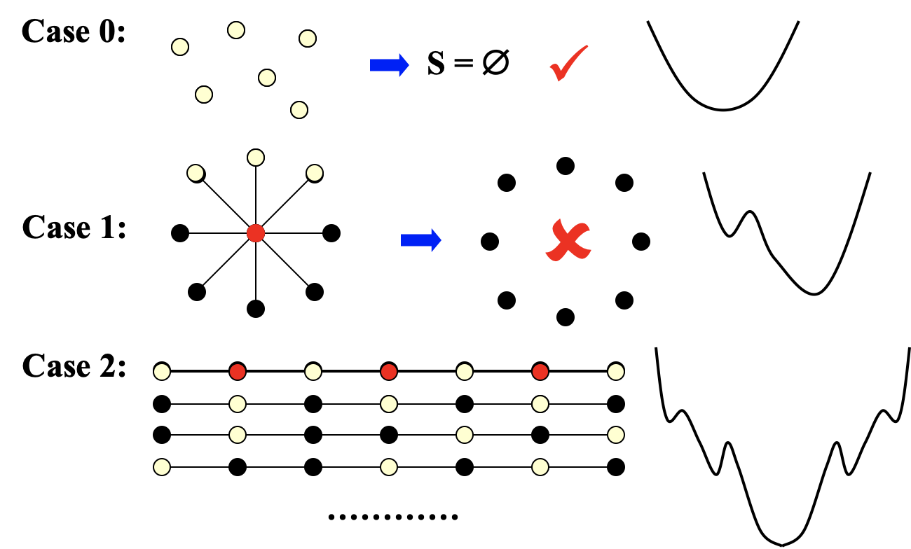

## Intro

Concentrate on Local optimum, step by step until there is no improvement

### Framwork

* Local
    * Define <u>neighborhoods</u> in the feasible set
        * N(S): neighborhood of S
    * A local optimum is a best solution in a neighborhood
* Search
    * Start with a feasible solution and search a better one within the neighborhood
    * A local optimum is achieved if no improvement is possible

### Neighbor Relation

S ~ S' : S' is a neighboring solution of S, S' can be obtained by a small modification of S.

N(S): neighborhood of S – the set { S': S ~ S' }.

那个碗的例子中用的梯度下降法没问题，<u>因为它不存在局部最优解</u>

```pseudocode
SolutionType Gradient_descent()
{   Start from a feasible solution S ∈ FS ;
    MinCost = cost(S);
    while (1) {
        S’ = Search( N(S) ); /* find the best S’ in N(S) */
        CurrentCost = cost(S’);
        if ( CurrentCost < MinCost ) {
            MinCost = CurrentCost;
            S = S’;
        }
        else  break;
    }
    return S;
}
```


## Verte Cover

> ~~>Decision：是否存在至多k个顶点的子图，使得原图中每条边至少有一个顶点在子图中(即覆盖了所有的边)~~
>
> Optimization：Given an undirected graph G = (V, E).  Find a minimum subset S of  V such that for each edge (u, v) in E, either u or v  is in S.
>

Feasible solution set FS: all the vertex covers

cost(S) = |S|

S~S': S' can be obtained from S by (adding or) deleting a **single** node. 

\\        Each vertex cover S has at most |V| neighbors. (each vertex can be deleted once)

Search: Start from S = V; delete a node and check if S' is a vertex cover <u>with a smaller cost</u>.


**Ptifalls of Gradient-Descent algorithm**



### Metropolis Algorithm

Metropolis是人名

避免落入局部最优的情况

```pseudocode
SolutionType Metropolis()
{   Define constants k and T;
    Start from a feasible solution S ∈ FS ;
    MinCost = cost(S);
    while (1) {
        S’ = Randomly chosen from N(S); 
        CurrentCost = cost(S’);
        if ( CurrentCost < MinCost ) {
            MinCost = CurrentCost;
            S = S’;
        }
        else {
            With a probability e^{-Δcost/(kT)}, let S = S’;	/* Random，避免锁死 */
            else  break;
        }
    }
    return S;
}
```

注：对于上面的case 1，有一定概率可以跳出local optimum得到正确解。但是对case 0，有可能在加1和减1之间无限震荡……

注：当（温度）T很高时，上坡的概率($e^{-\Delta cost/(kT)}$)几乎为1，容易引起底部震荡；当T接近0时，上坡概率几乎为0，<u>接近原始的梯度下降法</u>。

### Simulated Annealing

温度慢慢降低，获得最优解

## Hopfield Neural Networks

> Graph G = (V, E) with integer edge weights w (positive or negative).
>
> If we < 0, where e = (u, v), then u and v want to have the same state;if we > 0 then u and v want different states.
>
> The absolute value |we| indicates the strength of this requirement.
>
> Output: A configuration S of the network – an assignment of the state su to each node u (There may be no configuration that respects the requirements imposed by all the edges.)
> 
> So just <u>Find a configuration that is sufficiently good.</u>
>
> ---
>
> edge e(u,v) is <u>good</u>: $\large w_es_us_v<0$
>
> a node u is <u>satisified</u>: $\large \displaystyle \sum_{v:e(u,v) \in E} w_es_us_v \leqslant 0$
>
> configuration is <u>stable</u>: all nodes are satisfied.
>

Does a Hopfield network always have a stable configuration, and if so, how can we find one?

### State-flipping Algorithm

找到unsatisfied的换色

```pseudocode
ConfigType State_flipping()
{
    Start from an arbitrary configuration S;
    while ( ! IsStable(S) ) {
        u = GetUnsatisfied(S);
        su = - su;	/* flip unsatisfied point's color */
    }
    return S;
}
```

不会死循环，因为对于目标函数$\large \Phi(S) = \sum_{e\ {\rm is\ good}}|w_e|$，当其从S变成S'之后，有一个点的颜色翻转了，与之相连的所有good边和bad边的属性都反转，但是其他边属性不变，因此有：$\displaystyle \Phi(S') = \Phi(S) - \sum_{e \in E\ is\ bad}|w_e| + \sum_{e \in E\ is\ good}|w_e|(E为S'中u的邻边集)$，又因为本来u是unsatisfied的，因此本来的bad边(现在的good)的权重之和肯定超过good边(现在的bad)的，因此后面那项是正的，因此$\Phi(S)$是递增的

**Local Search**

Problem: maximize φ

FS: configurations

S~S': S' can be obtained from S by flipping a single state

## The Max Cut Problem

> <u>是Hopfield的特殊情况 (所有边都是正边权)</u>
>
> Maximum Cut problem: Given an undirected graph G = (V, E) with positive integer edge weights w~e~, find a node partition (A, B) such that the total weight of edges crossing the cut is maximized.
>
> $\displaystyle w(A,B) = \sum_{u \in A, v \in B} w_{(u, v)}$
>
> * Toy application
>     * n activities, m people.
>     * Each person wants to participate in two of the activities.
>     * Schedule each activity in the morning or afternoon to maximize number of people that can enjoy both activities.
> * Real applications: Circuit layout, statistical physics

**Local Search**

Problem:  To maximize w(A, B).

FS: any partition (A, B) 

S~S': S'(Single-flip neighborhood) can be obtained from S by moving one node from A to B, or one from B to A.

这个算法和上面那个神经网络的一模一样

```pseudocode
ConfigType State_flipping()
{
    Start from an arbitrary configuration S;
    while ( ! IsStable(S) ) {
        u = GetUnsatisfied(S);
        su = -su;
    }
    return S;
}
```

### Approx-Ratio

**Claim**: Let (A, B) be a local optimal partition and let (A\*, B\*) be a global optimal partition.  Then w(A, B) >= ½ w(A\*, B\*). So ρ is 2. 证明还好，看PPT

### Better algo

* [Sahni-Gonzales 1976]  There exists a 2-approximation algorithm for MAX-CUT.
* [Goemans-Williamson 1995]  There exists a 1.1382($\displaystyle =\min_{0\leqslant\theta\leqslant\pi}\frac{\pi(1-\cos\theta)}{2\theta}$)-approximation algorithm for MAX-CUT.
* [Håstad 1997]  Unless P = NP, no 17/16 approximation algorithm for MAX-CUT.

### Time Opt

To terminitae in polynomial time, stop the algorithm when there are no "big enough" improvements.

**Big-improvement-flip**:  Only choose a node which, when flipped, increases the cut value by at least $\frac{2\epsilon}{|V|}w(A, B)$，这里ε是个小值

**Claim**:

1. Upon termination, the big-improvement-flip algorithm returns a cut (A, B) so that $(2+\epsilon)w(A, B) \geqslant w(A^*, B^*)$
2. The big-improvement-flip algorithm terminates after at most $O(\frac{|V|}\epsilon \log W)$ flips.

**Proof**(感觉不重要):

1. 每次flip**至少**增加$(1+\frac{\epsilon}{|V|})$倍，其实是$(1+\frac{2\epsilon}{|V|})$倍
2. $\frac{\epsilon}{|V|}$次flip之后，总增长至少是2倍。利用(1+1/x)^x^ >= 2, 如果x>=1
3. 总量不超过W，而cut翻倍的次数不能超过logW

