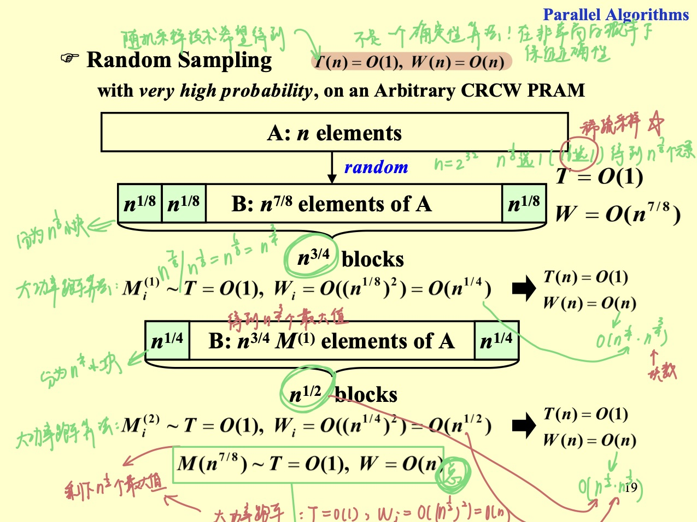
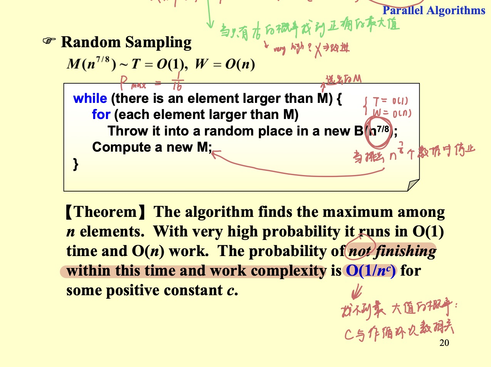
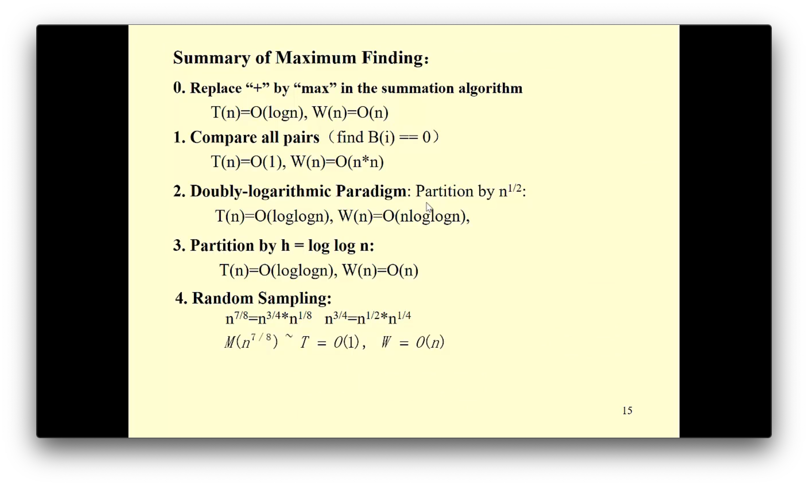

# Parallel Algorithms

<u>How to think in parallel?</u>

## Intro

**Parallelism**

* Machine parallelism
    * Processor parallelism
    * Pipelining
    * Very-Long Instruction Word (VLIW)
* Parallel algorithms
    * Parallel Random Access Machine (PRAM)
        * 不同阶段的并行数相同
    * Work-Depth (WD)
        * 不同阶段的并行数不同
        * 评价方式
            * worst case runnning time: T(N)
            * workload: total num of operations: W(n)


因为并行地操作可能会产生冲突，因此有三种解决访问冲突的方式

* Exclusive-Read Exclusive-Write (EREW)
* Concurrent-Read Exclusive-Write (CREW)
* Concurrent-Read Concurrent-Write (CRCW)
    * Arbitrary rule：随便选一个授权
    * Priority rule (P with the smallest number)
    * Common rule (if all the processors are trying to write the same value)


**【WD-presentation Sufficiency Theorem】**An algorithm in the WD mode can be implemented by any P(n) processors within $O(W(n)/P(n)+T(n))$ time, using the same concurrent-write convention as in the WD presentation.

## Summation

> 累加求和A(1)+...+A(n)

利用二维数组表示的平衡二叉树：

| B     | 1      | 2      | 3      | 4      | 5    | 6    | 7    | 8    |
| ----- | ------ | ------ | ------ | ------ | ---- | ---- | ---- | ---- |
| **3** | A(1-8) |        |        |        |      |      |      |      |
| **2** | A(1-4) | A(5-8) |        |        |      |      |      |      |
| **1** | A(1-2) | A(3-4) | A(5-6) | A(7-8) |      |      |      |      |
| **0** | A(1)   | A(2)   | A(3)   | A(4)   | A(5) | A(6) | A(7) | A(8) |

**PRAM**

```pseudocode
for Pi, 1 ≤ i ≤ n pardo
    B(0, i) := A( i )
    for h = 1 to log n do
        if i ≤ n/2^h	/* 蓝色 */
            B(h, i) := B(h-1, 2i-1) + B(h-1, 2i)
        else			/* 灰色 */
            stay idle
    for i = 1: output B(log n, 1)
    for i > 1: stay idle
```


`B(h, i) = B(h-1, 2i-1) + B(h-1, 2i)`

**WD**

```pseudocode
for Pi, 1 ≤ i ≤ n pardo
    B(0, i) := A( i )
for h = 1 to log n do
    for Pi, 1 ≤ i ≤ n/2^h pardo
        B(h, i) := B(h-1, 2i-1) + B(h-1, 2i)
for i = 1 pardo
    output B(log n, 1)
```


**Cost**

时间减少了，变为`T(N)=logN+2`，但是workload没减少，仍是`W(N) = N+N/2+N/4+...+N/2^k + 1 = 2N=O(N)`


## Prefix-Sums

> 求和：$\sum_{i=1}^{1}A(i), \sum_{i=1}^{2}A(i), ..., \sum_{i=1}^{n}A(i)$

还是用二维数组表示平衡二叉树，B和上面一样

设$C(h, i) = \sum_{k=1}^{\alpha}A(k), (0,\alpha)是(h,i)的rightmost叶节点$

$C(h, i) = \begin{cases} B(h, i) & i==1 \\ C(h+1,i/2)[parent] & i\%2==0 \\ C(h+1, (i-1)/2) + B(h, i) [perv\ node + B(itself)] & else \end{cases}$

根据这第三条，是否要把C(h, 0)设为0？

```pseudocode
/* Assign B */
for Pi , 1 ≤ i ≤ n pardo
    B(0, i) := A(i)
/* Cal B */
for h = 1 to log n
    for i , 1 ≤ i ≤ n/2^h pardo
        B(h, i) := B(h - 1, 2i - 1) + B(h - 1, 2i)
/*  */
for h = log n to 0
    for i even, 1 ≤ i ≤ n/2^h pardo
        C(h, i) := C(h + 1, i/2)
    for i = 1 pardo
        C(h, 1) := B(h, 1)
    for i odd, 3 ≤ i ≤ n/2^h pardo
        C(h, i) := C(h + 1, (i - 1)/2) + B(h, i)
/* Output */
for Pi , 1 ≤ i ≤ n pardo
    Output C(0, i)
```

## Merging

> Merging – merge two **non-decreasing** arrays A(1), A(2), …, A(n) and B(1), B(2), …, B(m) into another **non-decreasing** array C(1), C(2), …, C(n+m) 

**Partitioning Paradigm**

* partitioning - partition the input into a large number, say p, of independent small jobs, so that the size of the largest small job is roughly n/p
* actual work - do the small jobs concurrently, using a separate (possibly serial) algorithm for each


**By turning merging into ranking**

* RANK( j, A) = i,   if A(i) < B(j) < A(i + 1), for 1 ≤ i < n
* RANK( j, A) = 0,  if B(j) < A(1)
* RANK( j, A) = n,  if B(j) > A(n)

The ranking problem, denoted RANK(A,B) is to compute: 

1. RANK( i, B) for every 1 ≤ i ≤ n	// For A(i)
2. RANK( i, A) for every 1 ≤ i ≤ n	// For B(i)


**Usage of RANK**

```pseudocode
for Pi , 1 ≤ i ≤ n  pardo
    C(i + RANK(i, B)) := A(i)
for Pi , 1 ≤ i ≤ n  pardo
    C(i + RANK(i, A)) := B(i)
```

Ex.

| i           | 1    | 2    | 3    | 4    | 5    | 6    | 7    | 8    |
| ----------- | ---- | ---- | ---- | ---- | ---- | ---- | ---- | ---- |
| A           | *11* | *12* | *15* | *17* |      |      |      |      |
| RANK(i, B)  | 0    | 0    | 2    | 3    |      |      |      |      |
| B           | *13* | *14* | *16* | *18* |      |      |      |      |
| RANK(i, A)  | 2    | 2    | 3    | 4    |      |      |      |      |
| C[k=i+RANK] | 11   | 12   | 13   | 14   | 15   | 16   | 17   | 18   |

例如11在1+0，12在2+0，15在3+2，17在4+3，🐂🍺


**Ways to get RANK**

* Binary Search

    * TN = O(logN)
    * WN = O(NlogN)

* Serial Ranking

    * TN = WN = O(M+N) [M,N=|A|,|B|]

* Parallel Ranking

    * Assume that n = m ; and that A(n+1) and B(n+1) are each larger than both A(n) and B(n).

    * 感觉就是先隔每logN个找出对应的RANK，重复p次(T=O(logN))，然后再对这p组内部的在界定好的范围(size=O(logN))上找

    * Stage 1: Partitioning

        * Steps:

            * take p = n/logn
            * A_Select( i ) = A( 1+(i-1)logn )   for 1 ≤ i ≤ p
            * B_Select( i ) = B( 1+(i-1)logn )   for 1 ≤ i ≤ p
            * Compute RANK for each selected element

            

        * Cost

            * T = O(logN) (2p个线程，每个O(logN))
            * W = O(plogN) = O(N)

    * Stage 2: Actual Ranking

        * At most 2p smaller sized (O(logn)) problems.
        * Cost
            * T = O(logN)
            * W = O(plogN) = O(N)

    * Total Cost

        * T = O(logN)
        * W = O(plogN) = O(N)

## Maximum Finding

> 找出A(i)中的最大值

**用Summation的算法，TN=logN，WN=N**

**Compare all paris**

```pseudocode
for Pi , 1 ≤ i ≤ n  pardo
    B(i) := 0	/* 0 is for winner */
for i and j, 1 ≤ i, j ≤ n  pardo	/* N^2 pairs */
    if ( (A(i) < A(j)) || ((A(i) = A(j)) && (i < j)) )
        B(i) = 1	/* 1 is for loser */
    else B(j) = 1
for Pi , 1 ≤ i ≤ n  pardo
    if B(i) == 0
       A(i) is a maximum in A
```

`T(N) = O(1), W(N) = O(N^2)`(N^2^个CPU), and also conflict since many will write at the same time, we use CRCW(see [here](# Intro)) (因为对A是ReadOnly的，所以可以CR；对B是WriteOnly，且只写1不写0所以CW也没关系；但是ER或EW都会造成阻塞)


### A Doubly-logarithmic Paradigm

*Denotes h = loglogN (N = 2\^(2\^h))*

实际上还是带点分治的意思的

**Partition by √n** (√n个CPU)

* Stage1
    * M~i~ = MAX{A((i-1)√n + 1), ..., A(i√n)}, 1≤i≤√n
    * T=T(√N), W=W(√N) (递归)
* Stage2
    * 用All pairs法
    * A~max~ = MAX{M~1~, M~2~, ..., M~√n~}
    * T = O(1)
    * W = O(√N^2^) = O(N)
* Here we get
    * T(N) ≤ T(√N) + O(1)
    * W(N) ≤ √N \* W(√N) + N \* O(1)
* 用DC的方法解出
    * T(N) = O(loglogN)
    * W(N) = O(NloglogN)

**Partition by h** (n/h个CPU)

* Stage1
    * 因为h会比上面的√n小得多，所以可以用linear scan来获得单组里的max
    * M~i~ = MAX{A((i-1)h + 1), ..., A(ih)}, 1≤i≤n/h
    * T=W=O(h)
* Stage2
    * 不是用线性搜索而是用Partition by (n/h)法
    * A~max~ = MAX{M~1~, M~2~, ..., M~n/h~}
    * T = O(loglog(N/h)) [须由结论反解]
    * W = O((n/h)loglog(n/h))，这又是怎么来的
* Here we get
    * T(N) = O(h+loglog(N/h)) = O(loglogN)
    * W(N) = O(h×(N/h) + (N/h)loglog(N/h)) = O(N)

### Random Sampling

随机抽样法

zyx的ppt




```pseudocode
while (there is an element larger than M) {
    for (each element larger than M)
        Throw it into a random place in a new B(n^{7/8});
    Compute a new M;
}
```

【Theorem】The algorithm finds the maximum among n elements.  With very high probability it runs in O(1) time and O(n) work.  The probability of not finishing within this time and work complexity is O(1/n^c^) for some positive constant c.

### 总结

