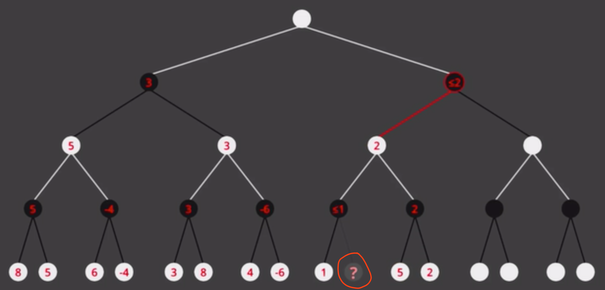

https://blog.csdn.net/weixin_40170902/article/details/80856799


## MiniMax Strategy

例如井字棋，设**评估函数**W为当前状态下某方的可能赢的三条(Win Line)有W个，则f(P) = W_Computer - W_Me，我要使fP尽可能小

评估函数很重要

另外的评估函数：$\begin{cases}赢了：1\\平局：0\\输了：-1\end{cases}$


http://inst.eecs.berkeley.edu/~cs61b/fa14/ta-materials/apps/ab_tree_practice/


https://www.bilibili.com/video/BV1XJ411n7Ee?from=search&seid=10293850935654516783

* α：max节点最大推算评估值
* β：min界定最小推算评估值

```
Max                3
                /     \
              /          \ 
Min          3          <=-4
           /   \        /   \
Max       3     5     -4    ?
         / \   / \    / \
Min 	-1  3  5  ?  -6 -4
```



想问一下为什么这个要被剪枝(白max黑min)？如果问号右边是5和4，那上边那个黑2就要变成4，在上边那个白2也要变成>=4，这样的话如果在旁边那个白色也大于3，那再上层的黑色就会是(min(>=4, >3))，这时候根节点就会选择右边，并且有可能走到问号这条路(~~如果问号比4还大~~(不会的，因为这样的话上面那个黑色就会选择1而不是问号了，**这个黑色的<=1确保了路不会走到<=1这边**))


蒙特卡洛树搜索


Game Trees

