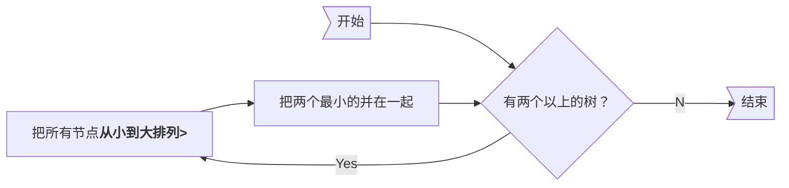
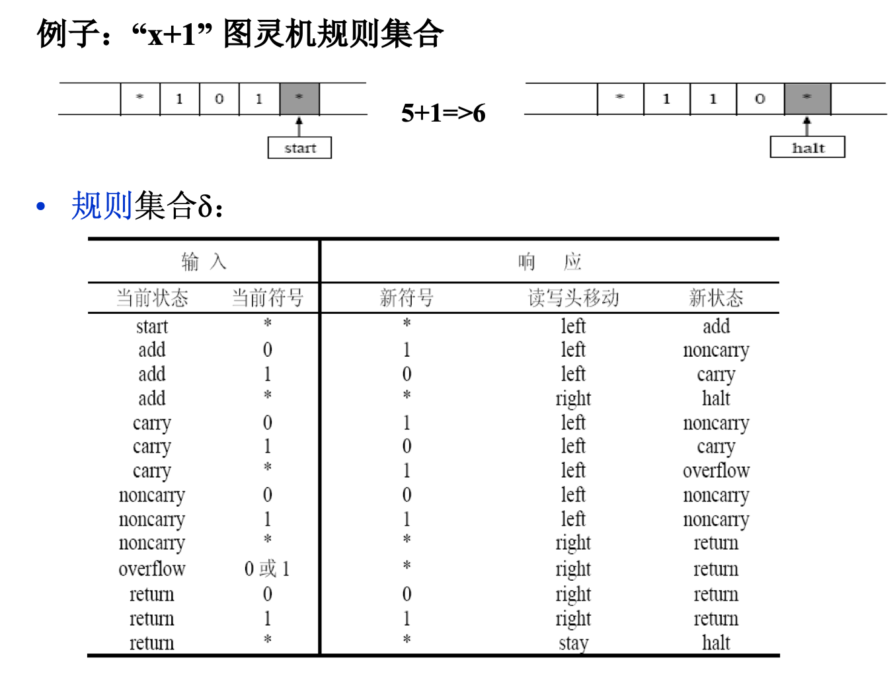
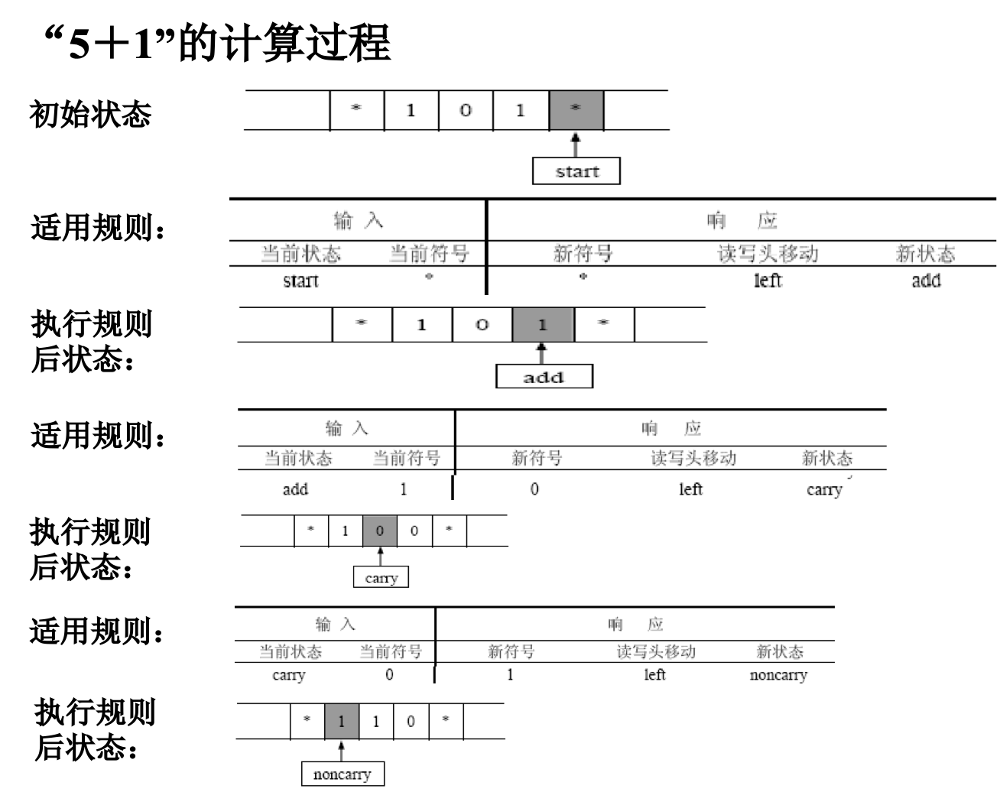
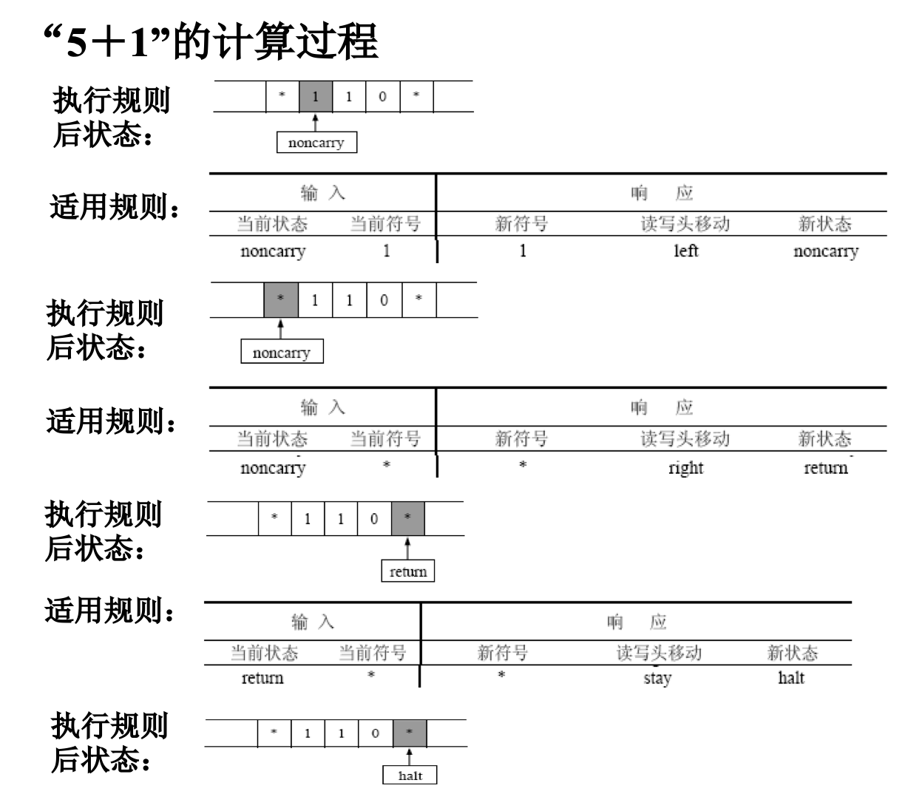
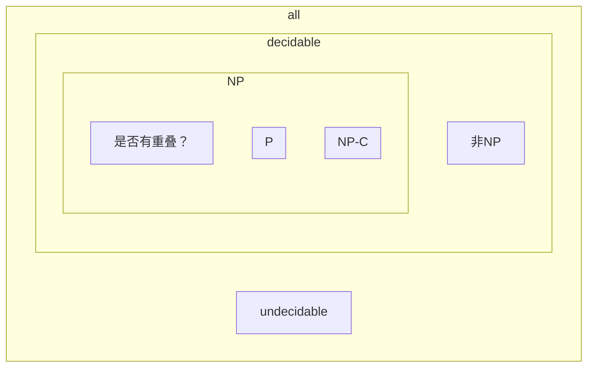

# Greedy

## 活动选择问题

不冲突的情况下选**最多个**活动


### DP solution

用ai表示第i个任务

a1 a2 ...ai ...ak ...aj ...an，用Sij表示ai结束之后开始，在aj开始之前结束的所有任务的集合

$\large \displaystyle c_{ij} = \begin{cases} 0 & S_{ij} = \empty \\ \max_{a_k \in S_{ij}}(c_{ik} + c_{kj} + 1) & S_{ij} \neq \empty \end{cases}$

### Greddy

**策略**

* Select the interval which starts earliest (but not overlapping the already chosen intervals)
    * 如果最早的那个持续了一天就完蛋
* Select the interval which is the shortest (but not overlapping the already chosen intervals)
    * 三个活动：0~12; 12~24; 11~13，完蛋
* Select the interval with the fewest conflicts with other remaining intervals (but not overlapping
    the already chosen intervals)
    * 看ppt
* Select the interval which ends first (but not overlapping the already chosen intervals)

**重要定理**：<u>必然存在一个最优解，包含了最早结束的那个任务</u> (反证法，若不存在，则可以把某个最优解的最早任务换成最早结束的那个，构造处一个新的最优解)

### Another Look at DP

$\large \displaystyle c_{1j} = \begin{cases} 1 & j=1 \\ \max(c_{1,j-1}, c_{1,k(j)} + 1) & j > 1 \end{cases}$

(where c~1j~ is the optimal solution for a1 to aj , and a~k(j)~ is the <u>nearest compatible</u> activity to aj that is <u>finished before</u> aj)

如果是有权重的：

$\large \displaystyle c_{ij} = \begin{cases} 1 & j=1 \\ \max(c_{1,j-1}, c_{1,k(j)} + w_j) & j > 1 \end{cases}$？？？

有权重的情况DP还能用，贪心就不行了

## Huffman

所有节点都在叶节点上，且频率越高离根节点越近

Huffman的贪心算法：



手推了一下，Huffman树应该满足关系式`总节点数 = 2×对象数-1`

**重要定理1**(lemma)：设x,y为两个最小频的对象，则<u>必然存在一个最优解，xy都在同一层，且都在最深层</u>(同样反证)

**重要定理2**：一个最优解，将其拆为两个，两个都作为子节点，最优性不会丢失


# NP

相似

| P             | NP           |
| ------------- | ------------ |
| Euler         | Hamilton     |
| Shortest Path | Longest Path |
| 2-CNF         | 3-CNF        |

**可计算理论(Computability Theory**

* 可计算性Computability
* 计算复杂性Computational Complexity

**Piano公理，实数完备性**

Hilbert 23问之一：Question of **Decidability**: Could there exist, at least in principle, any definite method or process by which all mathematical questions could be decided?

Kurt Gödel不完备定理: not all true statements that evolve from an axiomatic system can be proven – we can never know everything nor prove everything we discover.


> Ex. Halting problem：能否写出一个程序，判断给定程序是否会死循环？
>
> 不存在。反证：若存在，则必能自查，无穷套娃
>
> ```cpp
> Loop( P )
> {  
> /* 1 */ if ( P(P) loops )	print (YES);
> /* 2 */ else infinite_loop();
> }
> // Terminate --> 2 --> Loops
> // Loops --> 1 --> Terminate
> ```
>
> 类似于理发师悖论

## 计算模型

* 递归函数

    * 分为初始函数、递归算子(用于构造复杂函数的递推关系)
    * Ex. 加法：`f(m,0)=m; f(m,n+1)=s(f(m,n)); s(i)=i+1;/*后继函数*/`

* λ算法

    * 变量替换
    * 将所有函数定义为一元函数
        * 多元函数可以转化为一元函数的组合

    ```cpp
        f (x) = x + 1:		λ x. x + 1    
        f(2):				(λ x. x + 1) 2
        f(x, y) = x - y:	λ x. λ y. x – y
    ```

* 图灵机

    * 能够抽象出模型，并且定义计算过程，就是可计算的
        * 与前两者不同，前两者都是数学方法
    * Deterministic Turing Machine
    * Nondeterministic Turing Machine

## 图灵机

模型：一个无限的存储带，一个可左右移动的读写头，一个有穷控制器(FSM，控制读写头)







* Deterministic Turing Machine
    * 就像上面x+1这种，可以按照确定好的方法一步一步来
* Nondeterministic Turing Machine
    * free to choose its next step from a finite set.  And if one of these steps leads to a solution, it will always choose the correct one.

## NP

NP:

* Nondeterministic Polynomial-time
* 可在多项式时间被**证明/判定**的问题
    * 像”给定一个图，是否不存在汉密尔顿回路“就是 非NP 问题

NP-C: NP-Complete

* An NP-complete problem has the property that any problem in NP can be polynomially reduced to it. (NP可在多项式时间内化简为NPC)
* 若NPC和P有交集，则NP=P

---



---

