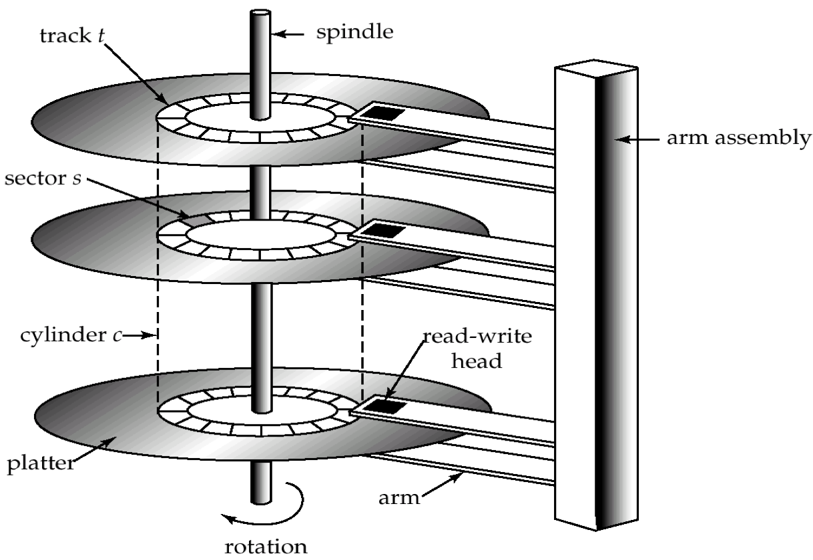
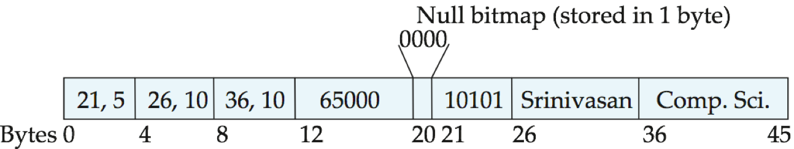
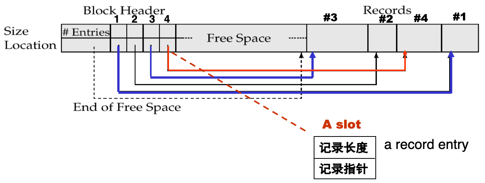
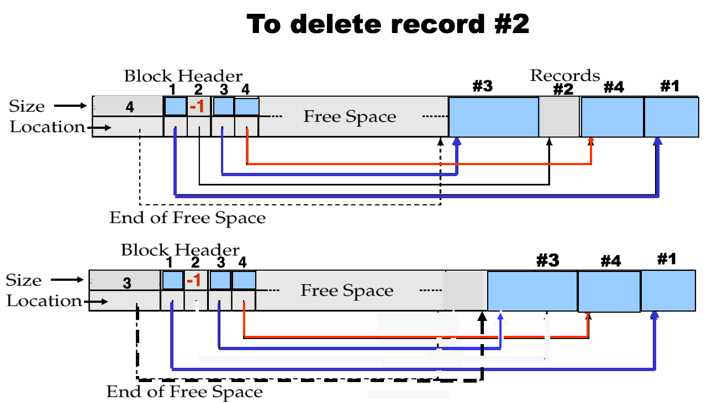
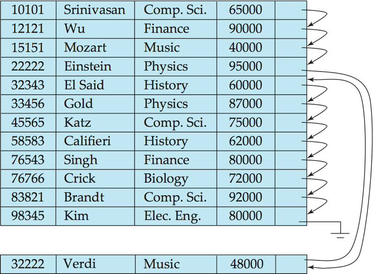
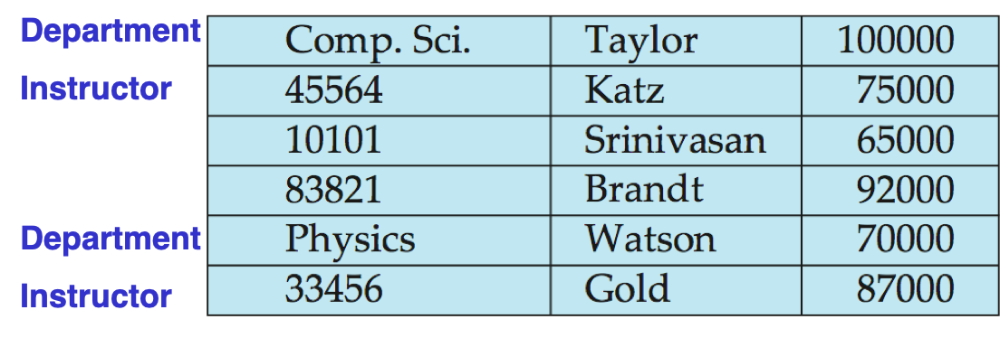

# Physical

## 分类

### by reliability

* volatile storage: loses contents when power is switched off.  E.g.: SDR, DDR2, DDR3, DDR4
    (SDR: Synchronous Dynamic RAM; DDR: Dual Date Rate SDRAM; DDR2 1.8v, DDR3 1.5v, DDR4 1.2v) 
* non-volatile storage (非易失性存储器): 
    * Contents persist even when power is switched off. 
    * Includes secondary and tertiary storage, as well as battery-backed up main-memory.

### by speed

* **Cache** (高速缓冲存储器) - fastest and most costly form of storage; volatile; managed by the computer system hardware. ( ≤ 0.5 ns)  size:  ~ KB ~MB
* **Main memory**:
    * fast access (1 to 50 of nanoseconds - ns; 1 nanosecond = 10–9 seconds)
    * generally too small (or too expensive) to store the entire database
    * Capacities of up to a few Gigabytes, widely used currently.
        * Capacities have gone up and per-byte costs have decreased steadily and rapidly (roughly factor of 2 every 2 to 3 years)
        * 8GB (RMB 200 JD 20/04/2016)
    * Volatile - contents of main memory are usually lost if a power failure or system crash occurs.
* **Flash memory** (快闪存储器)
    * also known as **EEPROM** (Electrically Erasable Programmable Read-Only Memory 电可擦可编程只读存储器)
    * 分类
        * NOR：体积大，可执行程序，所以可用于BIOS
        * NAND：体积小，可以做大存储
    * Data survives when power failure
    * Data can be written at a location only once, but location can be erased and written to again
        * Can support only a limited number of write/erase cycles (104 - 106).
        * Erasing of memory has to be done to an entire bank of memory
        * 固态硬盘并不能直接覆盖原来的数据，固态硬盘<u>必须要把旧的数据先擦出然后才可以把新的数据写入</u>。对于固态硬盘来说，垃圾回收是指把现存数据重新转移到其他闪存位置，并且把一些无用的数据彻底删除的过程。一块固态硬盘中的闪存可以被分为许多Block(块)，每个块又可以分成页面(pages)。数据可以直接以页面为单位写入，但是要想删除数据却需要以块为单位。因此要删除无用的数据，固态硬盘首先需 要把一个块内包含有用的数据先复制粘贴到全新的块中的页面内，这样原来块中包含的无用数据才能够以块为单位删除。删除后，才能够写入新的数据。
    * <u>Reads are roughly as fast as main memory (< 100ns), But writes are slow ( ~ 10µs), erase is slower.</u>
    * <u>Cost per unit of storage roughly similar to main memory. (becoming more cheaper than main memory)</u>
        * E.g. (64GB MicroSD RMB 80 JD 20/04/2016)
    * Widely used in embedded devices such as digital cameras and smart phones.
    * 名词
        * MLC (multi-level cell) VS SLC (single-level cell) VS TLC (Triple-Level Cell)
        * ONFI (Open NAND Flash Interface) 标准 VS Toggle DDR 标准
        * SSD (solid-state drive) 
    * Trim指令 disable delete notify
* Magnetic-disk
    * Data is stored on spinning disk, and read/written magnetically.
    * Primary medium for the long-term storage of data; typically stores entire database.
    * Data must be moved from disk to main memory for access, and written back for storage.
        * Much slower access than main memory (more on this later)
    * Direct-access - possible to read data on disk in any order, unlike magnetic tape.
    * Capacities range up to roughly 4T GB (1T per platter) currently
        * Much larger capacity and lower cost/byte than main memory/flash memory
        * Growing constantly and rapidly with technology improvements (factor of 2 to 3   every 2 years)  (如垂直记录技术大幅度提高了记录密度)
    * Survives power failures and system crashes.
        * Disk failure can destroy data, but is very rare
    * E.g. (3TB RMB 570 JD 20/04/2016)

## Hierarchy

* primary storage: Fastest media but volatile (cache, main memory).
* secondary storage (辅助存储器，联机存储器): next level in hierarchy, non-volatile, moderately fast access time
    * also called on-line storage 
    * E.g. flash memory, magnetic disks
* tertiary storage (三级存储器，脱机存储器): lowest level in hierarchy, non-volatile, slow access time
    * also called off-line storage 
    * E.g. magnetic tape, optical storage

# 磁盘

几万～几十万 tracks(磁道)/platter(盘片)

几百～几万 sectors(扇区)/track

## 原理

* Read-write head
    * Positioned very close to the platter surface (almost touching it，微米级)，但是没有接触
    * Reads or writes magnetically encoded information.
* Surface of platter divided into circular tracks
    * Over 16,000 tracks per platter on typical hard disks
* Each track is divided into sectors.
    * A sector is the smallest unit of data that can be read or written.
    * Sector size typically 512 bytes
    * Typical sectors per track: 1000 (on inner tracks) to 20000 (on outer tracks)
    * 500KB per track, 500GB per platter
* To read/write a sector
    * disk arm swings to position head on right track
    * platter spins continually; data is read/written as sector passes under head
* Head-disk assemblies 
    * multiple disk platters on a single spindle (typically 1 to 4 platters)
    * Two heads per platter, mounted on a common arm.
* Cylinder i consists of i th track of all the platters 所有盘片的第i条磁道合起来成为第i个柱面
* Disk controller – interfaces between the computer system and the disk drive hardware.          
    * Accepts high-level commands to read or write a sector
    * Initiates actions such as moving the disk arm to the right track and actually reading or writing the data
    * Computes and attaches checksums (校验和) to each sector to verify that data is read back correctly
        * If data is corrupted, with very high probability stored checksum won’t match recomputed checksum
    * Ensures successful writing by reading back sector after writing it
    * Performs remapping of bad sectors (坏扇区的重映射：将该扇区映射到预留的物理扇区，并且重映射被记录在磁盘或其他非易失性存储器中)
* Disk interface standards families
    * 家用：*ATA* (AT adaptor) range of standards, faster version of IDE (Integrated drive electronics), *SATA*(serial ATA)
    * 服务器：*SCSI* (Small Computer System Interconnect) range of standards, *SAS* (serial attached SCSI)
    * Several variants of each standard (different speeds and capabilities)
        * RAID: Redundant Arrays of Independent Disks 独立磁盘阵列
        * SAN: Storage Area Network
            * FC: Fibre Channel interface
            * iSCSI: Internet Small Computer System Interface

## Performance

* Access time: the time it takes from when a read or write request is issued to when data transfer begins(发出IO请求到开始传输) `= Seek time (寻道时间) + Rotational latency (旋转等待时间)`
    * Seek time – time it takes to reposition the arm(磁盘臂disk arm) over the correct track.  
        * 4 to 10 milliseconds on typical disks
    * Rotational latency time – (旋转等待(潜伏)时间) it takes for the sector to be accessed to appear under the head.
        * Average latency is 1/2 of the worst case latency.
        * 4 to 11 milliseconds on typical disks (5400 to 15000 r.p.m.)
* Data-transfer rate – the rate at which data can be retrieved from or stored to the disk.
    * Depends on rotational rate and disk interface,……
    * 100MB per second is typical.
    * Multiple disks may share a controller, so the rate that controller can handle is also important
        * E.g. SATA 1: 1.5Gbit/s; SATA 2: 3Gbit/s; SATA 3: 6Gbit/s
* Mean time to failure (MTTF, 平均故障时间) – the average time the disk is expected to run continuously without any failure. 一堆硬盘放一起算概率？
    * Typically 3 to 5 years
    * Probability of failure of new disks is quite low, corresponding to a “theoretical MTTF” of 30,000 to 1,200,000 hours for a new disk

Ex. IBM Deskstar 14GPX (10.1 GB capacity)

* 3.5 INCH， 7200R/minute
* 容量14.4GB，含5张双面盘片， 每张约3.35GB
* 平均寻道时间 9.1 ms 
    * 相邻磁道寻道时间 2.2 ms
    * 最大寻道时间15.5 ms
* 平均旋转等待时间 4.17 ms
* 数据传输速率 13MB/s (≈610ns/B)。故磁盘读写主要是寻道时间和旋转等待时间，相比之下数据传输 (真正的读写)时间可略(0.3ms/sector)
* 故磁盘存取时间 >10 ms，而内存的存取时间 ≈ 10 ns

Ex. Megatron 747 (vintage 2008)

* 3.5吋（直径），含有8个盘片，16个盘面；每个盘面有65536个磁道；
* 每个磁道平均256扇区；每个扇区4096字节。
* 最大容量=16*65536*256*4096=1000GB=1TB
* 转速7200转/分，即旋转一圈8.33ms；故旋转等待时间最小=0ms，最大8.33ms, 平均4.17ms
* 磁头相邻磁道启、停需1ms；每移动4000磁道另加1ms。故最小寻道时间=0，最大寻道时间=1+65536/4000=17.38ms，平均寻道6.46ms
* 传输时间：每扇区=8.33ms/256 =0.03ms
* 磁盘存取1扇区时间，最长=17.38+8.33+0.03=25.74ms，最短=0+0+0.03ms=0.03ms，平均≦ 6.45+4.17+0.03=10.66ms

### Performance Measures

## Optimize

* Block – a contiguous sequence of sectors from a single track 
    * data is transferred between disk and main memory in blocks.
    * sizes range from 512 bytes to several kilobytes
        * Smaller blocks: more transfers from disk
        * Larger blocks:  more space wasted due to partially filled blocks
    * Typical block sizes today range from 4 to 16 kilobytes/Block
* Disk-arm-scheduling algorithms (磁盘臂调度算法) order pending accesses to tracks so that disk arm movement is minimized. (Eg.:  ( 1, 6, 3, 5, 2, 4) → ( 1, 2, 3, 4, 5, 6 )
    * elevator algorithm (电梯算法): move disk arm in one direction (from outer to inner tracks or vice versa), processing next request in that direction, till no more requests in that direction, then reverse direction and repeat. (大酒店很多电梯，可能会经过该楼层没停，因此外部不显示楼层，这背后是有这个算法控制
* File organization – optimize block access time by organizing the blocks to correspond to how data will be accessed. E.g:
    * Store related information on the same or nearby cylinders.
    * Files may get fragmented over time：
        * E.g. if data is inserted to/deleted from the file
        * Or free blocks on disk are scattered, and newly created file has its blocks scattered over the disk
        * Sequential access to a fragmented file results in increased disk arm movement
            ∴ Some systems have utilities to defragment the file system, in order to speed up file access
        * But the system is generally unusable when these utilities are running.
* Nonvolatile write buffers (非易失性写缓冲区): speed up disk writes by writing blocks to a non-volatile RAM buffer immediately
    * Non-volatile RAM:  battery backed up RAM or flash memory
        * Even if power fails, the data is safe and will be written to disk when power returns
        * 家用的一般都是Violate的所以要Write-through
    * Controller then writes to disk whenever the disk has no other requests or request has been pending for some time
    * Then writes can be reordered to minimize disk arm movement 所以可以续命
* Log disk (日志盘) – a disk devoted to writing a sequential log of block updates
    * 不能和数据盘放一起，不然会极大影响效率
    * 特点：顺序写，因此可以拖出来单独开个盘(这有什么因果关系吗>？)
    * Used exactly like nonvolatile RAM
        * Write to log disk is very fast since no seeks are required
        * No need for special hardware (unlike NV-RAM)
    * File systems typically reorder writes to disk to improve performance
    * Journaling file systems write data in safe order to NV-RAM or log disk

# \*RAID

## Level

* Level 0
    * 无冗余，两个盘同时工作，加速
* Level 1
    * 两块盘镜像，速度不变，但是可以更安全
* Level 5
    * 块交叉分布式，带奇偶校验
    * 用N-1张盘存储数据，剩下一张盘存储奇偶校验位
    * 最多可以坏掉一个仍然保持数据

## Hardware Issues

热插拔

备盘：自动替换坏盘

# File Organization

一个数据库映射到多个不同的file，一个file有多个block

## Fixed-Length

因为每个元组占用的空间一样

优点：访问简单

缺点：一个数据可能会跨块存储(除非块的大小正好是元组大小的倍数)；删除的处理(要么拿新的数据填充，要么找到一种办法来标识这个地方是被删除的)

删除方法：

* 方法1：move records i + 1, . . ., n to i, . . . , n – 1(逐个往前平移一格)
    * 慢
* 方法2：move record n  to i
    * 顺序错了
* 方法3：do not move records, but link all free records on afree list.  (See next page)

### Free Lists

<u>记录的是被删掉的而不是存在的；利用被删除空间，不需要单独开辟空间存储指针</u>

* Store the address of the first deleted record(第一个被删掉的记录，还有其他信息) in the file header(文件头)
* Use this first record to store the address of the second deleted record, and so on 套娃，用被删掉的空间存储指向下一个被删除的空间的指针
* Can think of these stored addresses as pointers since they “point” to the location of a record.
* Advantage: more space efficient representation:  <u>reuse space for normal attributes of free records to store pointers</u>.  (No pointers stored in in-use records.)

## Variable-Length

为什么要变长

* 本身有些属性(varchar)就是变长的
* 有些文件就经常会被一起访问，最好放在一起

存储格式：定长在前，变长在后；其中变长属性的存储又分为一个偏移量

在记录的初始部分存储每个属性的固定长度信息

| 变长属性    | 定长数据 | 空位图         | 变长数据 |
| ----------- | -------- | -------------- | -------- |
| 偏移量+长度 |          | 为什么在这里？ |          |

例如，`instructor(ID varchar(5), name varchar(5), dept_name varchar(5), salary 8-bytes)`，空位图1bit一个数据

### Slotted Page Structure

**分槽的页结构**

Slotted page header contains:

* number of record entries
* **end** of free space in the block
* location and size of each record

删除过程

# Organization of Records in Files

* Heap file (堆文件, 流水文件) – a record can be placed anywhere in the file where there is space
    * 灵活，可以放在文件的任何地方
* Sequential file (顺序文件) – store records in sequential order, based on the value of a search key of each record
    * 按Key来排，删掉之后要保留顺序很蛋疼
* Hashing file (散列文件) – a hash function computed on some attribute of each record; the result specifies in which block of the file the record should be placed
    * 
* clustering file organization (聚集文件组织) – records of several different relations can be stored in the same file 一个文件存不同表的记录
    * Motivation: store related records in different relations on the same block to minimize I/O 比如Join等等操作可以节省时间

## Sequential

除了物理上连续，还需要pointer来存储下一个元组，删除插入需要用到

* Deletion – use pointer chains
* Insertion –locate the position where the record is to be inserted
    * if there is free space insert there 
    * if no free space, insert the record in an overflow block
    * <u>In either case, pointer chain must be updated</u> 物理上随缘
* Need to reorganize the file from time to time to restore sequential order. (需要定期对文件重新排序) 使得物理上重新是顺序的(跳来跳去的IO很受影响)

## Clustering

例如，把dept和对应所有老师放一起

# Data Dict Storage

Data dictionary (also called system catalog) stores **metadata**: that is, <u>data about data</u>, such as:

* Information about relations
    * names of relations
    * names and types of attributes of each relation
    * names and definitions of views
    * integrity constraints
* User and accounting information, including passwords
* Statistical and descriptive data
    * number of tuples in each relation
* Physical file organization information
    * How relation is stored (sequential/hash/…)
    * Physical location of relation 
        * operating system file name or 
        * disk addresses of blocks containing records of the relation 
* Information about indices (Chapter 12) 

Catalog structure:  can use either

* specialized data structures designed for efficient access 
* 一般用已有的DB(例如MySQL中的sys库)：<u>a set of relations, with existing system features used to ensure efficient access</u>

# Data Buffer

？？？？？？？？？

* Dirty Block
* Pinned Block

## Buffer Manager

* 本来就在buffer的
    * 直接用了
* 本来不在
    * 上层并不直接读磁盘，而是去找buffer manager
    * The buffer manager allocates free space in the buffer for the block, replacing (throwing out) some old pages, if no free spaces, to make space for the new block. (在buffer中为新页分配空间)
    * The block that is thrown out is written back to disk only if it was modified since the most recent time that it was written to/fetched from the disk. (将被覆盖的旧块若已被修改过，则写回磁盘)
    * Once space is allocated in the buffer, the buffer manager reads the block from the disk to the buffer, and passes the address of the block in main memory to requester. (从磁盘读入新块放buffer)

* Pinned block (被钉住的块)– memory block that is not allowed to be written back to disk. (如当前块正在被使用时)
    * Page in pool may be requested many times (被多个事务使用), 
        * a pin count is used.  A page is a candidate for replacement iff pin count = 0.
* Toss-immediate strategy – frees the space occupied by a block as soon as the final tuple of that block has been processed. (用后立即丢弃)
* Forced output of blocks.
    * Requestor of block must unpin it, and indicate whether page has been modified: 
        * dirty bit is used for this.

Buffer-Replacement Policies: LRU (最近最少使用), MRU (最近最常使用)

* LRU
    * 例如0->n->0->n
* MRU
    * 例如0->n, 0->n, 0->n

