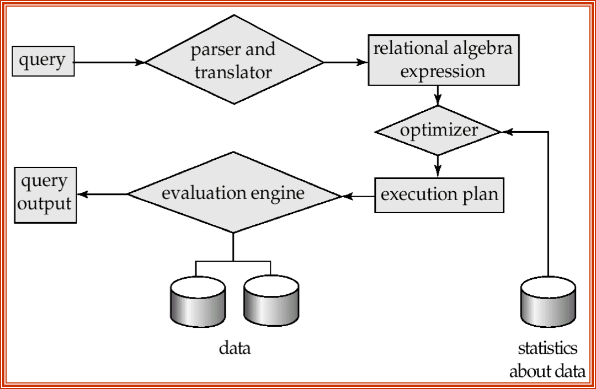

# 

# 测量

不考虑RW差距

* For simplicity, we just use the number of block transfers from disk and the number of seeks as the cost measures:
    * t~T~ – time to transfer one block.  (≈ 0.1ms)
    * t~S~ – time for one seek 寻道.  (≈ 4ms)
    * Cost for b block transfers plus S seeks：`b * tT + S * tS`
* We ignore CPU costs for simplicity. But real systems do take CPU cost into account
* We do not include cost to writing the final result back to disk in our cost formulae.

# Select

## Linear

* **File scan** – search algorithms that locate and retrieve records that fulfill a selection condition, do not use index. + 1 seek
    * Algorithm A1 (linear search线性搜索).  Scan each file block and test all records (tuples) to see whether they satisfy the selection condition.
        * Cost estimate = 1 seek + br block transf
            * br  denotes number of blocks in the file for relation r
        * If selection is on a key attribute, 
            * cost = 1 seek + (br /2)block transfers 
        * Linear search can be applied regardless of 
            * selection condition or
            * ordering of records in the file, or 
            * availability of indices
* Note: <u>binary search generally does not make sense since data is not stored consecutively</u>
    * except when there is an index available,
    * and binary search requires more seeks than index search

## Index and equality

* Index scan – search algorithms that use a B+ index. Selection condition must be on search-key of index.
    * **A2**：主索引，码属性的等值比较
        * Retrieve a single record that satisfies the corresponding equality condition
        * Cost = (Hi + 1)* (tS + tT),   其中Hi 为索引树高
    * **A3**：主索引，非码属性的等值比较
        * Retrieve multiple records.   --- duplicate  
        * Records will be on consecutive blocks 
        * Cost = Hi * (tT + tS) + tS + tT * b, b containing retrieved records ($b=\lceil sc(A, r) / f_r \rceil$)
    * **A4**：利用辅助索引的等值比较
        1. Retrieve a <u>single record</u> if the search-key is a <u>candidate</u> key
            * Cost = (hi + 1) * (tT + tS)
        2. Retrieve <u>multiple records</u> if search-key is <u>non-candidate</u> key:
            * each of n matching records may be on a different block
            * Cost = hi * (tT +tS)+ n* (tT + tS)= (hi + n) * (tT + tS)
                * Can be very expensive!
                * <u>May be more worse than linear scan (因为寻道更花时间)</u>

## Comparisons

* Liear
    * A1
* Index
    * A5：基于主索引的比较
    * A6：基于辅助索引
        * 

## Complex Select

**多值查询**

* **A7**：找一个代价最小的索引先选择，然后再去其他condition
* **A8**：组合索引
* **A9**：先根据个条件取出<u>元组的指针的集合</u>，然后对集合进行集合关系运算获得 结果指针集，再去取数据
* **A10**：

# Sort

## External Merge

