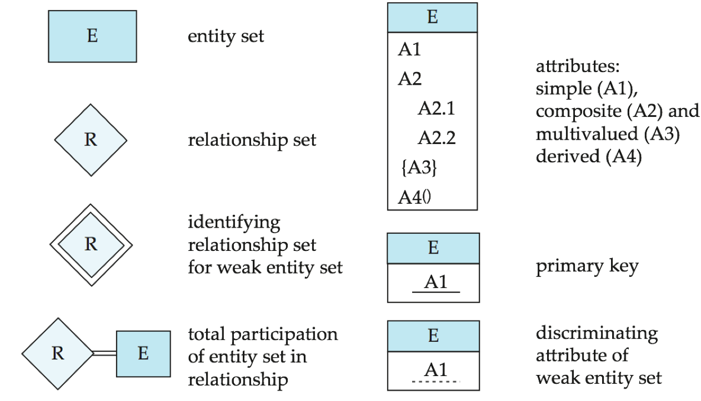
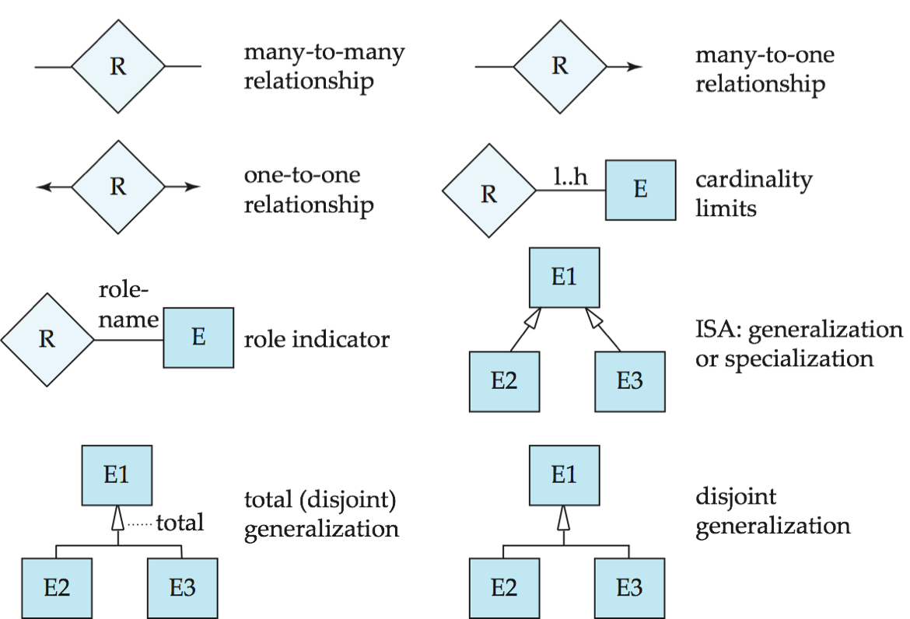
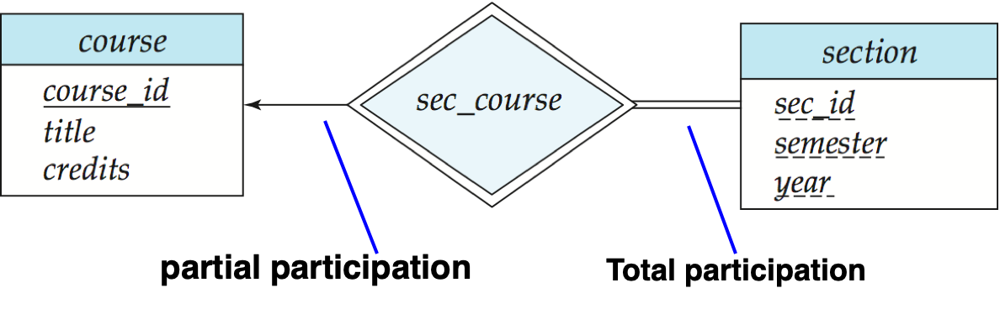

| Name                            |          | 作用                                                         | Ex                                                           |
| ------------------------------- | -------- | ------------------------------------------------------------ | ------------------------------------------------------------ |
| 选择 Select                     | $\sigma$ | 输出保留所有属性                                             | $\sigma_{\rm{salary \geqslant 85000}}(instructor)$           |
| 投影 Project                    | $\Pi$    | 取出某几个属性，<u>重复的tuple会被去掉</u>                   | $\Pi_{ID,salary}(instructor)$                                |
| 并 Union                        | $\cup$   | $r \cup s = \{t(uple) | t \in r {\ \rm or\ } t \in s\}$<br />1. r,s have same arity(等目)<br />2. attribute domains must be compatible | $\Pi_{name}(instructor) \cup \Pi_{name}(student)$<br />说明：映射之后已经等目了 |
| 集合差<br />Set difference      | $-$      | $r - s = \{t | t \in r {\ \rm and\ } t \notin s\}$           |                                                              |
| 笛卡尔积<br />Cartesian product | $\times$ | $\sigma_{A=C}(r \times s)$<br />似乎结果的属性得用r.Attribute和s.Attribute | $instructor \times department$<br />$\sigma_{in.dept = bu.dept}(instructor \times building)$ |
| 重命名<br />Rename              | $\rho$   | $\rho_{X(A_1,...,A_n)}(E)$<br />X是E的新名字，Ai表示可以对属性也重命名，缺省表示同名 |                                                              |

| Name                     | Symbol                 |                                                              | Ex                            |
| ------------------------ | ---------------------- | ------------------------------------------------------------ | ----------------------------- |
| 交<br />Set Intersection |                        |                                                              |                               |
| 自然连接<br />Join       | $\Join$<br />$\bowtie$ | 1. 得有共同属性<br />2. 连接同名属性的值相等的元组           | $instructor \Join department$ |
| 除<br />Division         | $\div$                 | 返回左边在右边元组都有组合的属性<br />$R=(A_1,...,A_m,B_1,...B_n)$<br />$S=(B_1,...,B_n)$<br />$R-S = (A_1,...Am)$<br />$r \div s = \{t|t\in \Pi_{R-S}(r) \and \forall u \in s (tu\in r)\} \\ = \Pi_{R-S}(r) - \Pi_{R-S}((\Pi_{R-S}(r)\times s) - \Pi_{R-S,S}(r))$<br />(PPT2.50)<br />**属性**：$q = r \div s \Rightarrow q {\ \rm is\ the\ largest\ }\\{\rm relation\ satisfying\ }q\times s \subseteq r$ | 看书/ppt吧                    |
| 赋值<br />Assignment     | $\leftarrow$           |                                                              |                               |







虚线

---

**BCNF**

对F^+^中所有的函数依赖α->β，以下**至少有一项成立**

* α->β是平凡的(β⊆α)[若α不是超码，不平凡的α->β就是Partial Dependency]
* α是R的超码(α->R, R⊆α^+^)

```c++
result = {R}
done = false
compute Fp;

while not done:
    if result 中有Ri不为BCNF:
        找到Ri上的一个非平凡函数依赖α->β/*α->Ri2*/，使得α->R不属于Fp/*α不为超码*/，且α∩β=∅/*不平凡*/;	// 一定能找到吗？？ 可以，不然就是BCNF了； **另外，β可以尽量取大**
        result = (result - Ri)/*第一次循环时此处为R-R=空集*/ ∪ (Ri - β)/*Ri1*/ ∪ (α, β)/*Ri2*/;	// α为Ri1与Ri2的共同属性
    else
        done = true
```

---

**依赖保持**

$\displaystyle F'^+ = (\bigcup_{i=1}^n F_i)^+  = F^+$

检查依赖α->β是否被保持的伪代码(课本P195)：

```python
result = α
while(result 有变化)
    for each 分解后的 Ri	# 对于F中的某个α->β，投影到各个Ri中，判别是否有某个Ri能保持函数依赖α->β
        t = (result ∩ Ri)_plus ∩ Ri	# 这是干啥？找出
        result = result ∪ t
# 若最后result包含β中的所有属性，则α->β得到保持
# 若对F中的每个函数依赖都能有一个Ri满足该函数依赖，则该分解保持依赖
```

---

**DTD**

ELEMENT

ATTLIST

---

**XPath**

用文件系统的表示方式来选择文档中的部分

Ex.

* 如`/university-3/instructor/name`返回值为整个元素，包括tag

    ```xml
    <name>Srinivasan</name>
    <name>Brandt</name>
    ```

* 不想要tag可以用`/university-3/instructor/name/text()`

* 要加条件可以用`[]`

    * `/university-3/course[credits >= 4]` returns course elements with a credits value greater than 4
    * `/university-3/course[credits]` returns course elements containing a credits subelement(有credits 就返回)
    * 支持布尔运算：`and` `or` `not()`

* 取属性用`@`

    * `/university-3/course[credits >= 4]/@course_id` returns the course identifiers of courses with credits >= 4
        * IDREF attributes are not dereferenced automatically

* 还有函数

    * `count()`
        * `/university-2/instructor[count(./teaches/course)> 2]` returns instructors teaching more than 2 courses (on university-2 schema)
    * `id()`
        * id() can also be applied to sets of references such as IDREFS and even to strings containing multiple references separated by blanks，解引用，拿属性值取回对应的元组
        * `/university-3/course/id(@dept_name)` returns <u>all **department** elements</u> referred to from the dept_name attribute of course elements.
    * `doc(name)`
        * returns the root of a named document

* 特殊操作符

    * `|`：并集
    * `//`：相当于跳级
        * `/university-3//name` finds any name element anywhere  under the /university-3 element, regardless of the element in which it is contained.
    * `*`：所有子节点
    * `..`：父节点   

---

**XQuery**

**FLOWR**

```xquery
for $x in /university-3/course
let $courseId := $x/@course_id
where $x/credits > 3
return <course_id> { $courseId } </course_id>	<!--大括号表示里面是变量，否则返回值就是字符串的"$courseID"，但是整个返回值还是文本型的，所以tag也会被返回-->


for $x in /university-3/course[credits > 3]
return <course_id> { $x/@course_id } </course_id>


return element course_id { element  $x/@course_id } 
```

Join

```xquery
<!--Joins are specified in a manner very similar to SQL-->
for $c in /university/course,
    $i in /university/instructor,
    $t in /university/teaches
where $c/course_id= $t/course id and $t/IID = $i/IID
return <course_instructor> { $c $i } </course_instructor>
<!--The same query can be expressed with the selections specified as XPath 9selections:-->
for $c in /university/course,
    $i in /university/instructor,
    $t in /university/teaches[ $c/course_id= $t/course_id and $t/IID = $i/IID]
return <course_instructor> { $c $i } </course_instructor>
```

Nested Query

```xquery
<university-1> 
{for $d in /university/department
    return <department>
        { $d/* }
        { for $c in /university/course[dept_name = $d/dept_name]
            return $c }
    </department>
}
{for $i in /university/instructor
    return  <instructor>
        { $i/* }
        { for $c in /university/teaches[IID = $i/IID]	<!--instructor下面的子元素-->
            return $c/course_id }
    </instructor>
}
</university-1>

<!--总的返回值-->
"<univrsity-1><department>d系的building和budget d系的所有课</department><instructor>i导师的name和salary i导师的所有课</instructor></university-1>"
```

<u>怎么个嵌套法？是直接笛卡尔积？是的</u>

##### Sort

The `order by` clause can be used at the <u>**end** of any expression</u>. 

```xquery
for $i in /university/instructor
order by $i/name	<!--Use order by $i/name  descending to sort in descending order-->

return <instructor> { $i/* } </instructor>
```

```xquery
<university-1> {
        for $d in /university/department
        order by $d/dept name
        return
             <department>
                 { $d/* }
                 { for $c in /university/course[dept name = $d/dept name]
                   order by $c/course id
                   return <course> { $c/* } </course> }
             </department>
      } </university-1>
<!--输出系和系的课，且先按系排序再按课排序-->
```

---

**B+**

MaxFanout：最大子节点数

* 根节点：$2$\~$n$个孩子，$1$~$n-1$个keys
    * `keyNum = childNum - 1`
* 非叶：$\lceil n/2 \rceil$~$n$个孩子($\lceil n/2 \rceil-1$~$n-1$个keys)
    * `keyNum = childNum - 1`
* 叶：$\lceil (n-1)/2 \rceil$~$n-1$个keys？？？这和ADS的应该是不一样的规则，为什么不一样？因为这里叶节点的指针也是要存指向data的ptr的
    * `keyNum = ptrNum`

```python
import math
for i in range(100):
    print(math.ceil(i/2)-1, math.ceil((i-1)/2))
'''
1: 0 0
2: 0 1
3: 1 1
4: 1 2
5: 2 2
6: 2 3
7: 3 3
8: 3 4
9: 4 4
10: 4 5
'''
```

---

**符号表示**

* n~r~: number of tuples in a relation r.
* b~r~: number of blocks containing tuples of r.
* b~b~: [每个归并段(run)的buffer数](# External Merge)/[每个关系的buffer数](# Merge Join)
* f~r~: blocking factor of r
    * i.e., the number of tuples of r that fit into one block.
* I~f~: tuples of r are stored together physically in a file, then:
* l~r~: number of bytes for a tuple in r
* V(A, r): number of distinct values that appear in r for attribute A; same as the size of A(r).
* SC(A, r): selection cardinality of attribute A of relation r ; average number of records that satisfy equality on A.
    * Sc(A, r) == n~r~ / V(A, r)


* F~i~: average **fan-out** of internal nodes of index i, for tree-structured indices such as B+-trees.
* Ht~i~ : number of levels in index i — i.e., the height of index i.
    * For a balanced tree index (such as B+-tree) on attribute A of relation r: $HT_i = \lceil \log_{F_i} (V(A,r)) \rceil$.
    * For a hash index, HT~i~ is 1.