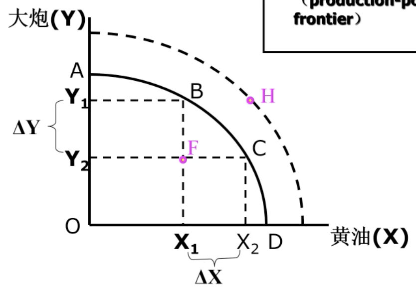
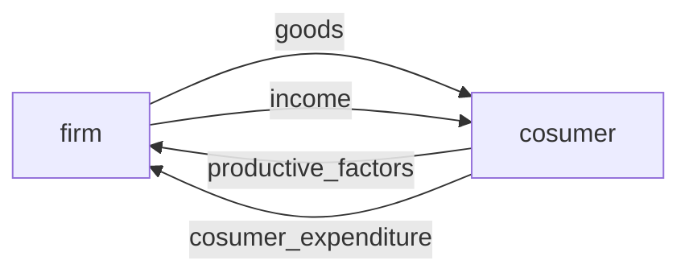
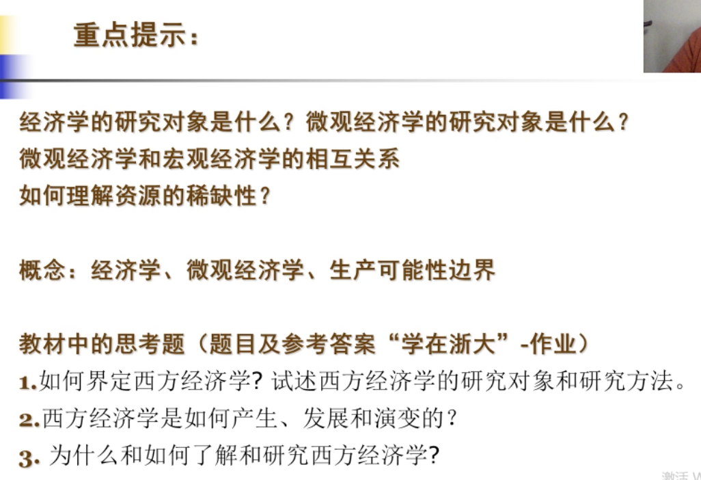

[TOC]

## 1.1 *经济学与资源配置

政治经济学

经济学

人的欲望(需求)的特性：无限性、多样性

> 为什么人类需要是无限的？

**资源特性**

* 稀缺性：相对概念
* 可选择性：多种用途

资源的基本种类：自然资源、人力资源、资本品(人力+自然所得的产品)、技术(劳动力+自然，劳动力+资本品有关的知识)

分类：经济资源(要钱)与非经济资源(免费)

资源满足人的欲望，由这两对的矛盾派生出了**资源配置**的概念

**生产可能性边界PPF**(机会成本、边际转换率MRT与技术进步)w

大炮与黄油

Productive Possibility Frontier是将现有资源**充分利用**、技术既定的情况下能生产出的两种物品的最大值的组合曲线					

F说明资源存在闲置或浪费，如烂尾楼(土地、经济资源浪费)

H(X2, Y1)在资源与技术不变的情况下达不到

> 在现实中的生产究竟在哪是由什么决定的？
>
> ​	BC由资源配置决定；FB由

宏观经济学研究要在PPF上哪一点

**机会成本**：放弃资源在其他用途上可能带来的收益，如果有多个用途，则取最大的

## 1.2 *经济学基本理论分类

经济学分类：增长、发展、灾害经济学等等(**很多**)

从原理角度分类

* 微观：市场经济中单个**微观经济主体**(个人、家庭等)的行为及相应的**微观经济变量**
    * 生产什么？生产多少？What
    * 如何生产？How(？？？？这里指生产方式还是什么)
    * 为谁生产？Who(即分配问题)
* 宏观：国民经济**总体经济运行**及相应的**总体经济变量**
    * 资源利用、充分就业
    * 经济增长
    * 经济稳定

经济变量

* 微观：单个市场、单个消费者
* 宏观：总体：总供给、总需求

注：消费者对于一家企业来说是劳动力要素，也属于生产要素(productive_factors)；企业通过发放工资(income)与消费者（劳动力）之间构成循环

中国不是其中任意一种，是社会主义市场经济

特征：

* 财产制度：公主体，多并存
* 经济条件：市场在资源配置起决定性作用，政府发挥积极作用

市场经济前提

* 经济人假定：最大利益
* 私有财产权

## 1.3

经济变量：经济运行中反应社会京津冀活动及其变动的一系列数值分类的概称，如储蓄、投资、需求、供给

存量与流量

* 存量Stock：某一个时点上的变量：2019年1月1日人口数
* 流量Flow：一个时期连续观察到的变量：2019年新出生人口数、**GDP**、人均GDP(流量/存量)

内生变量和外生变量

？？？？

方程解出来的是外生变量

经济模型：描述**经济变量**之间相互**关系**的**理论结构**

如市场供给正比于市场价，需求反比于市场价

## 1.4 经济分析方法

**边际分析**

关注增量(Delta)和最后单位(Final Unit)

**均衡分析**

概念借鉴于物理的平衡

供给=需求的价格叫均衡价格

分析方法：

* 局部均衡：其他条件不变，研究单一市场供给需求价格的相互作用
* 一般均衡：考虑所有市场的

* 静态：同一时点
* 比较静态：多个时点
    * 例如一个商店去年与今年三月份的销售额对比(同比增长、下降)
* 动态：不同时点
    * 一个时间序列的对比

？？？？动态和比较静态的区别

？？？？实证与规范

* 实证分析：经济运行如何
* 规范分析：评估政策

> 请问老师，为甚么经济资源跟非经济资源最后都一定会是经济资源？(如果它们的最终都会是经济商品我能理解，但有些资源产出的经济商品也是免费的呀？)
>
> > 获取资源是否有付出代价
>
> 
>
> 老师，讲机会成本的时候为什么说选择了某一种而放弃很多种的话以放弃效益最大的一种来衡量，而不是以放弃效益的总和来衡量？
>
> > 效率导向
> >
> > 陈希尧觉得这是傻逼问题。
>
> 

