# 需求、供给与均衡价格(价格理论、价格机制

## Intro

微观配置问题：价格

均衡价格理论：核心

在市场经济中，需求和供给的关系决定

### 市场

商品市场和要素市场

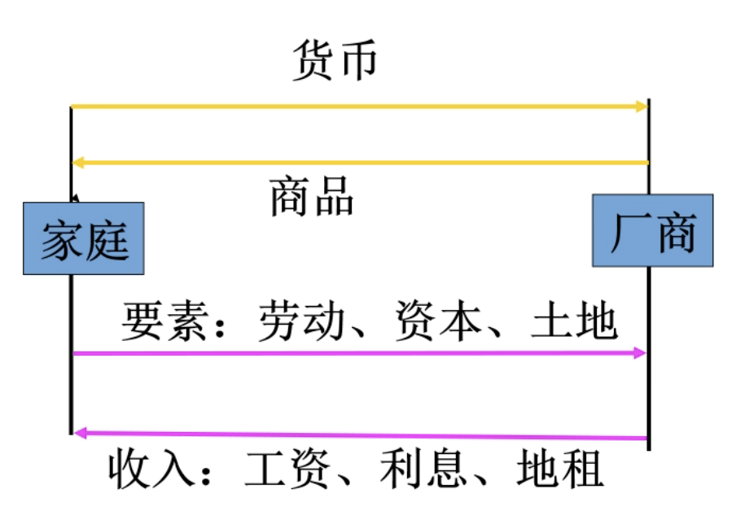

**一个市场包含四方面内容**

* 一组当事人为了出让获取的商品发生相互关系
* 都是自愿的。超经济的强制，如赋税，就不是市场行为
* 当事人通过价格和一定数量商品发生联系。通过指令(学校发通用粮票给学生去买粮)发生联系就不是市场行为
* 在出让商品者和取得商品者间存在竞争。商品配给就不是市场行为

## 需求分析

<u>说明某一商品在每一价格下的购买量</u>

### **需求与需求量**

**需求**：

* 消费者在某一时间内的**每**一价格水平上对某种商品愿意并且能够购买的数量。(各个价格水平上分别愿意买多少，是总的概念)
* 条件
    * 购买欲望
    * 购买能力(货币支付能力)

**需求量**

* 消费者在某一时间内的**某一特定**价格水平(针对特定时间)上对某种商品愿意并且能够购买的数量。
* 条件
    * 购买欲望
    * 购买能力(货币支付能力)
    * 流量：特定时间内的变化量，必须有**时间单位**(如A城**每个月**对小轿车需求量为n量)

### **影响需求的因素**

* 商品本身的价格
    * 最直接、最重要
    * 反方向变化
    * **需求定理**
* 相关商品的价格
    * 替代品
    * 互补品：汽车汽油、家电与电、镜架与镜片
* 消费者收入水平
    * 正常商品：需求与收入正方向
    * 低档商品：需求与收入反方向
* 消费者预期
    * 对未来收入预期
        * 稳定增长
        * 不确定或下降
    * 对未来价格预期
        * 未来上涨 $\Longrightarrow$ 需求增加
        * 未来下降 $\Longrightarrow$ 需求减少
* 消费者偏好
    * 广告宣传会改变人们的偏好 $\Longrightarrow$ 改变需求

#### **需求定理**

* 一般情况下，某种商品的需求量与其价格成反方向变动，即价格上升，需求量减少；方向变动，即价格上升，价格下降，需求量增加。

* 需求函数：Q_d=f(P) dQ_d/dP < 0

* 需求方程：Qd=a-bP (a、b为常数，b>0)

* 需求表

    | 价格(元**/**公斤)     | 需求量(公斤/月)   |
    | --------------------- | ----------------- |
    | 6.0 5.0 4.0 | 4 4.5 5 |

* 需求曲线：

    * 斜率为负
    * 线性、非线性

* 需求定理的例外：**某些**{炫耀性商品、珍稀商品、低档商品}

> 思考题：
>
> 1. 为什么需求和价格反方向变动？
>     * **替代效应**
>         * 用途可以互相替换的商品(茶和咖啡、牛排和猪排)，一种价格下降，会导致另外一种购买量下降，这部分钱用于多购价格下降了的商品
>     * **收入效应**
>         * 一种商品下降(提高) $\Longrightarrow$ 消费者**实际收入**提高(减少) $\Longrightarrow$ 需求量增加(减少)
>     * **边际效用价值论**
>         * 越稀缺 $\Longrightarrow$ 边际效用越大 $\Longrightarrow$ 价值越大
>         * 当人们消费某种商品时，随着商品数量增加，其效用不断递减
> 2. 所有的都是反方向吗？有例外吗？
>     * 炫耀性商品
>     * 珍稀商品
>     * 低档商品，[吉芬商品](https://zh.wikipedia.org/zh-hans/吉芬商品)(Giffen Goods)
>         * 十九世纪[维多利亚时代](https://zh.wikipedia.org/wiki/维多利亚时代)的[英国](https://zh.wikipedia.org/wiki/英国)[经济学家](https://zh.wikipedia.org/wiki/经济学家)[罗伯特·吉芬](https://zh.wikipedia.org/wiki/罗伯特·吉芬)发现，当时英国进口的[小麦](https://zh.wikipedia.org/wiki/小麦)价格提高使得[面包](https://zh.wikipedia.org/wiki/面包)价格上涨，而奇怪的是，低收入的[工人阶级](https://zh.wikipedia.org/wiki/工人阶级)反而消费更多的面包，有违一般[需求法则](https://zh.wikipedia.org/wiki/供给和需求)；后人对具有这种现象的物品，就称为吉芬商品。[1\]](https://zh.wikipedia.org/zh-hans/吉芬商品#cite_note-1)
>         * 本质就是其他也涨价，但是面包性价比相对高，所以只能多买面包
>     * 某些商品价格小幅变动，需求正常变动；但如果大幅变动，人们就会采取观望态度，会有不规则变化

### 需求量的变动与需求的变动

**需求量**的变动

* 同一需求曲线上点的移动。
* 变动原因：商品本身价格的变动

**需求**的变动

* 需求曲线本身的移动
    * 变动原因：商品本身价格以外的其它因素的变动
        * 相关商品的价格、消费者收入水平、消费者预期、消费者偏好

### 个人与市场需求的联系

市场需求是全部个人需求的加总。

* 市场需求函数：设Q1=a1-b1P， Q2=a2-b2P  则: Qd=a-bP ，
    其中， Qd=Q1+Q2 ，a=a1+a2 ，b= b1+b2
    
* 市场需求曲线:

    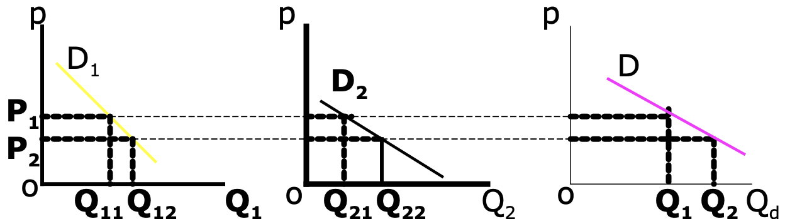

## 供给分析

<u>说明各种不同价格时的供给量</u>

### 供给与供给量

供给

* 生产者在某一时间内的每一价格水平上愿意提供并且能够提供的某种商品的数量。
* 供给的条件:
     (1)供给意愿;(2)供给能力。

供给量

* 生产者在某一时间内的某一特定价格水平上愿意提供并且能够提供的某种商品的数量。
* 供给量的条件:
     (1) 供给意愿;(2)供给能力;(3)时间单位。

### **影响供给量的因素**

* 商品本身的价格
    * 供给定理
* 生产成本的变化
    * 反方向
* 技术水平
    * 正方向
* 生产者预期
    * 预期行情看涨，供给增加；预期行情看跌，供给减少。
* 自然条件
    * 条件好，供给多；条件差，供给少。
* 产业支持
    * 提供支持/加以限制

#### **供给定理**

* 供给定理:一般情况下，某种商品的供给量与其价格成正方向变动，即价格上升，供给量增加;价格下降， 供给量减少。
* 供给函数：Qs=f(P) dQs/dP > 0
* 供给方程：Qs =c+dP (c、d为常数，d>0)
* 供给曲线
* 供给表

### 供给量的变动与供给的变动

供给量的变动

* 同一供给曲线上点的移动。
* 变动原因:商品本身价格的变动 。

供给的变动

* 供给曲线本身的 移动。
* 变动原因:商品本身价格以外的 其它因素的变动。

### 个人供给与市场的关系

市场供给是全部个人供给的加总。
市场供给函数：设为两个供给者的供给量分别为Q1=c1+d1P， Q2=c2+d2P  则: Qs=c+dP，其中，Qs=Q1+Q2 ，c=c1+c2 ，d= d1+d2

## 均衡价格及其决定

均衡价格 (equilibrium price)是指需求和供给相等时的价格，记为$P_e$，此时供给量等于需求量，称均衡数量。

* <u>当产品价格高于均衡价格时，供过于求，价格下降至均衡价格</u>
* <u>当产品价格低于均衡价格时，供不应求，价格上升至均衡价格</u>

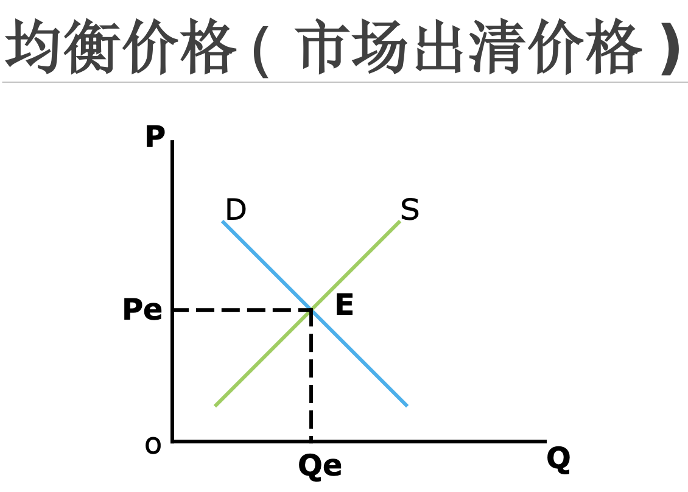

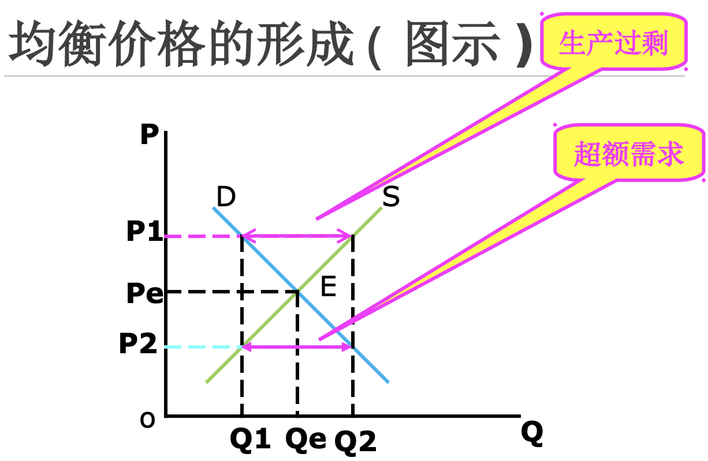

### 政策对价格与产量的影响

价格调节及其局限性

#### 支持价格与限制价格

* 支持价格 **Support price**：政府为支持某一行业发展而对该行业规定的**高于均衡价格**的最低限价。如农产品、最低工资
* 限制价格 **Ceiling price**：政府为限制某产品价格上涨而对该产品规定的**低于均衡价格**的最高限价 。如商品房

**后果**

* 支持价格
    * 过剩 $\Rightarrow$ 政府收购 $\Rightarrow$ 政府支出增加
* 限制价格
    * 实行配给制度、限制购买 $\Longrightarrow$ 粮票布票、商品房限购、黑市交易

#### 税收的影响(补贴的影响)

**对生产者征税**，通过市场交易，税收会有一部分转加到消费者，一般的，取决于需求弹性(D线的斜率)

* 消费者承担比例越大，如果需求完全无弹性，就将完全由消费者负担，反则反之
* 供给弹性越小，生产者承担比例越大，如果供给完全无弹性，就将完全由生产者负担，反则反之

均衡点由QePe到Q1P1，税收P2-Pe，生产者承担P2-P1，消费者承担P1-Pe

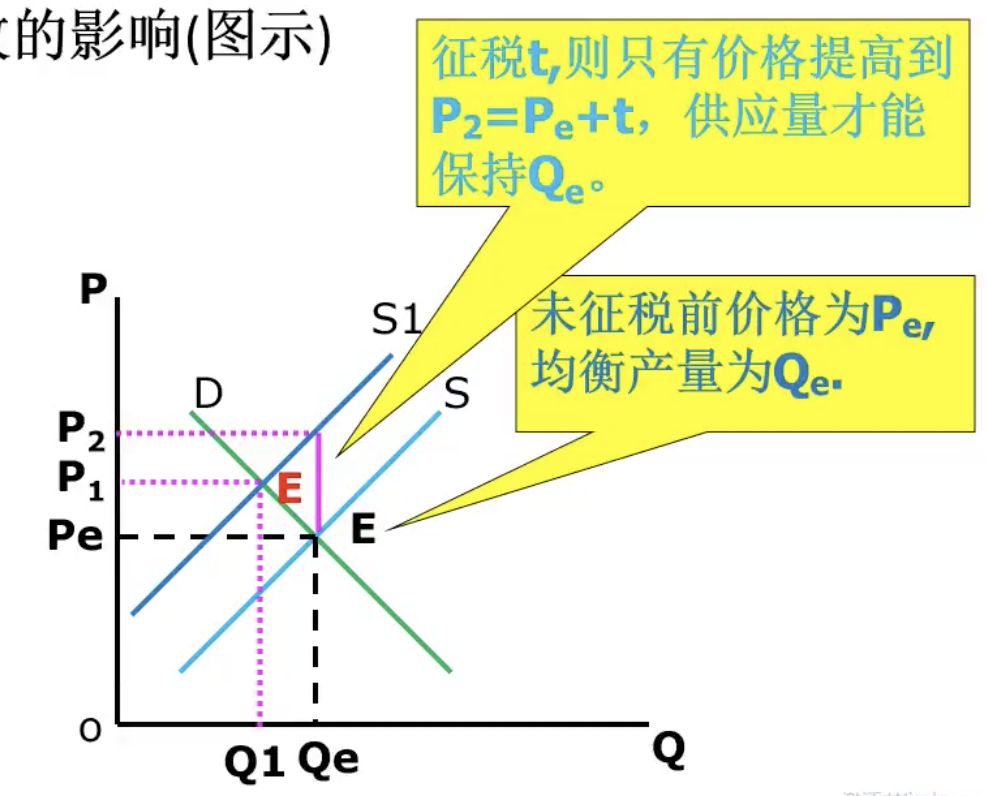

## 均衡价格的变动

### 供求定理(<u>不是供应定理+需求定理</u>)

* 需求增加 $\Longrightarrow$ 向上移动 $\Longrightarrow$ 均衡价格上升(**同方向**)，均衡数量增加(**同方向**)

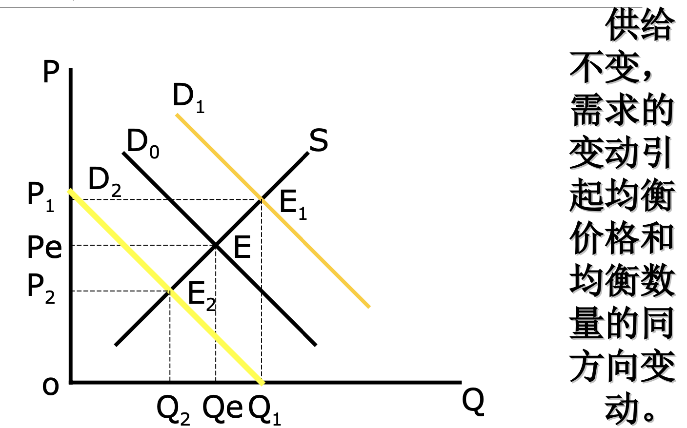

* 供给增加 $\Longrightarrow$ 向右移动 $\Longrightarrow$ 均衡价格下降(**反方向**)，均衡数量增加(**同方向**)
    * 增产不增收

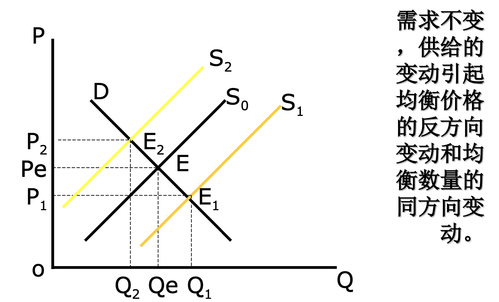

* 同时变动，得看供需相对变化趋势，看mooc，这:dog:ppt什么都没有

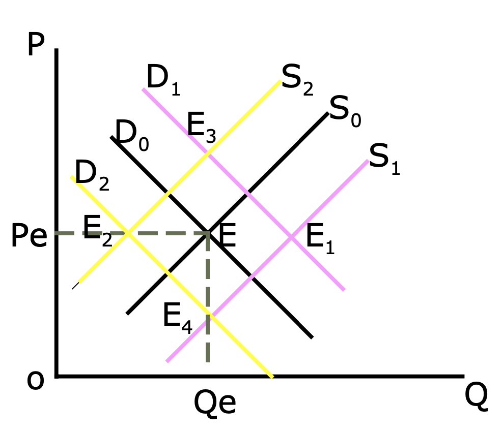

# 弹性理论

## 需求弹性

需求量对价格和其他因素的变动敏感度有多大？

弹性：因变量对自变量相对变化的反应程度

需求弹性 = 需求变化率 / 某种因素变化率

### 需求的价格弹性

**需求价格弹性系数** = 需求量变化率 / 价格变化率

$\large E_d = \frac{\Delta Q / Q}{\Delta P / P} = \frac{\Delta Q}{\Delta P}\frac{P}{Q}$

**注意**：

* Ed的数值不会因计量单位不同而不同
* Ed的数值一般是负数，但是一般都取绝对值
* 弹性不仅随商品的不同而不同，且弹性还随价格的不同而不同

**具体计算方法**：

* 弧弹性：两点之间的弹性
    * $\large E_d = \frac{\Delta Q}{\Delta P} \times \frac{P_1 + P_2}{Q_1 + Q_2}$
* 点弹性：
    * $\large E_d = \frac{\Delta Q}{\Delta P}\frac{P}{Q} = \frac{{\rm d} Q}{{\rm d} P}\frac{P}{Q}$，其中$\large \frac{{\rm d} Q}{{\rm d} P}$为斜率的导数

**分类**

* Ed=0
    * 需求完全无弹性
    * 需求曲线与P(y)轴平行
    * 胰岛素
* 0 < |Ed| < 1
    * 需求缺乏弹性
    * 直线
    * 生活必需品：粮食
* |Ed| = 1
    * 需求具有单位弹性(等值反应)
    * 需求曲线为正双曲线
    * 理论存在
* 1 < |Ed| < infinity
    * 富有弹性
    * 直线
    * 奢侈品(汽车、珠宝、出国旅游)、固定电话
* |Ed| = infinity
    * 完全有弹性
    * 需求曲线与Q轴平行
    * 银行对黄金的需求是无限的、263收费后需求量几乎为0\

**影响因素**

* 可替代程度
* 类别的大小？高露洁牙膏 的弹性比 牙膏 的大
* 对生活的重要程度
* 商品消费支出 占总支出的比重：比重越大弹性越大(越可压缩)
* 调整消费习惯的时间：老年人 时间长 弹性小
* 商品耐用时间：越耐用弹性越小

**弹性与斜率**

对于同一点，弹性与斜率绝对值成反比

直线型需求曲线

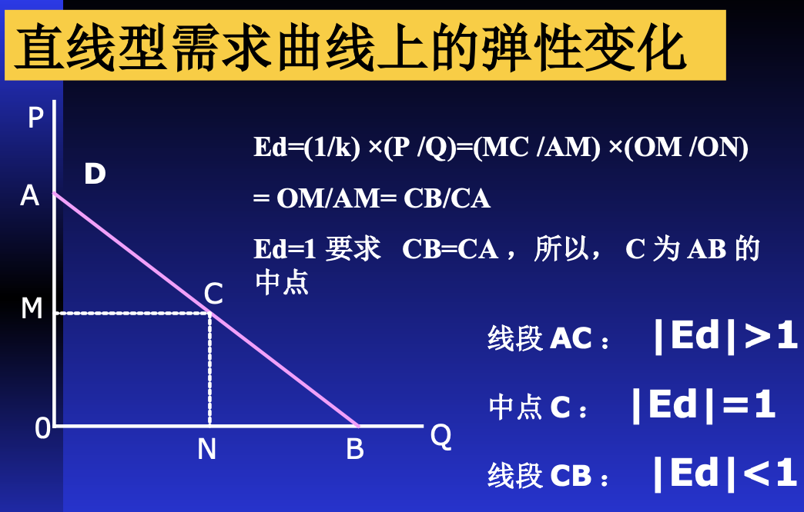

非线性

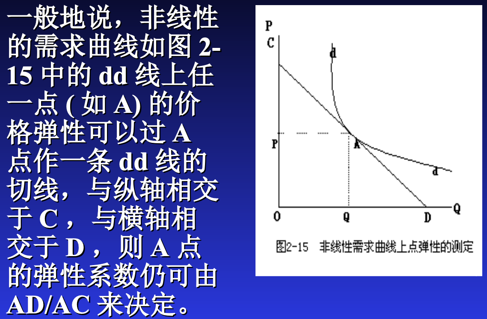

**弹性与收益**

涨价：销量减少，单利增加 $\Longrightarrow$ 用面积算

弹性>1：降价增加收益

弹性<1：涨价增加收益

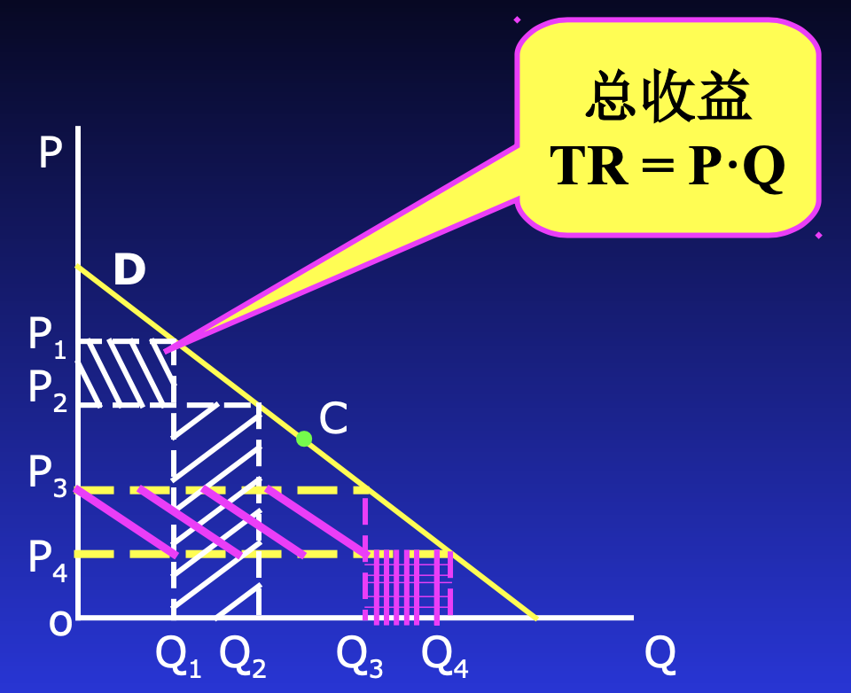

### 需求的收入弹性

* Ey<0 低档商品
* <1 必需品
* \> 1 奢侈品

### 需求的交叉弹性

Exy = 需求量变化的百分比与 <u>另一种商品价格变动</u> 的百分比

分类

* \> 0 替代品
* <0 互补品
* = 0 独立品

## 供给弹性

## 弹性理论的应用

### 谷贱伤农

需求缺乏弹性，供给弹性是0？？？

供给增加之后需求

### 税负分担理论

对消费者增税会怎么样？

国家对生产者/消费者进行补贴会怎么样

### 蛛网理论

**基本假设**:

* 本期的**供给量**取决于**上期**的价格
* 本期的**需求量**取决于**本期**的价格

三种类型

* 收敛型蛛网的条件:供给弹性 < 需求弹性，或，供给曲线斜率 > 需求曲线斜率。
* 发散型蛛网的条件:供给弹性 > 需求弹性，或，供给曲线斜率 < 需求曲线斜率。(供给弹性大，产量变动得更大)
* 稳定型蛛网的条件:供给弹性 = 需求弹性，或，供给曲线斜率 = 需求曲线斜率。

适用分析对象：有生产周期的产品 ( 非订单生产 ) 。