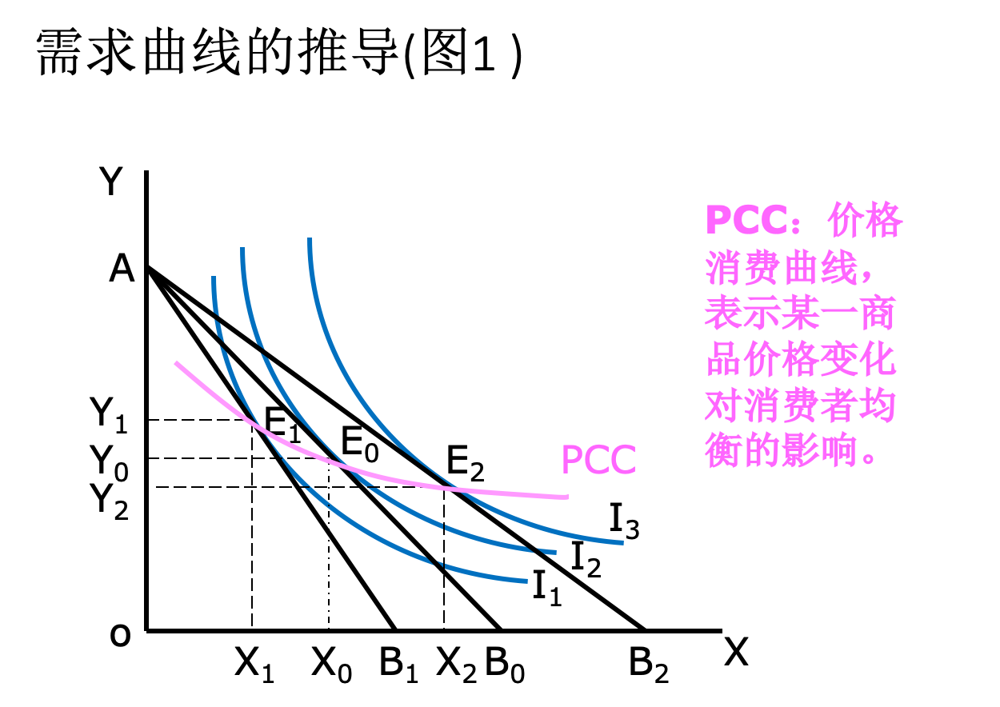

消费是人们为**满足欲望**而使用物品或接受服务的一种经济行为，目的是获取效用

基数效用理论(Cardinal Utility) ：可以用基数加以测量并求和，采用边际效用分析

序数效用理论(Ordinal Utility) ：不能用基数测量，只能排序，采用无差异曲线分析

## 效用

满足程度高，效用高，程度低，效用低；带来痛苦，负效用

共性在于人们消费的物品或劳务的本身具有能够满足人们欲望的客观的物质属性(如饭吃了能饱)

个性则表现为它是消费者的一种主观感受，如抽烟对不同人感受不同，也正因如此<u>效用与物品的使用价值(value in use)有关，但不相等</u>。

幸福=效用/欲望（萨缪尔森）

# 基数效用理论

> 基数效用理论首先假设消费者消费物品和劳务所获得的满足程度即效用，是可以用基数即1、2、3等来计量，因而可以相加（不同商品或劳务的效用可以相加、不同消费者获得的效用可以相加），和表示总效用。

**计量单位**：效用单位

基数效用理论：

Q:某种商品的消费量，U：消费该商品所获得的效用量

U=f(Q)

## 总效用：TU

总效用函数

1. TU=μ(Qx)  (比如=6+10+7)
    * 只消费一种商品x，Qx表示消费的数量
2. TU=∑ μ(Qxi） （i=1，2，3…n）(比如=aQx1+bQx2+cQx3)
    * 消费多种商品，Qxi表示第i种商品的数量
3. TU= μ(Qx,Qy,Qz) （比如=AQxQy）
    * 消费多种商品，Qx,Qy,Qz表示不同商品的数量

## 边际效用

**边际效用**（MU, Marginal Utility）：物品的边际效用，是指该物品的消费量每增(减)一个单位所起的总效用的增(减)量。

* MU大小与欲望强弱成正比
* MU大小与所消费商品数量多少成反比
* MU是特定时间内的效用(由于欲望具有再生性、反复性，因此MU也具有时间性)
* MU是决定产品价值的主观标准

MU = ΔTUx/ΔQx 或 dTU/dQ

### 边际效用递减规

（Decreasing Marginal Utility or Gossen’s Law）

**在一定时期内**，在其他商品的消费数量保持不变的条件下，消费者随着对**某种商品**的消费量的增加，从该商品连续增加消费的每一单位中所得到的效用即边际效用是递减的；当边际效用递减到等于零以至变为负数时，总效用就不再增加以至减少。

条件：时间；某种

但在实际中，边际效用不会为0或负值。

**理论解释**：1. 满足程度或心理刺激递减；2. 消费者总是将前一单位的消费品用在更重要的用途上的，因此用途重要性必然是随购买量递减的

### 数学

效用函数 TU = μ(QX),

则边际效用MU =dTU/dQX 

**总效用最大化**

必要条件：二阶偏导=0

充分条件：二阶偏导<0

## 基数效用理论中消费者均衡条件

消费者均衡是指消费者在收入（M）和商品价格(Px、Py）既定的条件下作出实现效用最大化的消费(商品x和商品y的数量)选择。

约束条件：M(收入)=Px\*QX+Py\*QY

==**均衡的实现条件**：$\Large \frac{MUx}{Px} = \frac{MUy}{Py} = \lambda(货币的边际效用)$，用稳定平衡的方法证明==

### 货币的边际效用

将货币视作商品：对于一个消费者来说，收入的时候货币的边际效用递减，支出的时候货币的边际效用递增

货币的边际效用（λ）是支出1单位（元）货币使消费者总效用的减少量。如λ＝6，就表示消费者每支出1元货币，就牺牲了6个效用单位的效用。

**假定：货币的边际效用对于<u>同一个人</u>，在<u>一次消费</u>中是不变的。**

* 为什么要假设为const：在评价买卖行为时，货币起到衡量效用大小的作业(价值尺度？)，应该是常数
* 为什么可以假设为const：一般情况，单位商品的价格只占消费者货币总收入量很少一部分，所以当购买量发生很小的变化时，所支出的货币的边际效应的变化可以忽略(例如收入1万，消费10元，第1块和第10块差异不大)

**计算**：拿边际效应除以价格，保持>=λ。最后算总效用记得要加剩余的钱的货币效用

则**需求价格**：P = MU/λ = (dTU/dQ)/λ 

需求价格是指消费者对一定数量的商品所愿意支付的价格，它由一定量商品对消费者的边际效用决定。由于边际效用递减规律的作用，因此随着商品供给量增加，边际效用递减，从而需求价格也是递减的。

**需求曲线**

## 消费者剩余

消费者剩余：消费者愿意支付的价格高于实际支付价格(用市场均衡价格解释)的差额。这是消费者从市场交易中享受到的福利。

一直买到`愿意支付价格等于均衡价格`为止

需求曲线 连续时直接积分，消费者剩余为均衡价格之上的三角形面积(Q为横轴，P为纵轴)

# 序数效用理论

消费者在消费商品和劳务的过程中所得到的满足是一种心理感受，因而很难用准确的基数来衡量，对不同的消费者而言，更不容易比较和加总，但可以根据商品和劳务对消费者的重要性来排队、可以按第一、第二、…顺序来进行排序

偏好：

三个公理：

* 完备性
    * 消费者对不同商品能按自身偏好排序，即为(A^P^B、B^P^A、A^I^B三者之一)，如飞机的航空餐二选一
* 非饱和性
    * 其他单位数量一样的前提下，消费者总是偏好数量多的商品组合(前提：边际效用MU>0)
    * 商品组合AB，均包含xy两种商品，若xA = x_B, y_A > y_B，则偏好A(A^P^B)
* 传递性
    * A^P^B, B^P^C $\Longrightarrow$ A^P^C
    * A^I^B, B^I^C $\Longrightarrow$ A^I^C(I表示=)

## (效用)无差异曲线：

能给消费者带来相同总效用的**两种商品**的不同数量**<u>组合</u>**的连线。

特性

* 无差异曲线向右下方倾斜（斜率为负)

* 一个平面上可以有无数条无差异曲线，并且任何两条都不相交(若相交，则两条曲线为同一条曲线)

* 离原点越远的无差异曲线代表的总效用水平越高

* 无差异曲线凸向原点(斜率的绝对值递减)

### 商品的边际替代率(Marginal Rate of Substitution)

保持总效用不变，增加以单位某种商品消费量必须放弃的另一商品消费量

例如，冰激凌对游戏的MRS是0.6，则1盒冰激凌对0.6次游戏(1盒冰激凌相当于0.6次游戏，游戏效用更大)

==X对Y的边际替代率：$\rm MRS_{XY} = - \frac{\Delta Y}{\Delta X}$，是曲线上两点连线的斜率的绝对值==

$\rm MRS_{XY}= -ΔY/ΔX = MU_X/MU_Y$

证：

$\rm 总效用不变 \Longrightarrow  ΔTU_X = -ΔTU_Y \\\Longrightarrow ΔX \times MU_X = -ΔY  \times  MU_Y \\\Longrightarrow -ΔY/ΔX =  MU_X/MU_Y$

结论即为边际替代率递减规律(X↑Y↓，MU_X↓MU_Y↑，MRSXY↓)

**边际替代率递减规律**保证了无差异曲线的形状

### **无差异曲线极端的例子**

**完全替代品**

边际替代率为常数，不递减

**完全互补品**

一个不够，另一个再多也没用，如一个镜架要配两个镜片

$\rm MRS_{镜片,镜架} = 0\ or\ \infin$

**一个好商品和一个坏商品**

中药是坏商品(难喝)，冰糖是好商品，

## 消费预算线(预算constraint)

消费者预算线（Budget Line)，也叫消费者可能线

`QX * PX + QY * PY = M` $\Longrightarrow$ `QY = M / PY - (PX / PY) * QX`

**消费预算线的变动**

* 收入变动，收入增加右移，减少左移
* 一个商品价格变动，沿与另一条轴的交点**<u>旋转</u>**
* 两个商品价格一起变动，改变交点
* 收入和价格同时变化：

## 序数效用理论消费者均衡的实现

为什么G、F不行？因为效用水平是I1，肯定比E的I2低

==序数效用理论的消费者均衡条件：$\rm MRS_{XY} = P_X / P_Y$==

#### **无差异曲线分析法与边际效用分析法比较**

> 应该指出，运用无差异曲线分析法与边际效用分析法对消费者均衡条件的分析是完全相同的。这是因为消费可能线斜率与无差异曲线斜率相等。<u>？？？？这哪来的因果关系</u>
> 无差异曲线斜率：
> 		MRSXY=△Y/△X =MUX/MUY，
> 而消费可能线AB的斜率：
> 		OB/OA=（M/PY ）/（M/PX） = PX / PY 。

## 需求曲线的推导

## 恩格尔曲线

不同曲线：课本P118

◆恩格尔曲线：表明消费者的货币收入与某种商品需求量之间关系的曲线，也称收入需求曲线。
◆恩格尔定律：收入少的家庭，用于食品消费支出的比例大于其它消费支出(即恩格尔系数大于0.5)；收入多的家庭，用于食品消费支出的比例小于其它消费支出(即恩格尔系数小于0.5)。
◆恩格尔系数：食品支出占总消费支出的比例

## 价格效应：替代效应和收入效应

* 价格效应：一种商品**价格变化所引起的需求量变化**，包括：
    * 替代效应：**在实际收入不变的条件下(为了分析方便的假设)**，由某商品的价格变动引起商品相对价格发生变动，进而由**商品的相对价格变动所引起的商品需求量的变动**。（效用不变~~(补偿预算线和原无差异曲线)~~）
    * 收入效应：由商品的价格变动引起的实际收入水平变动，进而由**实际收入水平变动所引起的商品需求量的变动**。（效用发生变化，假设价格不变~~(补偿预算线和原无差异曲线交点和现无差异曲线交点)~~）

价格效应=替代效应+收入效应

**补偿预算线**(一种分析工具，斜率同新的预算约束线，与旧的无差异曲线相切。表示按变动以后的价格(斜率)购买商品组合达到原效用(旧无差异曲线)的最低收入水平)：

1. 商品价格下降，消费者实际收入上升，假设取走消费者部分货币收入
2. 商品价格上升，消费者实际收入下降，假设补偿消费者部分货币收入

借助补偿预算线可以分清价格效用中的替代效应和收入效应

> 怎么来的？？
>
> 由AB_1平移来的 

虽然收入效应会抵消一部分替代效应的

吉芬商品

### 劳动的价格效应

工资简介提供效用、闲暇直接提供效用

收入水平提高

替代效应：劳动量增加(T0T1)

收入效应：劳动量减少(~~T0T2~~T1T2)

T2也有可能在T0右边，因为工资上升到一定水平后收入效应大于替代效应

### 对利息征税：收入效应和替代效应

S就是存款能产生的钱

征税后曲线逆时针旋转了

