* 生产理论：生产要素投入既定，看产出
* 成本理论：产量既定，看投入成本
* 厂商均衡：在不同市场上一定需求曲线下利润最大

# 生产理论(产量)

## 企业理论

**企业的性质**

企业是替代市场的组织。科斯，《企业的性质》，1937年

例如汽车生产商，向其他企业购买轮胎，这是市场行为，支付购买价格；若自己生产则是企业行为，花费生产成本，因此说企业是市场的替代品

**企业的边界**

## 经济活动的国际标准分类

| 产业分类 | 部门分类                                                     | 主要特点                                                     |
| -------- | ------------------------------------------------------------ | ------------------------------------------------------------ |
| 第一产业 | 农业、牧业、林业和渔业、矿山采掘业                           | 直接利用自然资源生产初级产品，创造物质效用                   |
| 第二产业 | 加工工业（制造业）、建筑业                                   | 对初级产品进行加工，创造或增加物质的形态效用                 |
| 第三产业 | 电力工业、供气和给水工业、批发商业和零售商业、饭店和旅游运输、保管和邮电业、金融业、保险业、不动产业和企业劳务、公共服务业、社会服务业和个人服务业、不能明确划分的其他各类活动 | 除物质生产外的所有劳务活动，能够创造或增加物质的所有权、空间、时间等效用 |

### 配第－克拉克定律（Petty－Clarck Law）

农业经济：Ⅰ>Ⅱ>Ⅲ
工业经济： Ⅱ>Ⅲ>Ⅰ
现代经济： Ⅲ>Ⅱ>Ⅰ

### 企业的组织形式

非法人企业：个人企业（业主制企业）、   合资（伙）企业

法人企业：公司企业（company corporation）

**分析企业行为时，一般假设：**

1. 关于商品的价格，假定企业索要可以得到的最高价格
2. 关于销售量，假定企业的销售量等于它的产量
3. 关于成本，影响成本的因素很多，简单地假定为产量的函数
4. 关于企业的目标，假定是谋求利润最大化

## 短期生产理论

### 生产者

### 生产函数

生产要素：资本K、劳动L、土地N和企业家才能E。

* 广义的生产函数：   Q=f（K，L，N、G）
* 狭义的生产函数：Q=f（K，L）
* 短期（short run）生产函数、长期（long run）生产函数
* 柯布-道格拉斯生产函数(C-D生产函数)：Q=AL^α^K^β^    (α+β=1)

**C-D生产函数**

A表示技术系数，A值越大，表明既定投入带来的产出越大

α和β是L和K的产出弹性，分别表明增加1%的资本和劳动投入，将增加的产出的百分比，说明资本和劳动对产出的贡献份额。

> 柯布和道格拉斯对美国1899-1922年有关的经济资料研究，得出α=0.25、β=0.75，表明，在该时期，劳动和资本分别增加100，美国的产出分别增加25和75。也就是说在该时期，劳动和资本对美国产出的贡献分别为25%和75%。

### 短期生产函数

所谓短期：一部分投入要素的数量无法做出调整的时期，这些要素称为**固定要素**

Q=f(<u>K</u>, L)或Q=f(K, <u>L</u>)

### TP AP MP

总产量TP(total product)：投入一定量的某种生产要素所生产出来的全部产量。 TP =f(L,<u>K</u>)=f(L) 

平均产量AP(average pruduct)：平均每单位某种生产要素所生产出来的产量。AP = TP/L

边际产量MP（marginal product）：其他要素投入不变的情况下，增加一单位某种生产要素所增加的产量。MP = ΔTP/ΔL   或   MP = dTP/ dL

例：

| L    | TP      | AP=TP/L   | MP=△TP/△L | MP=dTP/dL |
| ---- | ------- | --------- | --------- | --------- |
| 0    | 0       | 0         | 0         | 0         |
| 1    | 29      | 29        | 29        | 36        |
| 2    | 70      | 35        | 41        | 45        |
| 3    | ==117== | 39        | ==47==    | ==48==    |
| 4    | 164     | 41        | 47        | 45        |
| 4.5  | 185.63  | ==41.25== | 43.26     | ==41.25== |
| 5    | 205     | 41        | 38.75     | 36        |
| 6    | 234     | 39        | 29        | 21        |
| 7    | ==245== | 35        | 11        | 0         |
| 8    | 232     | 29        | -13       | -27       |

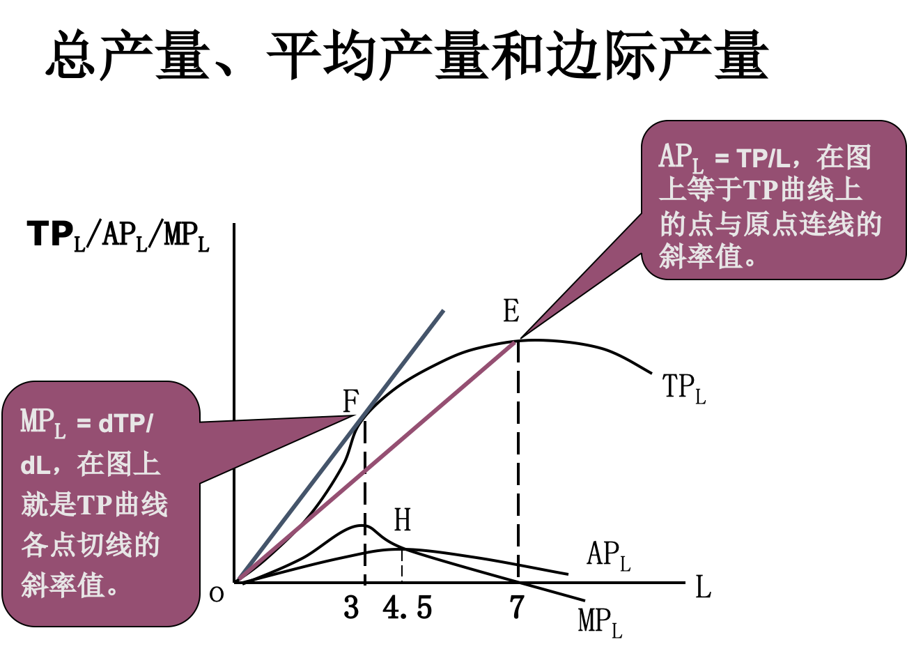

这图有问题吧，如果F点切线过原点的话，那AP和MP的极大值应该在同一个地方取到

### 边际收益递减规律

类比于边际效用递减规律

：在技术不变、其它生产要素投入量也不变的条件下，随着对某一种可变生产要素的投入量的不断增加，最初每增加一单位该要素所带来的总产量是以递增的速度增加；但当该种生产要素的投入量的增加超过了一定的临界点后，由该生产要素的投入量增量所带来的总产量的增量是递减的。

TP、AP和MP三条曲线随着某种要素（L）的增加，都依次经历了先增加、后减少的过程。这三条曲线的特征，或者说，它们所反映的物质技术关系，被认为具有普遍意义，并被归纳为“生产要素报酬递减法则”（边际报酬递减法则/边际收益递减规律）

**Premise**

* 技术水平不变
    * IT产业的边际产量一直递增
* 其它生产要素投入量不变。如果技术进步了、其它生产要素投入量也增加了，会推迟生产要素报酬递减的出现，但不会消灭报酬递减。
* 过了临界点才出现
    * 固定要素不可分割
    * ？：可变要素的投入数量与固定要素的投入数量之间不同的组合（搭配），效率会不同。在一定的技术条件下，必有某种要素组合的效率是最高的，任何一种对这一组合的偏离，都只能使效率下降。

#### 劳动的边际收益递减

**与马尔萨斯（1766-1834）的人口论**

经济学家马尔萨斯(1766-1834)曾经预言：随着人口的膨胀，越来越多的劳动耕种土地，地球上有限的土地最终将无法提供足够的食物。这是因为，一方面劳动的<u>边际产出与平均产出下降</u>，另一方面，更多的人口需要更多的食物，因而会产生大的饥荒。

但是由于农业生产技术的进步、同时人口也没有一直增长，马尔萨斯语言没有实现

### TP AP MP的关系

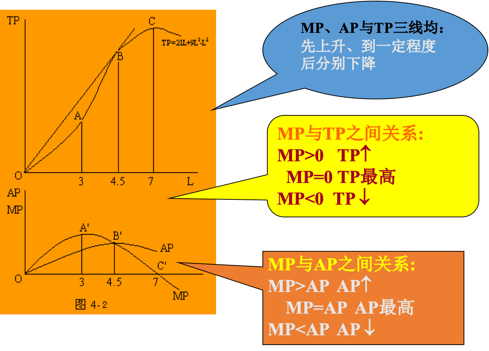

==注意MP与AP关系，交点即为AP的最大值点==

合理投入

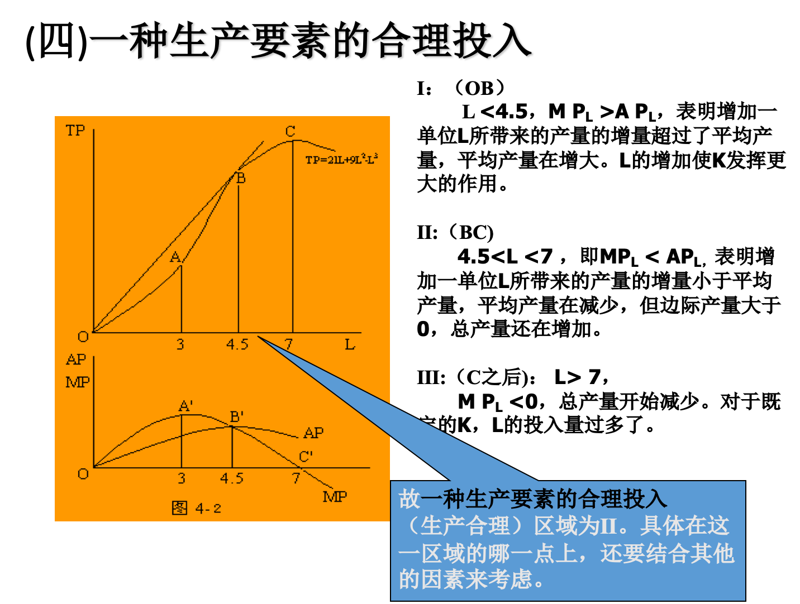

### 产出弹性

生产要素的产出弹性：产量变化的百分比与引起产量变化的可变生产要素投入量变化的百分比之比。

* 劳动：$E_L = \frac{dQ/Q}{dL/L} = \frac{dQ}{dL}\frac{L}{Q}$
* 资本：$E_K = \frac{dQ/Q}{dK/K} = \frac{dQ}{dK}\frac{K}{Q}$


柯布-道格拉斯生产函数：Q=AL^α^K^β^

## 长期生产分析

### 规模收益

**规模收益变动的三个阶段**

包括：递增、不变、递减三种：在技术水平不变的条件下，所有生产要素投入量按照==**相同比例增加**==时，总产量先是以递增的幅度增加，其次以不变的幅度增加，最后以递减的幅度增加。相应地分别称为规模收益递增阶段、规模收益不变阶段和规模收益递减阶段。


| 劳动(L) | 资本(K) | 产量(Q) | 阶段     |
| ------- | ------- | ------- | -------- |
| 100     | 100     | 1000    |          |
| 200     | 200     | 2200    | 收益递增 |
| 400     | 400     | 4400    | 收益不变 |
| 800     | 800     | 8000    | 收益递减 |

生产规模弹性：$E_\lambda$

C-D生产函数：Q=ALαKβ
F(λL,λK)=A(λL)α(λK)β
=λ（α+β） ALαKβ 
=λ（α+β）Q

当α+β>1时，规模收益递增；
当α+β=1时，规模收益不变；
当α+β<1时，规模收益递减。

#### 规模经济与规模不经济

* 规模经济：由于规模扩大而导致平均成本下降的情况
    * 内在经济：(1)专业化分工，提高效率；(2)提高管理效率，节约管理费用；(3)学习效应；(4)提高副产品的综合利用率(范围经济)；等。
    * 外在经济：(1)建设大规模的原料基地和交通运输设施；(2)扩大员工培训能力；(3)提高信息交流效率；等。
* 规模不经济：由于规模扩大而导致平均成本上升的情况
    * 内在不经济：(1)大企业管理机构庞杂，复杂，降低效率；(2)增加管理费用；(3)对要素的需求刺激要素价格上升；等。
    * 外在不经济：(1)行业规模扩大导致同类产品大企业增加，加剧竞争；(2)为此付出更多的广告竞争费用；等。
* 最适规模：平均成本最低时的规模(经济规模)
    * 例：课堂、高校、城市
    * 三人成虎、三个臭皮匠顶个诸葛亮、三个和尚没水吃


### 等产量曲线

能够生产相同产量的两种生产要素的不同数量组合的连线。 

就是类似于无差异曲线吧


**特点**

* 一个平面上可以有无数条等产量曲线，并且任何两条都不相交
* 离原点越远的等产量曲线代表的总产量水平越高
* 等产量曲线向右下方倾斜，并且凸向原点（斜率为负，并且斜率的绝对值递减）

### 边际技术替代率

**Marginal Rate of Tech Substitution**

保持总产量水平不变的条件下，增加一单位某种生产要素投入所必须放弃的另一种生产要素的投入数量。

MRTS~LK~= -ΔK/ΔL

要素的边际技术替代率即是<u>等产量曲线的斜率</u>的绝对值。

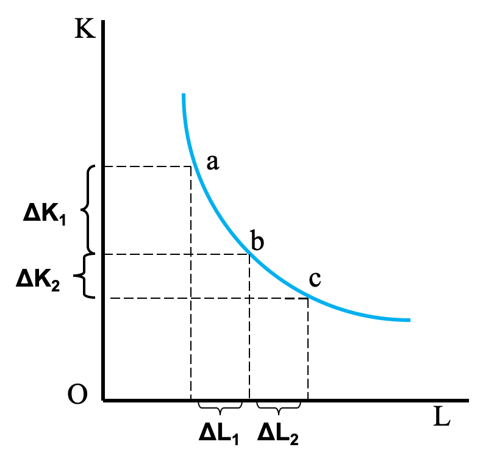

**特殊的曲线**

固定替代比例

#### 边际技术替代率递减

**MRTSLK= -ΔK/ΔL = MP~L~/MP~K~** 
ΔTP~L~ = -ΔTP~K~(同一条总产量曲线)
ΔL • MP~L~ = -ΔK• MP~K~ 
-ΔK/ΔL =  MP~L~/MP~K~

由于随着劳动数量的增加，其边际产量递减；而随着资本数量的减少，其边际产量反而在增加，所以劳动的边际产量与资本的边际产量的比值将不断减小，即要素的边际技术替代率是递减的，从而等产量曲线的斜率的绝对值是递减的。

### 等成本曲线

等成本方程：C = wL + rK (C：生产者的总成本；w、r分别是劳动、资本的价格；L、K分别是劳动、资本的数量)

类似于消费预算线，随总成本的变化平行移动

工资(L)、利率(K)变动使其旋转

### 最适生产要素组合

利用等产量曲线和等成本曲线画到一起求切点

**成本既定产量最大**：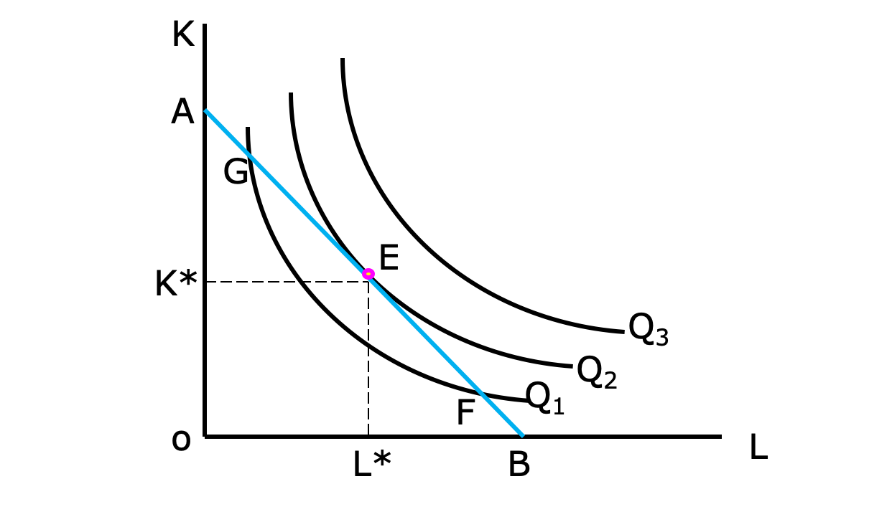

**产量既定成本最小**：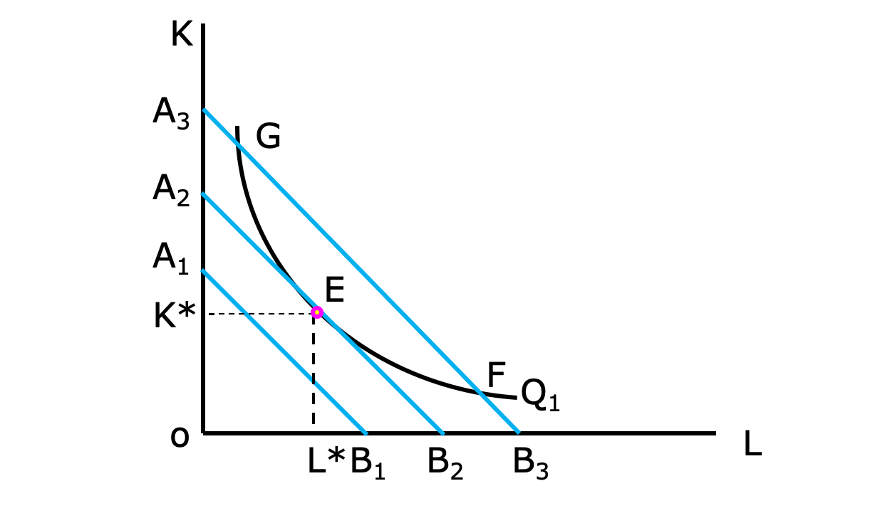


==**生产者均衡点E**==

两种算法

 MRTS~LK~ = -ΔK/ΔL = MPL/MPK=|k| = P_L / P_K

* MP~L~/MP~K~ = w/r 或 MP~L~/w = MP~K~/r


### 生产扩张线

类似于收入消费曲线

### 生产者剩余


# 成本理论

## 一般分析

成本，也称费用，是经济活动中为获得物品(劳务)或取得收益所需付出的代价。

生产的成本则是指厂商在生产和经营活动中所投入的各种<u>生产要素的数量</u>与相应的各种<u>生产要素市场价格</u>的<u>乘积之和</u>。

**机会成本**(opportunity cost)

* 经济学家往往将成本问题与稀缺的生产资源有效地在<u>各种用途上的分配</u>使用问题联系起来加以考察。
* 是将要素投入其他用途中可能得到的**最高**收益
    * 考虑机会成本实际上就是<u>掌握各个选择方案可能带来的收益</u>，这样，获利最大的方案自然就清楚了
* 面向未来


### 生产成本

* **显明成本**(explict cost)
    * 在账本上作为**会计成本**(accounting cost)：计入在账的
    * 一般低于机会成本
* **隐含成本**(implicit cost)
    * 这些成本没有直接反映在会计成本中，只是存在于经济决策的思维中
    * 从机会成本的角度来进行考虑
    * 指厂商自己拥有且被用于企业的资源的价值；这些资源的价值是根据它们在其他用途中的最佳用途所能产生的收益来估算的。包括：
        * 自有厂房(我家有地)、机器等固定设备的折旧费
        * 企业主自己投入的资金的利息 (~~我入股了，但是这些钱我拿去存银行可以赚利息~~ 本来企业没钱向银行借钱需要利息，我自己出资可以不收利息)
        * 企业主为该厂提供的劳务应得的薪金 (老板自己没工资(老子如果去给别人当CEO年薪100w))


```perl
生产成本(机会成本视野下)
    = 显明成本 + 隐含成本
    = 会计成本 + 隐含成本
    = 显明成本 + 折旧 + 正常利润
```

**经济成本**=显性成本 + 隐性成本


**经济利润**

```java
会计利润 = 收益 - 会计成本

正常利润 = 业主自有资源（且投入企业）的机会成本 // 噢噢就是相当于我至少得赚这么多，不然还不如不开企业

经济利润 = 收益 - 机会成本
        = 收益 - (会计成本 + 内隐成本)
        = 会计利润 - 内隐成本
        = 会计利润 - 正常利润 - 其他内隐成本
```


### 可变成本变动规律

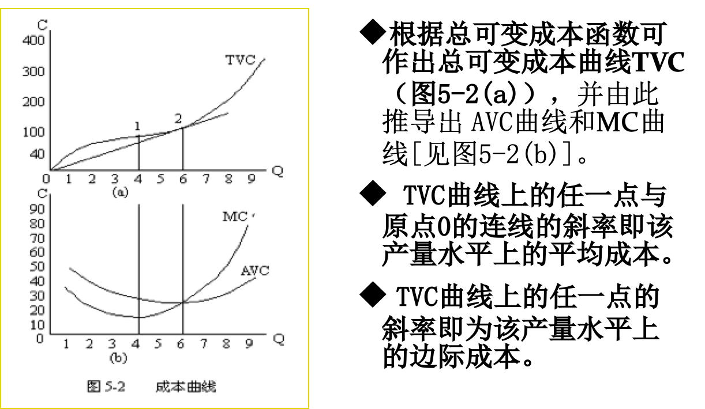

**TVC**

* 总可变成本TVC是产量的函数，它从原点出发，表明产量为零时，TVC为零，随着产量的增加，成本也相应增加。
* 总可变成本曲线形状主要决定于投入要素的边际生产率(边际产量)，也就是边际成本率。
* 从原点到产量为4的区间，投入生产要素的边际生产率递增，也即边际成本递减，因此，总可变成本虽增加，但渐趋缓慢，产量超过4以后，投入要素的边际生产率递减，也即边际成本递增，因此，总可变成本增加渐趋加快。

**AVC**

* 平均可变成本AVC曲线形状为U型，表明平均可变成本随产量增加先递减后递增。
* 其成U型的原因也是可变投入要素的边际成本先递减后递增也即边际生产率先递增后递减的结果。

**MC**

* 边际成本（MC）是每增加1单位产量所增加的总成本，边际成本也是总成本对产量的导数或总成本曲线的斜率。MC=dTVC/dQ=f '(Q)
* MC曲线也是U型，其递减部分对应投入要素的边际产量递增阶段。与MC曲线最低点相对应的产量为4，这一最低点也是TVC曲线上的拐点1。拐点在数学上的涵义是二阶导数为零的一点，它是曲线斜率递减和递增的分界点，在拐点的左侧，TVC曲线斜率递减，与之对应的MC曲线下降，在拐点的右侧，情况正好相反，于是拐点正好对应MC曲线的极小值点。

**MC和AVC关系**

MC曲线与AVC曲线相交于AVC曲线的最低点上。在这一点， MC = AVC，即边际成本等于平均成本。在这一点之左， AVC在MC之上， AVC一直递减， AVC＞MC，即边际成本小于平均成本。在这一点之右， AVC在MC之下， AVC一直递增AVC＜MC，即边际成本大于平均成本。

**MC和AVC / MP和AP**


不难发现，边际成本和平均可变成本关系同前一章所讲的边际产量与平均产量关系是互相对应的。<u>边际收益递减规律的对应就是边际成本递增规律</u>，呈**U型**的MC曲线和呈**倒U型**的MP曲线，MC与AVC相交于AVC的最低点同MP与AP相交于AP的最高点等等都是对应的。


## 短期成本

* **固定成本**：不随产量变化
* **可变成本**：直接随产量变化(劳动力、原料、电力等，**不生产则为0**

短期<u>总</u>成本(STC) = TFC + TVC (好像记作TFC和TVC，不管了)

<u>平均</u>固定成本(AFC) = TFC/Q 持续下降

<u>平均</u>可变成本(AVC) = TVC/Q 先降再升

短期<u>平均</u>成本(SAC) = STC/Q or AFC + AVC

短期<u>边际</u>成本(SMC) = dSTC/dQ = dTVC/dQ

### 短期总成本


总成本TC是固定成本与可变成本之和，其形状与可变成本曲线一样，它只不过是可变成本曲线向上平行移动一段相当于FC大小的距离，即总成本曲线与可变成本曲线在任一产量上的垂直距离等于固定成本FC，<u>但FC不影响总成本曲线的斜率</u>，因此**固定成本**的大小与总成本曲线的**形状无关**，而只与总成本曲线的**位置有关**。总成本曲线也是产量的函数，其**形状**也取决于可变投入要素边际成本递增规律，也即**边际收益递减规律**。这一点与可变成本曲线是一致的，<u>总成本的变动规律与可变成本相同</u>。（见图5-3）

* FC：截距
* VC：形状

### 短期平均成本

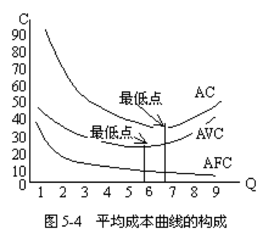

* SAC = AFC+AVC
* AC曲线开头的决定因素与AVC曲线相同。AC曲线的位置在AVC曲线之上，两条曲线之间的垂直距离即为平均固定成本AFC。
* 由于AFC ↘，因此，|AC-AVC|↘
* AC曲线的最低点与AVC曲线的最低点不在同一条垂直线上，AC的在AVC的后面，这是因为AC=AVC+AFC，AFC是单调递减的，AVC从最低点转而上升，当其增量少于AFC的减少量时，AC仍是呈下降趋势，只有当产量等于某一水平时，<u>AVC的增量正好等于AFC的减少量</u>，这时AC才达到最低点。

### 边际成本

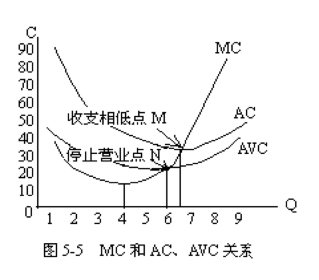

不解释，在市场理论章节中解释

## 长期成本

不区分固定和可变，<u>所有的成本都是可变的了</u>

### LTC

由于都是可变的，因此形状类似于VC曲线

将长期拆为多个短期进行考虑(本来应该无限个，但是此处考虑3个)

`LTC = min{STC1, STC2, STC3}`

TFC3 > TFC2 > TFC1：规模增大

企业在达到生成规模的要求下选择最小成本

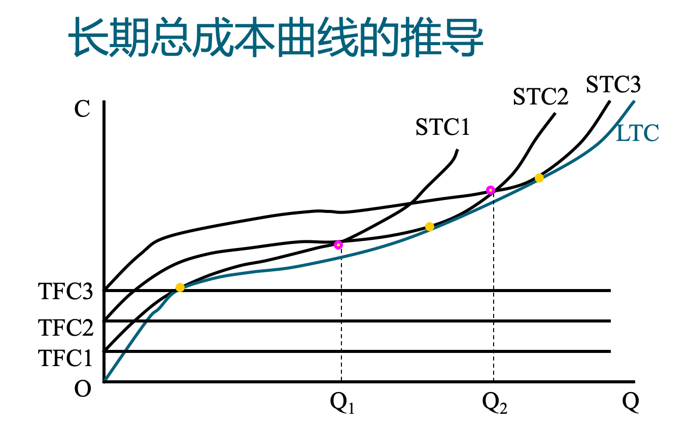

产量在0\~Q1，选规模1；在Q1\~Q1，选规模2；在Q2\~+\infinity，选规模3。连起来的线就是LTC，如果有无穷个短期，就可以得到一个光滑(导数连续)的LTC。

LTC是{STC}的包络线

* 为什么过原点？因为Q=0时TFC也为0吗？

### LAC


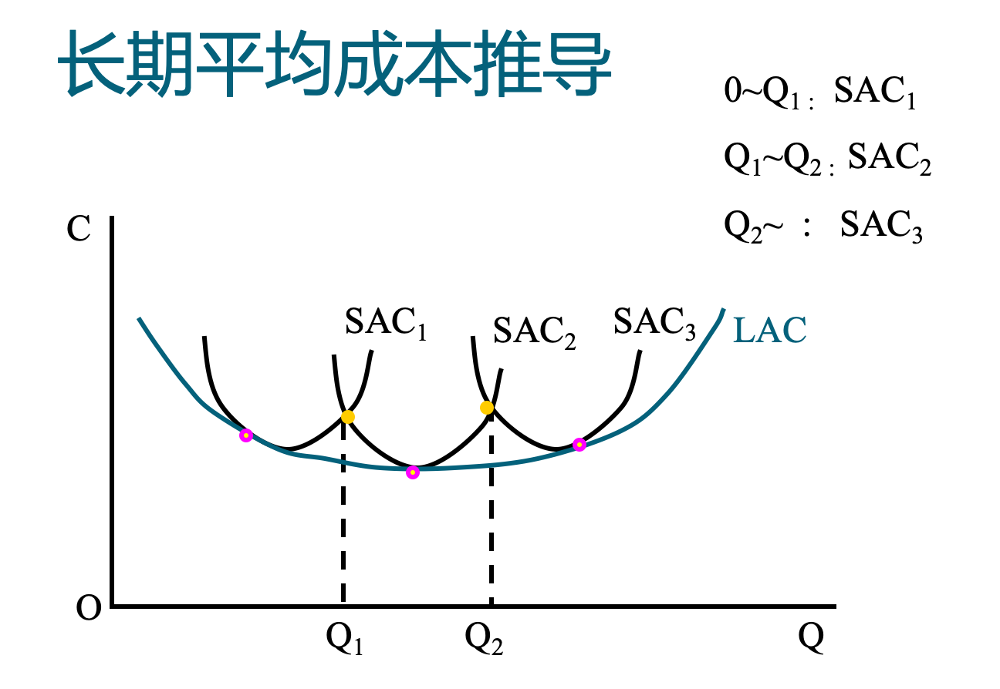

产量在0\~Q1，选规模1；在Q1\~Q1，选规模2；在Q2\~+\infinity，选规模3。连起来的线就是LAC，如果有无穷个短期，就可以得到一个光滑(导数连续)的LAC。

LAC曲线是各条SAC曲线的[包络线]，即图中粉点是切点

Q1Q2是什么点？没什么特殊意义，只不过如果有无穷个规模，则交点也都在LAC上


### LMC

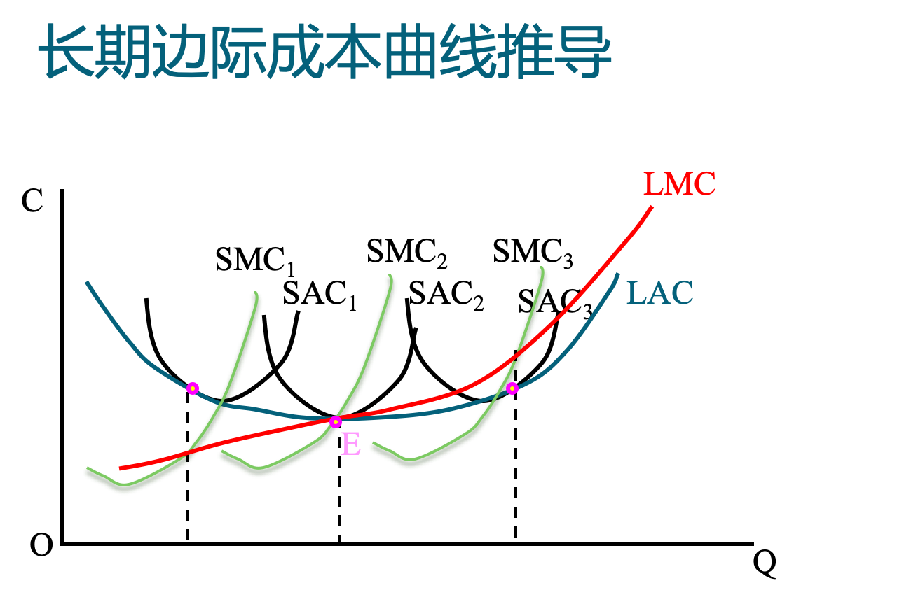

这就不是包络线了

LMC与LAC交于LAC最低点(因为？LMC>LAC之后LAC必然回升)

## [规模经济](# 规模经济与规模不经济)

## 成本收益分析

* 总收益TR、平均收益AR、边际收益MR(Revenue)
    * AR = TR/Q
    * 
    * 
* 总成本、平均成本、边际成本
* 利润=总收益 - 总成本

情况

* 价格不变，则 P=AR=MR
* 价格与销量反方向变化，则 P\=AR\>MR
* ==下图的公式也要求掌握==

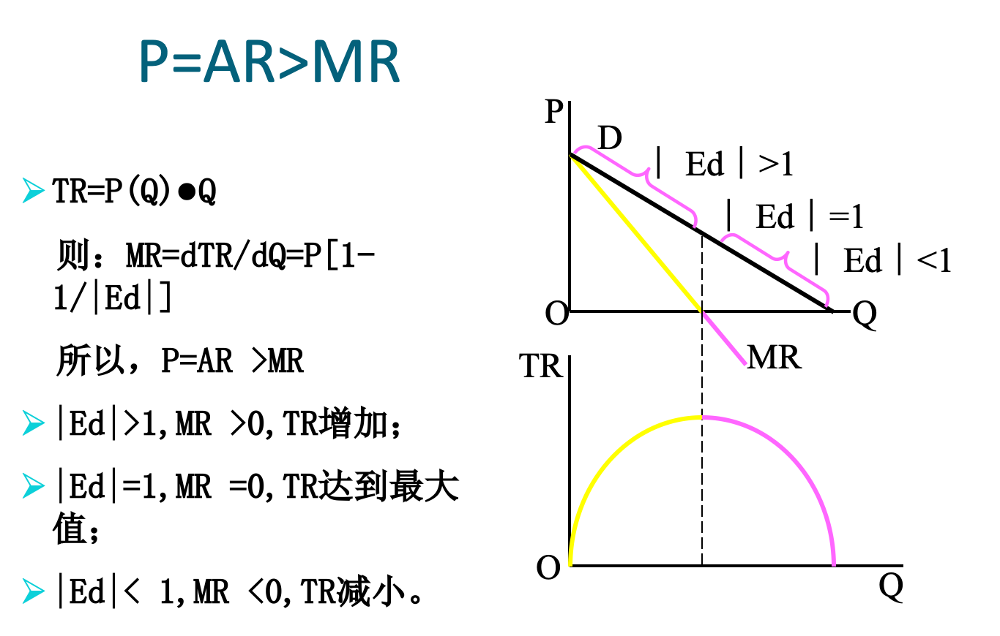

### 利润最大化

MR=MC(边际收益=边际成本)，企业既不扩大也不削减成本

利润π=MR-MC

所谓利润最大化

* 盈利则使利润最大
* 亏损则使亏损最小
* 即无利润也无亏损，则零利润

## 生产者剩余

**生产者剩余**：就是企业出售产品或劳务得到的价格与提供该产品或劳务的成本之间的差额(废话真多，就是(市场价到最低价)对销售额的积分)，它衡量企业参与市场活动获得的福利。


## 总福利

`总剩余（市场总福利）= 消费者剩余+生产者剩余 =（消费愿意支付的价格-消费者实际支付的价格）+（生产者出售商品的实际价格-生产者愿意出售的价格（生产成本））=消费愿意支付的价格-生产者愿意出售的价格（生产成本）`


**限制价格**(支持价格略)

价格从P\*到P1(限制价格是这样理解的吗>？

生产者减少两块(P1BCP\*, BCE)，消费者+1(P1BCP\*)-1(ACE)

总福利减少ABE

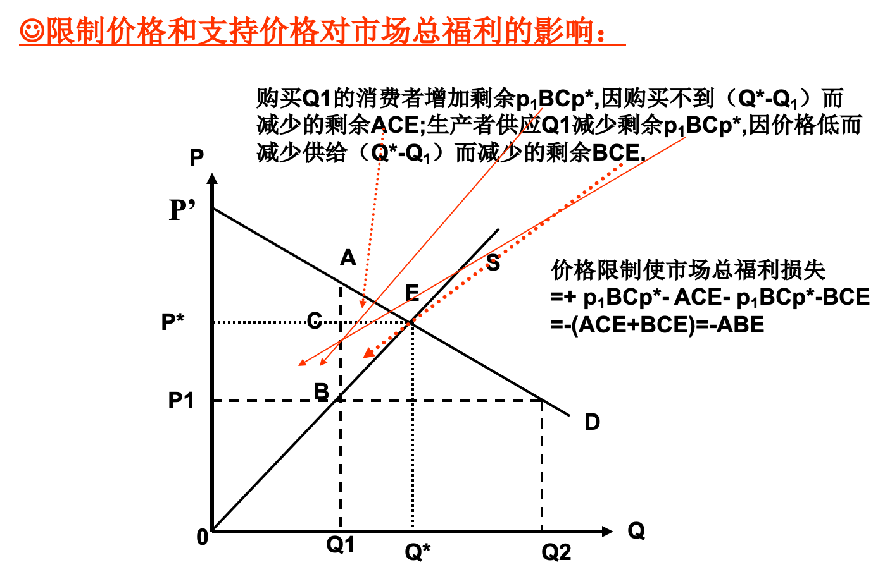


---

# Appendix

### 成本函数

利润最大化时的成本。C = (P~L~, P~K~, Q)  (与K、L无关)

