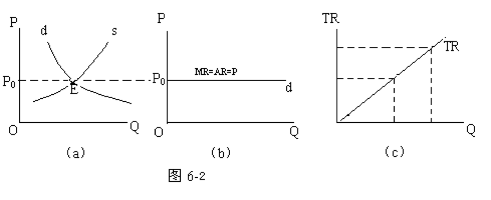
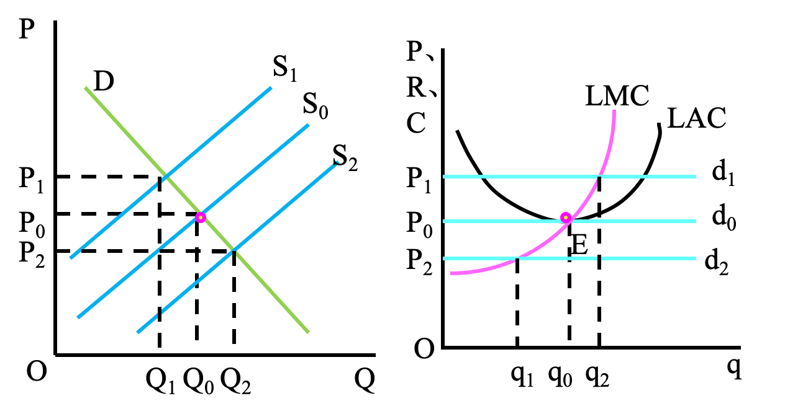
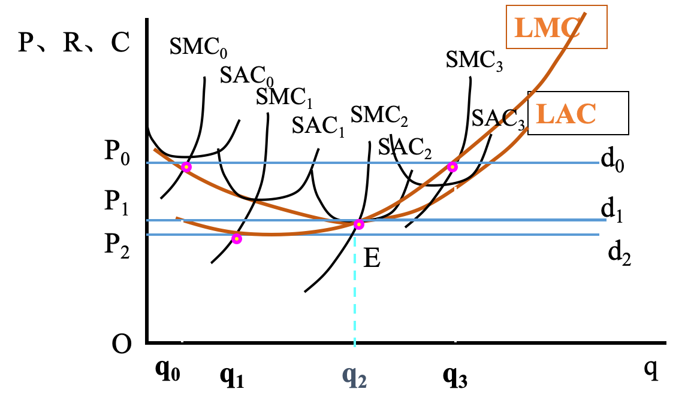
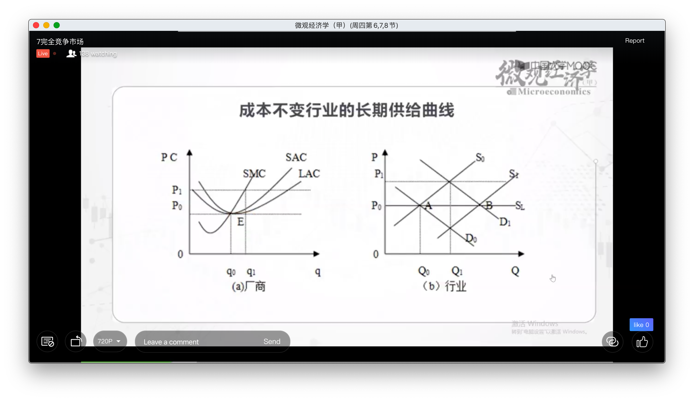
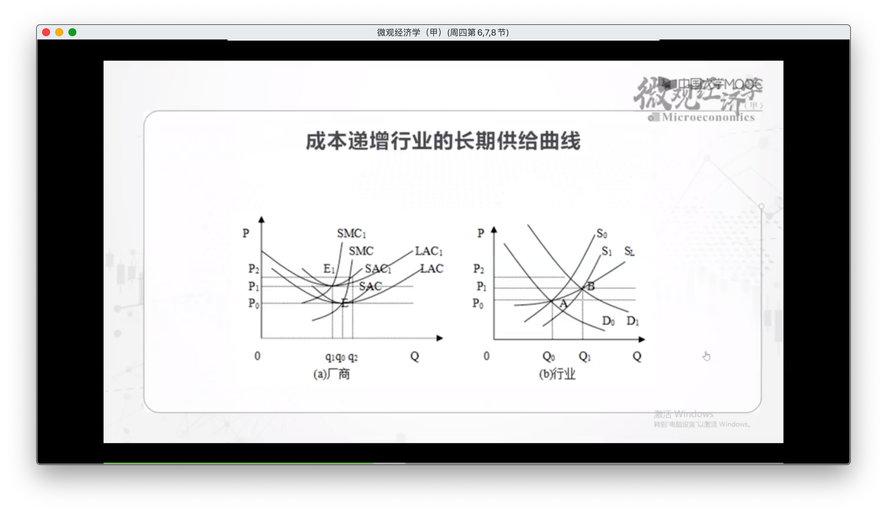
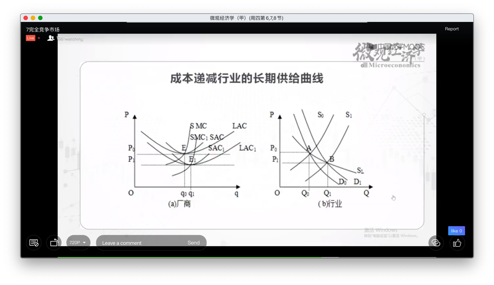

课程论文

# 完全竞争市场的条件

* 买方市场：
    * 买方占优势
    * 商品种类丰富
    * 有利于生产者之间的竞争
    * 有利于消费者主权的实现，迫使生产者按需生产
* 卖方市场
    * 商品种类稀缺
* 产品市场
    * 农产品
    * 工业消费品
    * 生产资料市场
* 要素市场

| 市场结构类型 | 厂商数目 | 产品差别程度     | 个别厂商控制价格程度 | 厂商进入产业难易 | 现实中接近的行业             |
| ------------ | -------- | ---------------- | -------------------- | ---------------- | ---------------------------- |
| 完全竞争     | 很多     | 无差别           | 没有                 | 完全自由         | 股市、专业市场、农产品市场等 |
| 垄断竞争     | 很多     | 有些差别         | 有一些               | 比较自由         | 零售业                       |
| 寡头垄断     | 几个     | 有或没有差别     | 相当有               | 有限             | 汽车制造业                   |
| 完全垄断     | 一个     | 唯一产品无替代品 | 很大，但常受政府管制 | 不能             | 公用事业(供电/供水等等       |

## 完全竞争的条件

* 众多的买者与卖者，且每个的份额非常小
    * 都是价格的接受者而不能是制定者
    * 可以将购买/生产量视作与价格无关的
* 产品同质(或称无差别)
* 要素流动自由(不存在任何壁垒)
    * 保证长期为零经济利润
* 信息充分(有关交易的信息可以无条件低迅速获得)
    * 厂商了解技术条件、价格
    * 消费者知道自己的偏好和劳务价格
    * 劳动者和资本者

比较接近完全竞争的行业：股市、专业市场、农产品市场等。

## 需求和收益曲线

a) 供求曲线

b) 厂商的生产曲线：价格为Pc时，有无限弹性，P、MR、AR重合

c) 收益曲线

# 短期均衡

完全竞争市场

P = MR = AR，因为短期均衡条件为MR = MC，因此要P = MC

## 供给曲线推导

# 厂商的长期均衡

在长期中所有生产要素都是可以变动的，可以通过调整要素投入来实现利润最大化

* 在长期中，各个厂商都可以根据市场价格来调整全部生产要素和生产，也可以自由进入或退出该行业。这样，整个行业供给的变动就会影响市场价格，从而影响各个厂商的均衡。
* 具体来说，当供给小于需求，价格高时，各厂商会扩大生产，其他厂商也会涌入该行业，从而整个行业供给增加，价格水平下降。
* 当供给大于需求，价格低时，各厂商会减少生产，有些厂商会退出该行业，从而整个行业供给减少，价格水平上升。
* 最终价格水平会达到使各个厂商既无超额利润又无亏损的状态。这时整个行业的供求均衡，各个厂商的产量也不再调整，于是就实现了长期均衡。 

## 行业厂商数目变化

例如开始在d1，可以获利，新厂商涌入，供给增加，Q1到Q0，P1到P0，最后获得零利润

同理在d2厂商会退出

## 厂商调整规模

但是单个厂商也可以提通过调整自己的产量来调整LMC

## 完全竞争市场的短期供给曲线

# 行业的长期均衡

◆成本不变行业的长期供给曲线是一条水平线。
◆成本递增行业的长期供给曲线是一条向右上方倾斜(斜率为正)的曲线。
◆成本递减行业的长期供给曲线是一条向右下方倾斜(斜率为负)的曲线。

## 成本不变行业

## 成本递增行业

供给的扩张导致要素价格增长

## 成本递减行业

## 长期均衡

完全竞争的短期均衡条件是：P=MR=SMC

长期均衡的条件是：P=MR= SMC =SAC = LMC =LAC

# 完全竞争市场的效率

* 边际成本=市场价格
    * 从社会需要来看，是最优的
* 平均成本=市场价格
    * 生产量处于平均。。最低点
* 价格的自发调节
* 经济剩余
    * 

**政府干预效率损失**

* 限制价格