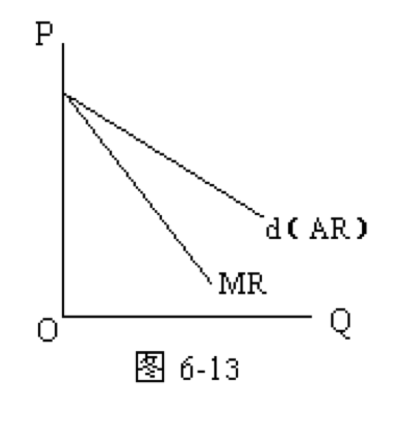

# 完全垄断市场

## 含义与条件

**特征**

1. 市场上只有一个销售者（但有许多买方）（不常见）
2. 该商品没有非常类似的替代品（最为关键的一个条件）
3. 新厂商不能进入该市场

社会公用事业(供电/供水等等

**成因**

* 规模经济（**自然垄断**）：竞争中的唯一幸存者
* 政府特许（**行政垄断**）
* 对资源的控制：如南非的钻石德比尔，贵州茅台
* 拥有专利与知识产权等

## 需求/收益曲线

* 完全垄断厂商的需求曲线(d)和平均收益曲线(AR)重合并向右下方倾斜
* 边际收益曲线(MR)也向右下方倾斜，但在需求曲线的左下方，且斜率为AR的两倍(设AR：P=a-bQ，则MR：d(aQ-bQ^2^)/dQ = a-2bQ)
* <u>完全垄断厂商的均衡条件：MR=MC</u>
* 不管短期均衡还是长期均衡一般都有经济利润，也称垄断利润
* 仍然不能随便制定价格，因为还要考虑价格与需求量的关系

## 短期

# 垄断竞争市场

# 寡头垄断市场