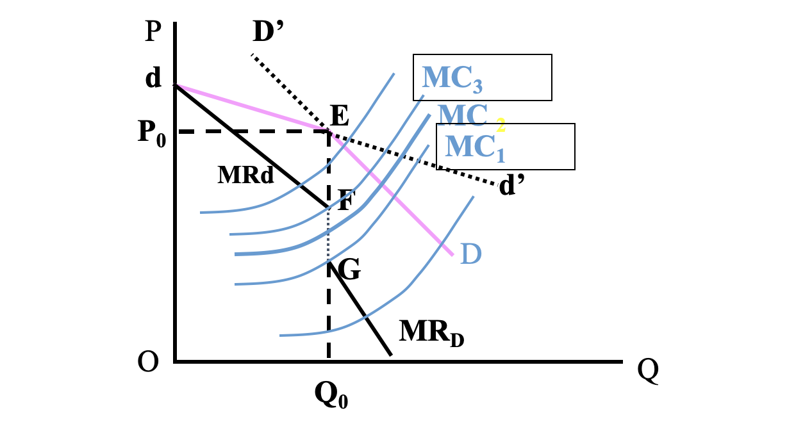

完全垄断>寡头垄断>垄断竞争>完全竞争

# 完全垄断市场

## 含义与条件

**特征**

1. 市场上只有一个销售者（但有许多买方）（不常见）
2. 该商品没有非常类似的替代品（最为关键的一个条件）
3. 新厂商不能进入该市场

在这种情况下，完全垄断企业就同完全竞争企业是一个价格接受者不同，是价格的制定者，它可以自行决定自己的产量和销售价格，并因此使自己利润最大化。垄断企业还可以根据获取利润的需要在不同销售条件下实行不同的价格，即实行差别价格（price discrimination）

社会公用事业(供电/供水等等

可以控制产量或价格来控制市场，不能两个一起，不然就违背了市场规律

**成因**

* 规模经济（**自然垄断**）：竞争中的唯一幸存者
* 政府特许（**行政垄断**）
    * 早期的食盐等
* 对资源的控制
    * 如南非的钻石德比尔，贵州茅台
* 拥有专利与知识产权等

## 需求/收益曲线

* 完全垄断厂商的需求曲线(d)和平均收益曲线(AR)重合(设d：P=a-bQ，AR = (a-bQ)×Q/Q)，并向右下方倾斜
    * 完全竞争中P=MR，此处P>MR
* 边际收益曲线(MR)也向右下方倾斜且截距相同，但在需求曲线的左下方，且斜率为AR的两倍(设AR：P=a-bQ，则MR = d(aQ-bQ^2^)/dQ = a-2bQ)
* <u>完全垄断厂商的均衡条件：==MR=MC==</u>
* 不管短期均衡还是长期均衡一般都有经济利润，也称垄断利润
* 仍然不能随便制定价格，因为还要考虑价格与需求量的关系
* ==MR = P(1-1/E~d~)==
    * $\rm MR = P(1-1/Ed) = P(1- \frac{QdP}{PdQ}) = P - \frac{dP}{dQ}Q = (a-bQ) - bQ$

## 短期均衡

1. 图16，由==MR=SMC==获得均衡产量Q1，代入d曲线得到均衡价格P1；利润为Q1(P1-K)，有超额利润
2. 图17，利润为Q1(P1-K)，亏损
    * 所以并不是垄断就一定赚钱
    * 可能的亏损原因：市场需求太小、成本太高

==生产停止线还是<u>P=AVC</u>==

## 长期

* **一个垄断行业的长期均衡常常以净利润的存在为特征**
* 在长期中，垄断厂商可以通过调节产量与价格来实现利润最大化。这时厂商均衡的条件是：MR=LMC和MR=SMC，即==<u>MR=LMC=SMC</u>==
    * 相比完全竞争市场少了一个=AC的条件

## 完全垄断的差别定价

差别价格，是指垄断者在同一时间内对同一成本的产品向不同的购买者收取不同的价格(肯德基优惠券，嘀学生卡)，或是对不同成本的产品向不同的购买者收取相同的价格(空调车和无空调车同价格)，或对同一消费者购买的不同数量的同一产品索取不同价格(因边际成本或服务成本不同，或两者都有，如机场中的速食)。分为一级、二级、三级。

### 一级价格差别

所谓一级价格差别或完全价格差别，是指完全垄断厂商在销售其产品时，<u>每个产品均以不同的价格出售</u>以获得最大可能性收入。

一级价格差别则假定完全垄断厂商能够做到根据每一个产品对每一个消费者所产生的<u>边际效用大小</u>来取价，即向每个消费者索取他愿意出的最高价格，从而将消费者剩余全部榨光(为0)。

垄断厂商之所以能这样定价，条件是对每个消费者的需求均能充分了解。但实际中实属少见，所以只有在某实行个别服务、消费者甚少的行业可以看到一级价格差别。如：个体行医的医生、律师等。

### 二级价格差别

所谓二级价格差别，是指垄断者对某特定消费者，按其<u>购买数量的不同制定不同的价格</u>，以获得较大收益的一种方法。

两种情况：

* 0\~Q1，P1；0\~Q2，P2
* 0\~Q1，P1；Q1\~Q2，P2
    * 第二种消费者剩余更少

分批定价出售；商家的折扣表；更多出现在公用事业中，在水、电、煤气、邮政、电信等社会公用事业中，多采用这种方法。 

实行二级价格差别时，垄断厂商得到部分消费者剩余。条件是：产品必须易于衡量、记录并成批出售。

### 三级价格差别

三级价格差别，又称市场分割的差别价格，是指垄断者对<u>同样的产品在不同的市场取不同的价格</u>，而所售出的最后一个单位产品所获得的<u>边际收益相同</u>。(会导致窜货)

实行三级价格差别必须具备特殊的市场条件。

#### 既定产量下数量配置和价格决定

假定两个独立的市场： 

* 其平均收益函数或需求函数分别为
    * AR1(Q1)，AR2(Q2)
* 边际收益函数分别为MR1(Q1)，MR2(Q2)
    * Q1，Q2是两个市场的销售量
* 垄断企业的垄断产量即为Q= Q1+Q2 
* 其边际成本函数为MC(Q)

什么时候利润最大？调整两个市场的销售量，使两个市场的MR相等，这时厂商的利润最大：

* 在Q的产量水平，如果两个市场的边际收益不相同的话，即MR1≠MR2，那么垄断者就会把产品从边际收益较低的市场转移到边际收益较高的市场出售。最终结果将会使两个市场的边际收益均等。
* 另一方面，根据企业利润最大化原则，只要边际成本MC(Q)不等于两个市场的边际收益，它都会调整自己的产量，直至边际成本等于边际收益。
* 这样，对于市场分割的垄断者，它的均衡条件为：==MC(Q=Q~1~+Q~2~) = MR~1~(Q~1~) = MR~2~(Q~2~)==

在利润最大前提下为什么要差异定价？在销量被确定以后，在已知各市场需求曲线的情况下即可确定各个市场的价格：需求价格弹性大（小）的市场上定价较低（高）。

* 把边际收益与需求弹性之间的关系式代入以上的均衡条件，得到：MR = P~1~(1-1/|e~1~|) = P~2~(1-1/|e~2~|)
*  可以清楚地看到：如果一个市场的需求弹性大于另一个市场的需求弹性，如|e1|＞|e2|，那么为保持P~1~(1-1/|e~1~|) = P~2~(1-1/|e~2~|)时，必有价格P1＜P2。
* 这就是说，具有较高需求弹性的市场会有较低的价格；反之，需求弹性较低的市场会有较高的价格。这就是垄断者可以在不同市场差别定价的原因。

需要说明的是，垄断者要实现市场分割，根据不同市场的需求弹性分别制定不同的销售价格，从而取得更大利润，需有两个条件：

1. 垄断者能够把不同市场或市场的各个部分有效地分割开来。否则，不仅全部顾客会集中于低价市场采购，而且低价市场的顾客很可能会将低价购得的产品转向高价市场出售。
2. 各子市场或消费团体，必须具有不同的需求价格弹性。如果两个市场的需求弹性相同，差别价格就不会存在。只有需求弹性不同时，垄断者才能在需求弹性较大的市场制定较低的价格（因为定价过高，消费者就不买了）；同时在需求弹性较小的市场制定较高的价格（因为即使价格高些，消费者也不得不购买）。

* 例如，航空公司可以在一条飞机航线上，把它的乘客划分为公务乘客和旅游休假乘客，对公务乘客（需求弹性不足）就可收费高一些，而对旅游休假乘客收费可能低一些，因为对这部分需求弹性充足的乘客索取高价的结果会使需求量大幅度地下降。
* 三级价格差别的实例，除了航空公司对乘客进行划分外，还有一些常见实际范例。例如电力公司对普通家庭用电和工业用电这两个不同的市场分别收取不同的收费标准。再如在国际贸易方面，销售同一产品时，对本国市场与别国市场分别定不同的价格。一般来说，外国市场价格偏低，而本国市场价格偏高。这是因为外国市场的需求价格弹性通常高于国内市场的缘故。

#### 产量的决定及其在不同市场的分配

==MR~A~ = MR~B~ = MR~A+B~ = MC==

<!--由于要偏微分因此不能再用MR=MC了，而是要对TR和TC分别偏微分使之相等-->

<u>**这个求法好奇怪啊，可以看第五次作业题的第三题**</u>

垄断厂商的总产量应该是多少？

* 厂商将选择这样一个产量水平，其边际成本等于两个市场上的边际收益。如：某垄断厂商在A、B两个隔离的市场出售同一种产品。这两个市场的需求曲线分别为：
    * A市场   PA=60-0.5QA
    * B市场   PB=110-3QB
* 那么厂商总需求曲线(Q=Q~A~+Q~B~)：P=(470-3Q)/7<!--这个神奇的求法，这个P是均摊价格？-->

求最大利润时的总产量 (设MC=20) [总的MR=MC]

* TR = Q\*P = Q\*(470-3Q)/7
* MR = dTR/dQ = (470-6Q)/7
* MR = MC时，Q=55

总产量该如何分配？ [各市场的的MR=MC]

* A市场TR＝PQ~A~=60Q~A~-0.5Q~A~^2^
* MR(A)=60-Q~A~
* 令MR(A)=60-Q~A~＝MC=20    得Q~A~＝40
* 同理可得  QB＝15
* 进而：A市场定价P~A~=60-0.5Q~A~＝40；B市场定价P~B~=110-3Q~B~＝65

比较一下统一价和差别定价的收益

* 统一定价的收益：
    * P\*Q=43.58×55＝2397
* 差别定价的收益：
    * P\*Q1=40×40＝1600
    * P\*Q2= 65×15＝975
    * 1600＋975＝2575

### 差别定价的主要依据

关键是不同的市场需求价格弹性不同。

* 地理差别。 如果产品的供应者认为销售地区的差别可把各地区市场隔离开来，就可以利用地理差别在不同地区实行不同价格。
* 产品用途。电力、煤气、自来水等公用事业公司对工商用户和个人用户采用不同收费标准。
* 使用时间。白天和夜晚长途话费标准不同、峰谷电、旅游淡旺季。
* 收入水平高低不同的消费者能被区分开，便能形成不同的需求。如酒水在高档酒店的价格与一般市场价格。

### 对完全垄断市场的评论 

许多经济学家根据完全垄断市场和完全竞争市场的比较分析，认为完全垄断对经济是不利的：

* 第一，生产资源的浪费。因为完全垄断与完全竞争相比，平均成本与价格高，而产量低。在完全竞争条件下长期均衡的条件是MR=AR=AC=MC，即厂商是在最低的成本情况下，保持生产均衡，因而生产资源得到最优配置。但在完全垄断条件下的长期均衡，由MR曲线与MC（包括SMC与LMC）曲线的交点确定均衡产量。由于生产是在生产成本高于最低平均成本处保持均衡，因此资源未能得到最优配置。（图示）
* 第二，社会福利损失。垄断厂商实行价格歧视，即价格差别，消费者所付的价格高，就是消费者剩余减少。这种减少是社会福利的损失。
* 第三，垄断造成社会分配不公平。垄断企业可以长期维持超额利润，而这一利润并非与投入相关。（经济租）
* 第四，垄断也容易引起腐败。由于部分垄断与政府有关，垄断企业将会通过“寻租”行为来维持垄断地位
* 最后，垄断妨碍社会进步。（在大多数情况下，垄断会扼杀竞争）

好处

* 首先，有些完全垄断，尤其是政府对某些公用事业的垄断，并不以追求垄断利润为目的。这些公用事业往往投资大，投资周期长而利润率低，但它又是经济发展和人民生活所必需的。这样的公用事业由政府进行完全垄断，会给全社会带来好处。然而也应该指出，由政府完全垄断这些公用事业，往往也会由于官僚主义而引起效率低下。
* 其次，也有的经济学家认为，垄断厂商因能获得垄断利润，具有更雄厚的资金与人力，从而更有能力进行新的研究，促进技术进步。　

# 垄断竞争市场

## Intro

**特征**

* 厂商数量较多
* 提供同类产品但存在产品差别(**必须条件**，否则会变成完全竞争厂商)
    * 产品差别是指同种产品在质量、构造、外观(实质差别)，销售服务、商标、广告(非实质性差别)等方面的差别
    * 可能会因此吸引顾客成为忠诚顾客，进而对产品价格产生影响(本来提高价格会失去所有顾客，现在不会了)
    * 但仍然会有替代性
* 厂商进出行业较易
* 信息完备

**假设**

1. 有差异的产品由大量企业生产出来，每一企业的产品都是其他企业产品的相当接近的替代品
2. 因为企业数量非常多，每个企业在市场上占的比例都很小，以至于每个企业都可以<u>忽略其他厂商的行为对自己利益的影响</u>
3. 每个企业都有相同的需求曲线和成本曲线
4. 在长期内，新的企业容易进入这种行业

* 短期中，产品差别导致垄断地位
* 长期中，可以改变产品来减小产品差别
* 服装业，饮食业等零售产业和日用品产业都具有垄断竞争的特点

垄断竞争市场兼具了垄断和竞争的特点

## 需求曲线

垄断竞争厂商面临着一条向右倾斜但斜率比完全垄断厂商要平坦得多(弹性更大)的需求曲线

由于产品差异，<u>无法建立行业的需求曲线和供给曲线</u>，而且行业中各种有差异的产品的价格并不一致，因此<u>对垄断竞争市场的分析限制在某个典型厂商而非整个行业</u>

**主观需求曲线和实际需求曲线**

分析垄断竞争厂商需要两条需求曲线：<u>主观需求曲线d</u>(只考虑自己与市场的互动，假设竞争者不跟进，**典型企业的预测方式**)和<u>实际需求曲线D</u>(假设竞争者会全部跟进，并非实际情况)，D也称比例需求曲线，但是<u>实际的需求曲线是介于d和D之间的</u>

*为什么d不是水平的？因为其他企业也有用户粘性*

**价格变化的影响**

价格降至P1，若其他厂商不跟进，则为C(挖了其他厂商的部分客户和吸引的新客户)；若其他全部厂商跟进，则到B(因为总需求量增加，所以单个厂商的销量还是能增加的，只是没那么多了)

同样价格升至P2，也不会失去全部客户(用户粘性)

==短期d有多条，短期D只有一条(长期就不止了)==

d1：在整个行业价格为P1的情况下厂商对自己需求量给出的预期

## 短期均衡

短期无法调整成本，因此平均成本线(SAC)是固定的，所以

* P\*>SAC：超额利润
* P\*=SAC：零利润
* P\*<SAC：亏损

**均衡条件**：==SMC = MR==

**求法**：<u>用MR与SMC交点求出Q~E~，然后带回d得到P~E~</u>

短期均衡利润(TR-TC)可正可负可零

达到实际的均衡是个渐进的过程(PPT12页)，因为企业是用d而不是D进行预期的，d和MR会不断修正直到`d(Q*)=D(Q*)=p*`(恰好是D和最终的d的交点)

==最终的均衡条件：`SMC=MR && d(Q*)=D(Q*)=p*`==

### 垄断竞争厂商的短期均衡

短期D是不移动的，但是长期因为有厂商进入或退出所以D是会变的

## 长期均衡

* 边际收益(MR)=长期边际成本(LMC)
* 主观需求曲线(d)与实际需求曲线(D)相交
* 主观需求曲线(d)长期平均成本曲线(LAC)及短期平均成本曲线(SAC)相切
* 垄断竞争厂商短期均衡利润可正可负可零，长期均衡利润为0

**均衡条件**

* MR = LMC
* P\*=d(Q\*)=D(Q\*)
* P\*=d(Q\*)=LAC(Q\*)=SAC(Q\*)
* 导数：d'(Q\*)=LAC'(Q\*)=SAC'(Q\*)

**与完全竞争的比较**

从Q1到Q2这段距离，表现出垄断竞争厂商没有被利用的“超额生产力”，它是价格超过边际成本而造成的效率损失，是因为长期均衡时厂商选择的规模小于最优生产规模。但是可以为垄断竞争市场上产品差别给广大消费者带来的多样化满足所抵消或弥补。

A是垄断竞争的均衡点，B是完全竞争的均衡点

## 评价

### 常见竞争方式

1. 价格竞争，即数量竞争，即上面的
2. 品质竞争：除价格，数量，广告以外的所有
3. 广告竞争

### 产品变异和成本

* 产品变异是非价格竞争的重要手段之一。产品变异指变换产品的颜色、款式、质地、做工和附带的服务等来改变原有的产品，以形成产品的差别，影响市场均衡。
* 产品变异会影响产品成本和产量，但关键是要看经过变异，能否形成较大的需求从而给厂商带来更大的超额利润。
* 下面用图来说明产品变异的情况 。  

# 寡头垄断市场(双为例)

## 寡头垄断市场的特征

**成因**

* 规模经济：最初的厂商形成了规模经济，则后来就很难
* 对投入的控制：后来很难
* 大量资本：后来很难
* 技术领先：后来很难
* 沉没成本：通常是巨额的，改行就难以得到补偿，因此导致了难进难出
* 政府的扶持：生产许可证，如邮电通讯，民用航空等

**特征**

* 许多买者，但只有少数卖者
    * 数量≥2，=2时称为双寡头
    * 独立行动或相互勾结
* 产品可以是同质的也可以是异质的
    * 同质：纯粹寡头：钢铁，炼铝，石油，水泥
    * 异质：差别寡头：机械，石油产品，汽车，家电
* 厂商进出行业受到限制
    * 在为厂商由于规模较大且有利润不退出，新的由于规模经济难进入
* 信息不完全
    * 寡头之间有依存关系

**特征导致的性质**

* 它很难对产量与价格问题作出象前三种市场那样确切而肯定的答案。
    * 前三个都能用MR=MC
* 价格和产量一旦确定以后，就有其相对稳定性。
* 各寡头之间的相互依存性，使他们之间更容易形成某种形式的勾结（但也容易解散勾结）。
    * 博弈，决策会互相影响

**囚徒困境**

对方招认，我招认是最优的；=对方沉默，我招认也是最优的。因此两人都招认是纳什均衡的

卡特尔：少数几家企业形成的集团

合作和利己的冲突

* 合作可以增强市场势力
* 协议的结果可能又与利益最大化相背离(若有厂商背离协议)
    * 🇷🇺增产石油，🇸🇦跟着增产

反应函数怎么获得>？

注意：**静态博弈和动态博弈的区别**

* 静态——同一时间内决策，谁也不知道其他参与人的决策和行动结果。因此即便决策和行动有先后，但只要后决策者无法知晓先行者的决策结果（行动结果），视同为同时、静态。
* 动态——决策和行动有先有后，且后行动者在决策和行动之前已经知晓先行者的决策结果（行动结果）。
    * 先行者知道会有跟随者，决策时考虑到跟随者的行为及其影响---老练
    * 后行者在先行者的行动既成事实的情况下进行优化决策---天真

|          | 静态   | 动态     |
| -------- | ------ | -------- |
| 产量竞争 | 古尔诺 | 斯坦克贝 |
| 价格竞争 |        |          |

## 产量竞争模型

### 古尔诺模型(静态)

双寡头垄断模型

1. AB生产销售同质产品，边际成本为C
2. 市场需求曲线是直线，AB均已知
3. AB无勾结行为，给定对方产量决定自己产量(利润最大化)
4. AB会调整产量追求利润最大化

* 没勾结
    * 最大总产量为Q~T~(市场价为0的点)
    * 均衡时两个寡头的产量均为(Q~T~-C)/3；利润为(Q~T~-C)^2^/9(当且仅当需求曲线系数为±1，否则老老实实用PQ-TC来算)
    * 推广(古尔诺解/古尔诺均衡)：n个寡头的情况，厂商产量为(Q~T~-C)/(n+1)，行业总产量为\[n/(n+1)\](Q~T~-C)
* 如果勾结了：各生产(Q~T~-C)/2，利润均为(Q~T~-C)^2^/8

模型缺陷：假定对方产量不变

反应函数：$\rm \large q_i = R_i(q_j) = \frac{Q_T - C - q_j}{2}$

### 斯坦克贝模型(动态)

双寡头垄断模型

* 领导厂商：决定一个产量(能充分了解跟随厂商会如何反应，要知道对方的反应函数而不需要知道自己的反应函数)
* 跟随厂商：根据领导厂商的产量决定自己的产量
* 但是两种产业的产品是同质的

1. A为领导厂商，B为跟随厂商
2. 两个厂商的边际成本相等且都是常数C(考试可能是不一样的

最优产量要求出利润然后偏微分，见作业5的第8题 

均衡产量：领导厂商为(Q~T~-C)/2，跟随厂商为(Q~T~-C)/4 (先动优势)

利润：

反应函数：$\rm \large q_i = R_i(q_j) = \frac{Q_T - C - q_j}{2}$

## 价格竞争模型

### 贝尔特兰模型

AB生产销售同质产品

若两个寡头市场价格相同，则应该五五开

由于价格竞争，均衡时，应该有价格=边际成本，与实际情况(仍是有超额利润利润的)矛盾，被称为”贝尔特兰悖论“，引入产品差别(即不可能完全同质)解决悖论

需求函数：$\rm \large Di(p_i ,p_j) = a - p_i + b \cdot p_j$

厂商i的反应函数：$\rm \large p_i = R(p_j) = \frac{a + C + b \cdot p_j}{2}$

均衡价格：$\rm \large p_1^* = p_2^* = \frac{a+c}{2-b}$，若同质，则均为c

### 斯威齐模型

价格刚性：寡头垄断市场中即使成本发生变化，价格也不变

弯折的需求曲线 $\Longrightarrow$ 间断的边际收益曲线 $\Longrightarrow$ 价格刚性

假设

* 一厂商提价，其他不跟着提价，因此提价厂商的销售量减少很多
* 一厂商降价，其他也跟着降价，因此降价厂商的销售量增加有限
* 需求是主观需求曲线和客观需求曲线的结合，边际收益线因此断开了，如下：

FG之间价格怎么变Q都不变，称为价格刚性

## 勾结与串谋

◆卡特尔(Cartel)：同一行业的少数几家厂商为增进共同利益而采取一致行动的集团或组织。如石油输出国组织（OPEC）。
◆价格领导制（Price leadership)：在寡头垄断行业中产品的市场销售价格由某一厂商率先制定，其余厂商追随其后来确定它们各自售价的一种寡头垄断定价方式。
    具体方式有：
           晴雨表型价格领导；
           支配型价格领导；
           最低成本型价格领导。
◆成本加成定价法：P = AC(1+ η)， η=1/(|Ed|-1)

# 判断

* 从企业数量出发
    * 一家：垄断
    * 几家：寡头垄断
    * 许多：
        * 有差别产品：垄断竞争
        * 相同产品：完全竞争

