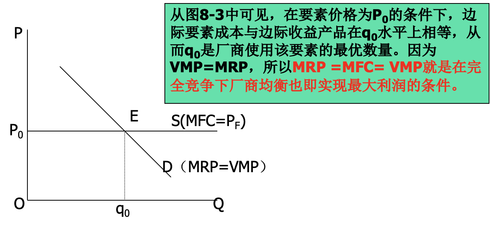

## 生产要素价格(收入分配理论)

之前的都是产品市场

产品市场的需求方往往是要素市场的供给商，反之亦然

## 要素市场均衡的一般分析

### 生产要素需求和供给的性质　

* 生产要素的需求来自厂商
    * 生产要素的需求是派生的需求
    * 生产要素的需求是联合的需求
* 生产要素的供给来自个人或家庭或厂商
    * 四种主要生产要素：劳动、资本、土地与企业家才能
    * 四种主要生产要素价格：工资、利息、地租和利润
    * 产品成本=要素收入=产品价值。
* 生产要素需求分析的难点

### 要素市场的利润最大化原则

**要素市场的利润最大化原则**

MR~F~ = MC~F~

* MR~F~ = MP • MR (= MRP)
* MC~F~ = MP • MC
* F：某个Factor，可以是K，L等等
* MP：边际产量/边际生产力，在现有情况下增加一单位要素增加的产量
* W：均衡的劳动价格，即均衡工资

产品市场参数

* VMP(Value of Marginal Product)：边际产品价值，厂商增加一单位要素投入所增加的产品的价值，VMP(X)=MP(X) • P
* MRP(Marginal Revenue Product)：边际产品收益，由于使用额外一单位投入品乘以所带来的总收益的增加，MRP(X)=MP(X) • MR，VMP ≥ MRP

要素市场参数

* MFC(Marginal Factor Cost)：边际要素成本，每增加一单位要素投入所增加的成本，MFC(X)=MP(X) • MC，MFC≥W
    例：C=L • W(L)，则MFC = dC/dL = W(L)+ L•dW(L)/dL ≥ W(L)
* AFC

### 完全竞争，厂商

<u>**产品和要素都是完全竞争**</u>

#### 要素供给

#### 要素需求

因为MR=P

#### 要素供求均衡

### 非完全竞争，厂商

完全的维持原样，不完全的分成两条

#### 产品不完全，要素完全

MRP与Demand曲线重合

P~F~ = MFC = MRP

#### 产品完全，要素不完全

(买方垄断)

Supply与AFC重合，厂商对该要素的需求曲线不存在

MFC = MRP = VMP决定Q~0~，用AFC(Q~0~)获得均衡价格P~0~

#### 都不完全

需求曲线也不存在

MFC = MRP决定R~0~，用AFC(R~0~)获得均衡价格P~0~

### 剥削问题

> <u>厂商付给要素的价格，如果低于其边际产品价值，即存在剥削。</u>依此而论，除了产品市场都处于完全竞争状态外，其余各种市场都不同程度地存在剥削。 

1

2.卖方垄断剥削

3.买方垄断剥削

4.在要素市场是买方垄断，在产品市场是买方垄断

## 工资理论\*

## 地租、利息和利润\*

## 收入分配的不平等及其对策

### 洛伦兹曲线和基尼系数

| 收入分组 | 占人口的百分比 |  | 绝对平均情况 |      | 不平均的情况 |      |
| -------------- | -------------- | ------------ | -------------- | ---- | ---- | ---- |
|            | 百分比 | 累计       | 占收入的百分比 | 累计 | 占收入的百分比 | 累计 |
| 1              | 20             | 20           | 20             | 20   | 4    | 4    |
| 2 | 20             | 40           | 20             | 40   | 10   | 14   |
| 3 | 20             | 60           | 20             | 60   | 20   | 34   |
| 4 | 20             | 80             | 20           | 80             | 26   | 60   |
| 5 | 20             | 100            | 20           | 100            | 40   | 100  |

A越大越不平等，OPY是绝对不平均线，表示社会的全部收入被一个人占有，其余人收入全是0

### 市场竞争与收入分配不平等

# 9 一般均衡

* 帕累托最优状态：经济状态的任何改变都不能使此状态中的任何一个人的境况变得更好而不使别人的境况变坏。也就是说，如果不使别人的境况变坏，就无法使任何一个人的境况变得更好的经济状态。
* 帕累托改进：所有人改进
* 非帕累托改进：部分人没改进(不变 变惨都可以

# 10 市场失灵与微观规制

**外部性**

* 外部性：单个生产者或消费者的经济行为对社会上其它人的福利产生的影响。
* 负外部性：环境污染、乱扔烟头和香蕉皮等
* 正外部性：环境保护、蜜蜂采蜜、漂亮和打扮等。
* 对外部性的矫正：(1)排污收费和排污权交易；(2)庇古税；(3)界定产权。 
* 科斯定理：如果交易费用为零，只要产权界定清楚，就能克服外部性，实现帕累托最优。 