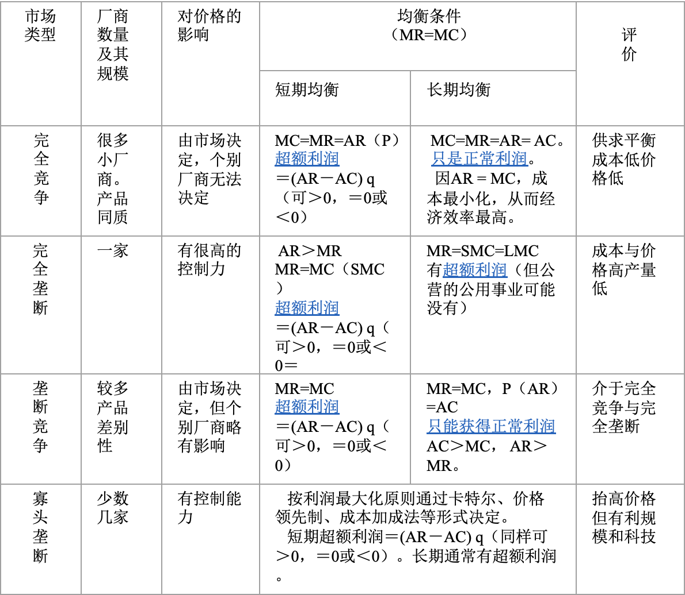

需求、供给量改变：修改公式的Q，增减、减增

税费影响：直接拿被征税的一方的公式修改完了求出新的平衡价格，例如1.3.3，实际价格为4，消费者此时的购买意愿相当于4时的，但供应商的获得价格只有2

需求价格弹性系数是有正负的，

交叉弹性是(本商品量)/(其他商品价格)

价格=AR是必然的，MR斜率是它们的2倍也是必然的

|          | 固有条件 | 短期均衡                            | 长期均衡                                                     | 停工                                                   |
| -------- | -------- | ----------------------------------- | ------------------------------------------------------------ | ------------------------------------------------------------ |
| 完全竞争 | P=MR=AR | MR=SMC              | MR= SMC =SAC=LMC =LAC                                    | P=AVC                               |
| 垄断竞争 |          | SMC=MR (最终均衡：d(Q\*)=D(Q\*)=p\* | MR=LMC P\*=d(Q\*)=D(Q\*) P\*=d(Q\*)=LAC(Q\*)=SAC(Q\*) 导数：d'(Q\*)=LAC'(Q\*)=SAC'(Q\*) |  |
| 寡头竞争 |          |                                     |                                                              |                                                              |
| 完全垄断 |   | MR=MC                             | MR=LMC=SMC                                                   | P=AVC                                              |

厂商原则

| 产品\要素 | 完全     | 不完全        |
| --------- | -------- | ------------- |
| 完全      | VMP~L~=W | VMP~L~=MFC~L~ |
| 不完全    | MRP~L~=W | MRP~L~=MFC~L~ |

