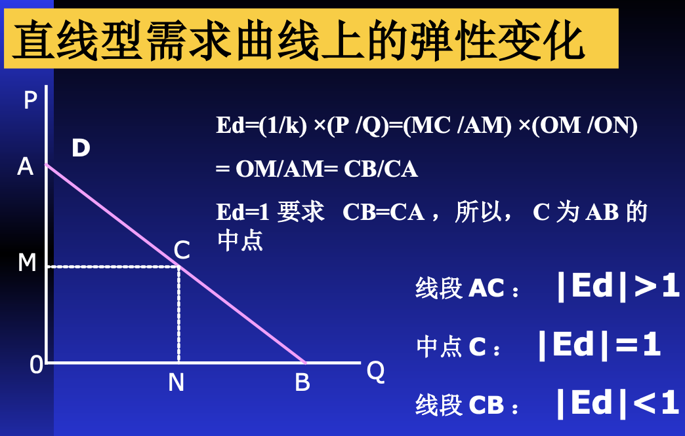
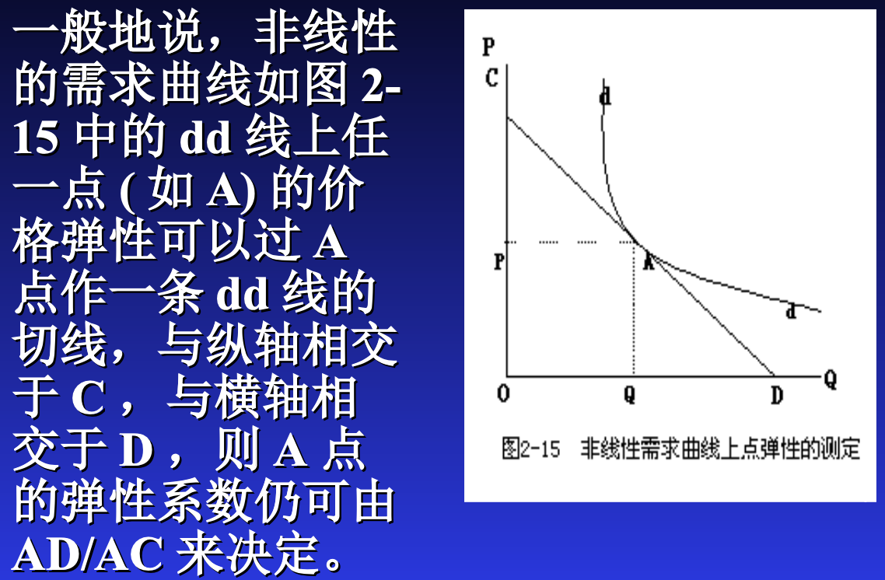
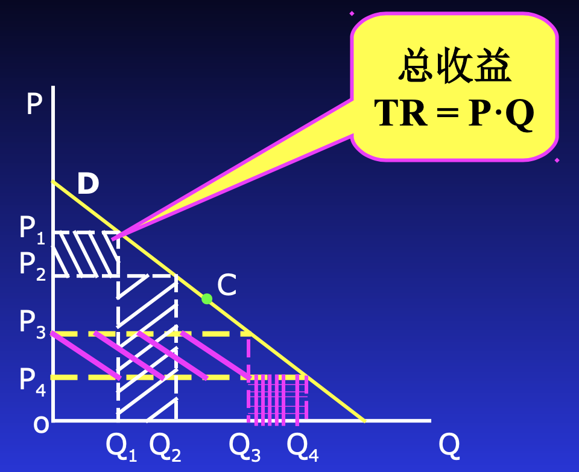

# 弹性理论

## 需求弹性

需求量对价格和其他因素的变动敏感度有多大？

弹性：因变量对自变量相对变化的反应程度

需求弹性 = 需求变化率 / 某种因素变化率

### 需求的价格弹性

**需求价格弹性系数** = 需求量变化率 / 价格变化率

$\large E_d = \frac{\Delta Q / Q}{\Delta P / P} = \frac{\Delta Q}{\Delta P}\frac{P}{Q}$

**注意**：

* Ed的数值不会因计量单位不同而不同
* Ed的数值一般是负数，但是一般都取绝对值
* 弹性不仅随商品的不同而不同，且弹性还随价格的不同而不同

**具体计算方法**：

* 弧弹性：两点之间的弹性
    * $\large E_d = \frac{\Delta Q}{\Delta P} \times \frac{P_1 + P_2}{Q_1 + Q_2}$
* 点弹性：
    * $\large E_d = \frac{\Delta Q}{\Delta P}\frac{P}{Q} = \frac{{\rm d} Q}{{\rm d} P}\frac{P}{Q}$，其中$\large \frac{{\rm d} Q}{{\rm d} P}$为斜率的导数

**分类**

* Ed=0
    * 需求完全无弹性
    * 需求曲线与P(y)轴平行
    * 胰岛素
* 0 < |Ed| < 1
    * 需求缺乏弹性
    * 直线
    * 生活必需品：粮食
* |Ed| = 1
    * 需求具有单位弹性(等值反应)
    * 需求曲线为正双曲线
    * 理论存在
* 1 < |Ed| < infinity
    * 富有弹性
    * 直线
    * 奢侈品(汽车、珠宝、出国旅游)、固定电话
* |Ed| = infinity
    * 完全有弹性
    * 需求曲线与Q轴平行
    * 银行对黄金的需求是无限的、263收费后需求量几乎为0\

**影响因素**

* 可替代程度
* 类别的大小？高露洁牙膏 的弹性比 牙膏 的大
* 对生活的重要程度
* 商品消费支出 占总支出的比重：比重越大弹性越大(越可压缩)
* 调整消费习惯的时间：老年人 时间长 弹性小
* 商品耐用时间：越耐用弹性越小

**弹性与斜率**

对于同一点，弹性与斜率绝对值成反比

直线型需求曲线

非线性

**弹性与收益**

涨价：销量减少，单利增加 $\Longrightarrow$ 用面积算

弹性>1：降价增加收益

弹性<1：涨价增加收益

### 需求的收入弹性

* Ey<0 低档商品
* <1 必需品
* \> 1 奢侈品

### 需求的交叉弹性

Exy = 需求量变化的百分比与 <u>另一种商品价格变动</u> 的百分比

分类

* \> 0 替代品
* <0 互补品
* = 0 独立品

## 供给弹性

## 弹性理论的应用

### 谷贱伤农

需求缺乏弹性，供给弹性是0？？？

供给增加之后需求

### 税负分担理论

对消费者增税会怎么样？

国家对生产者/消费者进行补贴会怎么样

### 蛛网理论

**基本假设**:

* 本期的**供给量**取决于**上期**的价格
* 本期的**需求量**取决于**本期**的价格

三种类型

* 收敛型蛛网的条件:供给弹性 < 需求弹性，或，供给曲线斜率 > 需求曲线斜率。
* 发散型蛛网的条件:供给弹性 > 需求弹性，或，供给曲线斜率 < 需求曲线斜率。(供给弹性大，产量变动得更大)
* 稳定型蛛网的条件:供给弹性 = 需求弹性，或，供给曲线斜率 = 需求曲线斜率。

适用分析对象：有生产周期的产品 ( 非订单生产 ) 。