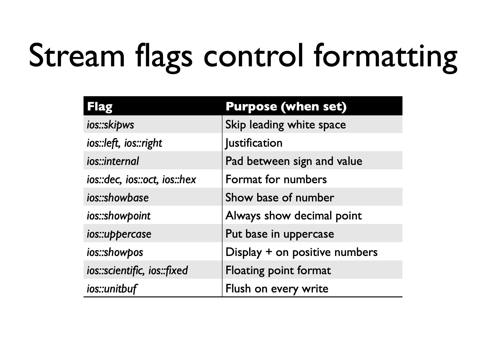

# Overloaded operators

**可以的**

```
+-*/%^&|~
= < > += -= *= /= %=
^= &= |= << >> >>= <<= ==
!= <= >= ! && || ++ --
, ->* -> () []
operator new operator delete
operator new[] operator delete[]
```

**不行的**

```
. .* :: ?:
sizeof typeid
static_cast dynamic_cast const_cast
reinterpret_cast
```


## Restrictions

* Only existing operators can be overloaded (you can't create a `**` operator for exponentiation)
* Operators must be overloaded on a class or enumeration type
* Overloaded operators must
    * Preserve number of operands
    * <u>Preserve precedence (保留优先级)</u>

## Member/Global?

```cpp
// Can be a member function
// Implicit first argument
String String::operator+(const String& that);	// 隐式的this指向String对象

// Can be a global (free) function
// Both arguments explicit
String operator+(const String& l, const String& r);
```

### Member Function

–Implicit first argument
–No type conversion performed on receiver

```cpp
class Integer {
public:
    Integer( int n = 0 ) : i(n) {}
    Integer operator+(const Integer& n) const {
        return Integer(i + n.i);
    }
    Integer operator-() const {
        return Integer(-i);
    }
...
private:
    int i;
};
x + y;	// x.operator+(y);
z = -x;	// z.operator=(x.operator-());
```

### Global

–Explicit first argument
–Type conversions performed on both arguments
–Can be made a friend

• Explicit first argument
• Developer does not need special access to classes
• May need to be a friend
• Type conversions performed on both arguments

```cpp
class Integer {
public:
    friend Integer operator+(const Integer&, const Integer&);
    ...
private:
    int i;
};
Integer operator+(const Integer& lhs, const Integer& rhs) {
    return Integer( lhs.i + rhs.i );
}


z = x + y;	// operator+(x, y)
z = x + 3;	// operator+(x, Integer(3))
z = 3 + y;	// operator+(Integer(3), y)
z = 3 + 7;	// Integer(10)	// 3+7是内置类型
```

### 一般选择

• Unary operators should be members
• `= () [] -> ->*` must be members
• All other binary operators as non-members

## Other things

### Argument passing

• If it is read-only pass it in as a const reference (except built-ins)
• Make member functions const that don't change the class (boolean operators, +, -, etc)
• For global functions, if the left-hand side changes pass as a **reference** (stream inserters)

### Return values

* Select the return type depending on the expected meaning of the operator. For example,
    * For operator+ you need to generate a new object. Return the created object.
    * Logical operators should return bool (or `int` for older compilers).

### 一些原生操作的prototype

```cpp
+ - * / % ^ & | ~
T operator X(const T& l, const T& r);

! && || < <= == >= >
bool operator X(const T& l, const T& r);

[]
E& T::operator [](int index);	// 例如VectorSTL中
```

### 艹

```cpp
class Integer {
public:
    ...
    Integer& operator++();		// x++
    Integer operator++(int);	// ++x
    Integer& operator--();		// x--
    Integer operator--(int);	// --x
    ...
};

Integer& Integer::operator++() {
    // this->i += 1;
    *this += 1;		// increment	// 对+=的重用，保证逻辑一致性，以防之后改了加法的形式
    return *this;	// fetch
}
// int argument not used so leave unnamed so
// won't get compiler warnings
Integer Integer::operator++(int) {
    Integer old( *this );	// fetch
    ++(*this);				// increment	// 对++x的重用
    return old;				// return
}
```

### 重用

==互相关联的符号重载应该尽量重用==，例如上面的`+=`、`++`

* != in terms of ==
* implement >, >=, <= in terms of < (只用`<`即可)

```cpp
bool Integer::operator==( const Integer& rhs ) const {
    return i == rhs.i;
}
// implement lhs != rhs in terms of !(lhs == rhs)
bool Integer::operator!=( const Integer& rhs ) const {
    return !(*this == rhs);
}
bool Integer::operator<( const Integer& rhs ) const {
    return i < rhs.i;
}
// implement lhs > rhs in terms of lhs < rhs
bool Integer::operator>( const Integer& rhs ) const {
    return rhs < *this;
}
// implement lhs <= rhs in terms of !(rhs < lhs)
bool Integer::operator<=( const Integer& rhs ) const {
    return !(rhs < *this);
}
// implement lhs >= rhs in terms of !(lhs < rhs)
bool Integer::operator>=( const Integer& rhs ) const {
    return !(*this < rhs);
}
```

### 自动等号

**Automatic operator= creation**

• The compiler will automatically create one if it’s not explicitly provided. (自动的类似拷贝构造)
• memberwise assignment (和copy ctor的方式处理指针)

```cpp
class Cargo{
public:
    Cargo& operator=(const Cargo&){
        cout << "Cargo& operator=(const Cargo&)" << endl;
        return *this;
    }
}
class Truck{
public:
    Cargo mc;
}

int main(){
    Truck a, b;
    a = b;	// Truck的=是compiler生成的，调用了a.mc = b.mc
}
```

### 等号

```cpp
class A{
public:
    A& operator=(const A& rhs){
        // delete[] p;	// 若是同一块内存就完蛋
        p = new char(strlen(p) + 1);
        p = strcpy(p, rhs.p);
        return p;
    }
private:
    char *p;
}
```

### type conversions

* A conversion operator can be used to convert an object of one class into
    * an object of another class
    * a built-in type
* Compilers perform implicit conversions using
    * Single-argument constructors
    * implicit type conversion operators

```cpp
class PathName {
    string name;
public:
// or could be multi-argument with defaults
    PathName(const string&);
    ~PathName();
};
...
string abc("abc");
PathName xyz(abc);	// OK!
xyz = abc;			// OK abc => PathName
```

`explicit`防止隐式转换

```cpp
class PathName {
    string name;
public:
// or could be multi-argument with defaults
    explicit PathName(const string&);
    ~PathName();
};
...
string abc("abc");
PathName xyz(abc);	// OK!
xyz = abc;			// ERROR!
```

#### Built-in conversions

* Primitive
    char  ==> short  ==> int  ==> float  ==> double
    \\                             ==> int  ==> long
* Any type T
    T ==>  T&	T& ==>  T	T\* ==>  void\*
    T[] ==>  T\*	T\* ==>  T[]	T ==>  const T

## 最后

• Just because you can overload an operator doesn't mean you should.
• Overload operators when it makes the code easier to read and maintain.

# Streams

|            | I             | O             | Header      |
| ---------- | ------------- | ------------- | ----------- |
| Generic    | istream       | ostream       | <iostream>  |
| File       | ifstream      | ofstream      | <fstream>   |
| C string   | istrstream    | ostrstream    | <strstream> |
| C++ string | istringstream | ostringstream | <sstream>   |

## Intro

* Original C I/O used printf, scanf
* Streams introduced in C++
    * C I/O libraries still work
* Advantages of streams
    * Better type safety
    * Extensible
    * More object-oriented
* Disadvantages
    * More verbose 格式控制很烦
    * Might be slower
        * Turn off synchronization: `std::ios::sync_with_stdio(false);`
            * 开了可以混用c和cpp方式


**Predefined streams**

• cin
	– standard input
• cout
	– standard output
• cerr
	– unbuffered error (debugging) output
• clog
	– buffered error (debugging) output

[What is the difference between cout, cerr, clog of iostream header in c++? When to use which one? - Stack Overflow](https://stackoverflow.com/questions/16772842/what-is-the-difference-between-cout-cerr-clog-of-iostream-header-in-c-when)

## Input

### extractor

```cpp
istream& operator>>(istream& is, T& obj) {
    // specific code to read obj
    return is;
}
```

### get

* int get()

    * Returns the next character in the stream

    * Returns EOF if no characters left

    * Example: copy input to output

        ```cpp
        int ch;
        while ((ch = cin.get()) != EOF)
            cout.put(ch);
        ```

* istream& get(char& ch)

    * Reads the next character into argument
    * Similar to int get();

### Other

`get(char *buf, int limit, char delim='\n')`

• Read up to limit characters, or to delim
• Appends a null character to buf
• Does not consume the delimiter

`getline(char *buf, int limit, char delim='\n')`

• Read up to limit characters, or to delim
• Appends a null character to buf
• Does consume the delimiter

`ignore(int limit=1, int delim = EOF)`

• Skip over limit characters or to delimiter
• Skip over delimiter if found

`int gcount()`

• Returns number of characters <u>just read</u>

```cpp
char buffer[100];
cin.getline(buffer, sizeof(buffer));
cout << "read" << cin.gcount() << " characters";
```

`void putback(char c)`

• Pushes a single character back into the stream

`char peek()`

• Examines the next character <u>without consuming it</u>

```cpp
switch(cin.peek())
```

## Output

### inserter

```cpp
ostream& operator<<(ostream& os, const T& obj) {
    // specific code to write obj
    return os;
}
```

### Other

`put(char)`

• Prints a single character
• Examples
```cpp
cout.put('a');
cerr.put('!');
```

`flush()`

• Force output of stream contents
• Example

```cpp
cout << "Enter a number";
cout.flush();
```

## Format

### Manipulators

**endl的作用**

* 加个回车
* 执行`cout.flush()`


**进制**

```cpp
cin >> hex >> n;
```


**场宽位宽**

```cpp
cout << setprecision(2) << 1230.243 << endl;
cout << setw(20) << "OK!";
```


| Manipulator                                                  | Effect                     | Type |
| ------------------------------------------------------------ | -------------------------- | ---- |
| dec, hex, oct                                                |                            | IO   |
| endl                                                         |                            | O    |
| flush                                                        |                            | O    |
| setw(int)                                                    |                            | IO   |
| setfill(ch)                                                  |                            | IO   |
| [setbase(int)](http://www.cplusplus.com/reference/iomanip/setbase/) | Set number base(8, 10, 16) | O    |
| ws                                                           | Skip whitespaces           | I    |
| setprecision(int)                                            |                            | O    |
| setiosflag(long)                                             | Turn on specified flags    | IO   |
| resetiosflags(long)                                          | Turn off specified flags   | IO   |


### Flag



**Setting flags**

* Using manipulators
    * setiosflags(flags);
    * resetiosflags(flags);
* Using stream member functions
    * setf(flags);
    * unsetf(flags);

