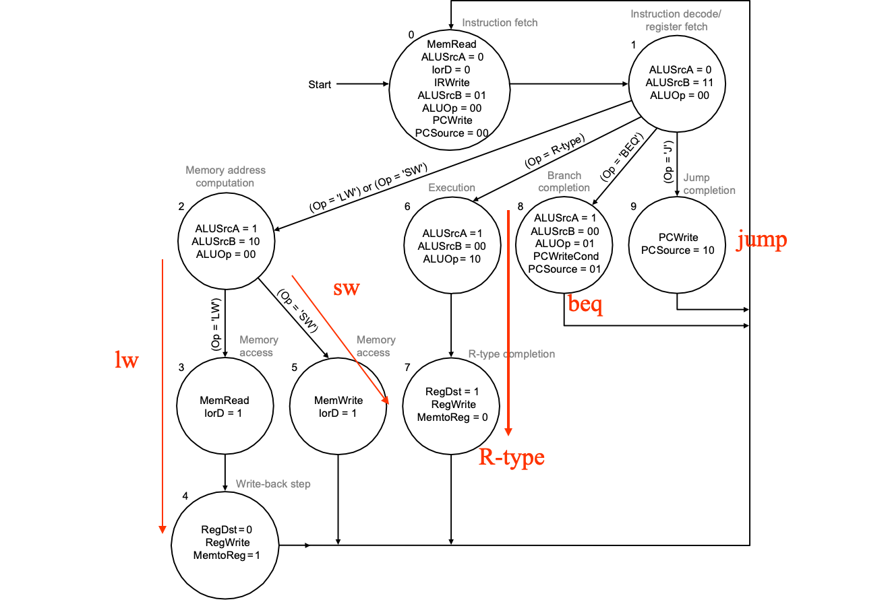

| Name      | Register number | Usage                                        | Preserved on call? |
| --------- | --------------- | -------------------------------------------- | ------------------ |
| \$zero    | 0               | The constant value 0                         | n.a.               |
| \$at      | 1               | For assembler                                |                    |
| \$v0–\$v1 | 2–3             | Values for results and expression evaluation | no                 |
| \$a0–\$a3 | 4–7             | Arguments                                    | no                 |
| \$t0–\$t7 | 8–15            | Temporaries                                  | no                 |
| \$s0–\$s7 | 16–23           | Saved                                        | yes                |
| \$t8–\$t9 | 24–25           | More temporaries                             | no                 |
| \$k0-\$k1 | 26-27           | For OS                                       |                    |
| \$gp      | 28              | Global pointer                               | yes                |
| \$sp      | 29              | Stack pointer                                | yes                |
| \$fp      | 30              | Frame pointer                                | yes                |
| \$ra      | 31              | Return address                               | yes                |

常用的指令和type的对应

```assembly
Rtype $rd, $rs, $rt
Itype $rt, $rs, immediate
sll $rd, $rt, shamt # $rs=0
sllv $rd, $rt, $rs	# shamt = 0
lw_sw $rt, $rs[offset]
beq_bne $rs, $rt, offset
j_jal targer
jr $rs				# $rt=$rd=0, shamt=hint
jalr $rs			# $rt=0, $rd=31, shamt=hint
```

| 31符号位 | 30    ……     23 exp | 22        ……          0      |
| -------- | ------------------- | ---------------------------- |
| 1        | 0111 1110           | 110 0000 0000 0000 0000 0000 |
| 1 bit    | 8 bits              | 23 bits                      |

---

计算机原则

---

多周期几个状态


---

控制线套路抄一抄



---

* Write hits:  Difference Strategy
    * write-through: Ensuring Consistent (总是写到内存，(一写到底through))
        * Write the data into both the memory the cache
        * Strategy ---- writes always update both the cache and the memory
        * **[write buffer](# write buffer)**，可以用这个来稍微减小对速度的影响
        * 不需要dirty，有valid就够了
    * write-back: Cause Inconsistent (之后再写到内存)
        * Wrote the data into only the data cache
        * Strategy ---- write back data from the cache to memory later (later一般是指程序结束之后)
        * Fast，两者相差很大用这种
        * 需要加一个[dirty](# 脏位)位来进行判断
        * **避免误写的方法**：用两个周期(先检查是否命中再写)；弄个写缓冲(在正常周期内将新数据放入缓冲，如果命中了再写入)
* Write misses(写东西，tag对不上):
    * Write allocate (收集)
        * read the entire block from memory into the cache(==Write allocate得先read==), then write the word using \-back or \-through(hit策略)
        * <u>The block is loaded into the cache on a miss before anything else occurs.</u> 
        * 看脏位
            * 1：先把原来东西写到内存，再用新值冲掉
            * 0：没被写过，直接冲
    * Write around (绕开？no write allocate)
        * The block is only written to main memory
        * It is not stored in the cache.
    * In general, **<u>write-back caches use write-allocate</u>**(之后要hit必须cache里有东西；chache和mem差距大), and **<u>write-through caches use write-around</u>**.(无所谓，反正hit了也要写到mem，跟cache没啥关系；mem和cache差距小)

---

`CPU time = (CPU execution clock cycles 􏰃+ Memory-stall clock cycles) × Clock cycle time`

读操作阻塞的周期：`Read_stall_cycles = (Reads/Program) × Read_miss_rate × Read_miss_penalty`

写操作阻塞的周期：`Write_stall_cycles = [(Writes/Program) × Write_miss_rate × Write_miss_penalty] + Write_buffer_stalls` (写缺失+写缓冲阻塞)

写缓冲区阻塞：`Write_buffer_stalls`：个人理解应该指的是连续多次写操作中，下一次得等上一次写完才可以写。取决于频率和write的时机(比如你要是能保证mem任意时刻写一次的时间之内不会遇到其他的写要求，那就不存在这个问题)，因此没办法量化计算。

存储器阻塞时钟周期数：`Memory-stall clock cycles `

\\            `􏰀= (Read-stall cycles 􏰃+ Write-stall cycles)`

\\            `= (Memory_accesses/Program) × Miss_rate × Miss_penalty`(忽略写缓冲区阻塞，共用读写的MissRate和MissPenalty)

\\            `= (Instructions/Program) × (Misses/Instruction) × Miss_penalty`(这第一个括号应该是只考虑内存中的指令)

---

**除法**

64被除数存到64余数里

### Ver1

32商左移，64余数不动，64除数(32位除数存在高32位)右移，64位ALU

做减法，余数=余数-除数然后和0比大小，若大于0则ok，商该位置1；小于0则rollback(余数+除数)

### Ver2

32商左移，64余数左移，32除数不动，32位ALU

做减法，余数高32-除数比大小，若大于0则ok，商该位置1；小于0则rollback(余数高32+除数)

### Ver3

省掉商寄存器

64余数左右移，32除数不动，32位ALU

做减法，余数高32-除数比大小，若大于等于0则将余数左移，低位平行置位1；小于0则rollback并左移，低位平行置位0

商在余数的低32位。结束后将余数的高32右移一位

| iteration | step                           | Divisor | Remainder |
| --------- | ------------------------------ | ------- | --------- |
| 0         | Initial Values                 | 0010    | 0000 0111 |
|           | Shift Rem left 1               | 0010    | 0000 1110 |
| 1         | 1.Rem=Rem-Div                  | 0010    | 1110 1110 |
|           | 2b: Rem<0 →+Div,sll R,R0=0     | 0010    | 0001 1100 |
| 2         | 1.Rem=Rem-Div                  | 0010    | 1111 0110 |
|           | 2b: Rem<0 →+Div,sll R,R0=0     | 0010    | 0011 1000 |
| 3         | 1.Rem=Rem-Div                  | 0010    | 0001 1000 |
|           | 2a: Rem>0 →sll R,R0=1          | 0010    | 0011 0001 |
| 4         | 1.Rem=Rem-Div                  | 0010    | 0001 0011 |
|           | 2a: Rem>0 →sll R,R0=1          | 0010    | 0010 0011 |
| End       | Shift left half of Rem right 1 |         | 0001 0011 |

---

**Booth**

* 1 0 	subtract multiplicand from left half
* 1 1 	no arithmetic operation
* 0 1 	add multiplicand to left half
* 0 0 	no arithmetic operation
* ALways Shift Right(sra)