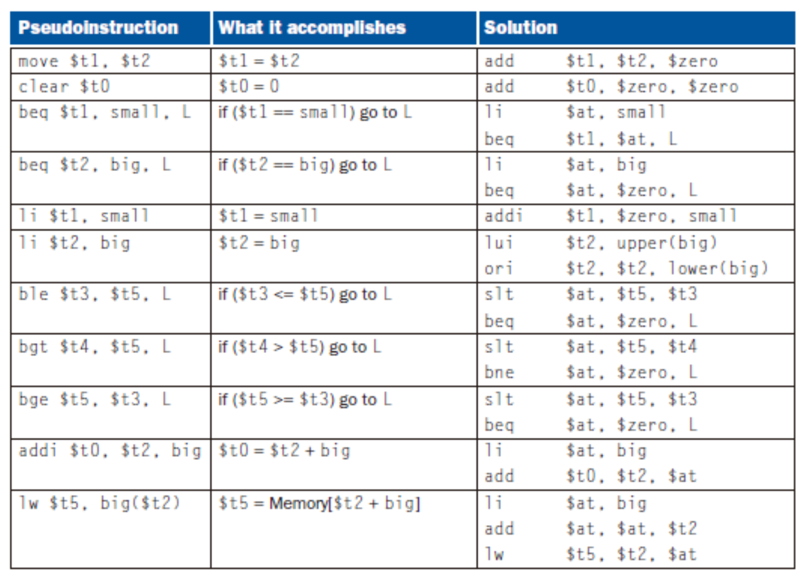
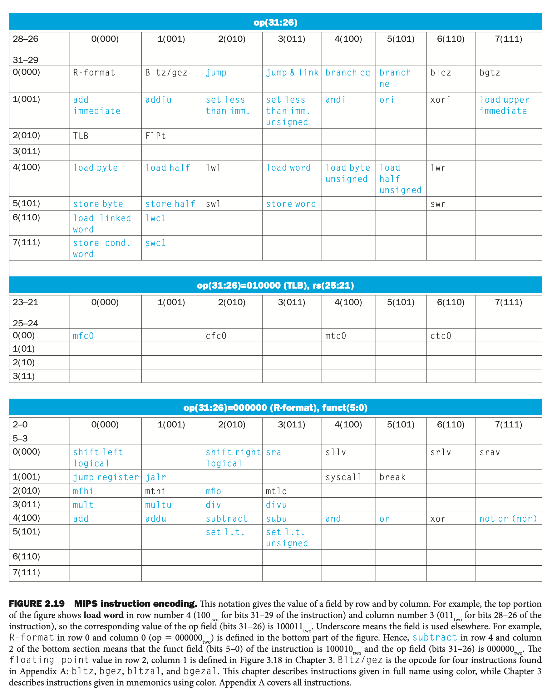
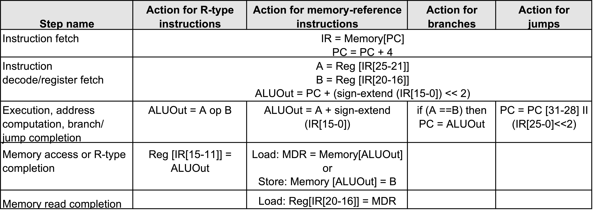
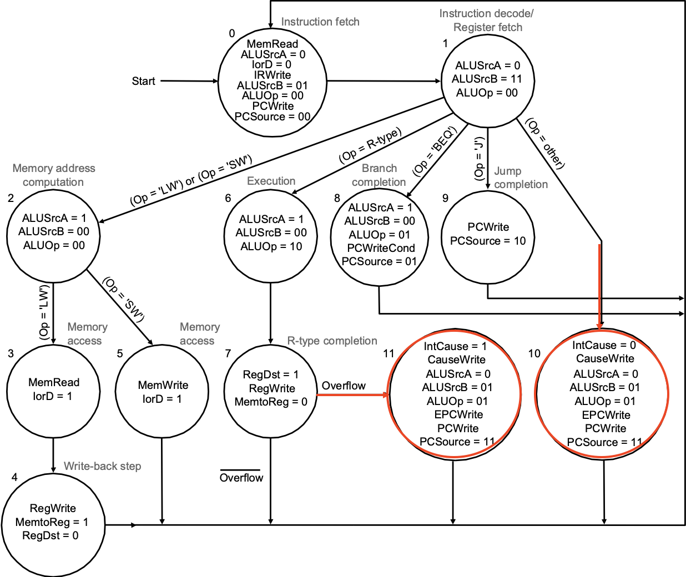
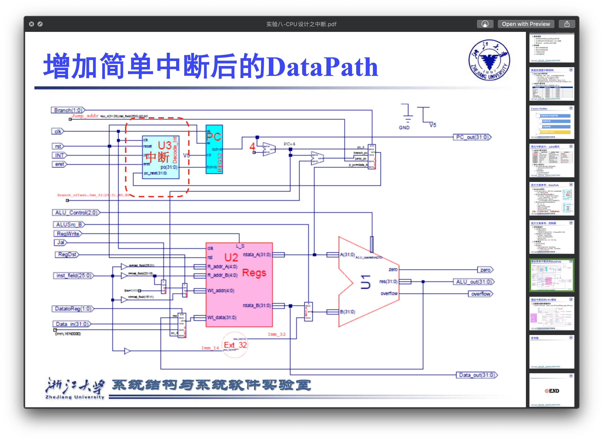
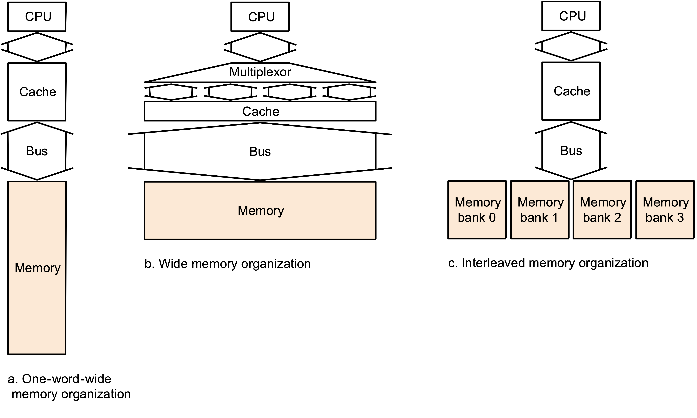

# 。。。

缺页页替换：5.11

Cache替换：5.3，5.7

Cache资源计算：5.4

C转汇编：期末练习

# Intro

**Hardware Design Principles**

* Simplicity favors regularity.
* Smaller is faster.
* Make common case fast.
* Good design demands good compromises.

**Today Computer's Disign Principles**

* Instruction are represented as numbers.
* Programs can be stored in memory to be read or written just like numbers.

---


# MIPS

| Name      | Register number | Usage                                        | Preserved on call? |
| --------- | --------------- | -------------------------------------------- | ------------------ |
| \$zero    | 0               | The constant value 0                         | n.a.               |
| \$at      | 1               | For assembler                                |                    |
| \$v0–\$v1 | 2–3             | Values for results and expression evaluation | no                 |
| \$a0–\$a3 | 4–7             | Arguments                                    | no                 |
| \$t0–\$t7 | 8–15            | Temporaries                                  | no                 |
| \$s0–\$s7 | 16–23           | Saved                                        | yes                |
| \$t8–\$t9 | 24–25           | More temporaries                             | no                 |
| \$k0-\$k1 | 26-27           | For OS                                       |                    |
| \$gp      | 28              | Global pointer                               | yes                |
| \$sp      | 29              | Stack pointer                                | yes                |
| \$fp      | 30              | Frame pointer                                | yes                |
| \$ra      | 31              | Return address                               | yes                |

常用的指令和type的对应

```assembly
Rtype $rd, $rs, $rt
Itype $rt, $rs, immediate
sll $rd, $rt, shamt # $rs=0
sllv $rd, $rt, $rs	# shamt = 0
lw_sw $rt, (offset)$rs
beq_bne $rs, $rt, offset
j_jal targer
jr $rs				# $rt=$rd=0, shamt=hint
jalr $rs			# $rt=0, $rd=31, shamt=hint
```

==压栈是减sp的==

```assembly
li $t2, big
ble $t3, $t5, L
lw $t5, big($t2)
abs $t2, $t3
# lw $t5, 0($at)
```



```assembly
# abs $t2, $t3
    sra $at, $t3, 31	# neg: 1111, pos: 0000
    xor $t2, $t3, $at	# neg: ~, pos: nop
    subu $t2, $t2, $at	# ~neg-1111 = ~neg+1 = abs

# -10= 1111 0110
# ~-10=0000 1001
# +10= 0000 1010
# +    1111 1111
# =    0000 1001

# swap $t1, $t0
    xor $t1, $t0, $t1
    xor $t0, $t0, $t1
    xor $t1, $t0, $t1
```


```assembly
MAIN:
    addi $sp, $sp, -4
    sw $ra, ($sp)
    add $t6, $0, 0x30 # ‘0’
    add $t7, $0, 0x39 # ‘9’
    add $s0, $0, $0
    add $t0, $a0, $0
LOOP:
    lb   $t1, ($t0)
    beq  $t1, $zero, DONE
    slt  $t2, $t1, $t6
    bne  $t2, $0, WRONG
    slt  $t2, $t7, $t1
    bne  $t2, $0, WRONG
    sub  $t1, $t1, $t6
    mul  $s0, $s0, 10
    add  $s0, $s0, $t1
    addi $t0, $t0, 1
    j LOOP
DONE:
    add  $v0, $s0, $0
    j RET
WRONG:
    addi $v0, $zero, -1
RET:
    lw   $ra, ($sp)
    addi $sp, $sp, 4
    jr   $ra
```


# Numbers

**符号数**

对于补码，A+-A=100...

---

**乘法**

**Ver1**

64ALU；64cand左移，32ier右移，64积不动；ier低位为0则Prod+=cand

**Ver2**

32ALU；32cand不动，32ier右移，64积右移；ier低位为1则Prod[high half]+=cand

**Ver3**

32ALU；32cand不动，64积(初值为{32'b0, ier})右移；ier低位为1则Prod[high half]+=cand

**signed乘**

将符号数转化为非符号数，若两数异号再把结果变为其补码

**Booth**

10减；01加；sra

---

**除法**

**Ver1**

32商左移，64余数不动，64除数(初值为`{32位除数, 32'b0}`)右移，64位ALU

做减法，余数-=除数比大小，若大于0则ok，商左移置1；小于0则rollback，商左移置0；循环33次

**Ver2**

32商左移，64余数左移，32除数不动，32位ALU

做减法，余数高32-=除数比大小，若大于0则ok，商该位置1；小于0则rollback

**Ver3**

64余数左移，32除数不动，32位ALU；余数高32-=除数比大小，若大于0则将左移置1；小于0则rollback并左移置0；开始全部左移一位；结束时高位右移一位，商在余数的低32位

| Round                 | Divisor | Remainder     |
| --------------------- | ------- | ------------- |
| 0                     | 1000(8) | 0010 0111(39) |
| <<+0                  |         | 0100 1110     |
| 1: <0                 |         | ...           |
| <<+0                  |         | 1001 1100     |
| 2: >0                 |         | 0001 1100     |
| <<+1                  |         | 0011 1001     |
| 3: <0                 |         | ...           |
| <<+0                  |         | 0111 0010     |
| 4: <0                 |         | ...           |
| <<+0                  |         | 1110 0100     |
| Done: shift high left |         | 0111 0100     |

---

**浮点格式**

1, 8, 23, -127; 1, 11, 52, -1023;

$\Large \rm (-1)^{sign}\times(1+significand)\times 2 ^{exp - bias}$

1+significand(=fraction，尾数)是二进制，即整个浮点数实际上是<u>用**二进制**的科学计数法表示的小数</u>

**特殊的**：NaN，+\infin, -\infin, 0

| Significand    | Exp  |          |
| -------------- | ---- | -------- |
| 0              | 0    | 0        |
| 0              | 全1  | $\infin$ |
| 不全0(1000...) | 全1  | NaN      |

最小的inf：2^128^；最小的指数位非0：2^-126^；最小的非0：2^-149^；

范围[1.00...0×2^-126^, 1.1111...1×2^127^=2^128^-2^-23^]

---

**浮点加法**

```
  1.001 * 2^2
+
  1.0100,0000,0000,0000,0000,011 * 2^1
(=0.1010,0000,0000,0000,0000,0011 * 2^2)
=
  1.1100,0000,0000,0000,0000,0011 * 2^2(GRS=100, nearest even)
=
  1.1100,0000,0000,0000,0000,010 * 2^2
```

MIPS

`$s1 > $s0 > 0, $s3 = 0xFF000000, $s4 = 0x00800000`

```assembly
or $s5, $s4, $s3	# mask of sign+exp

nor $s6, $s5, $s5	# mask of fraction
and $t1, $s1, $s5	# sign+exp of s1
and $t0, $s0, $s5	# sign+exp of s0
and $t3, $s1, $s6	# frac of s1
and $t2, $s0, $s6	# frac of s0
or $t3, $t3, $s4	# add 1. to t3
or $t2, $t2, $s4	# add 1. to t2

align:
    slt $t4, $t0, $t1
    beq $t4, $zero, align_exit	# 两数指数位相等时停下
    srl $t2, $t2, 1
    add $t0, $t0, $s4	# s0.exp++
    j align
align_exit:

add $t3, $t3, $t2	# t3 = sum of frac
carry:
    and $t4, $t3, $s3	# if sum_of_frac has carry, t4 != 0
    beq $t4, $zero, carry_exit
    srl $t3, $t3, 1
    add $t1, $t1, $s4	# s1.exp++
    j carry				# 感觉这里不需要循环，因为最多进一位
carry_exit:
    and $t3, $t3, $s6	# remove 1.
    or $s2, $t1, $t3	# link sign+exp with frac
```


---

**guard round sticky**

**nearest even**

[ieee 754 - Rounding Floating Point Numbers after addition (guard, sticky, and round bits) - Stack Overflow](https://stackoverflow.com/questions/19146131/rounding-floating-point-numbers-after-addition-guard-sticky-and-round-bits)

[rounding - Guard, round, sticky bits (floating point) - Stack Overflow](https://stackoverflow.com/questions/45662113/guard-round-sticky-bits-floating-point)


# CPU

**ALUop**

* 00：加法(sw, lw)
* 01：减法(beq, EPC)
* 10：由funct决定

**ALU_Operation**

| ALU Control Lines | Function |
| ----------------- | -------- |
| 000               | And      |
| 001               | Or       |
| 010               | Add      |
| 011               | Xor      |
| 100               | Nor      |
| 101               | Srl      |
| 110               | Sub      |
| 111               | Slt      |

---



---

**控制线**

RegDst: rt, rd

MemtoReg: ALUOut_Reg, MDR

ALUSrcA: RegPC, RegA

ALUSrcB: RegB, 4, signext(imm), signext(imm)<<2

PCSource: ALU_result(for PC+4), ALUOut_Reg(for b), j_target, c0000000

branch: PC_EN=`(((zero ^ Branch) & PCWriteCond) | PCWrite)`(`Branch = 0 if beq, 1 if bne(= inst[26])`)

---

多周期几个状态



---

控制线状态机抄一抄



---

**Exception**

EPC = PC - 4(error pc); PC=Handler's PC; eret



# Cache

**Cache**

Size = (ValidBit+TagWidth+BlockSize) * 2^IndexWidth^

Cache是通过物理地址访问的，即PT hit或TLB hit会先经过Cache

---

**LRU**

2路相连：单独给出一个bit用于记录，访问Block0时复位，访问Block1时置位

---

* Write hits
    * write-back：之后再写到mem；dirty
    * write-through：写到cache和mem；write buffer
* Write misses
    * Write-allocate：先读进cache再写，冲旧的之前要看dirty；
    * Write-around：直接写到mem，不到cache；
* back+allocate, through+around

---



# VM

**Abbr**

MMU; PT, PTE (Entry); VA/PA; VPN/PPN; VPO/PPO (offset); TLB (Translation Lookaside Buffer)

---

**PageTable**

一个页表在创建时需要先分配好所需内存，满的是2^VPN^ \* (字对齐(PPN_Width+DirtyBit))

Page Fault: 数据(按页算)不在内存，需要从辅存中获取，用write-back

一般是FA


Transition由PageTable(VPN, Valid, PPN)+MMU实现

---

**TLB**(是硬件)

TLB_Size = SetWay \* 2^TLB_Index^ \* (ValidBit+DirtyBit+TLBTagWidth+PPNWidth)

一般用DM或SA

**VA传给TLB的格式**

| 虚拟页号VPN(Virtual Page Num) | 页内偏移VPO   |
| ----------------------------- | ------------- |
| TLB_Tag \| TLB_Index          | No Use in TLB |


# IO

**硬盘访问**

磁针初始位置在内，注意寻道是否连续，连续的话`相邻磁道寻道时间=(最大时间-最小时间)/磁道数`；注意是否有分区，不同区的寻道时间不一样

---

**RAID**

3：位交叉；4：块交叉ConR(`check' = (data xor data') xor check`)；5：分布式块交叉ConRW；6：P+Q

---

**总线类型**

背板：PCI；外设：SCSI, IDE, ISA

---

**Asynchronous**

Ex. IO设备通过异步握手协议从内存读取一个字的数据


*橙线是IO设备发出的，黑线是内存发出的*

1. When memory saw the **ReadReq** line, it reads the address from the data bus, starts the memory read operation, <u>then</u> raises **Ack** to tell the device that the ReadReq signal has been seen.
2. I/O device saw the **Ack** line high and releases the **ReadReq** data lines.
3. Memory sees that **ReadReq** is low and drops the **Ack** line.
4. When the memory has the data ready, it places the data on the data lines and raises **DataRdy**.
5. The I/O device sees **DataRdy**, reads the data from the bus, and signals that it has the data by raising **Ack**.
6. The memory sees **Ack** signals, drops **DataRdy**, and releases the data lines.
7. Finally, the I/O device, seeing **DataRdy** go low, drops the **Ack** line, which indicates that the transmission is completed.

---

**Communication Type**

* Polling
* Interrupt
* DMA


# 公式

$\Large \rm \frac{秒数}{程序}=\frac{指令数}{程序} \times \frac{时钟周期数}{指令数}(CPI) \times \frac{秒数}{时钟周期数}(clk\_time)$

**SP = IU**

**DP = CU^2^f/2(方波)**

---

| Type              | Miss Penalty for M words(Init是大头)       |
| ----------------- | ------------------------------------------ |
| 1w wide           | AddrTrans + M • (Init+DataTrans)           |
| wide(width=N)     | AddrTrans + (M/N) • (Init + DataTrans)     |
| N-way interleaved | AddrTrans + (M/N) • (Init + N • DataTrans) |

---


**读写阻塞**

`CPU time = (CPU execution clock cycles 􏰃+ Memory-stall clock cycles) × Clock cycle time`

`Read_stall_cycles = (Reads/Program) × Read_miss_rate × Read_miss_penalty`

`Write_stall_cycles = [(Writes/Program) × Write_miss_rate × Write_miss_penalty] + Write_buffer_stalls`

`Memory-stall clock cycles = Read_stall_cycles + Write_stall_cycles ≈ (内存访问次数/程序数) × 缺失率 × Miss_penalty = (指令数/程序数) × (缺失数/指令数) × Miss_penalty`

**带宽**(Cache和内存)

==有些写操作也需要读(如write-allocate)，反之亦然(如[作业5.4](../../Org/Org_HW/陈希尧_3180103012_期中练习后.md)read miss遇到脏的块)，注意==

~~==注意InstSize和DataSize可能是不一样的==~~，missrate可能是不一样的

==写穿用Word就行==

`Inst_Read_BW = Cache_mr × BlockSize / CPI`

Allocate: `Data_Read_BW = (lw_rate + sw_rate) × Cache_mr × BlockSize / CPI`

Around: `Data_Read_BW = lw_rate × Cache_mr × BlockSize / CPI`

Through: `Data_Write_BW = sw_rate × 4B / CPI`(只要写一个Byte)

Back: `Data_Write_BW = (lw_rate + sw_rate) × Cache_mr × dirty_rate × BlockSize / CPI`(遇到dirty要整个块写)

**多级缓存**

==MissPenalty = L1_mr • (L2_time + L2_mr • Mem_time) • I = (L1_mr × L2_time + L12_mr × Mem_time) × I==

**通过二级缓存与页表的访问**

`实际CPI = 理想CPI(L1_ht) + L1_mr • (L2_ht + L2_mr • (Mem_t + VM_mr • disk_t))`

---

计算Bandwidth

* 时间 = Block数目 * （地址传输时间 + Memory内循环次数 * （内存读取一轮所需时间+ ~~数据传输时间~~）+bus中间休息时间）
    * Memory内循环次数= Block大小/Memory一次能读取大小
* Bandwidth = 传输数据大小/时间
* ==注意，当Block大小大于memory一次能读取的大小时，传输上一个的data和读下一个的内存时间可以重叠==

---

==Access Time = Seek time + Rotational Latency + Controller Time + Transfer time==

\\                       = 6ms + 0.5*60,000(ms/min)/10,000(RPM) + 0.2ms +0.5KB/(50MB/sec) = 9.2ms

---

`DMA_Time = DMA次数 • (CPU初始化DMA时间 + DMA发送读取地址给内存时间 + DMA内的循环次数 • (内存读取时间 + 数据(分次)发送时间))`

