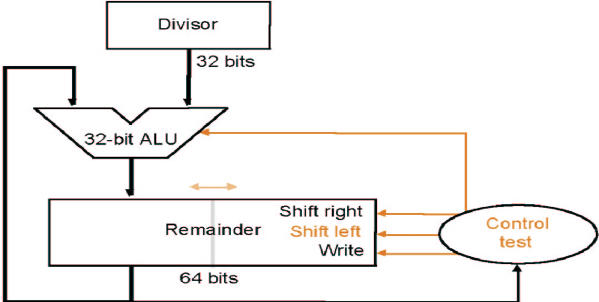
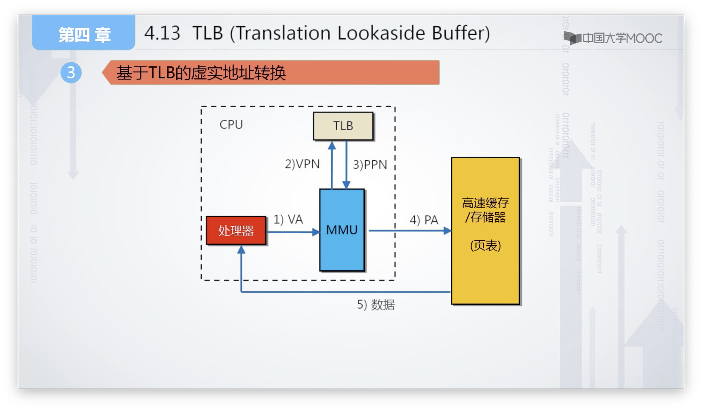

# Intro

**Hardware Design Principles**

* Simplicity favors regularity.
* Smaller is faster.
* Make common case fast.
* Good design demands good compromises.

**Today Computer's Disign Principles**

* Instruction are represented as numbers.
* Programs can be stored in memory to be read or written just like numbers.

---

**SP = IU**

**DP = CU^2^f/2**

# MIPS

| Name      | Register number | Usage                                        | Preserved on call? |
| --------- | --------------- | -------------------------------------------- | ------------------ |
| \$zero    | 0               | The constant value 0                         | n.a.               |
| \$at      | 1               | For assembler                                |                    |
| \$v0–\$v1 | 2–3             | Values for results and expression evaluation | no                 |
| \$a0–\$a3 | 4–7             | Arguments                                    | no                 |
| \$t0–\$t7 | 8–15            | Temporaries                                  | no                 |
| \$s0–\$s7 | 16–23           | Saved                                        | yes                |
| \$t8–\$t9 | 24–25           | More temporaries                             | no                 |
| \$k0-\$k1 | 26-27           | For OS                                       |                    |
| \$gp      | 28              | Global pointer                               | yes                |
| \$sp      | 29              | Stack pointer                                | yes                |
| \$fp      | 30              | Frame pointer                                | yes                |
| \$ra      | 31              | Return address                               | yes                |

常用的指令和type的对应

```assembly
Rtype $rd, $rs, $rt
Itype $rt, $rs, immediate
sll $rd, $rt, shamt # $rs=0
sllv $rd, $rt, $rs	# shamt = 0
lw_sw $rt, $rs[offset]
beq_bne $rs, $rt, offset
j_jal targer
jr $rs				# $rt=$rd=0, shamt=hint
jalr $rs			# $rt=0, $rd=31, shamt=hint
```

| 31符号位 | 30    ……     23 exp | 22        ……          0      |
| -------- | ------------------- | ---------------------------- |
| 1        | 0111 1110           | 110 0000 0000 0000 0000 0000 |
| 1 bit    | 8 bits              | 23 bits                      |

==压栈是减sp的==


```assembly
abs $t2, $t3:
sra $at, $t3, 31
xpr $t2, $t3, $at
subu $t2, $t2, $at
```


# Numbers

**Booth**

* 1 0 	subtract multiplicand from left half
* 1 1 	no arithmetic operation
* 0 1 	add multiplicand to left half
* 0 0 	no arithmetic operation
* ALways Shift Right(sra)

| iteration | step           | Multiplicand | product          |
| --------- | -------------- | ------------ | ---------------- |
| 0         | Initial Values | 0010(2)      | 0000_/1101_0(-3) |
| 1         | 10: sub        | 0010         | 1110_/1101_0     |
|           | sra            | 0010         | 1111_0/110_1     |
| 2         | 01: add        | 0010         | 0001_0/110_1     |
|           | sra            | 0010         | 0000_10/11_0     |
| 3         | 10: sub        | 0010         | 1110_10/11_0     |
|           | sra            | 0010         | 1111_010/1_1     |
| 4         | 11: nop        | 0010         | 1111_010/1_1     |
|           | sra            | 0010         | 1111_1010/_1     |

---

**除法Ver3**



| Round                 | Divisor | Remainder     |
| --------------------- | ------- | ------------- |
| 0                     | 1000(8) | 0010 0111(39) |
| <<+0                  |         | 0100 1110     |
| 1: <0                 |         | ...           |
| <<+0                  |         | 1001 1100     |
| 2: >0                 |         | 0001 1100     |
| <<+1                  |         | 0011 1001     |
| 3: <0                 |         | ...           |
| <<+0                  |         | 0111 0010     |
| 4: <0                 |         | ...           |
| <<+0                  |         | 1110 0100     |
| Done: shift high left |         | 0111 0100     |

---

**浮点格式**

1, 8, 23, -127; 1, 11, 52, -1023;

$\Large \rm (-1)^{sign}\times(1+significand)\times 2 ^{exp - bias}$

1+significand(=fraction，尾数)是二进制，即整个浮点数实际上是<u>用**二进制**的科学计数法表示的小数</u>

**特殊的**：NaN，+\infin, -\infin, 0

exp和significand都为0：0(那1怎么办？1是2^0^，指数是01111111(偏码))

exp全为1，significand全为0：$\pm\infin$

exp全为1，significand不为0：NaN

最小的inf：2^128^；最小的非0：2^-149^；最小的指数位非0：2^-126^

---

浮点加法

`$s1 > $s0 > 0, $s3 = 0xFF000000, $s4 = 0x00800000`

```assembly
or $s5, $s4, $s3	# mask of sign+exp

nor $s6, $s5, $s5	# mask of fraction
and $t1, $s1, $s5	# sign+exp of s1
and $t0, $s0, $s5	# sign+exp of s0
and $t3, $s1, $s6	# frac of s1
and $t2, $s0, $s6	# frac of s0
or $t3, $t3, $s4	# add 1. to t3
or $t2, $t2, $s4	# add 1. to t2

align:
    slt $t4, $t0, $t1
    beq $t4, $zero, align_exit	# 两数指数位相等时停下
    srl $t2, $t2, 1
    add $t0, $t0, $s4	# s0.exp++
    j align
align_exit:

    add $t3, $t3, $t2	# t3 = sum of frac
carry:
    and $t4, $t3, $s3	# if sum_of_frac has carry, t4 != 0
    beq $t4, $zero, carry_exit
    srl $t3, $t3, 1
    add $t1, $t1, $s4	# s1.exp++
    j carry				# 感觉这里不需要循环，因为最多进一位
carry_exit:
    and $t3, $t3, $s6	# remove 1.
    or $s2, $t1, $t3	# link sign+exp with frac
```


---

**guard round sticky**

**nearest even**

[ieee 754 - Rounding Floating Point Numbers after addition (guard, sticky, and round bits) - Stack Overflow](https://stackoverflow.com/questions/19146131/rounding-floating-point-numbers-after-addition-guard-sticky-and-round-bits)

[rounding - Guard, round, sticky bits (floating point) - Stack Overflow](https://stackoverflow.com/questions/45662113/guard-round-sticky-bits-floating-point)


# CPU

**ALUop**

* 00：加法(sw lw)
* 01：减法(beq
* 10：由funct决定

**ALU_Operation**

| ALU Control Lines | Function |
| ----------------- | -------- |
| 000               | And      |
| 001               | Or       |
| 010               | Add      |
| 011               | Xor      |
| 100               | Nor      |
| 101               | Srl      |
| 110               | Sub      |
| 111               | Slt      |

---

**branch**


---


---


---

控制线


---

数据通路抄一抄


---

多周期几个状态


---

控制线状态机抄一抄


---

**Exception**

EPC = PC - 4(PC是已经加过4的下一指令的PC，所以此时EPC存的就是出错的指令的PC)

# Cache

* Write hits
    * write-back：之后再写到内存；dirty
    * write-through：写到cache和mem；write buffer
* Write misses
    * Write-allocate：先读进cache再写，冲旧的之前要看dirty；
    * Write-around：直接写到内存，不到cache；
* back+allocate, through+around

---


| Type              | Miss Penalty for 4 words(Init是大头)       |
| ----------------- | ------------------------------------------ |
| 1w wide           | AddrTrans + 4 • (Init+DataTrans)           |
| wide(width=N)     | AddrTrans + (4/N) • (Init + DataTrans)     |
| N-way interleaved | AddrTrans + (4/N) • (Init + N • DataTrans) |

---

**读写阻塞**

==有些写操作也需要读(如write-allocate)，反之亦然(如[作业5.4](../../Org/Org_HW/陈希尧_3180103012_期中练习后.md)read miss遇到脏的块)，注意==

`CPU time = (CPU execution clock cycles 􏰃+ Memory-stall clock cycles) × Clock cycle time`

`Read_stall_cycles = (Reads/Program) × Read_miss_rate × Read_miss_penalty`(注意InstSize和DataSize可能是不一样的)

`Write_stall_cycles = [(Writes/Program) × Write_miss_rate × Write_miss_penalty] + Write_buffer_stalls`

`Memory-stall clock cycles = Read_stall_cycles + Write_stall_cycles ≈ (内存访问次数/程序数) × 缺失率 × Miss_penalty = (指令数/程序数) × (缺失数/指令数) × Miss_penalty`

**多级缓存**

==MissPenalty = L1MissRate • (L2AccessTime + L2MissRate • MemAccessTime) • I==

Ex. CPI = 1.0(无miss), f = 5GHz, 整体缺失率(此时仅有L1)为2%, 100ns DRAM access; Adding L2 cache, 5ns access time, 整体缺失率(此时变为L1+L2)降为0.5%(是全部的missrante不是L2的)

访问内存的Miss penalty `(100ns)/(0.2ns/clk) = 500clk`

访问L2没访问内存的Miss penalty `(5ns)/(0.2ns/clk) = 25clk`

The **CPI** with Two level of cache is `1.0 + primary_stall_per_inst + secondary_stall_per_inst = 1 + 2% × 25 + 0.5% × 500 = 1 + 0.5 + 2.5 = 4.0`

本来是`1 + 2% × 500 = 11.0`，显然快了很多

# VM

**Abbr**

MMU; PT, PTE (Entry); VA/PA; VPN/PPN; VPO/PPO (offset); TLB (Translation Lookaside Buffer)

Page Fault: 数据(按页算)不在内存，需要从辅存中获取


Transition由PageTable(VPN, Valid, PPN)+MMU实现

---

**TLB**(是硬件)

**VA传给TLB的格式**

| 虚拟页号VPN(Virtual Page Num) | 页内偏移VPO                 |
| ----------------------------- | --------------------------- |
| TLB_Tag \| TLB_Index_High     | TLB_Index_Low \| TLB_Offset |




# IO

==Access Time = Seek time + Rotational Latency + Transfer time + Controller Time==

\\                       = 6ms + 0.5*60,000(ms/min)/10,000(RPM) +0.5KB/(50MB/sec) + 0.2ms = 9.2ms

---

**RAID**

---

**总线类型**

* 背板：PCI
* 外设：SCSI, IDE

---

**Asynchronous**

Ex. IO设备通过异步握手协议从内存读取一个字的数据


*橙线是IO设备发出的，黑线是内存发出的*

1. When memory saw the **ReadReq** line, it reads the address from the data bus, starts the memory read operation, <u>then</u> raises **Ack** to tell the device that the ReadReq signal has been seen.
2. I/O device saw the **Ack** line high and releases the **ReadReq** data lines.
3. Memory sees that **ReadReq** is low and drops the **Ack** line.
4. When the memory has the data ready, it places the data on the data lines and raises **DataRdy**.
5. The I/O device sees **DataRdy**, reads the data from the bus, and signals that it has the data by raising **Ack**.
6. The memory sees **Ack** signals, drops **DataRdy**, and releases the data lines.
7. Finally, the I/O device, seeing **DataRdy** go low, drops the **Ack** line, which indicates that the transmission is completed.

---

**Communication Type**

* Polling
* Interrupt
* DMA