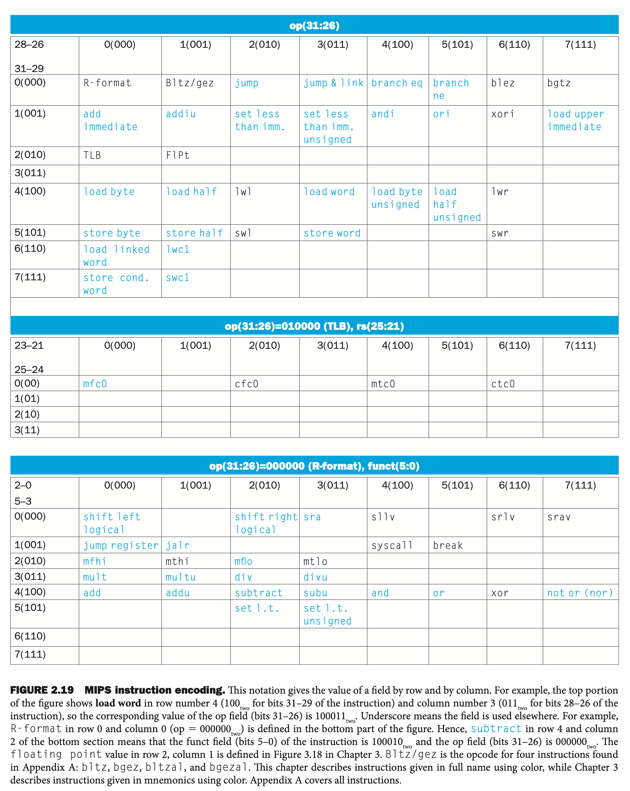

****


MIPS **convention** for registers
* \$s0, \$s1, ... for registers corresponding to variables in C
* \$t0, \$t1, ... for temporary registers


==特别注意位置！！==

==Load：reg $\Longleftarrow$ memory==：`lw $t0, 32($s3)`

==Store：reg $\Longrightarrow$ memory==：`sw $t0, 48($s3)`


基址寄存器：`lw $t0, 8($s3)	# word $s3[2]`==这个偏移量必须是常量，也不能不加(原址也得加个0)==

`word`到底是多大与指令集有关：<u>**MIPS的一个word是4字节**</u>

要用变址得求出要用的地方的地址：

```assembly
# g = h + A[i];
# g, h, i ---- $s1, $s2, $s4; base address of A ---- $s3
add $t1, $s4, $s4	# temp reg $t1 = 2 * i
add $t1, $t1, $t1	# temp reg $t1 = 4 * i
add $t1, $t1, $s3	# $t1 = address of A[i] (4 * i + $s3)
lw  $t0, 0($t1)		# temp reg $t0 = A[i]
add $s1, $s2, $t0	# g = h + A[i]
```


### Memory Alignment

不足1字补到1字

```c
struct {
    int a;
    char b;
    char c[2];
    char d[3];
    float e;
}
```

|      |        |        |        |
| ---- | ------ | ------ | ------ |
| e    | e      | e      | e      |
| d[0] | d[1]   | d[2]   | No Use |
| c[0] | c[1]   | No Use | No Use |
| b    | No Use | No Use | No Use |
| a    | a      | a      | a      |

> 为什么不弄成连续？因为这样存有可能一个变量(如e)要被分到多个word，因为总线一次只能读一个word，因此e不能被一次读出


## Stack

栈：从高地址往低地址(临时)；堆：从低地址往高地址(长用)

汇编中可以越界操作不会报错


## MIPS字段格式

**(不同类型格式不同但<u>长度相同(32bit)</u>)**

* Reg型

    |        | op   | rs   | rt   | rd   | shamt | funct |
    | ------ | ---- | ---- | ---- | ---- | ----- | ----- |
    | bits： | 6    | 5    | 5    | 5    | 5     | 6     |
    | add    | 0    |      |      |      |       | 32    |

    当只有一个源寄存器时优先使用rt？
    Ex. 

* Immediate

    | op   | rs   | rt目的 | const or address |
    | ---- | ---- | ------ | ---------------- |
    | 6    | 5    | 5      | 16               |

Ex.6

```assembly
lw  $t0, 1200($t1)
add $t0, $s2, $t0
sw  $to, 1200($t1)
```

| op         | rs   | rt   | rd    | shamt | funct  |
| ---------- | ---- | ---- | ----- | ----- | ------ |
| 35(100011) | 9    | 8    | 00000 | 10010 | 110000 |
| 0          | 18   | 8    | 8     | 0     | 32     |
| 43(101011) | 9    | 8    | 00000 | 10010 | 110000 |

注意`lw`和`sw`的op差别很小，这样便于硬件设计


## 部分汇编指令

<u><b><code>PC</code></b>寄存器指向当前行，类似于x86中的<code>IP</code></u>


```assembly
slt $t0, $s0, $s1		# SetLessThan?
						# $t0 gets 1 if $s0 < $s1 ( a < b)
						# $s0-$s1<0 ,test sign bit =1
bne $t0, $zero, Less	# go to Less if $t0 != 0(that is, if a < b)

# 为什么不直接
blt $s0, $s1, Less
```


**Switch**的汇编

```c
switch (k) {
	case0: f = i + j; break; /*k=0*/
	case1: f = g + h; break; /*k=1*/
	case2: f = g - h; break; /*k=2*/
	case3: f = i - j; break; /*k=3*/
}
```

```asm
# 要点
# Jump with register content
jr $r
# jump address table
$r ← $t4 + 4 * K
```

## 函数调用

Six steps for execution of the procedure 

1. Main program to place parameters in place where the procedure can access them
2. Transfer control to the procedure
3. Acquire the storage resources needed for the procedure (保护过程要用的寄存器)
4. Perform the desired task
5. Return result value to main program
6. Return control to the point of origin (即断点)

**Registers for procedure calling**

\$a0 ~ \$a3: four argument registers to pass parameters

\$v0 ~ \$v1: two value registers to return values

\$ra: one return address register to return to origin point

**Instruction for procedures: jal ( jump-and-link )**

`jal` ProcedureAddress

类似x86中的`call`?get

作用

1. Next instruction address (PC+4 )Save to \$ra (\$31)
2. Procedure Address move to PC(instruction address REG.)
3. return control to the caller using `Jr $ra` (\$31)

**Using more registers**

* Stack: ideal data structure for spilling registers	
* Stack Operation :Push, pop ; Stack pointer: \$sp (\$29)

# 函数调用

## 样例1：Fact

**压栈**

```assembly
addi $sp, $sp, -8	# MIPS中没有subi
sw   $ra, 4($sp)	# 这样可以防止递归调用使地址丢失
sw   $a0, 8($sp)	# 寄存器传参
```

==Caller主调函数、Callee被调函数==

约定俗成

* `$s0-$s9`：子函数保存(视作硬盘，借给别人的时候要转存)
* `$to-$t9`：子函数不保存(视作u盘，随便搞)

再注意：栈从高到低

若是Fact()函数，Fact中递归的下一个指令的位置为2000，主程序中调用Fact的下个指令位置为1000，则栈为：

|                       | SP   |      | SP-8 |      | SP-16 |      |      |
| --------------------- | ---- | ---- | ---- | ---- | ----- | ---- | ---- |
| 主程序第一次call fact | 1000 | 2    |      |      |       |      |      |
| 第一次递归fact        | 1000 | 2    | 2000 | 1    |       |      |      |
| 第二次递归fact        | 1000 | 2    | 2000 | 1    | 2000  | 0    |      |
| n<1时                 | 1000 | 2    | 2000 | 1    |       |      |      |
|                       |      |      |      |      |       |      |      |

`jr rs(默认是$ra)`：PC ← rs并jmp：调到rs的位置

另外有个指针`$fp`表示栈底，平常用不到，但是可以多个栈的时候用到；或者要丢弃某块栈


## 样例2：strcpy

```assembly

```

清零：`add $sp, $zero, $zero`


Make the common cast fast

传32位常数：32位指令只有16位给立即数

```assembly
lui  $t0, 12		# load upper immediate
addi $t0, $t0, 34	# 错的，若立即数是负的会把高位给影响了
ori  $to, $t0, 34	# 伪指令：`ulw $s0, 32bits`
```

Reserved reg for assembler: `$at`


# 跳

## j 绝对地址

一般是J型指令，但是有个`jar`是R型指令

| j     | {$location} |
| ----- | ----------- |
| 2     | 1000        |
| 6bits | 26bits      |

伪定向：为了让地址位能多几位：使用立即数的26位和(PC+4)的高4位，再x4(<<2)即可获得一个32位地址，所以除去来自PC的高4位实际上能定址的范围是256（2\^28）MB

## b 相对地址

| b    |      |      | {$offfset} |
| ---- | ---- | ---- | ---------- |
|      |      |      |            |
| 6    | 5    | 5    | 16bits     |

[(PC+4)](跳过当前行) + offset x 4

例

```assembly
	bne $, $, Exit	# 此处offset为8 Byte
	add ...
	j Loop
Exit:
```




# 寻址方式

* 立即数：自身的16位数作为操作数
* 寄存器：寄存器作为操作数
* 基址：`8($t0)`，==为了确保能访问任意一个地址所以不用左移==
* PC相对：branch：16位offset左移两位和(PC+4)**相加**
* 伪直接：jump：26位offset左移两位和PC的高四位**相连**

 

**R指令没有16位来存立即数，所以很富余，拿右边op6位+funct6位来存R指令的功能**

**寄存器**

* at
* gp：全局量堆
* ra：函数存PC
* `$v`：返回值
* `$a`：参数

## 编译

### Link

**FIGURE 2.13** The MIPS memory allocation for program and data

\$pc从`0x400 000`开始向高

\$gp堆顶寄存器(Stack for Static Data)从`0x1000 8000`到`0x1000 0000`

\$sp栈顶寄存器(Stack for Dynamic Data)从`0x7fff fffc`开始往低

Static和Dynamic没有实际的分界，compiler会视具体应用来操作

看书上(中文P127)例题

那道题offset里存的是0xFFFF8000和0XFFFF8020，然后直接溢出完事


### Load

调用动态链接库


### 宏

$at专门给宏用的

