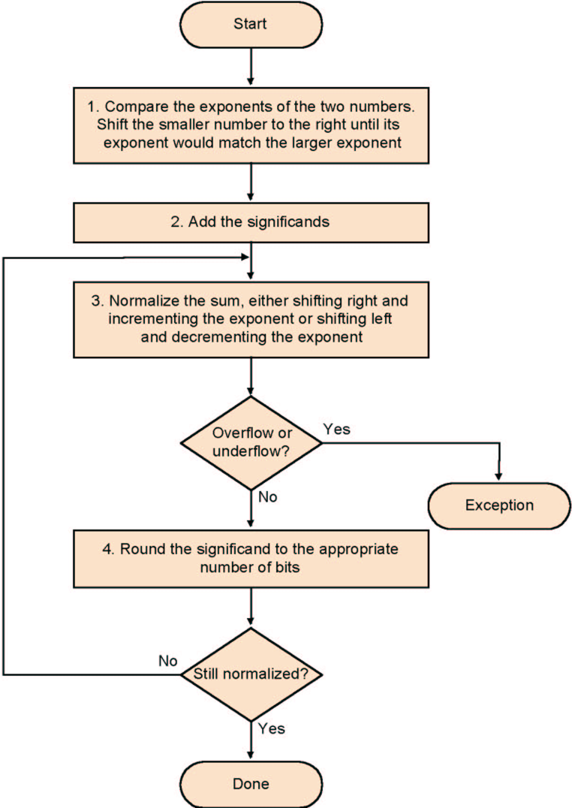

# 数

## 符号拓展

note: `addi` still sign-extends!

note: `sltu, sltiu` for unsigned comparisons

溢出可能的后果：

`-127(1000 0001)+(-2)(1111 1110) = +127(0111 1111)`

常见情况

|      |      | 结果 |
| ---- | ---- | ---- |
| A+B  | ++   | <0   |
| A+B  | --   | \>0  |
| A-B  | +-   | <0   |
| A-B  | -+   | \>0  |

**lb、lbu**： Loads a byte into the lowest 8 bits of a register，剩下24位视正负拓展

**sltu、sltiu**：

注意单源指令用的位段不一定是rs：`sll $t2, $s0, 3	#sll rd,rt,i`


## ALU

| ALU Control Lines        | Function         |
| ------------------------ | ---------------- |
| 000                      | And              |
| 001                      | Or               |
| 010                      | Add              |
| 110                      | Sub              |
| 111                      | Set on less than |
| 符号控制、逻辑代数控制、 |                  |


### ALU加速

**Carry look-ahead adder (CLA)**

C~i+1~	 =bi ci+ai ci +ai bi 

​           =ai bi +(ai +bi )ci

Generate gi = ai bi

Propagate pi = ai + bi

c1 = g0 + (p0 * c0)
c2 = g1 + p1*c1 = g1 + (p1 * g0) + (p1 * p0 * c0)
c3 = g2 + p2*c2 = g2 + (p2 * g1) + (p2 * p1 * g0) + (p2 * p1 * p0 * c0)
c4 = g3 + p3*c3 = g3 + (p3 * g2) + (p3 * p2 * g1) + (p3 * p2 * p1 * g0) + (p3 * p2 * p1 * p0 * c0)

一般不会look ahead太多位，四位挺好的：

```pseudocode
c4 =  g3  + p3*g2 	+ p3*p2*g1    + p3*p2*p1*g0     + p3*p2*p1*p0*c0
c8 =  g7  + p7*g6 	+ p7*p6*g5    + p7*p6*p5*g4     + p7*p6*5*p4*c4
c12 = g11 + p11*g10	+ p11*p10*g9  + p11*p10*p9*g8   + p11*p10*p9*p8*c8
c16 = g15 + p15*g14	+ p15*p14*g13 + p15*p14*p13*g12 + p15*p14*p13*p12*c12
```

也可以先做个四位的ALU再把他们串联

```pseudocode
G1= g7  + p7*g6   + p7*p6*g5    + p7*p6*p5*g4
G2= g11 + p11*g10 + p11*p10*g9  + p11*p10*p9*g8
G3= g15 + p15*g14 + p15*p14*g13 + p15*p14*p13*g12

P0= p3*p2*p1*p0
P1= p7*p6*p5*p4
P2= p11*p10*p9*p8 P3= p15*p14*p13*p12

C1 = c4  = G0+P0*c0
C2 = c8  = G1+P1*c4
C3 = c12 = G2+P2*c8
C4 = c16 = G3+P3*c12

C1=G0+P0*c0
C2=G1+P1*C1 = G1+P1*G0 + P1*P0*c0
C3=G2+P2*C2 = G2+P2*G1 + P2*P1*G0+ P2*P1*P0*c0
C4=G3+P3*C3 = G3+P3*G2 + P3*P2*G1+P3*P2*P1*G0 + P3*P2*P1*P0*c0
```

## 乘法

第一个操作数是被乘数(multiplicand)，第二个是乘数(multiplier)

### Ver2

不移动multiplicand，右移动product，multiplier上从低到高遍历，若为1则product+=multiplicand<<i

### Ver3

处理方式同上，但是一开始时把product的低32位用来存multiplier，每次右移product取出一个溢出位，等32次完正好product是pure的了

习题3.13

### signed乘

存住积的符号，将符号数转成非符号数进行运算

### Booth算法

PPT65

multiplier连续n位(如a\~b)为1，则在第a位执行`sub Mcand*2^{a}`，a+1\~b执行sll，b+1位执行`add Mcand*2^{b+1}`(从0开始记位)

与Ver3结合可以做成状态机(最后一位 | 上一次右溢出位)：

* 1 0 	subtract multiplicand from left half
* 1 1 	no arithmetic operation
* 0 1 	add multiplicand to left half
* 0 0 	no arithmetic operation
* ALways Shift Right(sra)

Arithmetic shift right:

* ™keeps the **leftmost bit constant**
* ™no change of sign bit !

优势：代数运算少

更慢的特殊情况：0101

一样快：0110

| iteration | step                    | Multiplicand | product           |
| --------- | ----------------------- | ------------ | ----------------- |
| 0         | Initial Values          | 0010(2)      | 0000_\|1101_0(-3) |
| 1         | 1.c: 10→Prod=Prod-Mcand | 0010         | 1110_\|1101_0     |
|           | 2: shift right Product  | 0010         | 1111_0\|110_1     |
| 2         | 1.b:01→Prod=Prod+Mcand  | 0010         | 0001_0\|110_1     |
|           | 2: shift right Product  | 0010         | 0000_10/11_0      |
| 3         | 1.c: 10→Prod=Prod-Mcand | 0010         | 1110_10/11_0      |
|           | 2: shift right Product  | 0010         | 1111_010/1_1      |
| 4         | 1.d: 11 → no operation  | 0010         | 1111_010/1_1      |
|           | 2: shift right Product  | 0010         | 1111_1010/_1      |

==**好像有符号数不能用负数当Mcand**==

13 = 0b001101, -21 = 0b101011

Use -21 as Mcand

| Iteration | Step       | Multiplicand | Product/Multiplier |
| --------- | ---------- | ------------ | ------------------ |
| 0         | Initialize | 101011       | 000000_001101_0    |
| 1         | 10: sub    | 101011       | 010101_001101_0    |
|           | sra        | 101011       | 001010_1\|00110_1  |
| 2         | 01: add    | 101011       | 110101_1\|00110_1  |
|           | sra        | 101011       | 111010_11\|0011_0  |
| 3         | 10: sub    | 101011       | 001111_11\|0011_0  |
|           | sra        | 101011       | 000111_111\|001_1  |
| 4         | 11: keep   | 101011       | 000111_111\|001_1  |
|           | sra        | 101011       | 000011_1111\|00_1  |
| 5         | 01: add    | 101011       | 101100_1111\|00_1  |
|           | sra        | 101011       | 110110_01111\|0_0  |
| 6         | 00: keep   | 101011       | 110110_01111\|0_0  |
|           | sra        | 101011       | 111011_001111\|_0  |

Use 13 as Mcand

| Iteration | Step       | Multiplicand | Product/Multiplier |
| --------- | ---------- | ------------ | ------------------ |
| 0         | Initialize | 001101       | 000000_101011_0    |
| 1         | 10: sub    | 001101       | 110011_101011_0    |
|           | sra        | 001101       | 111001_1/10101_1   |
| 2         | 11: keep   | 001101       | 111001_1/10101_1   |
|           | sra        | 001101       | 111100_11/1010_1   |
| 3         | 01: add    | 001101       | 001001_11/1010_1   |
|           | sra        | 001101       | 000100_111/101_0   |
| 4         | 10: sub    | 001101       | 110111_111/101_0   |
|           | sra        | 001101       | 111011_1111/10_1   |
| 5         | 01: add    | 001101       | 001000_1111/10_1   |
|           | sra        | 001101       | 000100_01111/1_0   |
| 6         | 10: sub    | 001101       | 110111_01111/1_0   |
|           | sra        | 001101       | 111011_101111/_1   |

上一种方法第五位差了个1。。。

## 除法

64被除数存到64余数里

### Ver1

32商左移，64余数不动，64除数(32位除数存在高32位)右移，64位ALU

做减法，余数-除数比大小，若大于0则ok，商该位置1；小于0则rollback(余数+除数)

### Ver2

32商左移，64余数左移，32除数不动，32位ALU

做减法，余数高32-除数比大小，若大于0则ok，商该位置1；小于0则rollback(余数高32+除数)

### Ver3

省掉商寄存器

64余数左右移，32除数不动，32位ALU

做减法，余数高32-除数比大小，若大于0则将左移，低位平行置位1；小于0则rollback并左移，低位平行置位0

商在余数的低32位


## 浮点数

Standardized format IEEE 754

* Single precision 8 bit exp, 23 bit significand
* Double precision 11 bit exp, 52 bit significand

exp和significand两个是符号数，但不是补码，是偏码

Bias127(127偏码)：0表示-127，127表示0，254表示+127，255是特殊位

32位计算偏码是 `-0x80000000`

$\Large \rm (-1)^{sign}\times(1+significand)\times 2 ^{exp - bias}$

1+significand(=fraction，尾数)是二进制，即整个浮点数实际上是<u>用**二进制**的科学计数法表示的小数</u>

**特殊的**：NaN，+\infin, -\infin, 0

exp和significand都为0：0(那1怎么办？1是2^0^，指数是01111111(偏码))

exp全为1，significand全为0：$\pm\infin$

exp全为1，significand不为0：其他(Not a Number)


例如-0.75为$\large\rm (-1)^1 \times (1 + 0.1000\ 0000\ 0000\ 0000\ 0000\ 000)\times 2^{(126 - 127)}$，所以exp为126，指数为0x4000000

```cpp
#include <cmath>
#include <iomanip>
#include <iostream>

std::string F2B(void *pa) {
    std::string out = "";
    int tmp         = *(int *)pa;
    int a           = tmp;
    for (int i = 0; i < 32; i++) {
        if (a & 0x80000000)
            out += "1";
        else
            out += "0";
        if (i == 0 || i == 8)
            out += " ";
        a = a << 1;
    }
    return out;
}

void printLine(float a) {
    std::cout << std::setw(12) << a << ": " << F2B(&a) << "\n";
}

int main(int argc, char const *argv[]) {
    printLine(0);
    printLine(pow(2, -0b01111111));
    printLine(1);
    printLine(pow(0xFFFFFFFFFFFFF, 20));
    printLine(pow(-0xFFFFFFFFFFFFF, 21));
    printLine(1.0 / 0.0);
    printLine(0.0 / 0.0);
    printLine(nanf(0));
    return 0;
}

/* Output */
           0: 0 00000000 00000000000000000000000
 5.87747e-39: 0 00000000 10000000000000000000000
           1: 0 01111111 00000000000000000000000
         inf: 0 11111111 00000000000000000000000
        -inf: 1 11111111 00000000000000000000000
         inf: 0 11111111 00000000000000000000000
         nan: 0 11111111 10000000000000000000000
         nan: 0 11111111 10000000000000000000000
```


**单精度**

| 31符号位 | 30    ……     23 exp | 22        ……          0      |
| -------- | ------------------- | ---------------------------- |
| 1        | 0111 1110           | 110 0000 0000 0000 0000 0000 |
| 1 bit    | 8 bits              | 23 bits                      |

**双精度**

| 31符号位 | 30     ……    20 exp | 19      ……           0   | 31 ... ... 0 Also fraction |
| -------- | ------------------- | ------------------------ | -------------------------- |
| 1        | 011 1111 1110       | 1100 0000 0000 0000 0000 |                            |
| 1bit     | 11 bits             | 20 bits                  | 32 bits                    |

### 浮点加法

假设只能存储4个十进制有效数和2个十进制指数



y=0.5+(-0.4375) in binary

```perl
0.5     =  1.0002×2^-1  
-0.4375 = -1.1102×2^-2  
Step1:The fraction with less exponent is shifted right until matching
-1.110×2-2  → -0.111×2-1 
Step2:  Add the significands
       1.000×2-1 
  +) - 0.111×2-1
  -------------------
       0.001×2-1
Step3:  Normalize the sum and check for overflow or underflow
      0.001×2-1 → 0.010×2-2 → 0.100×2-3 → 1.000×2-4 
Step4: Round the sum
	 1.0002×2-4   = 0.062510
```

存在加法器不够大的可能，因为是以大的数字进行align的

存在浮点数吞吃：如10^6^+1，1极有可能被吞掉；还有$\displaystyle\sum_{i=1}^{100,000} \frac1x$会溢出，$\displaystyle\sum_{i=100,000}^{1} \frac1x$就不会

### 浮点乘法

指数直接相加即可，注意若是偏码表示的指数，需在结果上减去一个偏阶(如127、0x1FFFFFFF)

有效数也直接相乘，小数点仍在第一位后面(两个)

### 浮点除法

### Rounding


### Keyword

**Sign Magnitude**：符号表示法，如第一位放0/1，后面保留原码(-24 = 1001 1000)

**Biased Notation**：偏码表示法：如Bias127中0就是-127


浮点加法不符合结合律

(A+B)+C != A+(B+C)

T1 = A+B, T2 = T1 + C 不能保证 T2 == A + B + C


**3.13**

额外多保留两位guard和round

guard保护位：多保留的第一位，用于提高舍入精度

round舍入位：多保留的第二位，使中间结果满足浮点格式？(例如乘法结果有可能第一位为0(前导0)，这样就必须将结果左移一位，此时的guard就是移位前的round)

sticky：只要舍入位右边还有1，stk就为1，这样才能发现0.5和0.50000001之间的区别

```perl
3.13.1 (A+B)+C=
(A)  -1.1111111010*213+1.1111111010*213+1.0*20=1
    
(B)    (A+B)+C=
    1.1100101010*2^4+1.1010|100010*2^-2 + 1.1000010010*2^3
     
    1.1100101010+ 
    0.0000011010|101 (多的三位寄存器保存对齐过程的数据 Guard=1,round=0, Sticky = 1) 
 = 1.1101000100
     (No round)
 
 3.13.2  A+(B+C)= A+1.1111111010*213+1.0*20
      (B+C)= 
      1.111111010+ 
      0.0000000000 (Guard=0, Round=0, Sticky=1) 
    =1.1111111010
        (No round)

3.13.2.b  A+(B+C)= 1.0100100110 11
      1.1000010010+
      0.0000110101 000 (Guard=0,round=0, Sticky = 0)
    =1.1001000111   NO ROUND
  A:   1.1100101010 
C+B:0.1100100011 10 (Guard=1,round=0, Sticky = 0)
         10.1001001101 10   NORMALISE
           1.0100100110 110 (Guard=1,round=1, Sticky = 0)
             1.0100100111        ROUND UP

```

