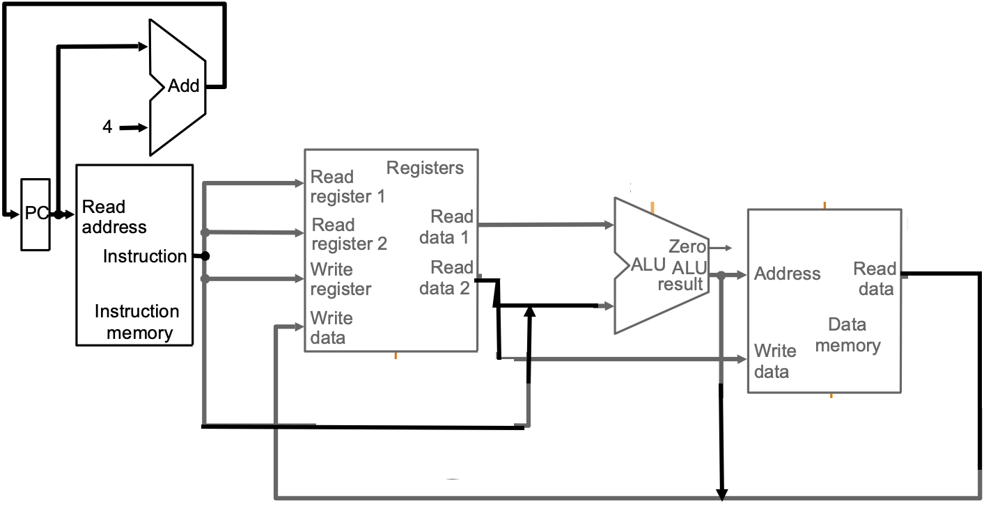
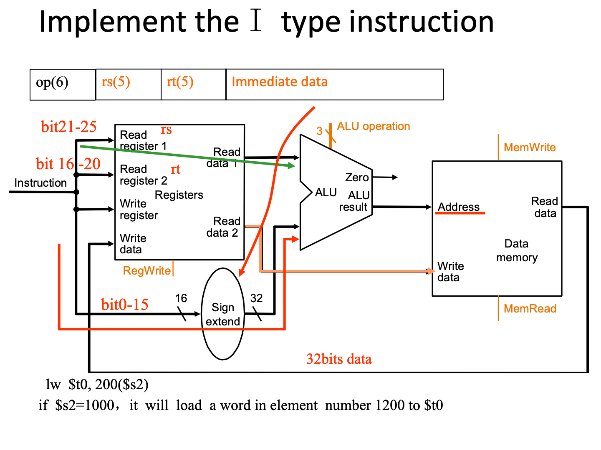
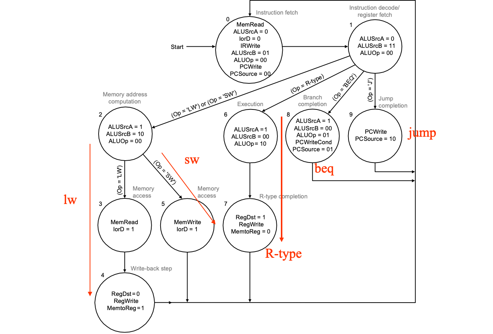

# CPU

aSimpleCPU.png



单周期：一个周期一个指令，(如8点杭州12点北京，中间怎么走无所谓，一条铁路线都是你的)

多周期：一个周期完成指令的一部分，哪一部分在哪完成都是限定死的(如8点杭州12点北京，9点之前得到济南，因为同一条线上济南9点有车要往杭州开)

| Name      | Register number | Usage                                        | Preserved on call? |
| --------- | --------------- | -------------------------------------------- | ------------------ |
| \$zero    | 0               | The constant value 0                         | n.a.               |
| \$at      | 1               | For assembler                                |                    |
| \$v0–\$v1 | 2–3             | Values for results and expression evaluation | no                 |
| \$a0–\$a3 | 4–7             | Arguments                                    | no                 |
| \$t0–\$t7 | 8–15            | Temporaries                                  | no                 |
| \$s0–\$s7 | 16–23           | Saved                                        | yes                |
| \$t8–\$t9 | 24–25           | More temporaries                             | no                 |
| \$k0-\$k1 | 26-27           | For OS                                       |                    |
| \$gp      | 28              | Global pointer                               | yes                |
| \$sp      | 29              | Stack pointer                                | yes                |
| \$fp      | 30              | Frame pointer                                | yes                |
| \$ra      | 31              | Return address                               | yes                |

R型指令三个寄存器的顺序是`add rd, rt, rs`，跟源、目标没关系

| Name     | Format |       |       |       | Example |         |       | Comment                            |
| -------- | ------ | ----- | ----- | ----- | ------- | ------- | ----- | ---------------------------------- |
|          |        | 6bits | 5bits | 5bits | 5bits   | 5bits   | 6bits |                                    |
| R        | R      | op    | rs    | rt    | rd      | shamt   | funct |                                    |
| i-format | I      | op    | rs    | rt    |         | address |       |                                    |
| -        | -      | -     | -     | -     | -       | -       | -     | -                                  |
| add      | R      | 0     | 18    | 19    | 17      | 0       | 32    | `add s1, s2, $s3`                  |
| sub      | R      | 0     | 18    | 19    | 17      | 0       | 34    | `sub s1, s2, $s3`                  |
| and      | R      | 0     | 18    | 19    | 17      | 0       | 36    | `and s1, s2, $s3`                  |
| or       | R      | 0     | 18    | 19    | 17      | 0       | 37    | `or s1, s2, $s3`                   |
| nor      | R      | 0     | 18    | 19    | 17      | 0       | 39    | `nor s1, s2, $s3`                  |
| slt      | R      | 0     | 18    | 19    | 17      | 0       | 42    | `slt s1, s2,$s3`                   |
| jr       | R      | 0     | 31    | 0     | 0       | 0       | 8     | `jr $ra`                           |
| lw       | I      | 35    | 18    | 17    |         | 100     |       | `lw s1, 100(s2)`                   |
| sw       | I      | 43    | 18    | 17    |         | 100     |       | `sw s1, 100(s2)`                   |
| addi     | I      | 12    | 18    | 17    |         | 100     |       | `addi s1, s2,100`                  |
| ori      | I      | 13    | 18    | 17    |         | 100     |       | `ori s1, s2,100`                   |
| beq      | I      | 4     | 17    | 18    |         | 25      |       | `beq s1, s2,100`                   |
| bne      | I      | 5     | 17    | 18    |         | 25      |       | `bne s1, s2,100`                   |
| j        | J      | 2     |       |       | 2500    |         |       | `j 10000`<br />(see section 2.9)   |
| jal      | J      | 3     |       |       | 2500    |         |       | `jal 10000`<br />(see section 2.9) |

注意R型的op都是0，区别在func

注意branch的shamt和lw的shamt的不同

## 指令的执行

* Fetch :
    Take instructions from the instruction memory 
    Modify PC to point the next instruction
* Instruction decoding & Read Operand: 
    Will be translated into machine control command 
    Reading Register Operands, whether or not to use 
* Executive Control:
    Control the implementation of the corresponding ALU operation 
* Memory access:
    Write or Read data from memory 
    Only LW/SW
* Write results to register:
    If it is R-type instructions, ALU results are written to Rd
    If it is I-type instructions, Results are written to Rt

### Instructuon Fetching

<u>单周期的部件一个周期只能用一个(因为单周期的是组合电路)</u>

ALU操作表，观察会发现对应指令的func后两位确实与下面的op一样

| B  negate | op   | function |
| --------- | ---- | -------- |
| 0         | 00   | and      |
| 0         | 01   | Or       |
| 0         | 10   | Add      |
| 1         | 10   | Sub      |
| 1         | 11   | Slt      |


---



---


---


## 单周期指令

<u>单周期的部件一个周期只能用一个(因为单周期的是组合电路)</u>


---


---


---


---


---


---

### Signals for datapath

| Signal name | Effect when deasserted(=0)                                   | Effect when asserted(=1)                                     |
| ----------- | ------------------------------------------------------------ | ------------------------------------------------------------ |
| RegDst      | Select  register destination number from the rt(20:16) when WR | Select  register destination number from the rd(15:11) when WB |
| RegWrite    | None                                                         | Register  destination input is written with the value on the Write data input |
| ALUSrc      | The  second ALU operand comes from the second register file output (Read data 2) | The  second ALU operand is the sign-extended lower 16 bits of the instruction. |
| PCSrc       | The  PC is replaced by the output of the addr that computes the value PC+4 | The  PC is replaced by the output of the addr that computes the branch target. |
| MemRead     | None                                                         | Data  memory contents designated by the address input are put on the Read data output. |
| MemWrite    | None                                                         | Data  memory contents designated by the address input are replaced by value on the  Write data input. |
| MemtoReg    | The  value fed to register Write data input comes from the Alu | The  value fed to the register Write data input comes from the data memory. |

| 信号        | 源数目  | 功能定义            | 赋值0时动作     | 赋值1时动作                  |
| ----------- | ------- | ------------------- | --------------- | ---------------------------- |
| ALUSrc_B    | 2       | ALU端口B输入选择    | 选择寄存器B数据 | 选择32位立即数（符号扩展后） |
| RegDst      | 2       | 寄存器写地址选择    | 选择指令rt域    | 选择指令rs域                 |
| MemtoReg    | 2       | 寄存器写入数据选择  | 选择存储器数据  | 选择ALU输出                  |
| Branch      | 2       | Beq指令目标地址选择 | 选择PC+4地址    | 选择转移地址（Zero=1）       |
| Jump        | 2       | J指令目标地址选择   | 选择J目标地址   | 由Branch决定输出             |
| RegWrite    | -       | 寄存器写控制        | 禁止寄存器写    | 使能寄存器写                 |
| MemWrite    | -       | 存储器写控制        | 禁止存储器写    | 使能存储器写                 |
| MemRead     | -       | 存储器读控制        | 禁止存储器读    | 使能存储器读                 |
| ALU_Control | 000-111 | 3位ALU操作控制      | 参考表  Lab4    | Lab4                         |


### ALUop

* 00：加法(sw lw)
* 01：减法(beq
* 10：由funct决定


### ALU Decoder

| Instruction opcode | ALUOp | Instruction  operation | Funct field | Desired  ALU action | ALU control   Input |
| ------------------ | ----- | ---------------------- | ----------- | ------------------- | ------------------- |
| LW                 | 00    | Load  word             | xxxxxx      | Load  word          | 0010                |
| SW                 | 00    | Store  word            | xxxxxx      | Store  word         | 0010                |
| Beq                | 01    | branch  equal          | xxxxxx      | branch  equal       | 0110                |
| R-type             | 10    | add                    | 100000      | add                 | 0010                |
| R-type             | 10    | subtract               | 100010      | subtract            | 0110                |
| R-type             | 10    | AND                    | 100100      | AND                 | 0000                |
| R-type             | 10    | OR                     | 100101      | OR                  | 0001                |
| R-type             | 10    | Set  on less than      | 101010      | Set  on less than   | 0111                |

| ALU Control Lines | Function         | note |
| ----------------- | ---------------- | ---- |
| 000               | And              | 兼容 |
| 001               | Or               | 兼容 |
| 010               | Add              | 兼容 |
| 110               | Sub              | 兼容 |
| 111               | Set on less than |      |
| 100               | nor              | 扩展 |
| 101               | srl              | 扩展 |
| 011               | xor              | 扩展 |

### K-Map Implementation

简化后的真值表：


### Main Decoder


关注Control模块的输出

**完整版(加上jump)**


### 时间


| Instruction  class | Instruction  memory | Reg read | ALU  | Data  memory | Reg write | Total |
| ------------------ | ------------------- | -------- | ---- | ------------ | --------- | ----- |
| R-format           | 2                   | 1        | 2    |              | 1         | 6  ns |
| Load  word         | 2                   | 1        | 2    | 2            | 1         | 8  ns |
| Store  word        | 2                   | 1        | 2    | 2            |           | 7  ns |
| Branch             | 2                   | 1        | 2    |              |           | 5  ns |
| Jump               | 2                   |          |      |              |           | 2  ns |


### 单周期的问题

**占用资源**：==寄存器单周期只能一次IO操作，但是可以上升沿读下降沿写；如果一定要两次读或者两次写，则必须用两个寄存器==

**占用时间**：而且多周期实际上更节省时间，因为单周期必须以耗时最长的指令为准；而单周期不同指令可以跑不同周期，更为灵活。

## **多周期**

还是高铁的例子，在xx站和xx站之间只有我一辆车，不要求在出发站和终点站之间只有一辆，但是必须准时到中间的站。

We will be reusing functional units

* ALU used to compute address and to increment PC
* Memory used for instruction and data

We will use a **finite state machine** for control

同样的op在不同的周期的Control输出不同，因此比单周期更为麻烦

分周期得确保：

* 每个周期的长度还是得一样，因此要确保每个周期任务差不多
* 大部件每个周期只能用一个(Memory、ALU、Regs)

每个周期结束的操作：

* 存值给下一个周期使用
* 引入额外的寄存器

**Five Steps**：

* IF：Instruction Fetch(Memory比较慢所以不能再加任务了不然做不完)
    * IM和DM共用一个内存了
* ID：Instruction Decode and Register Fetch
* EX(BC)：Execution, Memory Address Computation, or Branch Completion
* MEM(WB)：Memory Access or R-type instruction completion
* WB：Write-back step

PC 的改变方式

* seq：pc = pc + 4
* beq：pc = pc + offset * 4
* j：pc = pc~31-28~ + IR~25-0~ << 2

### 额外的硬件设计


### ==控制线==

| Signal name | Effect when deasserted(=0)                                   | Effect when asserted(=1)                                     |
| ----------- | ------------------------------------------------------------ | ------------------------------------------------------------ |
| RegDst      | Select  register destination number from the rt(20:16) when WR. | Select  register destination number from the rd(15:11) when WB. |
| RegWrite    | None                                                         | Register  destination input is written with the value on the Write data input |
| ALUScrA     | PC                                                           | A register.                                                  |
| MemRead     | None                                                         | Memory  contents at the location specified by the address input is put on the Memory  data out. |
| MemWrite    | None                                                         | Memory  contents at the location specified by  the address input are replaced by value on the Write data input. |
| MemtoReg    | ALUOut                                                       | MDA                                                          |
| IorD        | The  PC is used to supply the <u>address</u> to the memory unit. | ALUOut  is used to supply the <u>address</u> to the memory unit. |
| IRWrite     | None                                                         | The  output of memory is written into the [IR](Instruction Register). |
| PCWrite     | None                                                         | The  PC is written; the source is controlled by PCSource.    |
| PCWriteCond | None                                                         | The  PC is written if the zero output from the ALU is also active. (For branch) |

| Signal name | Value | Effect                                                       |
| ----------- | ----- | ------------------------------------------------------------ |
| ALUOp       | 00    | The  ALU performs an add operation.                          |
|             | 01    | subtraction                                                  |
|             | 10    | The  funct field of the instruction determines the ALUoperation |
| ALUScrB     | 00    | B register.                                                  |
|             | 01    | constant 4                                                   |
|             | 10    | Immeidate' sign extend                                       |
|             | 11    | (Immeidate' sign extend) << 2                                |
| PCSource    | 00    | <u>Output  of the ALU(PC+4) is sent to the PC for writing.</u> |
|             | 01    | <u>The  contents of ALUOut (the branch target address) are sent to the PC for  writing.</u><br />与上面的区别在于有没有经过寄存器(有的话是上一个周期的ALUOut |
|             | 10    | The  jump target address (IR[25:0]shifted left 2 bits and concatenated with  PC+4[31:28]) is sent to the PC for writing. |

### 具体Steps

#### Step1

**IF**

```c
IR = Memory[PC];
PC = PC + 4;
```

#### \*\*Step2

**ID：Instruction Decode and Register Fetch**

`ALUSrcA = 1'b0; ALUSrcB = 2'b11; ALUOp = 2'b00`

```c
A = Reg[IR[25-21]];
B = Reg[IR[20-16]];
ALUOut = PC + (sign-extend(IR[15-0]) << 2);	// 这里先做好，之后不是branch再改
```

#### Step3

**EX(BC)：Execution, Memory Address Computation, or Branch Completion**

```c
//Memory Reference ( lw / sw ):
ALUOut = A + sign-extend(IR[15-0]);
//R-type:
ALUOut = A op B;
//Branch:beq
if (A==B)
    PC = ALUOut	// 此时结束
//Jump:
pc = pc[31-28] + IR[25-0] << 2	// 此时结束
```

#### Step4

**MEM(WB)：Memory Access or R-type instruction completion**

```c
//Loads and stores access memory
    MDR = Memory[ALUOut];	// for lw
//or
    Memory[ALUOut] = B;		// for sw
//R-type instructions finish
    Reg[rd] = Reg[ IR[15-11] ] = ALUOut;
```

#### Step5

**WB：Write-back step**

```c
// lw
Reg[rt]=Reg[IR[20-16]]= MDR;
```

**总结**


ALU控制真值表还是这个：


### 有限状态机


状态图



状态对应的控制线


控制线对应的状态


## 微程序&微指令

一个机器指令：一个微程序：多个微指令

微指令构造：

| 操作控制字段     | 顺序控制字段                                                 |
| ---------------- | ------------------------------------------------------------ |
| 存储操作控制字段 | 判别字段：都为0时跳转到下址，否则从微程序入口取新的微指令<br />下址字段：下一条微指令的地址 |


下图：相当于左边是主函数，右边是两个子函数


两个Dispatch


## Exception

只考虑ALU的overflow，因此只看最高位就行了，具体的我在实验四里写过了

加：`overflow = A[31] & ~res[31] | A[31] & B [31] | B[31] & ~res[31];`

减：`overflow = ~A[31] & res[31] | ~A[31] & B [31] | B[31] & res[31];`


发生exception会跳转到向量表指定的位置

| Exception type        | Vector address |
| --------------------- | -------------- |
| undefined instruction | C0 00 00 00~H~ |
| overflow              | C0 00 00 20~H~ |

EPC寄存器存放异常的位置(PC)

Cause寄存器

* 0：undefined instruction
* 1：overflow


* add control signal
    * **CauseWrite** for CauseReg
    * **EPCWrite** for EPC
        * EPC = <u>PC - 4</u>  (completed by ALU)，其实不做也可以，自己知道然后看上一句就好了
* process of control 
    * CauseReg = 0 or 1
    * EPC = PC - 4
    * PC <--- address of process routine ( ex. c0000000 )


----

# 期中练习

```
addi $r, $zero, BIG

xor $r1, $r1, $r1
beq $r2, $r3, Exit
addi $r1, $zero, 1
Exit:

1) {(PC+4)[31:28], imme << 2}
2) $reg
3) (PC+4) + disp << 2
4) B
5) B + disp << 2
6) i * s + disp << 2
7) B + i * s + disp << 2
8) B + i * s + disp << 2


18, 32
取reg<<2为偏移地址，18位地址<<2为基地址
C

不可以，一个周期两个mem都需要被IO，合并后只能IO一个
2*1.3 + 3*2 + 1.5 + 4.6 + 1.7 = 16.4
```

**Booth算法**


**计算浮点数的那个**

先后与s3 s4与可以得到指数位，把原数字减掉指数位然后右移

**设计addm**