[TOC]

# Intro

**Three characteristics**

* Behavior
    * Input (read once), output (write only, cannot read) ,or storage (can be reread and usually rewritten)
* Partner 对象
    * Either a human or a machine is at the other end of the I/O device, either feeding data on input or reading data on output.
        * 比如说键盘人也不可能摁太快，所以bus不需要太快，但是CPU就不一样了
* Data rate
    * The **peak** rate at which data can be transferred between the I/O device and the main memory or processor.
        * 峰值/平均值


**Throughput**

**Measure of IO bandwidth**

1. How much data can we move through the system in a certain time?
    For example, in many supercomputer applications, most I/O requires are for long streams of data, and transfer bandwidth is an important characteristic.
2. How many I/O operations can we do per unit of time? 
    For example, National Income Tax Service mainly processes <u>large number of small files</u>.
    * Response time (e.g., workstation and PC)
    * Both throughput and response time (e.g., ATM, FileServer, WebServer)

# Disk

* floppy disks
* hard disks
    * larger
    * higher density
    * higher data rate
    * more than one platter


**The organization of hard disk**

* platters(盘片): disk consists of a collection  of platters, each of which has two recordable disk surfaces
    * tracks(磁道): each disk surface is divided into concentric circles
        * sectors(扇区): each track is in turn divided into sectors, which is the smallest unit that can be read or written
* cylinder(柱面)：在所有盘片的某一给定位置下，所有读写头下面的轨道所形成的的柱面


<u>**Disk Read Time**</u>

* Seek time：把磁头定位到正确的磁道
    * 一般使用avg，且实际avg会是厂商手册的25%\~33%
    * C盘在磁头开始移动的位置，字母越大越远
* Rotational latency：寻道后，等待扇区转过来的时间
    * 使用avg，即<u>转半圈所需时间</u>
* Transfer time：传输一块(一般是一个sector，新磁盘是多个sectors)所需的时间
* Controller time：磁盘内部的IO控制器消耗的时间

Ex.

==Access Time = Seek time + Rotational Latency + Transfer time + Controller Time==

\\                       = 6ms + 0.5*60,000(ms/min)/10,000(RPM) +0.5KB/(50MB/sec) + 0.2ms = 9.2ms

## D, R, A

**Dependability Reliability Availability** 可依赖性，可靠性，可用性

> Def: Computer system **dependability** is the quality of delivered service such that reliance can justifiably be placed on this service. The service delivered by a system is its observed actual behavior as perceived by other system(s) interacting with this system’s users. Each module also has an ideal specified behavior, where a service specification is an agreed  description of the expected behavior. A system failure occurs when the actual behavior deviates from the specified behavior.


**Measure of Availability**

* MTTF(Mean Time To Failure)：磁盘平均故障时间
* MTTR(Mean Time To Repair)：服务中断修理时间
* MTBF(Mean Time Between Failures) = MTTF+ MTTR
* 可用性Availability=MTTF/(MTTF+MTTR)

**Three way to improve MTTF**

* Fault avoidance:
    preventing fault occurrence by construction(构建技术)
* Fault tolerance:
    using redundancy(冗余技术) to allow the service to comply with the service specification despite faults occurring, which applies primarily to <u>hardware faults</u>
* Fault forecasting:
    predicting the presence and creation of faults, which applies to hardware and software faults


## RAID

Redundant Arrays of Inexpensive Disks(Take *4 data disks* for example)

|       |                                              | 备注                                                         | CheckDisk                  | FailSurv？？ | Use    |
| ----- | -------------------------------------------- | ------------------------------------------------------------ | -------------------------- | ------------ | ------ |
| 0     | Non-redundant striped(条带化)                | 把数据分散到多个磁盘(条带化)                                 | 0                          | 0            | Widely |
| 1     | Mirroring                                    | 镜像拷贝                                                     | 4                          | 1            |        |
| ~~2~~ | ~~Memory-style ECC~~                         | 弃用                                                         | 3                          | 1            |        |
| 3     | Bit-interleaved(交叉) parity                 | 每次都要读所有盘                                             | 1                          | 1            |        |
| 4     | Block-interleaved parity                     | 小数据量读不必访问所有盘？？？，但是每次写都要更新校验盘(减速) | 1                          | 1            |        |
| 5     | Block-interleaved distributed(分布式) parity | 将校验信息分布到所有盘                                       | 1 (那为什么还要校验盘？？) | 1            | Widely |
| 6     | P+Q redundancy                               | 每个校验盘对数据盘和另外一个校验盘进行奇偶校验               | 2                          | 2            |        |

\*parity：奇偶校验


**RAID**

* 主要目的：用多个小磁盘替代掉一个大磁盘

* 弊端
    * Array Reliability of N disks = Reliability of 1 disk / N，例如72个6年的组在一起变成1个月，因此需要经常更换
* 特点
    * 文件条带化：
    * Availability很高：因为有冗余，即使某个部件坏掉了都能继续用
    * 容易坏：如上
    * 数据可以从阵列中冗余的部分恢复
        * Capacity penalty to store
        * Bandwidth penalty to update

### Level

[Standard RAID levels - Wikipedia](https://en.wikipedia.org/wiki/Standard_RAID_levels)

* **RAID0**
    * 只是把数据分散到多个磁盘(条带化)，没有redundancy
* **RAID1**
    * 完全拷贝
    * 最昂贵
    * 01和10的区别
* **RADI3**
    * 按字节进行条带化？
        * 无论多大规模的IO都需要所有盘
    * 对所有盘，按位进行奇偶校验存在checkDisk
        * 如果一个数据盘出错了，subtract P from sum of other disks to find missing information
    * 对RAID4的Inspiration
        * RAID 3 relies on parity disk to discover errors on Read
        * Every sector has an error detection field
        * Relies on error detection field to catch errors on read, not on the parity disk
        * Allows independent reads to different disks simultaneously
* **RAID4**
    * 按块进行条带化
    * 允许并行发生多个数据读取
    * 小数据量读不必访问所有盘
    * 小数据量写也不必访问所有盘
        * 只需要在目标数据盘上写，并利用旧的Check盘更新奇偶校验(`check' = (data xor data') xor check`)
    * 但是写操作不能并发进行：Writes to DataDisk also write to P disk
* **RAID5**
    * 支持了写操作的并发进行
        * 每个block的奇偶校验放在不同盘上了
        * 所以是否相当于每个盘都是数据盘？
* **RAID6**
    * 两个校验盘：每个校验盘对数据盘和另外一个校验盘进行奇偶校验

#### 图示

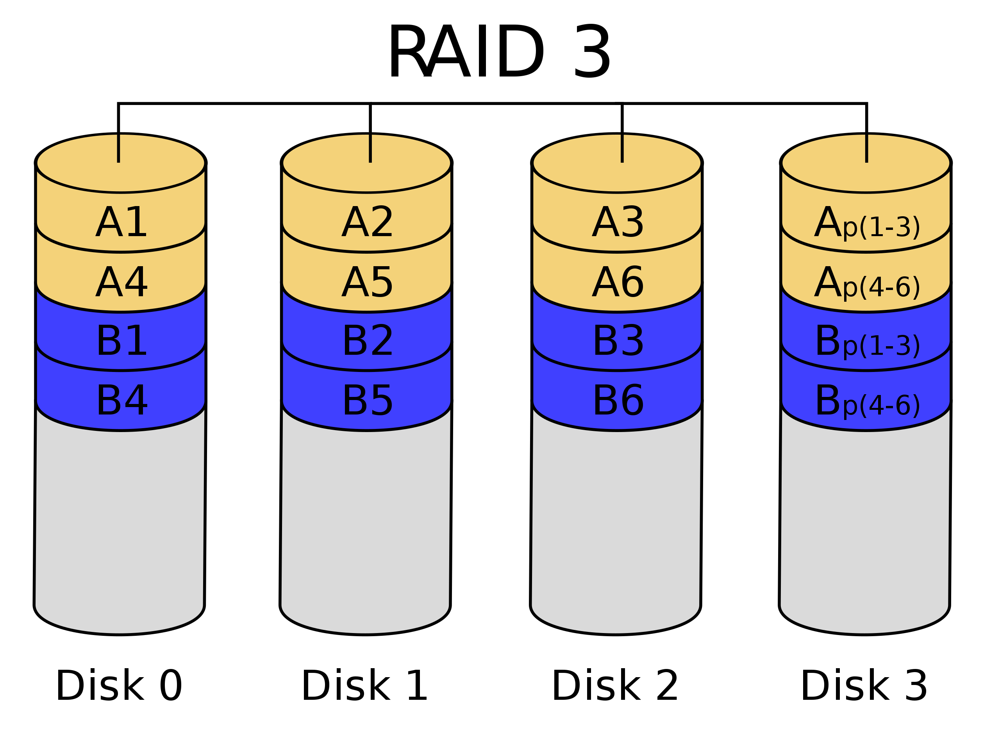

*注：一个颜色一个block，一个小块一个byte*

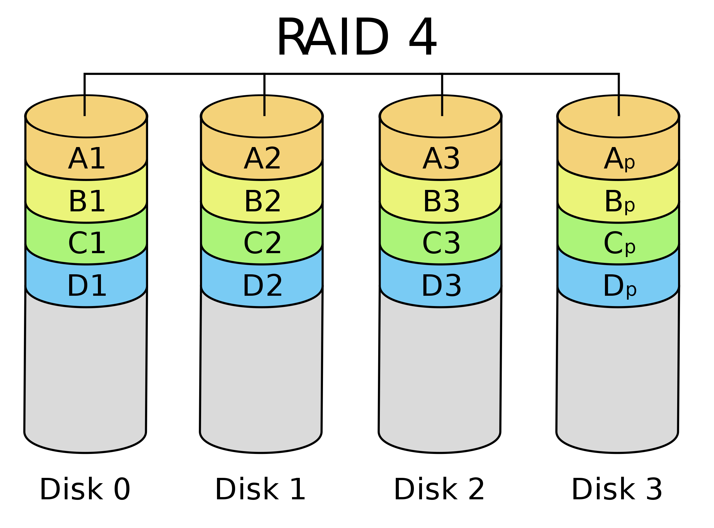


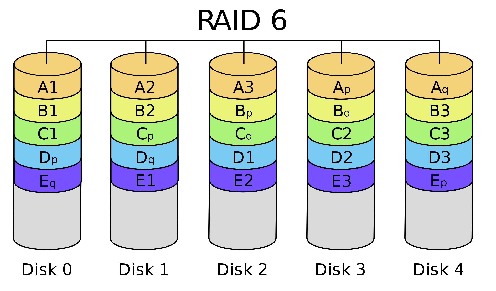

### Tech

* Disk Mirroring, Shadowing (RAID 1)
    * Logical write = two physical writes
* Parity Data Bandwidth Array (RAID 3)
* High I/O Rate Parity Array (RAID 5)
    * Logical write = 2 reads>？？ + 2 writes

Hot swapping：在系统运行时替换某个部件

# Network

Key characteristics of typical networks include the following

* Distance: 0.01 to 10,000 kilometers
* Speed: 0.001MB/sec to 100MB/sec
* Topology: Bus, ring, star, tree
* Shared lines: None (point-to-point) or shared (multidrop)

Type

* Local area network (LAN)
    * e.g., Ethernet
* Packet-switched network ,which are common in long-haul networks 
    * e.g., ARPANET
* TCP/IP is the key to interconnecting different networks
* The bandwidths of networks are probably growing faster than the bandwidth of any other type of device at present.

# Bus, Conc

不能全是专线，否则代价太高了

**Difficulty**

* may be bottleneck
    * 数据多会阻塞
* length of the bus
    * 长度决定了频率
* number of devices
* trade-offs (fast bus accesses and high bandwidth，二者不可兼得，就像公交车人多会使上下车慢)
* support for many different devices
* cost


**Bus transaction 总线事务**

* Def：一系列的总线操作，包括一个请求，也可能包括一个相应，二者均可能携带数据。一个事务由一个请求发起，可能包括多个独立的总线操作
* include two parts
    1. sending the address
    2. receiving or sending the data
* two operations
    * **input**: inputting data <u>from the device to memory</u>
    * **output**: outputting data <u>to a device from memory</u>

## Type

**传输内容**

* **Control lines**, which are used to signal requests and acknowledgments, and to indicate what types of information is on the data lines.
* **Data lines**, which carry information (e.g., **data**(注意地址不是控制总线的), addresses, and complex commands) between the source and the destination.

**连接位置**

* processor-memory 处理器-内存总线
    * (short high speed, custom design)
* [backplane](https://en.wikipedia.org/wiki/Backplane) 背板总线
    * 使处理器，内存，IO设备能接在单根总线上，就像人的backbone
    * (high speed, often standardized, e.g., **PCI**)
* I/O
    * (lengthy, different devices, standardized, e.g., **SCSI**)
    * 通过pm/bp总线连接到内存上而不直接相连

Ex.

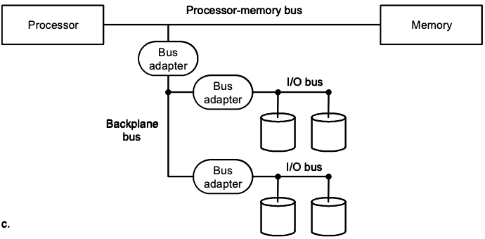

==**标准**==

考试会考

* SCSI (small computer system interface)：外设
* PCI (peripheral component interconnect)：背板
* IPI (intelligent peripheral interface)
* IBMPC-AT, IBMPC-XT
* ISA, EISA：外设？
* IDE：外设

### Syn&Asyn

**<u>Synchronous</u>** bus use a clock and a synchronous protocol, fast and small but every device must operate at same rate and clock skew(时钟偏差) requires the bus to be short

* **Output**

    1. Initial a read from memory. Control lines signal a read request(谁的request？CPU还是设备？CPU吧，这里设备应该不能直接和内存通讯)  to memory, while the data lines contain the address

        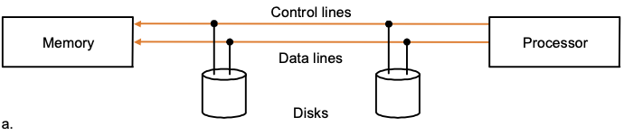

    2. Memory access the data.

        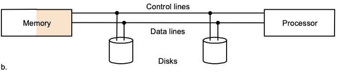

    3. Memory transfers data and signal data is available. The device stores data as it appears on the bus.

        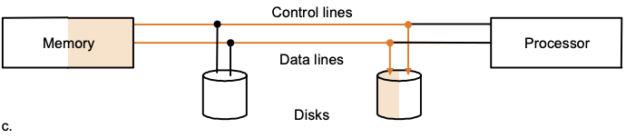

* **Input**

    1. Control lines indicate a write request(这里只能是CPU了) for memory, while the data lines contain the address

        

    2. When the memory is ready, it signals the device, which then transfers the data. The memory will store the data as it receives it . The device need not wait for the store to be completed.

        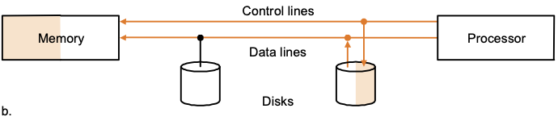

弊端：得按慢的来(张明敏幼儿园吃饭的故事)

优势：比较简单，不像Asyn那么折腾，简单的事务可以用同步的

---

**<u>Asynchronous</u>** bus don’t use a clock and instead use handshaking

* Handshaking protocol (七步握手协议)
    * Our example ,which illustrates how asynchronous buses use handshaking, assumes there are 3 control lines.
        * ReadReq(读请求): Used to indicate a read request for memory. The <u>address is put on the data lines</u> at the same time.
        * DataRdy(数据就绪): Used to indicate that data word is now ready on the data lines.
        * Ack(应答): Used to acknowledge the ReadReq or the DataRdy signal of the other party(另一方)

Ex. IO设备通过异步握手协议从内存读取一个字的数据

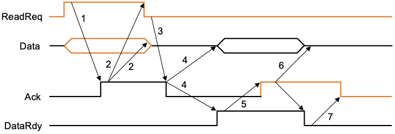

*橙线是IO设备发出的，黑线是内存发出的*

1. When memory saw the **ReadReq** line, it reads the address from the data bus, starts the memory read operation, <u>then</u> raises **Ack** to tell the device that the ReadReq signal has been seen.
2. I/O device saw the **Ack** line high and releases the **ReadReq** data lines.
3. Memory sees that **ReadReq** is low and drops the **Ack** line.
4. When the memory has the data ready, it places the data on the data lines and raises **DataRdy**.
5. The I/O device sees **DataRdy**, reads the data from the bus, and signals that it has the data by raising **Ack**.
6. The memory sees **Ack** signals, drops **DataRdy**, and releases the data lines.
7. Finally, the I/O device, seeing **DataRdy** go low, drops the **Ack** line, which indicates that the transmission is completed.

也可以用FSM来表示这个过程：


==例题中是只读的异步总线，那可读可写的异步总线如何实现？==*将ReadReq信号拓展成多个信号。可以增加一条专门的地址线，也可以数据线和地址线复用(但是需要增加额外的控制信号)*

## 总线分配

> *Bus Arbitration* refers to the process by which the current bus master accesses and then leaves the control of the bus and passes it to the another bus requesting processor unit. The controller that has access to a bus at an instance is known as *Bus maste*r.

**Obtaining Access to the Bus**

* “Without any control, multiple device desiring to communicate could each try to assert the control and data lines for different transfers!”
* So,a bus master is needed. Bus masters initiate and control all bus requests.
    * e.g., <u>processor is always a bus master.</u>
* Example: the initial steps in a bus transaction with a single master (the processor). PPT6.46

 **Bus Arbitration**(仲裁)

[BUS Arbitration in Computer Organization - GeeksforGeeks](https://www.geeksforgeeks.org/bus-arbitration-in-computer-organization/)

* <u>Deciding which **bus master**(应该是which device？) gets to use the bus next</u>
* In a bus arbitration scheme, a device wanting to use the bus signals a bus request and is later granted the bus. 
* four bus arbitration schemes:
    * daisy chain arbitration (not very fair):菊花链，阻塞式级联
    * centralized, parallel arbitration (requires an arbiter),  e.g., PCI
    * self selection, e.g., NuBus used in Macintosh
    * collision detection, e.g., Ethernet


# Interface

* 3 characteristics of I/O systems
    * shared by multiple programs using the processor.
    * often use interrupts to communicate information about I/O operations.
    * The low-level control of an I/O devices is complex
* 3 types of communication are required:
    * $\rm OS \xrightarrow{commands} I/O\ Device$
    * $\rm I/O\ Device \xrightarrow{Notifications:\ completed\ an\ operation\ or\ has\ encountered\ an\ error} OS$
    * $\rm Memroy \overset{Data} \longleftrightarrow I/O\ Device$

## Giving Commands to I/O Devices

2 methods used to address the device

* memory-mapped I/O
    * portions of the memory address space are assigned to I/O devices，然后lw和sw操作被解释成对IO设备的命令，可以通过对指定地址的读或写来传输数据
* special I/O instructions
    * Give a command to an I/O device

command port, data port

* The Status register (a done bit, an error bit(🖨缺纸等)……)
* The Data register, The command register

## Communication with the Processor

* Polling(轮询): The processor periodically checks status bit to see if it is time for the next I/O operation. 
    * 开销大：处理器比IO快得多，可能会多次检查IO设备却发现IO设备连一个都还没完成
    * Ex. 老师直接周期性问学生写完了没有，写完了就交
* Interrupt: When an I/O device wants to notify  processor that it has completed some operation or needs attentions, it causes processor to be interrupted.
    * 与异常中断的区别：
        1. 与任何指令不相关，且不影响指令的完成。控制器只需要在每次执行新的指令之前检查是否有未决的I/O中断即可
        2. I/O的中断请求还包括：设备号、优先级等等信息
    * Ex. 学生提交作业给老师
* DMA (direct memory access): the device controller transfer data directly to or from memory without involving processor
    * 开一个单独的进程负责这个事情(是一种内存访问技术，软件+硬件(DMA控制器))
        * ==每个IO通讯都要init一次，不是init过一次就能一直用的==
    * 第三版P388
    * Ex. 找助教助教收集作业，统一交给老师
        * 如果一个学期交一次作业，助教就有点多余
        * 如果一周一交，就挺有用的

**Compare polling, interrupts, DMA**

* The disadvantage of polling:  wasting processor time. 理由如上
* If the I/O operations is interrupt driven, the OS can work on other tasks while data is being read from or written to the device.
* Because DMA doesn’t need the control of processor, it will not consume much of processor time. (为什么？？？因为有自己的DMA控制器，不占用CPU时间)

### Interrupt-Driven I/O mode

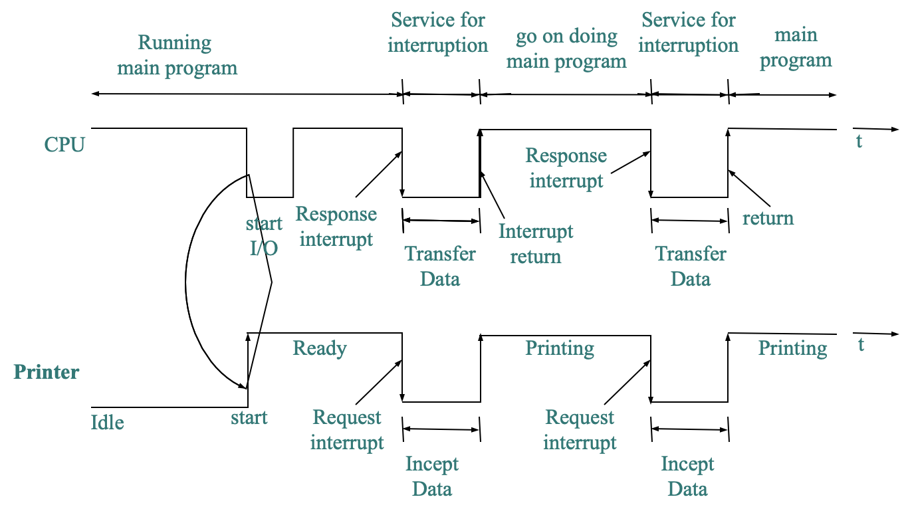

<u>所以是否Start IO只要一次？</u> 

### DMA transfer mode

**Direct Memory Access**

DMA 传输将数据从一个地址空间复制到另外一个地址空间。当CPU初始化这个传输动作，传输动作本身是由 DMA 控制器来实行和完成。典型的例子就是移动一个外部内存的区块到芯片内部更快的内存区。像是这样的操作并没有让处理器工作拖延，反而可以被重新排程去处理其他的工作。DMA 传输对于高效能嵌入式系统算法和网络是很重要的。

在实现DMA传输时，是<u>由DMA控制器直接掌管总线</u>，因此，存在着一个总线控制权转移问题。即DMA传输前，CPU要把总线控制权交给DMA控制器，而在结束DMA传输后，DMA控制器应立即把总线控制权再交回给CPU。一个完整的DMA传输过程必须经过<u>DMA请求、DMA响应、DMA传输、DMA结束</u>4个步骤。

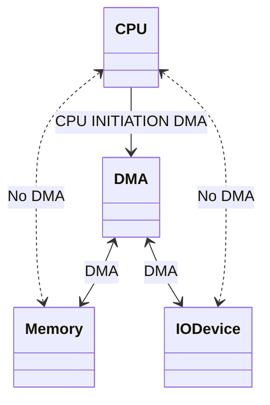

3 Steps

* The processor sets up the DMA by supplying some information, including the identity of the device, the operation, the memory address that is the source or destination of the data to be transferred, and the number of bytes to transfer.

* The DMA starts the operation on the device and <u>arbitrates for the bus</u>. If the request requires more than one transfer on the bus, the DMA unit generates the next memory address and initiates the next transfer.
* Once the DMA transfer is complete, the DMA controller interrupts the processor, which then examines whether errors occur.

# I/O Performance Measures(全是例题)

**Write Before**

1. 一般单位：时钟GHz，传输速率GB/s
2. 在IO系统中，==计量单位的底数是10而不是2==，例如1GB是1,000,000,000B而主存中1GB是1,073,741,824B
3. IO速率与数据传输速率不同

## Sync & Asyn buses

> The synchronous bus has a clock cycle time of 50 ns, and <u>each bus transmission takes 1 clock cycle</u>. The asynchronous bus requires 40 ns per handshake. The data portion of both buses is <u>32 bits</u> wide.
>
> Question: Find the bandwidth for each bus when reading <u>one word</u> from a 200ns memory.

**Sync**

1. Send the address to memory: 50ns
2. Read the memory: 200ns
3. Send the data to the device: 50ns

the bandwidth = 4bytes/300ns = 13.3MBps

**Asyn**

先看[这里](# Syn&Asyn)


Step1: 40ns

Step234: max(2×40ns+40ns, 200ns)=200ns(S1获得地址到S5放出数据之间至少200ns)

Step567: 3×40ns=120ns

the maximum bandwidth = 4bytes/360ns = 11.1MB/second

##  ↑Bandwidth

* Increasing data bus width
* Use separate address and data lines
* transfer multiple words

<font size = "4em">**Ex. Performance Analysis of Two Synchronous Bus Schemes**(通过增加blocksize来增加带宽)</font>

> Suppose we have a system with the following characteristic:
>
> 1. A memory and bus system supporting block access of 4 to 16(blocksize) 32-bit words
> 2. A 64-bit synchronous bus clocked at 200 MHz(5ns/clk), with each 64-bit transfer taking 1 clock cycle, and 1 clock cycle required to send an address to memory.
> 3. Two clock cycles needed between each bus operation.
> 4. A memory access time for the <u>first four words of 200ns</u>; each <u>additional set of four words can be read in 20 ns</u>. ==Assume that a bus transfer of the most recently read data and a read of the next four words  can be overlapped.==
>
> Find the sustained bandwidth(这是什么>？) and the latency for a read of 256 words for transfers that use 4-word blocks and for transfers that use 16-word blocks. Also compute effective number of bus transactions per second for each case.

**4word block **(64 blocks)

For a single block,

1. Send addr: 1clk = 5ns
2. Read mem: 200ns
3. Transfer: 2clk = 10ns
4. Between each bus operation: 2clk = 10ns (这个要算64次还是63次？)

Total_latency = 256 / 4 \* (225ns) = 14400ns

number of bus transactions per second = 64transactions / 14400ns = 4.44M transactions / second

bandwidth = 1024 bytes / 14400ns = 71.11 MB/sec

**16word block** (16 blocks)

For single block(我觉得这样算不容易出错，没必要按课件上那样算)

1. Send addr: 1clk = 5ns
2. Read mem: 200ns + 20ns \* 3 = 260ns
3. Transfer: 2clk = 10ns (只考虑最后一次传输)
4. break: 2clk = 10ns

Total_latency = 16 \* (285ns) = 4560ns

number of bus transactions per second = 16transactions / 4560ns = 3.51M transactions / second

bandwidth = 1024 bytes / 4560ns = 224.56 MB/sec

## Overhead of communication

### Polling

[Read First](# Communication with the Processor)

> Assume: the number of clock cycles for a polling operation is 400 and that processor executes with a 500-MHz(2ns) clock. 
>
> Determine the fraction of CPU time consumed for the mouse, floppy disk, and hard disk.
>
> We assuming that you poll often enough so that no data is ever lost and that those devices are potentially always busy.
>
> We assume again that:
>
> 1. The 🖱 must be polled 30 times per second to ensure that we do not miss any movement made by the user.
>  2. The 💾 transfers data to the processor in 16-bit units and has a data rate of 50 KB/sec. No data transfer can be missed.
>  3. The hard disk transfers data in four-word chunks and can transfer at 4 MB/sec. Again, no transfer can be missed.

🖱

clk_per_sec_for_polling = 30 \* 400 = 12,000clk

Fraction_of_CPU_clk_consumed = 12000 / 500M = 0.0024%

💾

num_of_polling_per_sec = 50KB / 16bits = 25K

clk_per_sec_for_polling = 25K \* 400 = 10M(注意这里K底数是10不是2)

Fraction_of_CPU_clk_consumed = 10M/500M = 2%

💽

num_of_polling_per_sec = 4MB / 4words = 250K

clk_per_sec_for_polling = 100M

Fraction_of_CPU_clk_consumed = 20%

说明：所以硬盘不能用轮询，但是鼠标用了也无所谓

### Interrupt-Driven

[Read First](# Communication with the Processor)

> Suppose we have the same hard disk and processor we used in the former example, but we used interrupt-driven I/O. The overhead for each transfer, including the interrupt, is 500 clock cycles. Find the fraction of the processor consumed if the <u>hard disk</u> is only transferring data 5%(200KBps) of the **time**.

先算所有时间都在传输的，

clk_per_sec_for_polling = 250K \* 500 = 125M

Fraction_of_CPU_clk_consumed = 125M / 500M = 25%

再考虑5%的传输时间，显然就是25% \* 5% = 1.25%

说明：<u>no CPU time is needed when an interrupt-driven I/O device is not actually transferring. This is the major advantage of an interrupt-driven interface versus polling.</u> 所以这个方式挺适合硬盘使用的

(为什么可以直接在结果上×5%)

### DMA

[Read First](# Communication with the Processor)

> Suppose we have the same hard disk and  processor we used in the former example.
>
> Assume that the initial setup of a DMA transfer takes 1000 clock cycles for the processor, and assume the handling of the interrupt at DMA completion requires 500 clock cycles for the processor.
>
> The hard disk has a transfer rate of 4MB/sec and uses DMA. The average transfer from disk is 8 KB. Assume the disk is actively transferring 100% of the time.
>
> Please find what fraction of the processor time is consumed.

Only consider one 8KB transfer

time_for_transfer = 8KB/4MBps = 2ms

clk_per_sec_for_polling = [(1000 + 500)(clk/transfer)] / [2(ms/transfer)] = 750K(clk/sec)
\\	这里是为什么？是不是总共是1000+500n，其中n=数据量/8KB，这里恰好8KB

Fraction_of_CPU_clk_consumed = 750K / 500M = 0.15%

# Designing an I/O system

 **The general approaches to designing I/O system**

1. Find the weakest link in the I/O system, which is the component in the I/O path that will constrain the design. Both the workload and configuration limits may dictate where the weakest link is located.
2. Configure this component to sustain the required bandwidth.
3. Determine the requirements for the rest of the system and configure them to support this bandwidth.

## Example

[看三种总线](# Type)

> Consider the following computer system:  
> 1.  A CPU  sustains *3 billion instructions per second* and it takes average *100,000 instructions* in the operating system per I/O operation.
> 2.  A memory <u>backplane bus</u> is capable of sustaining a transfer rate of *1000 MB/sec*.
> 3.  <u>SCSI</u>-Ultra320 controllers(连接设备的) with a transfer rate of *320 MB/sec* and accommodating up to 7 disks.
> 4.  Disk drives with a read/write bandwidth of *75 MB/sec* and an  average seek plus rotational latency of *6 ms*.
>
> If the workload consists of 64-KB reads (assuming the data block is sequential on a track), and the user program need 200,000 instructions per I/O operation, please *find the maximum sustainable I/O rate and the number of disks and SCSI controllers required.*

思路：先找到bottleneck(一般还得考虑disk，但这里可以并行disk所以不考虑？)，即CPU和bus端哪个慢

max_CPU_IO_rate = 3e+9 / [(100+200) \* 1e+3] = 1e+4 IOps (100+200是OS加User的)

max_bus_IO_rate = 1000MB / 64KB = 15625 IOps (这个为什么是用1000MB啊？那SCSI不是更慢>？因为SCSI是IO总线，连接磁盘，带宽不够可以通过并行解决(除非比磁盘还慢)，而背板总线只有一根，带宽直接影响了总带宽)

然后看IO总次数需要几个disk

time_disk_per_IO = 6ns + 64KB / 75MBps = 6.9ms

disk_needed = ceil(max_CPU_IO_rate / max_bus_IO_rate) = ceil(10000 / (1s/6.9ms)IOps) = 69

再看这么多磁盘需要多少SCSI总线

首先看每条SCSI的带宽够不够用，发现7 \* 64KB/6.9ms = 64.93MBps < 320MBps，因此是够用的(如果不够用就得用 总带宽/SCSI带宽 了)

这样条数显然就是ceil(69 / 7) = 10了


## 计算题1

[PPT文件](../../Org/理论_课件/PowerPoint/chapter6-zmm-MIPS.pptx)

考察磁盘IO

* 第二问
    * 的相邻磁道寻道时间注意一下，最小寻道时间是到最靠近磁头初始位置的磁道，最大寻道时间是到最远离磁头初始位置的磁道，而不是说停在哪里就是哪里，所以才要两个相加÷2K而不是直接把最大寻道时间÷2K
    * 没满一个磁道的要按比例算，保留需要的扇区即可
    * 一个磁道时间 = (寻道时间+半圈时间+扇区时间)，另外还有控制器时间(为什么控制器时间只算一次>？) [Disk Read TIme](# DIsk)
    * *Def*：吞吐率为1秒能进行几次IO操作，因此吞吐率=1/17.937=55.75(tps：每秒事务数)
* 第三问
    * 为什么D盘平均寻道时间是7ms>：因为题目有说C/D盘各占½的磁道
    * 为什么磁道转换时间是1ms>：因为(8-6)/2 = 1
* 第四问
    * 后者没分区了，所以寻道时间是4+4/4
    * 其他时间都一样
* zmm家的连连看一关有512MB，可以占满一个盘片
* 第八问
    * 回忆一下怎么算的：`实际CPI = (这是理想CPI还是L1_ht>？：实际上理想CPI说的就是L1_ht) + L1_mr • (L2_ht + L2_mr • (Mem_t + VM_mr • disk_t))`

## 计算题2

[PPT文件](../../Org/理论_课件/PowerPoint/chapter6-zmm-MIPS.pptx)

考察DMA，cc就是clock cycle

* 原题
  
    * 这里说的大小寄存器就是DMA的内部寻址寄存器，能够求出DMA大小为64KB，因此才需要256M/64K个DMA进程
      
    * 流程
        * 56步有什么区别>：因为要好多次DMA，DMA内部又有好多次传输
          
            ```cpp
            for(auto i : data) {
                auto tmpD = new DMA(i);
                for(auto j : *tmpD)
                    transfer(j);
            }
            ```
    * 1-6
        * 注意DMA一次容量是有限的
        * 次数 = data_size / DMA_size
    * 3-5
    
        * 次数 = DMA_size / mem_tran_size
    * `总时间 = DMA次数 • (CPU初始化DMA时间 + DMA发送读取地址给内存时间 + DMA内的循环次数 • (内存读取时间 + 数据(分次)发送时间))`
    
* 增加bllock的使用：不改变传输时间

* 增加总线位宽(从32到128)：改变了数据(不是地址或者其他)传输时间(单次传输时间减少但是总的不变)，其他不变

* 增加overlaped
    * 一般做法是在一个block操作内，内存读出(下一次要的)与数据发送到总线(本次的)这两个操作，可以重叠执行。
        要求block大于内存一次读出的数据，意味着一次block操作，会有多次内存读与内存发送到总线。
    * 也是只影响数据传输，总次数+1，第一次只读内存，最后一次只传数据，但是本来单独读内存的时间省下来了
    
* 目标设备

    * 例如：增加网卡的数据，网卡上有个缓冲区，大小为16bit，写入缓冲区就能马上发送到网络上(假设网络带宽足够)，刷新周期为1个clk
    * 那么因为总线宽度是32bit，因此在网卡这边需要等待额外的1clk

