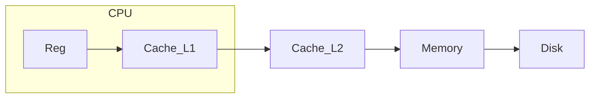
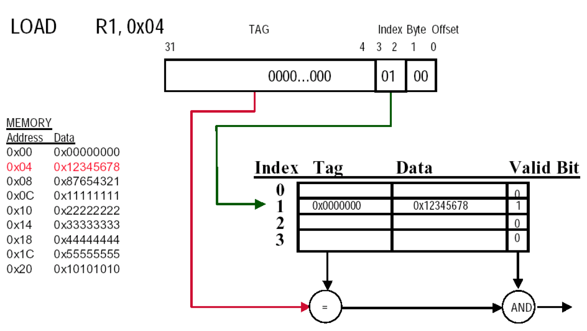
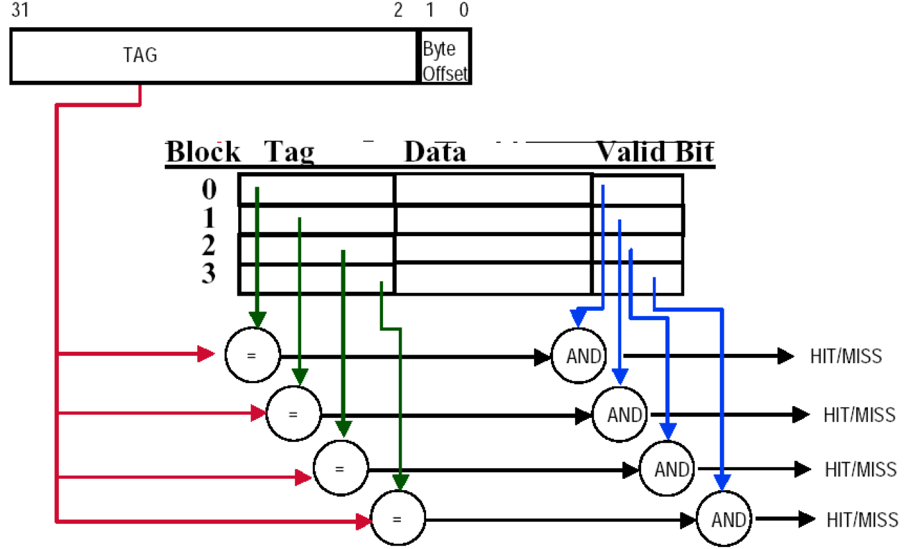
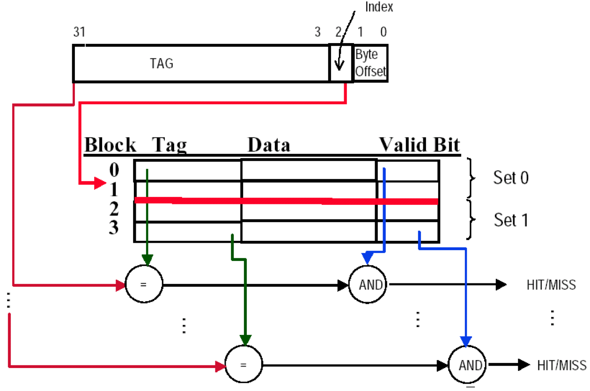
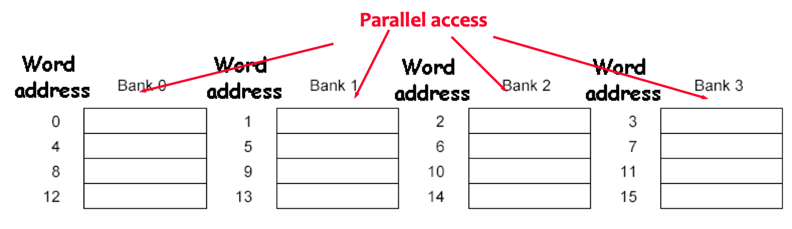

* SRAM：Cache(比寄存器慢
* DRAM：Mem

| Memory  technology | Typical  access time   | Cost  per GByte (2004) |
| ------------------ | ---------------------- | ---------------------- |
| SRAM               | 0.5-5ns                | \$4000-\$10,000        |
| DRAM               | 50-70ns                | \$100-\$200            |
| Magnetic  disk     | 5,000,000-20,000,000ns |                        |

# 层次化设计

* 时间相关性(temporal locality)
    * 一个东西被用了，大概率过一会会被再用
    * 循环结构
* 空间相关性(spatial locality)
    * 一个东西被用了，周围的东西大概率过一会会被再用
    * 顺序

Our initial focus:  two levels (upper, lower)

* block: minimum unit of data (block) for transfers
* hit: data requested is in the upper level(比如在Cache中hit了就不用去Memory找)
    * **HitTime**: The time to access the upper level of the memory hierarchy, which includes the time needed to determine whether the access is a hit or a miss. 在upper找到的时间(包括决定是否hit的时间)
* miss: data requested is not in the upper level
    * DMC方法中Cache中所需的单元格被占用了也叫miss
    * **Miss Penalty**: The time to replace a block in the upper level with the corresponding block from the lower level, plus the time to deliver this block to the processor. 
    * 没找到也需要加上hittime：如90%hit，10%miss，总时间为：HitTime\*100% + MissPenalty\*10%

# Cache

## 映射方式

首先两个问题

* 如何知道数据在不在里面？
* 如果知道不在里面，要怎么找？要用哪个位置来访导入的数据

==Index全部是根据Set(显式或隐式)而不是Block来算的==

### Direct Mapped(2L)

**分块**：例如1024Word(4Byte/Word)的内存，分为256块，则第61个Word的主存地址为000011(块号)11(区内块号)01(块内地址)

Memory中的整个Block的内容被全部存在Cache中

`Tag = BlockAddr_in_Memory // BlockNum_in_Cache`

`CacheIndex = BlockAddr_in_Memory % BlockNum_in_Cache`

`Offset = ByteAddr_in_Memory % BlockSize`

虽然容易不均匀，但是速度非常快(访问一次即可)

Tag是指示要找的东西的Memory对应在Block中的Byte地址(例如下面例题中就是4位的)

Index是指示Block地址的(例如下面例题中就是10位的)

`{tag, index}`合起来就是实际的地址(必须是按Byte而不是Word)

`Addr_bit = tag_bit + block_bit + byteOffset_bit + valid_bit`

> How many total bits are required for a direct-mapped **cache** 16KB of data and 4-word blocks, assuming a 32-bit address?
>
> * ~~16KB=4KWord=2^12^ words~~
> * ~~One block=4 words = 2^2^  words~~ 
> * Number of blocks (index bit) = 2^12^ ÷ 2^2^ = 2^10^ blocks(Cache中的BlockNum和IndexSize是相等的，因此index是10位的)
> * Data bits of block =4×32=128 bits\
> * <u>Tag bits  = address - index - blockSize(byte offset width) =32 - 10 - 4 =18 bits</u>  ？？(这个并不能由其他的算出来，因为没告诉你映射到的Memory多大，只能用地址线的位数来反推，由此再推出Memory = 2^18^ *16KB = 4GB) ==Valid和Dirty不算在地址位里==
> * Valid bit = 1 bit
> * Total Cache size = 2^10^ × (128+18+1)= 2^10^×147= 147 Kbits= 18.4KB
> * It is about [1.15](147/128=18.4/16) times as many as needed just for the data

**特点**

* Cache利用率低
* **替换速度快**
* **块冲突率高**
* 淘汰算法简单
* 适合于大容量Cache[低利用率、淘汰不至于太复杂]

Ex. 1-word Block

### Fully-Associative(1L)

**分块**：例如1024Word(4Byte/Word)的内存，分为256块，则第61个Word的主存地址为00001111(块号)01(块内地址)

Tag直接存储`BlockAddr_in_Memory`，

(这个扫描不是巨慢？？

**特点**

* Cache利用率高
* **替换速度慢**
* **块冲突率低**
* 淘汰算法复杂
    * Random, LRU, FIFO
* 适合于小容量Cache[高利用率、不至于因为淘汰复杂而导致时间很慢]

Ex. 1-word Blocks(Assume cache has 4 blocks)

### Set-Associative(3L)

一个Cache多组，每组多块

`SetIndex_in_Cache = SetIndex_in_Memory % SetNum_in_Cache`

\\                                     `= (BlockAddr_in_Memory / BlockNum_in_Set) % SetNum_in_Cache`

**n-way set associative**：一个set有n个block

Ex. 2-Way Set-Associative Cache(1 word/block; 2 blocks/set; 4 blocks/cache; hence 2 sets per cache)

### 映射方式区别

[映射方式对性能的影响](# 映射方式对性能的影响)

* DM：浙江代表只能住201
* FA：浙江代表随便住
* SA：浙江代表给5个房间
    * 即：任意模组数为k的都可以进到index=k的set，然后再看要去替换这个set里的哪个block

### 物理地址

| Block_Addr      | Block_Addr     |                  |
| --------------- | -------------- | ---------------- |
| Tag             | Index          | offset           |
| 第几个set/block | (Index of Set) | 块内的byte index |
|                 | Index of Block |                  |

* The Index field selects
    * The set, in case of a set-associative cache
    * The block, in case of a direct-mapped cache
    * Has as many bits as `log2(#sets)` for set-associative caches, or `log2(#blocks)` for direct-mapped caches
    * ==Index全部是根据Set(显式或隐式)而不是Block来算的==
* The Byte Offset field selects
    * The byte within the block
    * Has as many bits as `log2(size of block)`
* The Tag is used to find the matching block within a set or in the cache
    * Has as many bits as `Address_size – Index_size – Byte_Offset_Size`

**Ex**. CacheSize = 64KB; 4 words/block; 4 bytes/word; physical address: 32bits

|                   | tag  | inedx | offset |
| ----------------- | ---- | ----- | ------ |
| Directed-Mapped   | 16   | 12    | 4      |
| Fully-Associative | 28   | 0     | 4      |
| 2-way associative | 17   | 11    | 4      |
| 4-way associative | 18   | 10    | 4      |

## Cache R/W

### Handling Read

先找对应index的，如果V是低电平或者tag中的内容不对，则是miss

**Read miss**(冯诺依曼，因为混在一起miss概率会加大)

* instruction cache miss
* data cache miss

inst cache miss4

1. **stall(挂起) the CPU**: Send the original PC value (current PC-4) to the memory. (等你去内存找回来我可以先去完成其他一堆程序了)
2. **fetch block from memory**: Instruct main memory to perform a read and wait for the memory to complete its access.
3. **deliver to cache**(这步别漏了): Write the cache entry, putting the data from memory in the data portion of the entry, writing the upper bits of the address (from the ALU) into the tag field, and turning the valid bit on.
4. **restart CPU read**: Restart the instruction execution at the first step, which will <u>refetch the instruction again</u>, this time <u>finding it in the cache</u>. (Read Hit)

冷启动：开机的时候，OS为了开机会把Cache全部写满，这时候会很慢；之后OS就在Cache中常驻了因此速度就快了 (论DDR4的重要性

### Handling Write

* Write hits:  Difference Strategy
    * write-back: Cause Inconsistent (之后再写到内存)
        * Wrote the data into only the data cache
        * Strategy ---- write back data from the cache to memory later (later一般是指程序结束之后)
        * Fast，两者相差很大用这种
        * 需要加一个dirty位来进行判断
    * write-through: Ensuring Consistent (总是写到内存，(一写到底through))
        * Write the data into both the memory the cache
        * Strategy ---- writes always update both the cache and the memory
        * Slower----write buffer，两者差距不大用这种
* Write misses(写东西，tag对不上):
    * read the entire block from memory into the cache, then write the word using \-back or \-through
    * Write allocate 
        * The block is loaded into the cache on a miss before anything else occurs.
        * 看脏位
            * 1：先把原来东西写到内存，再用新值冲掉
            * 0：没被写过，直接冲
    * Write around (no write allocate) 
        * The block is only written to main memory 
        * It is not stored in the cache. 
    * In general, write-back caches use write-allocate , and write-through caches use write-around. 

**脏位**

* The bit indicates that its associated block of cache has been modified and has not been saved to memory yet. [What does 'dirty' mean in the context of caching? - Quora](https://www.quora.com/What-does-dirty-mean-in-the-context-of-caching)
* CPU向Cache上的某Block写过东西之后Block的dirtyBit被置位。之后要更新Cache的时候，如果dirty是1就必须先把当前的写到Memory(此时复位？)再更新，如果是0就直接更新。
* 此处的脏位(Cache->Mem)和虚拟内存中的(Mem->Disk)差不多，就是位置不一样而已

## 总结

### 替换方案

* Random：简单

* FIFO：计算量大，还得有硬件来计算时间

* LRU(Least Recently Used)：计算量大，还得每次都更新谁是最近使用的

    * The most commonly used scheme is least recently used (LRU), which we used in the previous example. In an LRU scheme, the block replaced is the one that has been unused for the longest time.

        For a two-way set associative cache, the LRU can be implemented easily. We could keep a single bit in each set. We <u>set the bit whenever a specific block in the set is referenced</u>, and reset the bit whenever another block is referenced.

        As associativity increases, implementing LRU gets harder.

## Memory Organization

**空间相关性**

。。。。

**三种策略**

### Basic

假设：一个clk发送地址；15个clk访问初始化(找到地址)；1个clk传1 word数据；4 words/block, 4 bytes/words

因此1word数据要17clk，传1 block要`Miss Penalty = 1 + 4 ×(1 + 15) = 65clk`(地址只用传一次)

${\rm Bandwidth} 带宽 = \frac{16B}{65clk} \approx \frac14$

<u>带宽表示一个周期能传多少字节的数据</u>

### Wide

2Words的数据宽

需要`Miss Penalty = 1 + 2 ×(15 + 1) = 33clk` (发地址一次，(读+传)两次)

${\rm Bandwidth} 带宽 = \frac{16B}{33clk} \approx 0.48$

4words的数据宽

需要`Miss Penalty = 1 + 1 × (15 + 1) = 17clk` (发地址一次，(读+传)一次)

${\rm Bandwidth} 带宽 = \frac{16B}{17clk} \approx 0.98$

### Four-way interleaved

每次都把其他的准备好

需要`Miss Penalty = 1 + 15 + (4 × 1) = 20clk`(发地址一次，读一次，传出四次)

${\rm Bandwidth} 带宽 = \frac{16B}{20clk} \approx 0.8$

> 为什么比Wide好？明明带宽更高？
>
> \\	因为加总线很贵

注意四个内存块的地址

## Cache性能

`CPU time = (CPU execution clock cycles 􏰃+ Memory-stall clock cycles) × Clock cycle time`

`Memory-stall clock cycles 􏰀= (Read-stall cycles 􏰃+ Write-stall cycles)`

读操作阻塞的周期：`Read_stall_cycles = (Reads/Program) × Read_miss_rate × Read_miss_penalty`

写操作阻塞的周期：`Write_stall_cycles = ((Writes/Program) × Write_miss_rate × Write_miss_penalty) + (Write_buffer_stalls)`

写缓冲区阻塞：`Write_buffer_stalls`：个人理解应该值得是连续多次写操作中，下一次得等上一次写完才可以写。取决于频率和write的时机(？)，因此没办法量化计算。

存储器阻塞时钟周期数：`Memory-stall clock cycles = (Memory_accesses/Program) × Miss_rate × Miss_penalty = (Instructions/Program) × (Misses/Instruction) × Miss_penalty`

### buffer

### Block大小对性能影响

Block👆，Index👇

| Program | Block size in  words | Instruction  miss rate | Data miss rate | Effective  combined miss rate |
| ------- | -------------------- | ---------------------- | -------------- | ----------------------------- |
| gcc     | 1                    | 6.1%                   | 2.1%           | 5.4%                          |
|         | 4                    | 2.0%                   | 1.7%           | 1.9%                          |
| spice   | 1                    | 1.2%                   | 1.3%           | 1.2%                          |
|         | 4                    | 0.3%                   | 0.6%           | 0.4%                          |

### 评估性能

* Miss Penalty影响冷启动速度之类的
* Miss Rate

两种启动方式

* 冷启动慢，但是开机之后都很流畅

* 冷启动快，但是开机之后得不断加载所以会卡](# 映射方式)

    。。。

    CPU_time = I × CPI × clk_time;

    CPU_time = (CPU_execution_cycles + Memory_stall_cycles) × clk_time

    Memory-stall clock cycles = # of instructions × miss ratio × miss penalty = Read-stall cycles + Write-stall cycles

    。。。

    加上R/W：

    。。。

#### 映射方式对性能的影响

先看[这里](# 映射方式)

Ex. Given the following sequence of block addresses: 0,8,0,6,8, find the number of misses for each cache organization. (each consisting of four one-word blocks. )

**direct-mapped**: 5 misses

| Memory block | Hit or miss | Set 0   | Set 1   | Set 2   | Set 3   |
| ------------ | ----------- | ------- | ------- | ------- | ------- |
|              |             | Block 0 | Block 1 | Block 2 | Block 3 |
| 0            | Miss        | M[0]    |         |         |         |
| 8            | Miss        | M[8]    |         |         |         |
| 0            | Miss        | M[0]    |         |         |         |
| 6            | Miss        | M[0]    |         | M[6]    |         |
| 8            | Miss        | M[8]    |         | M[6]    |         |

**fully-associative**: 3 misses

| Memory block | Hit or miss | Set 0   | Set 0  | Set 0  | Set 0  |
| ------------ | ----------- | ------- | ------- | ------- | ------- |
|              |             | Block 0 | Block 1 | Block 2 | Block 3 |
| 0            | Miss        | M[0]     |         |         |           |
| 8            | Miss        | M[0]     | M[8]    |         |           |
| 0            | Hit         | M[0]     | M[8]    |         |           |
| 6            | Miss        | M[0]     | M[8]    | M[6]    |           |
| 8            | Hit         | M[0]     | M[8]    | M[6]    |           |

**set-associative**: 4 misses

| Memory block | Hit or miss | Set 0   | Set 0  | Set 1  | Set 1  |
| ------------ | ----------- | ------- | ------- | ------- | ------- |
|              |             | Block 0 | Block 1 | Block 2 | Block 3 |
| 0            | Miss        | M[0]     |         |         |           |
| 8            | Miss        | M[0]     | M[8]    |         |           |
| 0            | Miss        | M[0]     | M[8]    |         |           |
| 6            | Miss        | M[0]     | M[6]    |         |           |
| 8            | Miss        | M[8]     | M[6]    |         |           |

### 计算

> Assume:
>
> * instruction cache miss rate = 2%
> * data cache miss rate = 4%
> * CPI without any memory stalls = 2
> * miss penalty = 100 cycles
> * The frequency of all loads and stores in gcc is 36%,as we see in Figure 3.26, on page 288.
>
> Question: How faster a processor would run with a perfect cache?
>
> Answer:
>
> * Instruction miss cycles = I×2%×100 =2.00I
> * Data miss cycles = I×36%×4%×100 =1.44I
> * Total memory-stall cycles = 2.00I+ 1.44I =3.44I
> * CPI with stall = CPI with perfect cache + total memory-stalls
>     \\                      = (2 + 3.44 )I = 5.44I
> * CPU_time_with_stall/CPU_time_with_perfect_cache(perfect is ) = (I×CPI_stall×Clock_cycle)/(I×CPI_perfect×Clock_cycle) = CPI_stall/CPI_perfect = 5.44/2 = 2.72

## 优化性能

### 降低Miss Rate

### 降低Miss Penalty

多级缓存

Ex. 假设原来CPI of 1.0 on a 5GHz machine with a 2% miss rate, 100ns DRAM access；现在Adding 2nd level cache with 5ns access time decreases miss rate to 0.5%(2%中有99.5%可以在二级缓存找到)

Miss penalty to main memory is `(100ns)/(0.2ns/clk) = 500clk`

Miss penalty with levels of cache without access main memory is `(5ns)/(0.2ns/clk) = 25clk`

The **CPI** with Two level of cache is `1.0 + primary_stall_per_inst + secondary_stall_per_inst = 1 + 2% × 25 + 0.5% × 500 = 1 + 0.5 + 2.5 = 4.0`

本来是`1 + 2% × 500 = 11.0`，显然快了很多

#  Virtual Memory

Page offset：按页算的，一般很大 (Page导一次(Mem<==>Disk)要很久，因此得尽量做大)

Page Fault: the data is not in memory, retrieve it from disk

* huge miss penalty, thus pages should be fairly large (e.g., 4KB)，太大也不行，太慢了
* reducing page faults is important (LRU is worth the price)
* can handle the faults in software instead of hardware
* using write-through is too expensive so we use write back (之后写)

**MMU(Memory Management Unit)管理存储器与物理存储器**

采用页表来判断PCU访问的内容是否在主存当中，并与MMU配合实现逻辑地址和物理地值之间的访问

VPN(Virtual Page Num)虚拟页号

PPN物理页号

