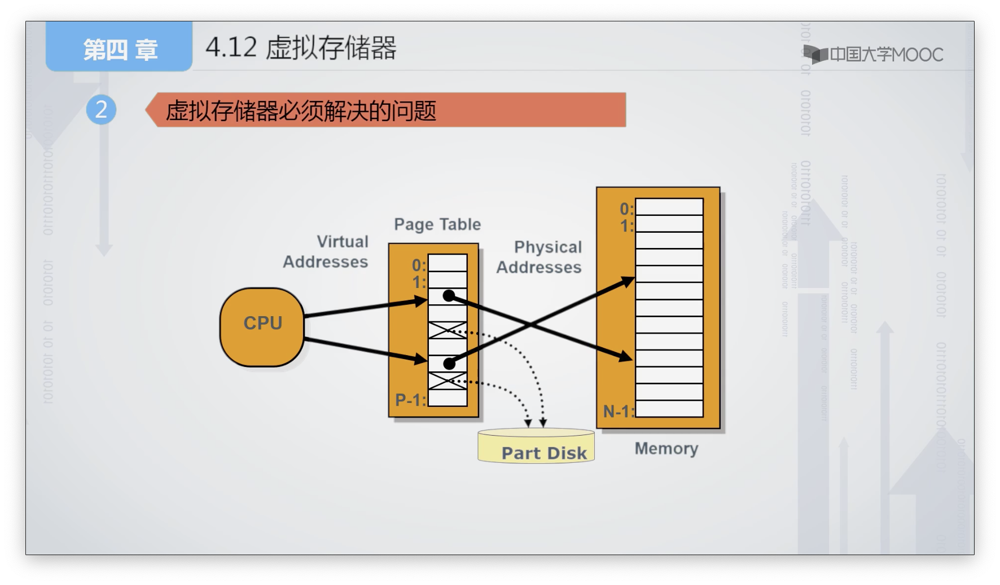
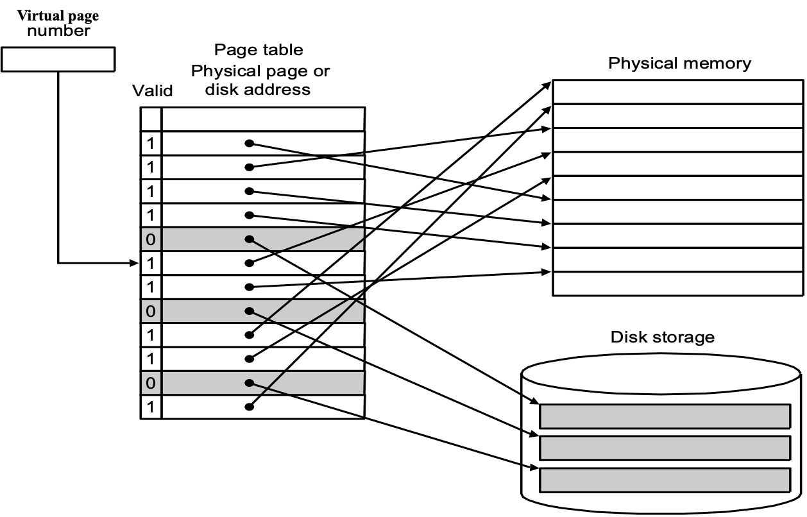
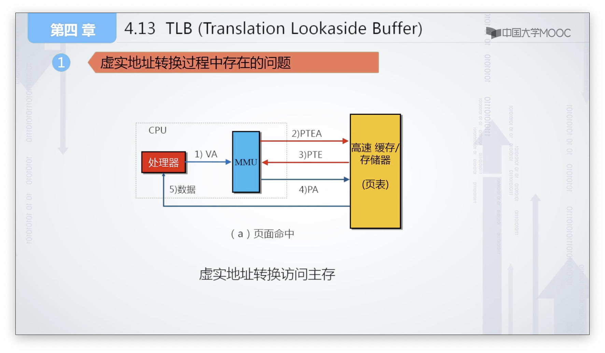
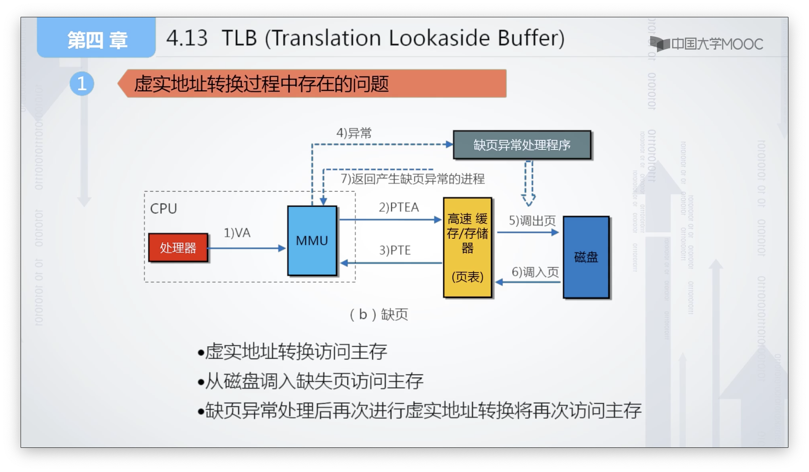
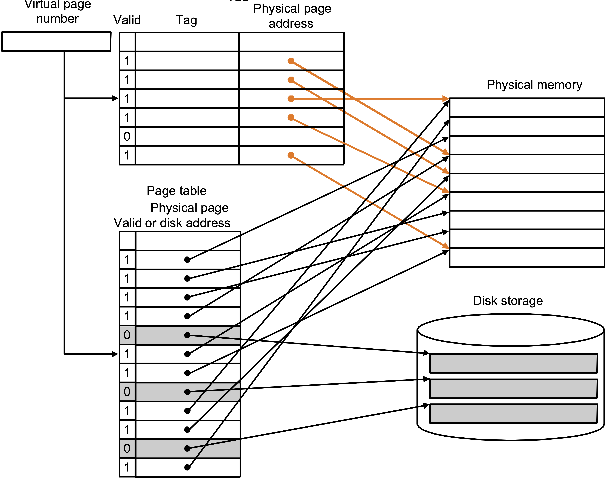
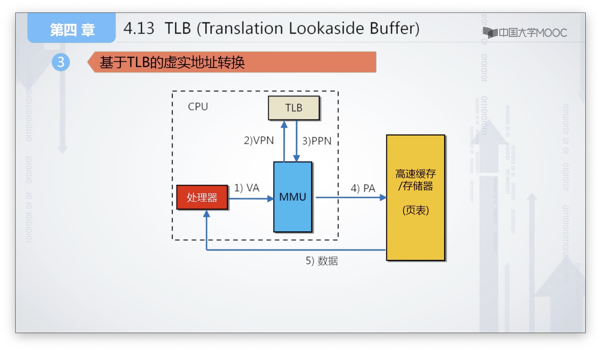
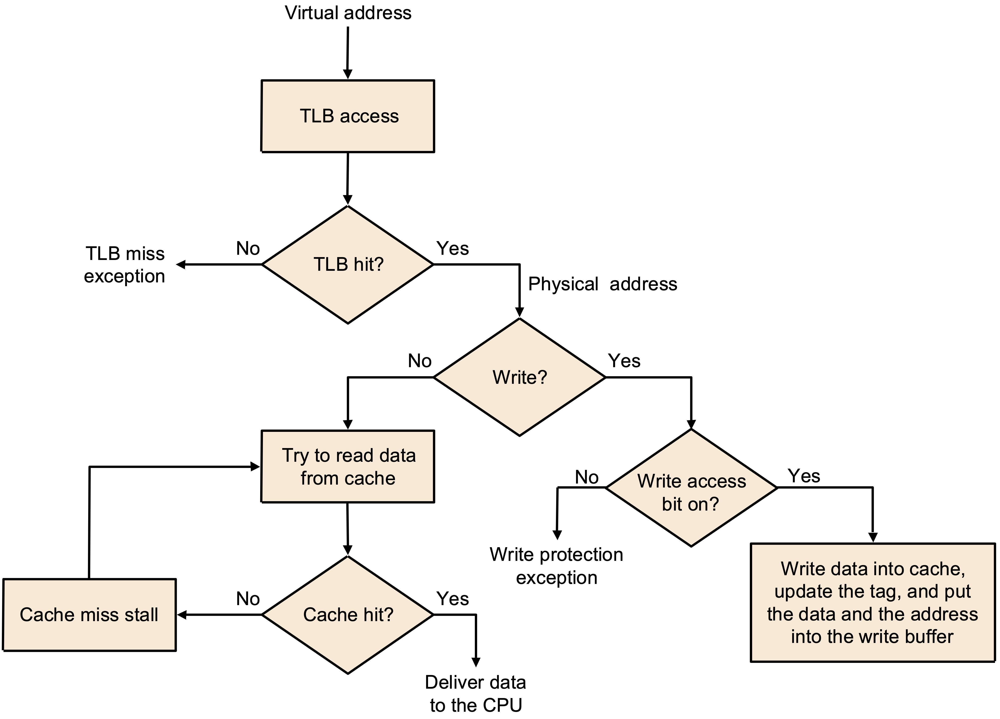

[TOC]

#  Virtual Memory

## 基础概念

**Advantages**

* illusion of having more physical memory
* program relocation 
    * 例如要求0地址，会另外给一个，类似于chroot
* protection
    * 同上，0是操作系统保护的
    * 或者内存某块坏了，就不会分配这块内存

### 专用名词

> **Abbreviation**
>
> * MMU
> * PT
>     * PTE (Entry)
> * VA/PA
> * VPN/PPN
> * VPO/PPO (offset)
> * TLB (Translation Lookaside Buffer)

**MMU(Memory Management Unit)**

* 管理存储器与物理存储器
* 解决“CPU访问存储系统的地址属性？”的问题
* 往往在CPU内部
* 将VA转化为PA

### PT

采用**页表**来判断CPU访问的内容是否在主存当中，并与MMU配合实现<u>逻辑地址和物理地值之间的访问</u>

* 解决了“如何判断CPU是否存在主存中”的问题
* 页表是若干个页表项PTE(Page Table Entry)的集合

**问题**

* <u>页表本身存储在哪？</u>
    * 内存，一个进程开一个
* 为什么一Byte一Byte的映射，而是要用比较大(上K)的Page？
    * 不这样就会有太多的PTE，导致PT变得很大
    * 另外由于磁盘IO很慢，不如一次多读一点
    * 太大也不行，IO太慢了
* <u>**页表是Full-Ass的**</u>，为什么？
    * DM搜索快，但是冲突率高，对于IO慢的磁盘来说不合适
* 同上，替换策略也很重要(不能像cache一样用random)，因为检查的代价小于IO的代价

#### Page Fault

the data is not in memory, retrieve it from disk

* <u>huge miss penalty, thus pages should be fairly large (e.g., 4KB)，太大也不行，IO太慢了</u>
* reducing page faults is important (LRU is worth the price)，因为磁盘IO一次要10^6^clk
* can handle the faults in software instead of hardware
* using write-through is too expensive so we <u>use **write back**</u> (之后写)

When the OS  creates a process, it usually creates the space on disk for all the pages of a process.

When a page fault occurs, the OS will be given control through exception mechanism. The OS will 通过PT在disk里找到Page，然后将需要的Page放进内存，如果满了则通过策略来替换 (至少得是LRU，高级一点用软件预测)

## 地址格式

虚地址(要求是32/64位的，)可以大于物理地址(视内存条大小而定)，所以可以放进虚拟内存的映射

**页表**

| 虚拟页号VPN(Virtual Page Num) | 有效位         | 物理页号PPN |
| ----------------------------- | -------------- | ----------- |
| 与页表数相关                  | 是否在主存中？ |             |

**虚拟地址VA**

| 虚拟页号VPN(Virtual Page Num) | 页内偏移VPO      |
| ----------------------------- | ---------------- |
| 与页表数相关                  | 与物理页大小相关 |

Ex. 主存页大小4KB，虚存大小4GB，则VPO为12位，VPN为32-12=20位，对应的页表有1M个PTE

**物理地址PA**

| 物理页号PPN | VPO --> PPO |
| ----------- | ----------- |
|             |             |

**逻辑地址向物理地址的转化**

用过PageTable+MMU实现

Ex2. Page大小为1KB，最大物理空间64KB(这是啥？是否意味着PPN应该是7位的？)，页表如下，求0d2050和0d3080的主存地址。

*？？？为什么VPN位数比PPN还少？这里应该是22位的？*

| VPN     | 0      | 1      | 2      | 3      |
| ------- | ------ | ------ | ------ | ------ |
| **V**   | 1      | 1      | 1      | 0      |
| **PPN** | 000010 | 000110 | 000111 | 000100 |

0d2050 = 0b10_0000000010，虚拟页号为2，查页表的物理页号为000111，因此物理地址为000111_0000000010

0d3080 = 0b11_...，虚拟页号为3，对应无效，因此是缺失的

## TLB

**Translation Lookaside Buffer** 地址转换后备缓冲器，**是个Cache**

### 本来存在的问题

命中也得访问内存两次

缺页就更惨了，还得进辅存

5是腾出位置，7完成后还得正常地访问一次

### 原理

* 存储当前访问页表地址变换条目
    * 不需要从主存中取了
* 因为也是个Cache，所以存储方式也可以用DM，FA，SA
* 类似页表，也是PTE的集合，但是采用类似Cache中的映射方法(最好是direct或set-ass)，对来自CPU的虚拟页号进行逻辑划分，得到相应的tag和index
* <u>TLB只有一个，因此每换一个进程都得换TLB内容</u>

**VA传给TLB的格式**

| 虚拟页号VPN(Virtual Page Num) | 页内偏移VPO                 |
| ----------------------------- | --------------------------- |
| TLB_Tag \| TLB_Index          | TLB_Index_Low \| TLB_Offset |

### 带TLB的转换

将获得的PPN和VPO=PPN链接起来

主存只要访问一次了

