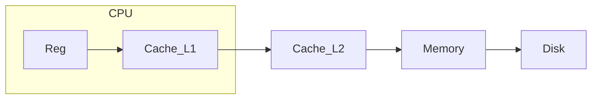
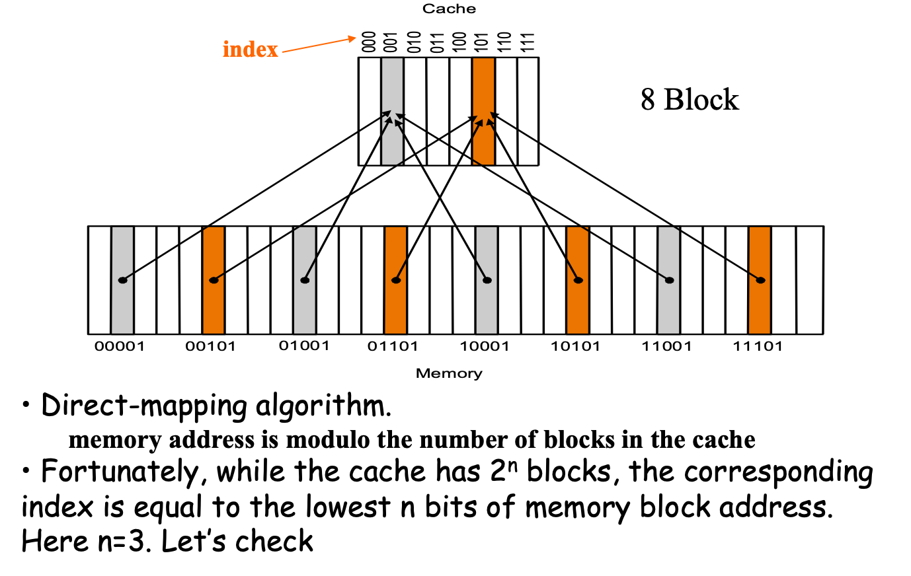
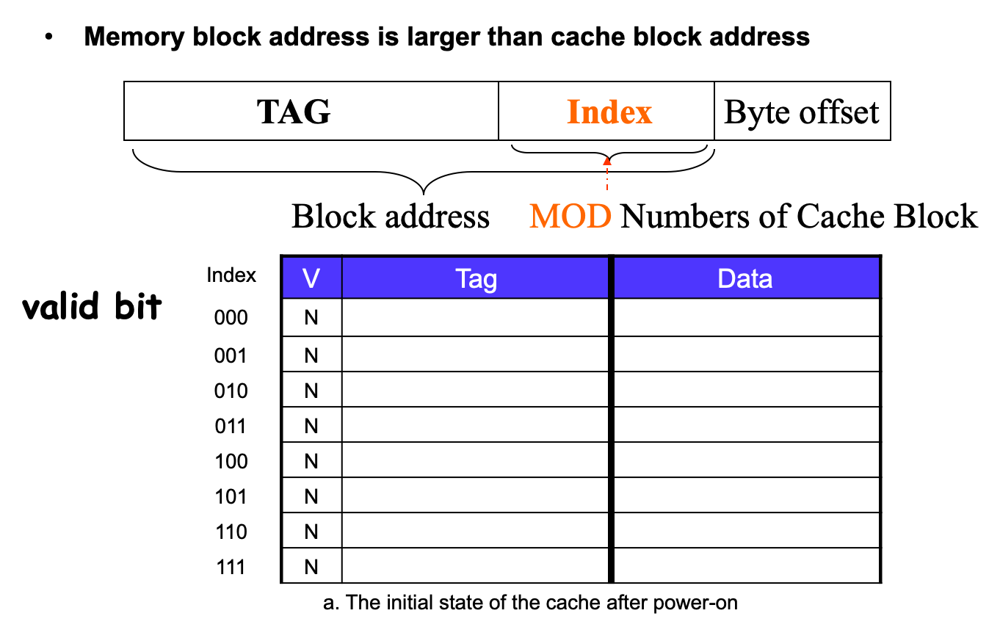
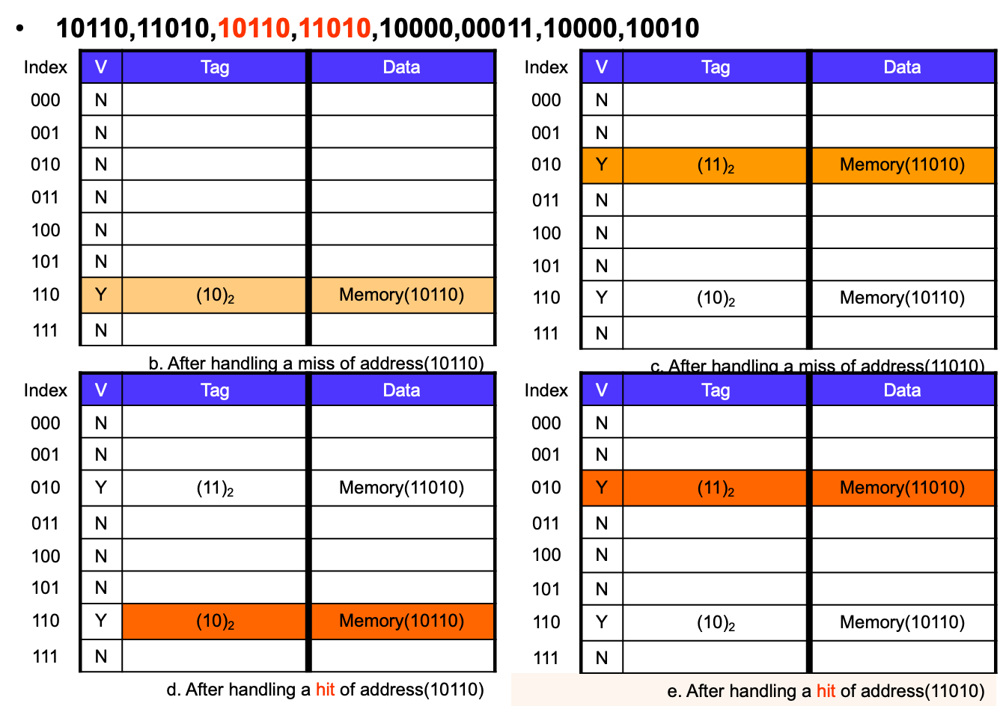
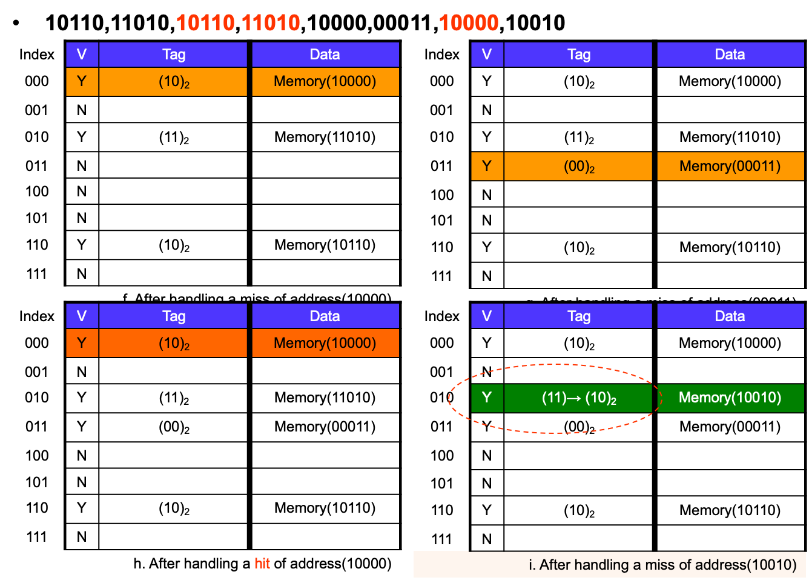
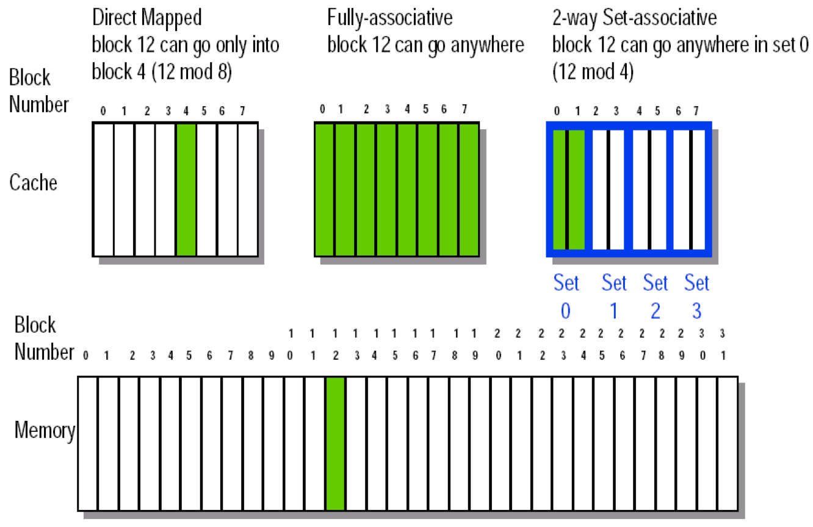

* SRAM：Cache(比寄存器慢
* DRAM：Mem

| Memory  technology | Typical  access time   | Cost  per GByte (2004) |
| ------------------ | ---------------------- | ---------------------- |
| SRAM               | 0.5-5ns                | \$4000-\$10,000        |
| DRAM               | 50-70ns                | \$100-\$200            |
| Magnetic  disk     | 5,000,000-20,000,000ns |                        |

# 层次化设计

* 时间相关性(temporal locality)
    * 一个东西被用了，大概率过一会会被再用
    * 循环结构
* 空间相关性(spatial locality)
    * 一个东西被用了，周围的东西大概率过一会会被再用
    * 顺序

Our initial focus:  two levels (upper, lower)

* block: minimum unit of data (block) for transfers
* hit: data requested is in the upper level(比如在Cache中hit了就不用去Memory找)
    * **HitTime**: The time to access the upper level of the memory hierarchy, which includes the time needed to determine whether the access is a hit or a miss. 在upper找到的时间(包括决定是否hit的时间)
* miss: data requested is not in the upper level
    * DMC方法中Cache中所需的单元格被占用了也叫miss
    * **MissPenalty**: The time to replace a block in the upper level with the corresponding block from the lower level, plus the time to deliver this block to the processor. 
    * 没找到也需要加上hittime：如90%hit，10%miss，总时间为：HitTime\*100% + MissPenalty\*10%

# Cache

## 映射方式

首先两个问题

* 如何知道数据在不在里面？
* 如果知道不在里面，要怎么找？要用哪个位置来访导入的数据

### Direct Mapped(2L)

**分块**：例如1024Word(4Byte/Word)的内存，分为256块，则第61个Word的主存地址为000011(块号)11(区内块号)01(块内地址)

Memory中的整个Block的内容被全部存在Cache中

`Tag = BlockAddr_in_Memory // BlockNum_in_Cache`

`CacheIndex = BlockAddr_in_Memory % BlockNum_in_Cache`

`Offset = ByteAddr_in_Memory % BlockSize`

虽然容易不均匀，但是速度非常快(访问一次即可)

Tag是指示要找的东西的Memory对应在Block中的Byte地址(例如下面例题中就是4位的)

Index是指示Block地址的(例如下面例题中就是10位的)

`{tag, index}`合起来就是实际的地址(必须是按Byte而不是Word)

`Addr_bit = tag_bit + block_bit + byteOffset_bit + valid_bit`

> How many total bits are required for a direct-mapped **cache** 16KB of data and 4-word blocks, assuming a 32-bit address?
>
> * ~~16KB=4KWord=2^12^ words~~
> * ~~One block=4 words = 2^2^  words~~ 
> * Number of blocks (index bit) = 2^12^ ÷ 2^2^ = 2^10^ blocks(Cache中的BlockNum和IndexSize是相等的，因此index是10位的)
> * Data bits of block =4×32=128 bits\
> * <u>Tag bits  = address - index - blockSize(byte offset width) =32 - 10 - 4 =18 bits</u>  ？？(这个并不能由其他的算出来，因为没告诉你映射到的Memory多大，只能用地址线的位数来反推，由此再推出Memory = 2^18^ *16KB = 4GB)
> * Valid bit = 1 bit
> * Total Cache size = 2^10^ × (128+18+1)= 2^10^×147= 147 Kbits= 18.4KB
> * It is about [1.15](147/128=18.4/16) times as many as needed just for the data

**特点**

* Cache利用率低
* 块冲突率高
* 淘汰算法简单
* 适合于大容量Cache[低利用率、淘汰不至于太复杂]

### Fully-Associative(1L)

**分块**：例如1024Word(4Byte/Word)的内存，分为256块，则第61个Word的主存地址为00001111(块号)01(块内地址)

Tag直接存储`BlockAddr_in_Memory`，

(这个扫描不是巨慢？？

**特点**

* Cache利用率高
* 块冲突率低
* 淘汰算法复杂
    * Random, LRU, FIFO
* 适合于小容量Cache[高利用率、不至于因为淘汰复杂而导致时间很慢]

### Set-Associative(3L)

一个Cache多组，每组多块

`SetIndex_in_Cache = SetIndex_in_Memory % SetNum_in_Cache`

\\                                     `= (BlockAddr_in_Memory / BlockNum_in_Set) % SetNum_in_Cache`

**n-way set associative**：一个set有n个block

### Cache R/W

#### Handling Read

先找对应index的，如果V是低电平或者tag中的内容不对，则是miss

**Read miss**(冯诺依曼，因为混在一起miss概率会加大)

* instruction cache miss
* data cache miss

inst cache miss4

1. **stall(挂起) the CPU**: Send the original PC value (current PC-4) to the memory. (等你去内存找回来我可以先去完成其他一堆程序了)
2. **fetch block from memory**: Instruct main memory to perform a read and wait for the memory to complete its access.
3. **deliver to cache**(这步别漏了): Write the cache entry, putting the data from memory in the data portion of the entry, writing the upper bits of the address (from the ALU) into the tag field, and turning the valid bit on.
4. **restart CPU read**: Restart the instruction execution at the first step, which will <u>refetch the instruction again</u>, this time <u>finding it in the cache</u>. (Read Hit)

冷启动：开机的时候，OS为了开机会把Cache全部写满，这时候会很慢；之后OS就在Cache中常驻了因此速度就快了 (论DDR4的重要性

#### Handling Write

* Write hits:  Difference Strategy
    * write-back: Cause Inconsistent (之后再写到内存)
        * Wrote the data into only the data cache
        * Strategy ---- write back data from the cache to memory later (later一般是指程序结束之后)
        * Fast，两者相差很大用这种
        * 需要加一个dirty位来进行判断
    * write-through: Ensuring Consistent (总是写到内存)
        * Write the data into both the memory the cache
        * Strategy ---- writes always update both the cache and the memory
        * Slower----write buffer，两者差距不大用这种
* Write misses:
    * read the entire block from memory into the cache, then write the word using \-back or \-through

**脏位**

* The bit indicates that its associated block of cache has been modified and has not been saved to memory yet. [What does 'dirty' mean in the context of caching? - Quora](https://www.quora.com/What-does-dirty-mean-in-the-context-of-caching)
* CPU向Cache上的某Block写过东西之后Block的dirtyBit被置位。之后要更新Cache的时候，如果dirty是1就必须先把当前的写到Memory(此时复位？)再更新，如果是0就直接更新。
* 此处的脏位(Cache->Mem)和虚拟内存中的(Mem->Disk)差不多，就是位置不一样而已

## 总结

**替换方案**

* Random：简单
* FIFO：计算量大，还得有硬件来计算时间
* LRU(Least Recently Used)：计算量大，还得每次都更新谁是最近使用的

**区别**

* DM：浙江代表只能住201
* FA：浙江代表随便住
* SA：浙江代表给5个房间

