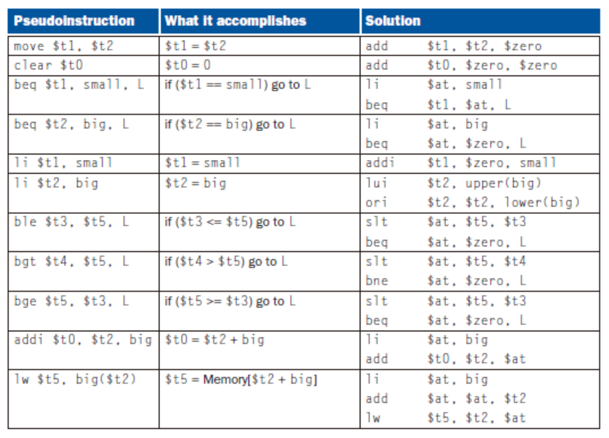

## 编译

### Link

**FIGURE 2.13** The MIPS memory allocation for program and data

\$pc从`0x400 000`开始向高

\$gp堆顶寄存器(Stack for Static Data)从`0x1000 8000`到`0x1000 0000`

\$sp栈顶寄存器(Stack for Dynamic Data)从`0x7fff fffc`开始往低

Static和Dynamic没有实际的分界，compiler会视具体应用来操作

看书上(中文P127)例题

那道题offset里存的是0xFFFF8000和0XFFFF8020，然后直接溢出完事


### Load

调用动态链接库


### 宏

$at专门给宏用的



# 数

## 符号拓展

note: `addi` still sign-extends!

note: `sltu, sltiu` for unsigned comparisons

溢出可能的后果：

`-127(1000 0001)+(-2)(1111 1110) = +127(0111 1111)`

常见情况

|      |      | 结果 |
| ---- | ---- | ---- |
| A+B  | ++   | <0   |
| A+B  | --   | \>0  |
| A-B  | +-   | <0   |
| A-B  | -+   | \>0  |

**lb、lbu**： Loads a byte into the lowest 8 bits of a register，剩下24位视正负拓展

**sltu、sltiu**：

注意单源指令用的位段不一定是rs：`sll $t2, $s0, 3	#sll rd,rt,i`


## ALU

| ALU Control Lines        | Function         |
| ------------------------ | ---------------- |
| 000                      | And              |
| 001                      | Or               |
| 010                      | Add              |
| 110                      | Sub              |
| 111                      | Set on less than |
| 符号控制、逻辑代数控制、 |                  |


### ALU加速

**Carry look-ahead adder (CLA)**

C~i+1~	 =bi ci+ai ci +ai bi 

​           =ai bi +(ai +bi )ci

Generate gi = ai bi

Propagate pi = ai + bi

c1 = g0 + (p0 * c0)
c2 = g1 + p1*c1 = g1 + (p1 * g0) + (p1 * p0 * c0)
c3 = g2 + p2*c2 = g2 + (p2 * g1) + (p2 * p1 * g0) + (p2 * p1 * p0 * c0)
c4 = g3 + p3*c3 = g3 + (p3 * g2) + (p3 * p2 * g1) + (p3 * p2 * p1 * g0) + (p3 * p2 * p1 * p0 * c0)

一般不会look ahead太多位，四位挺好的：

```pseudocode
c4 =  g3  + p3*g2 	+ p3*p2*g1    + p3*p2*p1*g0     + p3*p2*p1*p0*c0
c8 =  g7  + p7*g6 	+ p7*p6*g5    + p7*p6*p5*g4     + p7*p6*5*p4*c4
c12 = g11 + p11*g10	+ p11*p10*g9  + p11*p10*p9*g8   + p11*p10*p9*p8*c8
c16 = g15 + p15*g14	+ p15*p14*g13 + p15*p14*p13*g12 + p15*p14*p13*p12*c12
```

也可以先做个四位的ALU再把他们串联

```pseudocode
G1= g7  + p7*g6   + p7*p6*g5    + p7*p6*p5*g4
G2= g11 + p11*g10 + p11*p10*g9  + p11*p10*p9*g8
G3= g15 + p15*g14 + p15*p14*g13 + p15*p14*p13*g12

P0= p3*p2*p1*p0
P1= p7*p6*p5*p4
P2= p11*p10*p9*p8 P3= p15*p14*p13*p12

C1 = c4  = G0+P0*c0
C2 = c8  = G1+P1*c4
C3 = c12 = G2+P2*c8
C4 = c16 = G3+P3*c12

C1=G0+P0*c0
C2=G1+P1*C1 = G1+P1*G0 + P1*P0*c0
C3=G2+P2*C2 = G2+P2*G1 + P2*P1*G0+ P2*P1*P0*c0
C4=G3+P3*C3 = G3+P3*G2 + P3*P2*G1+P3*P2*P1*G0 + P3*P2*P1*P0*c0
```

## 乘法

第一个操作数是被乘数(multiplicand)，第二个是乘数(multiplier)

### Ver2

不移动multiplicand，右移动product，multiplier上从低到高遍历，若为1则product+=multiplicand<<i

### Ver3

处理方式同上，但是一开始时把product的低32位用来存multiplier，每次右移product取出一个溢出位，等32次完正好product是pure的了

习题3.13

### signed乘

存住积的符号，将符号数转成非符号数进行运算

### Booth算法

PPT65

multiplier连续n位(如a\~b)为1，则在第a位执行`sub Mcand*2^{a}`，a+1\~b执行sll，b+1位执行`add Mcand*2^{b+1}`(从0开始记位)

与Ver3结合可以做成状态机(最后一位 | 上一次右溢出位)：

* 1 0 	subtract multiplicand from left half
* 1 1 	no arithmetic operation
* 0 1 	add multiplicand to left half
* 0 0 	no arithmetic operation
* ALways Shift Right(sra)

Arithmetic shift right:

* ™keeps the **leftmost bit constant**
* ™no change of sign bit !

优势：代数运算少

更慢的特殊情况：0101

一样快：0110


