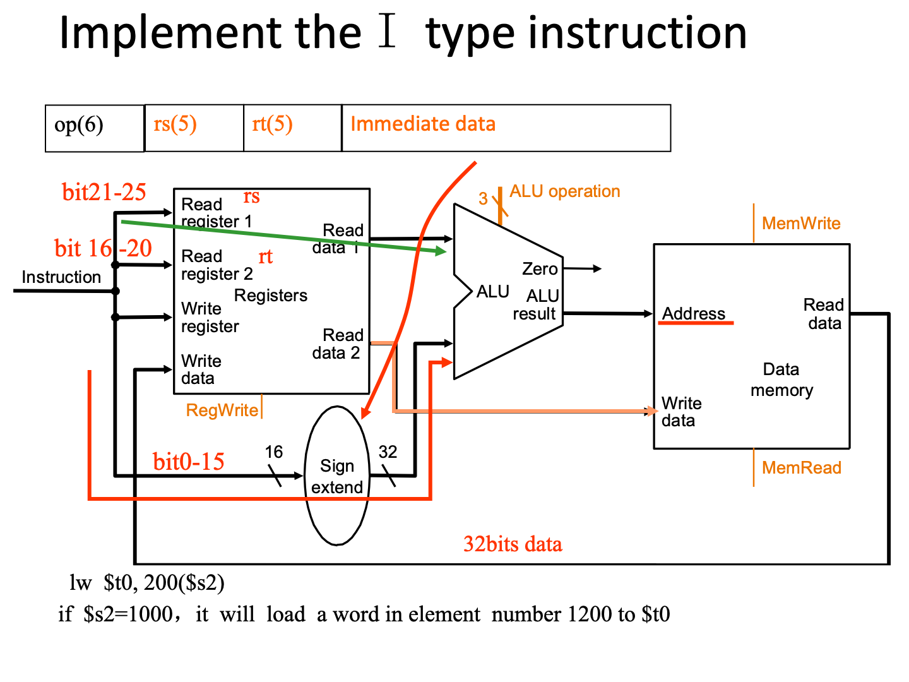
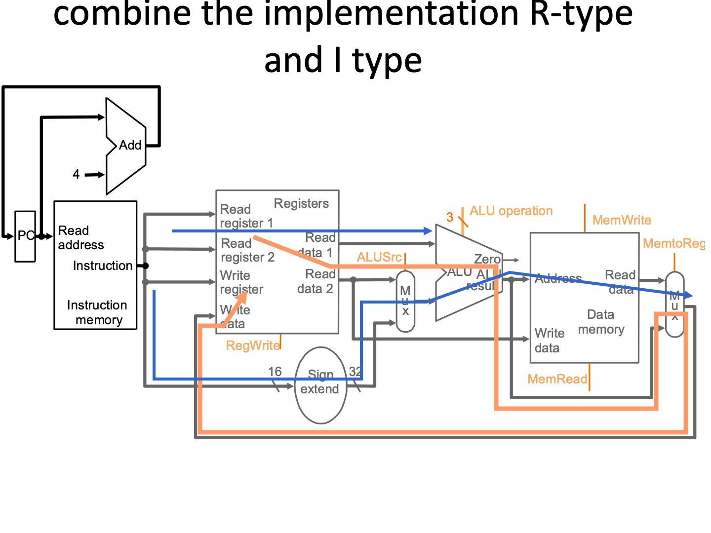
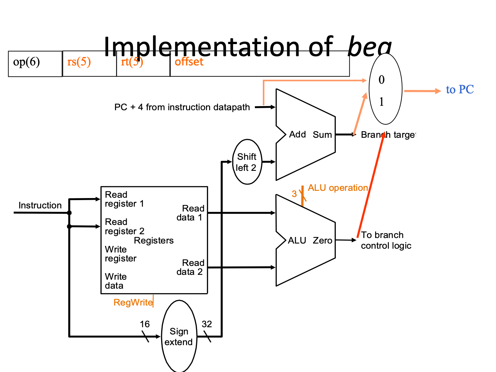

## 除法

64被除数存到64余数里

### Ver1

32商左移，64余数不动，64除数(32位除数存在高32位)右移，64位ALU

做减法，余数-除数比大小，若大于0则ok，商该位置1；小于0则rollback(余数+除数)

### Ver2

32商左移，64余数左移，32除数不动，32位ALU

做减法，余数高32-除数比大小，若大于0则ok，商该位置1；小于0则rollback(余数高32+除数)

### Ver3

省掉商寄存器

64余数左右移，32除数不动，32位ALU

做减法，余数高32-除数比大小，若大于0则将左移，低位平行置位1；小于0则rollback并左移，低位平行置位0

商在余数的低32位


## 浮点数

Standardized format IEEE 754

* Single precision 8 bit exp, 23 bit significand
* Double precision 11 bit exp, 52 bit significand

exp和significand两个是符号数，但不是补码，是偏码

BIas127(127偏码)：0表示-127，127表示0，254表示+127，255是特殊位

$\Large \rm (-1)^{sign}\times(1+significand)\times 2 ^{exp - bias}$

1+significand(=fraction，尾数)是二进制，即整个浮点数实际上是<u>用**二进制**的科学计数法表示的小数</u>

**特殊的**：NaN，+\infin, -\infin, 0

exp和significand都为0：0(那1怎么办？1是2^0^，指数是01111111(偏码))

exp全为1，significand全为0：$\pm\infin$

exp全为1，significand不为0：其他(Not a Number)


例如-0.75为$\large\rm (-1)^1 \times (1 + 0.1000\ 0000\ 0000\ 0000\ 0000\ 000)\times 2^{(126 - 127)}$，所以exp为126，指数为0x4000000

```cpp
#include <cmath>
#include <iomanip>
#include <iostream>

std::string F2B(void *pa) {
    std::string out = "";
    int tmp         = *(int *)pa;
    int a           = tmp;
    for (int i = 0; i < 32; i++) {
        if (a & 0x80000000)
            out += "1";
        else
            out += "0";
        if (i == 0 || i == 8)
            out += " ";
        a = a << 1;
    }
    return out;
}

void printLine(float a) {
    std::cout << std::setw(12) << a << ": " << F2B(&a) << "\n";
}

int main(int argc, char const *argv[]) {
    printLine(0);
    printLine(pow(2, -0b01111111));
    printLine(1);
    printLine(pow(0xFFFFFFFFFFFFF, 20));
    printLine(pow(-0xFFFFFFFFFFFFF, 21));
    printLine(1.0 / 0.0);
    printLine(0.0 / 0.0);
    printLine(nanf(0));
    return 0;
}

/* Output */
           0: 0 00000000 00000000000000000000000
 5.87747e-39: 0 00000000 10000000000000000000000
           1: 0 01111111 00000000000000000000000
         inf: 0 11111111 00000000000000000000000
        -inf: 1 11111111 00000000000000000000000
         inf: 0 11111111 00000000000000000000000
         nan: 0 11111111 10000000000000000000000
         nan: 0 11111111 10000000000000000000000
```


**单精度**

| 31符号位 | 30    ……     23 exp | 22        ……          0      |
| -------- | ------------------- | ---------------------------- |
| 1        | 0111 1110           | 110 0000 0000 0000 0000 0000 |
| 1 bit    | 8 bits              | 23 bits                      |

**双精度**

| 31符号位 | 30     ……    20 exp | 19      ……           0   | 31 ... ... 0 Also fraction |
| -------- | ------------------- | ------------------------ | -------------------------- |
| 1        | 011 1111 1110       | 1100 0000 0000 0000 0000 |                            |
| 1bit     | 11 bits             | 20 bits                  | 32 bits                    |

### 浮点加法

假设只能存储4个十进制有效数和2个十进制指数


y=0.5+(-0.4375) in binary

```perl
0.5     =  1.0002×2^-1  
-0.4375 = -1.1102×2^-2  
Step1:The fraction with less exponent is shifted right until matching
-1.110×2-2  → -0.111×2-1 
Step2:  Add the significands
       1.000×2-1 
  +) - 0.111×2-1
  -------------------
       0.001×2-1
Step3:  Normalize the sum and check for overflow or underflow
      0.001×2-1 → 0.010×2-2 → 0.100×2-3 → 1.000×2-4 
Step4: Round the sum
	 1.0002×2-4   = 0.062510
```

存在加法器不够大的可能，因为是以大的数字进行align的

存在浮点数吞吃：如10^6^+1，1极有可能被吞掉；还有$\displaystyle\sum_{i=1}^{100,000} \frac1x$会溢出，$\displaystyle\sum_{i=100,000}^{1} \frac1x$就不会

### 浮点乘法

### 浮点除法

### Rounding


### Keyword

Sign Magnitude：符号表示法，如第一位放0/1

Biased Notation：偏码表示法：如Bias127中0就是-127


浮点加法不符合结合律

(A+B)+C != A+(B+C)

T1 = A+B, T2 = T1 + C 不能保证 T2 == A + B + C


**3.13**

guard保护位：

round

sticky：只要舍入的有1，stk就为1

```
3.13.1 (A+B)+C=
(A)  -1.1111111010*213+1.1111111010*213+1.0*20=1
    
(B)    (A+B)+C=
    1.1100101010*2^4+1.1010|100010*2^-2 + 1.1000010010*2^3
     
    1.1100101010+ 
    0.0000011010|101 (多的三位寄存器保存对齐过程的数据 Guard=1,round=0, Sticky = 1) 
 = 1.1101000100
     (No round)
 
 3.13.2  A+(B+C)= A+1.1111111010*213+1.0*20
      (B+C)= 
      1.111111010+ 
      0.0000000000 (Guard=0, Round=0, Sticky=1) 
    =1.1111111010
        (No round)

3.13.2.b  A+(B+C)= 1.0100100110 11
      1.1000010010+
      0.0000110101 000 (Guard=0,round=0, Sticky = 0)
    =1.1001000111   NO ROUND
  A:   1.1100101010 
C+B:0.1100100011 10 (Guard=1,round=0, Sticky = 0)
         10.1001001101 10   NORMALISE
           1.0100100110 110 (Guard=1,round=1, Sticky = 0)
             1.0100100111        ROUND UP

```

# CPU

aSimpleCPU.png


单周期：一个周期一个指令，(如8点杭州12点北京，中间怎么走无所谓，一条铁路线都是你的)

多周期：一个周期完成指令的一部分，哪一部分在哪完成都是限定死的(如8点杭州12点北京，9点之前得到济南，因为同一条线上济南9点有车要往杭州开)

| Name      | Register number | Usage                                        | Preserved on call? |
| --------- | --------------- | -------------------------------------------- | ------------------ |
| \$zero    | 0               | The constant value 0                         | n.a.               |
| \$at      | 1               | For assembler                                |                    |
| \$v0–\$v1 | 2–3             | Values for results and expression evaluation | no                 |
| \$a0–\$a3 | 4–7             | Arguments                                    | no                 |
| \$t0–\$t7 | 8–15            | Temporaries                                  | no                 |
| \$s0–\$s7 | 16–23           | Saved                                        | yes                |
| \$t8–\$t9 | 24–25           | More temporaries                             | no                 |
| \$k0-\$k1 | 26-27           | For OS                                       |                    |
| \$gp      | 28              | Global pointer                               | yes                |
| \$sp      | 29              | Stack pointer                                | yes                |
| \$fp      | 30              | Frame pointer                                | yes                |
| \$ra      | 31              | Return address                               | yes                |

R型指令三个寄存器的顺序是`add rd, rt, rs`，跟源、目标没关系

| Name     | Format |       |       |       | Example |         |       | Comment                            |
| -------- | ------ | ----- | ----- | ----- | ------- | ------- | ----- | ---------------------------------- |
|          |        | 6bits | 5bits | 5bits | 5bits   | 5bits   | 6bits |                                    |
| R        | R      | op    | rs    | rt    | rd      | shamt   | funct |                                    |
| i-format | I      | op    | rs    | rt    |         | address |       |                                    |
| -        | -      | -     | -     | -     | -       | -       | -     | -                                  |
| add      | R      | 0     | 18    | 19    | 17      | 0       | 32    | `add s1, s2, $s3`                  |
| sub      | R      | 0     | 18    | 19    | 17      | 0       | 34    | `sub s1, s2, $s3`                  |
| and      | R      | 0     | 18    | 19    | 17      | 0       | 36    | `and s1, s2, $s3`                  |
| or       | R      | 0     | 18    | 19    | 17      | 0       | 37    | `or s1, s2, $s3`                   |
| nor      | R      | 0     | 18    | 19    | 17      | 0       | 39    | `nor s1, s2, $s3`                  |
| slt      | R      | 0     | 18    | 19    | 17      | 0       | 42    | `slt s1, s2,$s3`                   |
| jr       | R      | 0     | 31    | 0     | 0       | 0       | 8     | `jr $ra`                           |
| lw       | I      | 35    | 18    | 17    |         | 100     |       | `lw s1, 100(s2)`                   |
| sw       | I      | 43    | 18    | 17    |         | 100     |       | `sw s1, 100(s2)`                   |
| addi     | I      | 12    | 18    | 17    |         | 100     |       | `addi s1, s2,100`                  |
| ori      | I      | 13    | 18    | 17    |         | 100     |       | `ori s1, s2,100`                   |
| beq      | I      | 4     | 17    | 18    |         | 25      |       | `beq s1, s2,100`                   |
| bne      | I      | 5     | 17    | 18    |         | 25      |       | `bne s1, s2,100`                   |
| j        | J      | 2     |       |       | 2500    |         |       | `j 10000`<br />(see section 2.9)   |
| jal      | J      | 3     |       |       | 2500    |         |       | `jal 10000`<br />(see section 2.9) |

注意R型的op都是0，区别在func

注意branch的shamt和lw的shamt的不同

## 指令的执行

* Fetch :
    Take instructions from the instruction memory 
    Modify PC to point the next instruction
* Instruction decoding & Read Operand: 
    Will be translated into machine control command 
    Reading Register Operands, whether or not to use 
* Executive Control:
    Control the implementation of the corresponding ALU operation 
* Memory access:
    Write or Read data from memory 
    Only LW/SW
* Write results to register:
    If it is R-type instructions, ALU results are written to Rd
    If it is I-type instructions, Results are written to Rt

### Instructuon Fetching

单周期的部件一个周期只能用一个(因为单周期的是组合电路)

ALU操作表，观察会发现对应指令的func后两位确实与下面的op一样

| B  negate | op   | function |
| --------- | ---- | -------- |
| 0         | 00   | and      |
| 0         | 01   | Or       |
| 0         | 10   | Add      |
| 1         | 10   | Sub      |
| 1         | 11   | Slt      |


---



---



---

