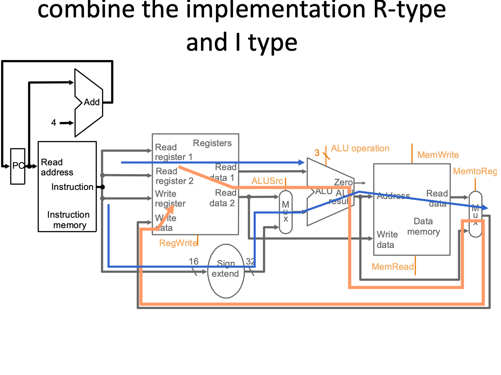
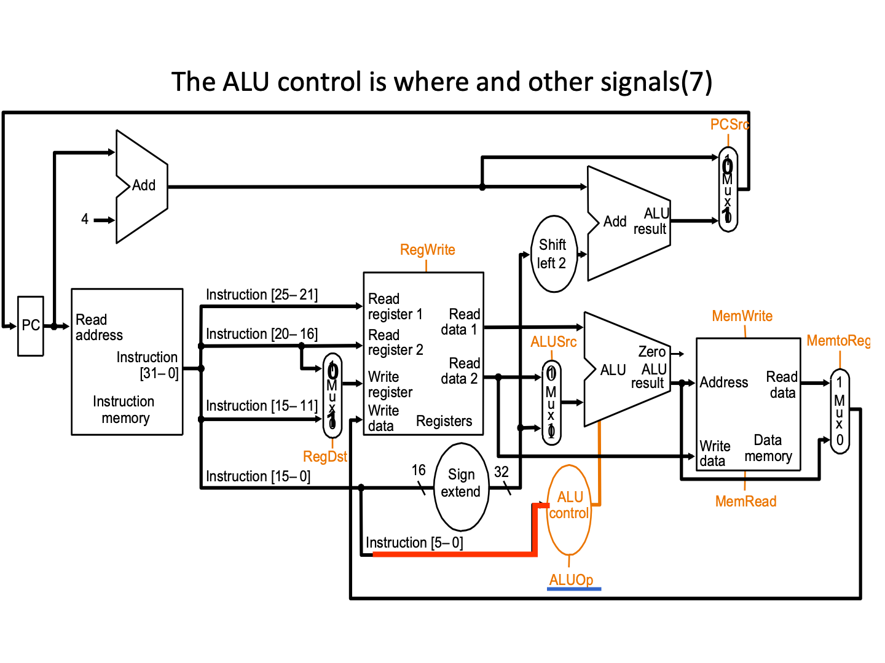
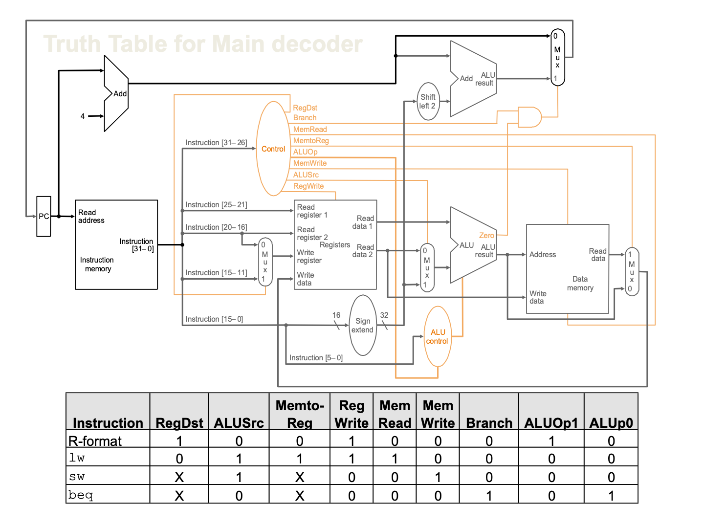
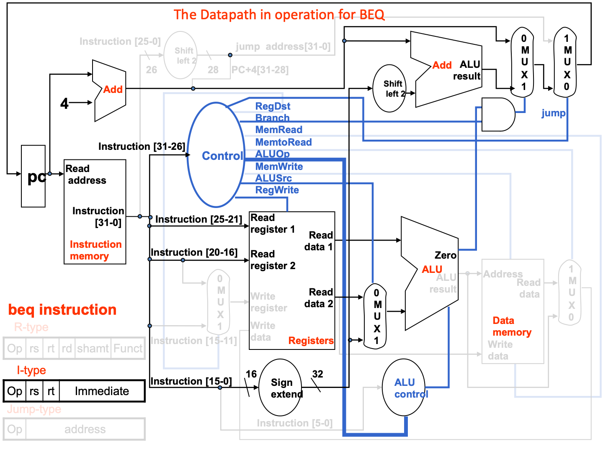
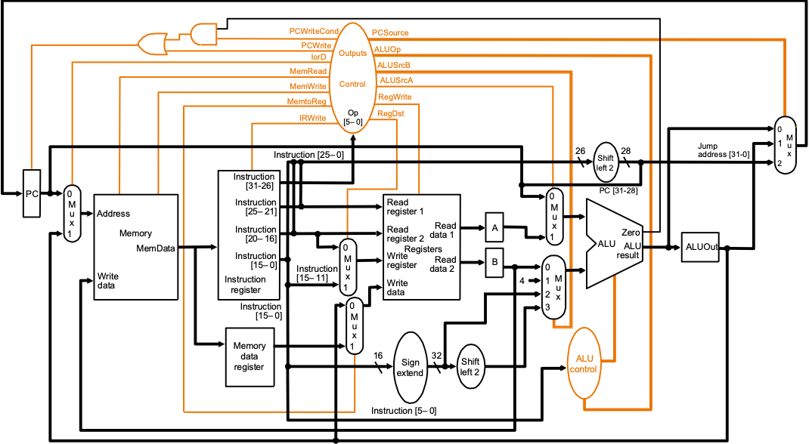

## 单周期指令

<u>单周期的部件一个周期只能用一个(因为单周期的是组合电路)</u>

---

---

---

---

---

---

### Signals for datapath

| Signal name | Effect when deasserted(=0)                                   | Effect when asserted(=1)                                     |
| ----------- | ------------------------------------------------------------ | ------------------------------------------------------------ |
| RegDst      | Select  register destination number from the rt(20:16) when WR | Select  register destination number from the rd(15:11) when WB |
| RegWrite    | None                                                         | Register  destination input is written with the value on the Write data input |
| ALUScr      | The  second ALU operand comes from the second register file output (Read data 2) | The  second ALU operand is the sign-extended lower 16 bits of the instruction. |
| PCSrc       | The  PC is replaced by the output of the addr that computes the value PC+4 | The  PC is replaced by the output of the addr that computes the branch target. |
| MemRead     | None                                                         | Data  memory contents designated by the address input are put on the Read data output. |
| MemWrite    | None                                                         | Data  memory contents designated by the address input are replaced by value on the  Write data input. |
| MemtoReg    | The  value fed to register Write data input comes from the Alu | The  value fed to the register Write data input comes from the data memory. |

### ALUop

* 00：加法(sw lw)
* 01：减法(beq
* 10：由funct决定

### ALU Decoder

| Instruction opcode | ALUOp | Instruction  operation | Funct field | Desired  ALU action | ALU control   Input |
| ------------------ | ----- | ---------------------- | ----------- | ------------------- | ------------------- |
| LW                 | 00    | Load  word             | xxxxxx      | Load  word          | 0010                |
| SW                 | 00    | Store  word            | xxxxxx      | Store  word         | 0010                |
| Beq                | 01    | branch  equal          | xxxxxx      | branch  equal       | 0110                |
| R-type             | 10    | add                    | 100000      | add                 | 0010                |
| R-type             | 10    | subtract               | 100010      | subtract            | 0110                |
| R-type             | 10    | AND                    | 100100      | AND                 | 0000                |
| R-type             | 10    | OR                     | 100101      | OR                  | 0001                |
| R-type             | 10    | Set  on less than      | 101010      | Set  on less than   | 0111                |

### K-Map Implementation

简化后的真值表：

### Main Decoder

关注Control模块的输出

**完整版(加上jump)**

### 时间

| Instruction  class | Instruction  memory | Reg read | ALU  | Data  memory | Reg write | Total |
| ------------------ | ------------------- | -------- | ---- | ------------ | --------- | ----- |
| R-format           | 2                   | 1        | 2    |              | 1         | 6  ns |
| Load  word         | 2                   | 1        | 2    | 2            | 1         | 8  ns |
| Store  word        | 2                   | 1        | 2    | 2            |           | 7  ns |
| Branch             | 2                   | 1        | 2    |              |           | 5  ns |
| Jump               | 2                   |          |      |              |           | 2  ns |

### 单周期的问题

**占用资源**：==寄存器单周期只能一次IO操作，但是可以上升沿读下降沿写；如果一定要两次读或者两次写，则必须用两个寄存器==

**占用时间**：而且多周期实际上更节省时间，因为单周期必须以耗时最长的指令为准；而单周期不同指令可以跑不同周期，更为灵活。

## **多周期**

还是高铁的例子，在xx站和xx站之间只有我一辆车，不要求在出发站和终点站之间只有一辆

We will be reusing functional units

* ALU used to compute address and to increment PC
* Memory used for instruction and data

We will use a **finite state machine** for control

同样的op在不同的周期的Control输出不同，因此比单周期更为麻烦

### 额外的硬件设计

| Signal name | Effect when deasserted(=0)                                   | Effect when asserted(=1)                                     |
| ----------- | ------------------------------------------------------------ | ------------------------------------------------------------ |
| RegDst      | Select  register destination number from the rt(20:16) when WR. | Select  register destination number from the rd(15:11) when WB. |
| RegWrite    | None                                                         | Register  destination input is written with the value on the Write data input |
| ALUScrA     | The  first ALU operand is the PC                             | The  first ALU operand come from the A register.             |
| MemRead     | None                                                         | Memory  contents at the location specified by the address input is put on the Memory  data out. |
| MemWrite    | None                                                         | Memory  contents at the location specified by  the address input are replaced by value on the Write data input. |
| MemtoReg    | The  value fed to register Write data input comes from the ALUOut | The  value fed to the register Write data input comes from the MDA. |
| IorD        | The  PC is used to supply the address to the memory unit.    | ALUOut  is used to supply the address to the memory unit.    |
| IRWrite     | None                                                         | The  output of memory is written into the [IR](Instruction Register). |
| PCWrite     | None                                                         | The  PC is written; the source is controlled by PCSource.    |
| PCWriteCond | None                                                         | The  PC is written if the zero output from the ALU is also active. |

| Signal name | Value | Effect                                                       |
| ----------- | ----- | ------------------------------------------------------------ |
| ALUOp       | 00    | The  ALU performs an add operation.                          |
|             | 01    | The  ALU performs an subtract operation.                     |
|             | 10    | The  funct field of the instruction determines the ALUoperation |
| ALUScrB     | 00    | The  second input to the ALU comes from the B register.      |
|             | 01    | The  second input to the ALU is the constant 4.              |
|             | 10    | The  second input to the ALU is the sign-extended, lower 16 bits of the IR. |
|             | 11    | The  second input to the ALU is the sign-extended, lower 16 bits of the IR shift 2  bits. |
| PCSource    | 00    | Output  of the ALU(PC+4) is sent to the PC for writing.      |
|             | 01    | The  contents of ALUOut (the branch target address) are sent to the PC for  writing. |
|             | 10    | The  jump target address (IR[25:0]shifted left 2 bits and concatenated with  PC+4[31:28]) is sent to the PC for writing. |

