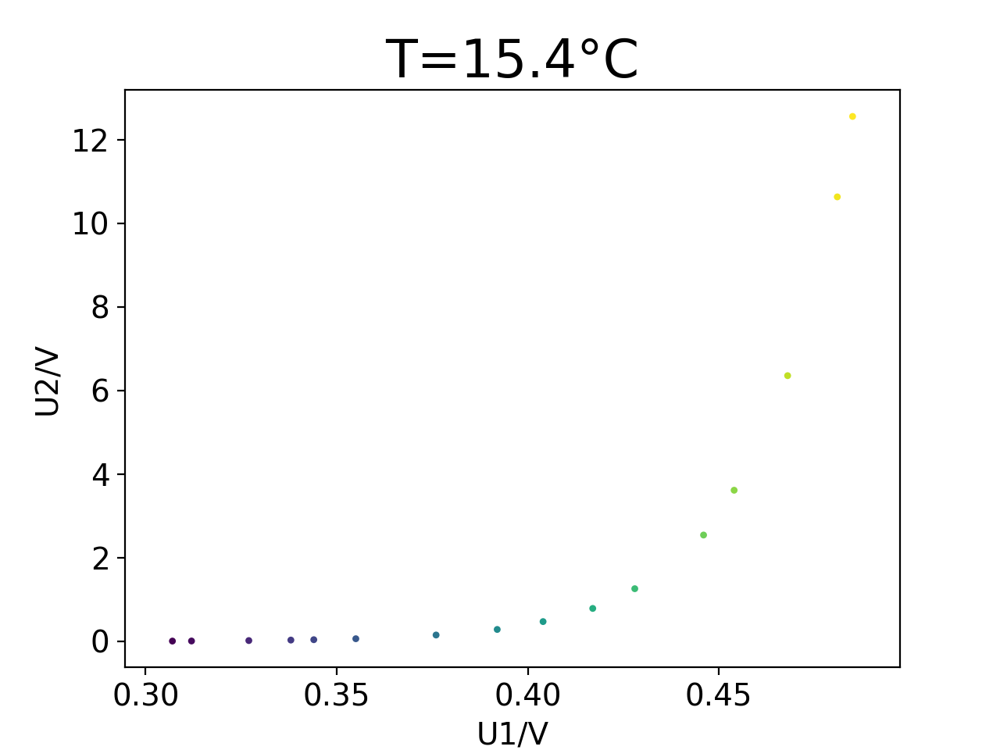
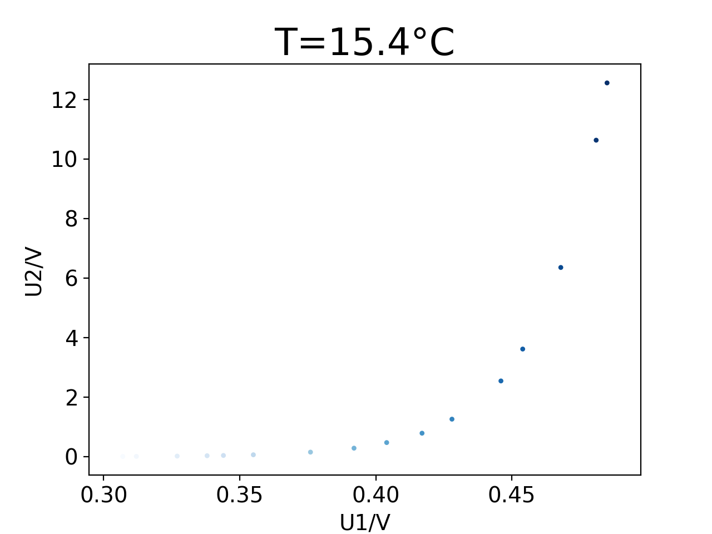

<center><b><font size = "4">Table of contents</font></b></center>
[TOC]

# 骚操作

```bash
python -m SimpleHTTPServer
ifconfig | grep "inet "
```

# 数据类型

## 字符串

> * 用`print()`输出其他类型记得用`str()`函数
> * 大部分`class`函数都是加点跟在后面

py中字符串可用单引号也可双引号，因此字符串中可以包含"或'，如

```python
 LEGAL
'I told my friend, "Python is my favorite language!"'
"The language 'Python' is named after Monty Python, not the snake."
"One of Python's strengths is its diverse and supportive community."
 ILLEGAL
'One of Python's strengths is its diverse community.'  # 肉眼可见的不对劲
```

py2与py3中print函数区别

```python
>>> python2.7
>>> print "Hello Python 2.7 world!"		# 本质上我也不知道是什么，感觉是个macro
Hello Python 2.7 world!

# PY3
>>> print("Hello Python interpreter!")	# 本质上是函数
Hello Python interpreter!
```

一些字符串操作

```python
 大小写转换
strName.title()	# 首字母大写
strName.upper()	# 全大写
strName.lower()	# 全小写

 字符串合并
first_name = "Ada"
last_name = "lovelace"
full_name = "I am " + first_name + " " + last_name.title()  # "I am Ada Lovelace"

 删除头尾空格(并没有实际删除)
>>> favorite_language = ' python '
>>> favorite_language.rstrip()
' python'
>>> favorite_language.lstrip()
'python '
>>> favorite_language.strip()
'python'
>>> favorite_language  # 字符串内容还是这样
' python '
```

## 整数与浮点数

```python
 **表示power运算

 PY3中 3/2=1.5；PY2中 3/2=1

# 浮点运算结果包含的小数位数可能是不确定的
# 但是我在Terminal里测发现不会这样？可能是有优化了
>>> 0.2 + 0.1
0.30000000000000004
>>> 3 * 0.1
0.30000000000000004

 str()将数转为字符串
# 小数也🉑
>>> age = 23
>>> message = "Happy " + str(age) + "rd Birthday!"
>>> print(message)
Happy 23rd Birthday!
# 但是这里小数会有这个现象(1.000-->1.0)，应该是存储的问题，计算机无法区分.00和.0
>>> age = 23.00
>>> message = "Happy " + str(age) + "rd Birthday!"
>>> print(message)
Happy 23.0rd Birthday!
```


# 列表

## 基础

### 创建、访问、修改、添加、删除

```python
>>> bicycles = ['trek', 'cannondale', 'redline', 'specialized']
>>> print(bicycles)
['trek', 'cannondale', 'redline', 'specialized']

>>> bicycles = ['trek', 'cannondale', 'redline', 'specialized']
>>> print(bicycles[0])
trek

 -n表示倒数第n个元素
>>> bicycles = ['trek', 'cannondale', 'redline', 'specialized']
>>> print(bicycles[-3].title())
Cannondale
# 但是不能溢出，比如[-5]就会报错

 修改元素
array[0] = val

 添加元素
# 末尾 append (没返回值(print(list.append('c'))会输出"None"))
>>> motorcycles = ['honda', 'yamaha', 'suzuki']
>>> print(motorcycles.append('ducati'))
>>> print(motorcycles)
None
['honda', 'yamaha', 'suzuki', 'ducati']

# 中间插入 insert (没返回值(print(list.insert(x, 'c'))会输出"None"))
>>> motorcycles = ['honda', 'yamaha', 'suzuki']
>>> print(motorcycles.insert(0, 'ducati'))
>>> print(motorcycles)
None
['ducati', 'honda', 'yamaha', 'suzuki']

 删除元素
# 用del
>>> motorcycles = ['honda', 'yamaha', 'suzuki']
>>> del motorcycles[0]
>>> print(motorcycles)
['yamaha', 'suzuki']

# 用pop(永久弹出/有返回值)
## 没加参数弹最后一个
>>> motorcycles = ['honda', 'yamaha', 'suzuki']
>>> print(motorcycles.pop())  #返回值是个元素
>>> print(motorcycles)
suzuki
['honda', 'yamaha']
## 加了参数弹该位置的元素
>>> motorcycles = ['honda', 'yamaha', 'suzuki']
>>> print(motorcycles.pop(1))  #返回值是个元素
>>> print(motorcycles)
yamaha
['honda', 'suzuki']

# 用remove(无返回值(print(list.remove())会报错))
>>> motorcycles = ['honda', 'yamaha', 'suzuki']
>>> motorcycles.remove('yamaha')  #参数也可以是变量
>>> print(motorcycles)
['honda', 'suzuki']
## 若有多个重复的只会删掉第一个
>>> motorcycles = ['1', '2', '1']
>>> motorcycles.remove('1')
>>> print(motorcycles)
['2', '1']
## 没有的会报错
>>> motorcycles = ['1', '2', '3']
>>> motorcycles.remove('4')
File "<stdin>", line 1, in <module>
ValueError: list.remove(x): x not in list

```

### 组织

```python
 永久排序
>>> listName.sort()
>>> print(listName)

 临时排序
>>> print(sorted(listName))

 永久反转
>>> listName.reverse()

 获取长度
>>> cars = ['bmw', 'audi', 'toyota', 'subaru']
>>> len(cars)
4
```

### 索引错误


## 列表操作

### 循环

```python
>>> magicians = ['alice', 'david', 'carolina']
>>> for magician in magicians:
>>>     print(magician)

 此处，显然magician不是仅在for中作用的临时变量
>>> magicians = ['alice', 'david', 'carolina']
>>> for magician in magicians:
>>> 	print(magician.title() + ", that was a great trick!")
>>> print("I can't wait to see your next trick, " + magician.title() + ".\n")
Alice, that was a great trick!
David, that was a great trick!
Carolina, that was a great trick!
I can't wait to see your next trick, Carolina.

>>> for value in range(1,3)
>>> 	print(value)
1
2

 用list(range())生成列表
 list(tup) ## tup为要转换为列表的元组
 range(start, stop[, step])

>>> numbers = list(range(1,6))
>>> print(numbers)
[1, 2, 3, 4, 5]

>>> even_numbers = list(range(2,11,2))
>>> print(even_numbers)
[2, 4, 6, 8, 10]

# 复杂操作
>>> squares = []
>>> for value in range(1,11):
>>> 	square = value**2
>>> 	squares.append(square)
>>> print(squares)
[1, 4, 9, 16, 25, 36, 49, 64, 81, 100]

# 统计计算
>>> digits = [0, 1, 2, 3, 4, 5, 6, 7, 8, 9]
>>> min(digits)
0
>>> max(digits)
9
>>> sum(digits)
45

# 列表解析

>>> squares = [value**2 for value in range(1,11)]
>>> print(squares)
[1, 4, 9, 16, 25, 36, 49, 64, 81, 100]

```

==不要遗漏了for后面的冒号==

## 切片

### 切片表示

`[a,b]`表示的是$[a,b)$即$[a,b-1]$

```python
>>> players = ['charles', 'martina', 'michael', 'florence', 'eli']
>>> print(players[1:4])
['martina', 'michael', 'florence']

# 未指定第一个索引的情况默认从头开始
>>> print(players[:4])
['charles', 'martina', 'michael', 'florence']

# 终止于结尾也一样
>>> print(player[2:])
['michael', 'florence', 'eli']

# 若要最后n个元素可以用负数表示
>>> print(player[-3:])
['michael', 'florence', 'eli']
```

### 遍历切片

```python
>>> for player in players[:3]
```

### 利用切片复制列表

```python
>>> foods_copy = foods_orig[:]

>>> friend_foods = my_foods # 注：这种方式不是赋值，而相当于C中的指针赋值
```

## 元祖

>列表非常适合用于存储在程序运行期间可能变化的数据集。列表是可以修改的，这对处理网站的用户列表或游戏中的角色列表至关重要。然而，有时候你需要创建一系列**不可修改**的元素，元组可以满足这种需求。Python 将不能修改的值称为不可变的 ，而<u>不可变的列表被称为元组</u>。

### 使用

```python
>>> dimensions = (200, 50)
>>> print(dimensions[0])
>>> print(dimensions[1])
200
50

>>> dimensions[0] = 250		# 元素无法赋值
TypeError: 'tuple' object does not support item assignment

>>> dimensions = (400, 100)	# 但是整个tuple可以重新赋值
>>> print("\nModified dimensions:")
>>> for dimension in dimensions:
>>>     print(dimension)
Modified dimensions:
400
100
```

# 条件语句

记得冒号就行了

逻辑的与或是`and`和`or`，不是`&&`和`or`


# 字典

## 基本

一种方式

```python
>>> alien_0 = {'color': 'green', 'points': 5}	# 键-值对
>>> print(alien_0['color'])						# []中存放的称为键
>>> print(alien_0['points'])	
green
5
```

从空字典开始创建

```python
>>> alien_0 = {}
>>> alien_0['color'] = 'green'
>>> alien_0['point'] = 5
>>> print(alien_0)
{'color': 'green', 'points': 5}
```

**修改**：直接赋值

```python
alien_0['color'] = 'yellow'
```

**Ex**. alien_move.py

```python
alien_0 = {'x_position': 0, 'y_position': 25, 'speed': 'medium'}
print("Original x-position: " + str(alien_0['x_position']))
# 向右移动外星人
# 据外星人当前速度决定将其移动多远
if alien_0['speed'] == 'slow':
	x_increment = 1
elif alien_0['speed'] == 'medium':
	x_increment = 2
else:
    x_increment = 3
# 新位置等于老位置加上增量
alien_0['x_position'] = alien_0['x_position'] + x_increment
print("New x-position: " + str(alien_0['x_position']))
```

\- 若要实现速度的改变，可直接加上`alien_0['speed'] = fast`

## 字典遍历

使用`.item()`

```python
>>> user_0 = {
>>>     'username': 'efermi',
>>>     'first': 'enrico',
>>>     'last': 'fermi',
>>> 	}
>>> for key, value in user_0.items():	# key, value不是keyword，仅是变量名
>>>     print("\nKey: " + key)
>>>     print("Value: " + value)
Key: last
Value: fermi

Key: first
Value: enrico

Key: username
Value: efermi
```

**注意**：这顺序不是存储时的顺序，py只关心键-值的对应关系不关心存储顺序

```python
for name in favorite_languages.keys():			# 遍历键：使用`.key()`

for language in favorite_languages.values():	# 遍历值：使用`.value()`

for name in sorted(favorite_languages.keys()):	# 排序(使用`sorted()`，此处是按字母序)

for language in set(favorite_languages.values()):	# `set()`剔除重复项
```

## 嵌套

### 列表套字典

```python
alien_0 = {'color': 'green', 'points': 5}
alien_1 = {'color': 'yellow', 'points': 10}
alien_2 = {'color': 'red', 'points': 15}
aliens = [alien_0, alien_1, alien_2]

# 调用
for alien in aliens:
    alien['color'] = ...
```

**alien.py**

> 在什么情况下需要处理成群结队的外星人呢?想象一下，可能随着游戏的进行，有些外星人会变色且移动速度会加快。必要时，我们可以使用for 循环和if 语句来修改某些外星人的颜色。例如，要将前三个外星人修改为黄色的、速度为中等且值10个点，可以这样做:
>
> 鉴于我们要修改前三个外星人，需要遍历一个只包含这些外星人的切片。当前，所有外星人都是绿色的，但情况并非总是如此，因此我们编写了一条if 语句来确保只修改绿色外 星人。如果外星人是绿色的，我们就将其颜色改为'yellow' ，将其速度改为'medium' ，并将其点数改为10 ，如下面的输出所示:
>
> 你可以进一步扩展这个循环，在其中添加一个elif 代码块，将黄色外星人改为移动速度快且值15个点的红色外星人，如下所示(这里只列出了循环，而没有列出整个程序):

```python
# 创建一个用于存储外星人的空列表 aliens = []
aliens = []

# 创建30个绿色的外星人
for alien_number in range (0,30):
	new_alien = {'color': 'green', 'points': 5, 'speed': 'slow'}
    aliens.append(new_alien)

for alien in aliens[0:3]:
	if alien['color'] == 'green':
		alien['color'] = 'yellow'
        alien['speed'] = 'medium'
        alien['points'] = 10
    elif alien['color'] == 'yellow':
        alien['color'] = 'red'
        alien['speed'] = 'fast'
        alien['points'] = 15

# 显示前五个外星人
for alien in aliens[0:5]:
	print(alien)
print("...")
```

### 字典套列表

```python
pizza = {
    'crust': 'thick',
    'toppings': ['mushrooms', 'extra cheese'],
	}

# 调用
for topping in pizza['toppings']:
    if topping == '?':
        topping = ...
```

### 字典套字典

**many_users.py**

```python
users = { 
	'aeinstein': {
		'first': 'albert',
		'last': 'einstein',
		'location': 'princeton',
		},

	'mcurie': {
		'first': 'marie',
		'last': 'curie',
		'location': 'paris',
		},
}
for username, user_info in users.items():
	print("\nUsername: " + username)
	full_name = user_info['first'] + " " + user_info['last']
	location = user_info['location']
	print("\tFull name: " + full_name.title())
	print("\tLocation: " + location.title())
```


# 用户输入

* `input("prompt")`
    * PY2：`raw_input() `
* 数值输入：`a = int(input("prompt"))` / `a = float(input("prompt"))`
    * `print(str(a))`


# while循环

* 新思路？：设置`flag`，然后用`while flag:`
* `break`、`continue`依旧可用

## 应用

### 在列表间移动元素

for 循环是一种遍历列表的有效方式，但在for 循环中不应修改列表，否则将导致Python难以跟踪其中的元素。要在遍历列表的同时对其进行修改，可使用while 循环。通过 将while 循环同列表和字典结合起来使用，可收集、存储并组织大量输入，供以后查看和显示。

**confirmed_users.py**

>假设有一个列表，其中包含新注册但还未验证的网站用户;验证这些用户后，如何将他们移到另一个已验证用户列表中呢?一种办法是使用一个while 循环，在验证用户的同时将其从未验证用户列表中提取出来，再将其加入到另一个已验证用户列表中。代码可能类似于下面这样:

```python
>>>	# 首先，创建一个待验证用户列表
>>>	# 和一个用于存储已验证用户的空列表
>>>	unconfirmed_users = ['alice', 'brian', 'candace']
>>>	confirmed_users = []
>>>	
>>>	# 验证每个用户，直到没有未验证用户为止
>>>	# 将每个经过验证的列表都移到已验证用户列表中
>>>	while unconfirmed_users:
>>>		current_user = unconfirmed_users.pop()	# pop是永久弹出、有返回值的
>>>		print("Verifying user: " + current_user.title())
>>>		confirmed_users.append(current_user)
>>>	
>>>		# 显示所有已验证的用户
>>>	print("\nThe following users have been confirmed:")
>>>	for confirmed_user in confirmed_users:
>>>		print(confirmed_user.title())
Verifying user: Candace
Verifying user: Brian
Verifying user: Alice

The following users have been confirmed:
Candace
Brian
Alice
```

### 删除列表中重复元素

```python
pets = ['dog', 'cat', 'dog', 'goldfish', 'cat', 'rabbit', 'cat']
while 'cat' in pets:
    pets.remove('cat')
```

### 获取输入填入字典

**mountain_poll.py**

```python
>>> responses = {}
>>> 
>>> # 设置一个标志，指出调查是否继续 polling_active = True
>>> while polling_active:
>>> 	# 提示输入被调查者的名字和回答
>>> 	name = input("\nWhat is your name? ")
>>> 	response = input("Which mountain would you like to climb someday? ")
>>> 	
>>> 	# 将答卷存储在字典中
>>> 	responses[name] = response
>>> 	# 看看是否还有人要参与调查
>>> 	repeat = input("Would you like to let another person respond? (yes/ no) ")
>>> 	if repeat == 'no':
>>> 		polling_active = False
>>> 
>>> # 调查结束，显示结果
>>> print("\n--- Poll Results ---")
>>> for name, response in responses.items():
>>> 	print(name + " would like to climb " + response + ".")
What is your name? Eric
Which mountain would you like to climb someday? Denali
Would you like to let another person respond? (yes/ no) yes

What is your name? Lynn
Which mountain would you like to climb someday? Devil's Thumb
Would you like to let another person respond? (yes/ no) no

--- Poll Results ---
Lynn would like to climb Devil's Thumb.
Eric would like to climb Denali.
```


# 函数

## 各部

### 传参

#### 传任意数量的参

利用tuple

```python
def make_pizza(*toppings):
    """概述要制作的比萨"""
    print("\nMaking a pizza with the following toppings:")
    for topping in toppings:
        print("- " + topping)

make_pizza('pepperoni')
make_pizza('mushrooms', 'green peppers', 'extra cheese')
```

注：若声明为`def make_pizza(toppings)`则输出是：

```bash

Making a pizza with the following toppings:
- p
- e
- p
- p
- e
- r
- o
- n
- i
Traceback (most recent call last):
  File "/Users/ulysses/Documents/大二上/PY/Untitled.py", line 8, in <module>
    make_pizza('mushrooms', 'green peppers', 'extra cheese')
TypeError: make_pizza() takes 1 positional argument but 3 were given
```

<u>即会认为只有一个参</u>

### 默认值

```python
def describe_pet(pet_name, animal_type='dog'):	# 已认定默认值为'dog'则传参时可略过animal_type
    """显示宠物的信息"""							# '''或"""表示多行注释
    print("\nI have a " + animal_type + ".")
    print("My " + animal_type + "'s name is " + pet_name.title() + ".")
describe_pet(pet_name='willie')
```

### 等效调用

可以用`keyword = value`的形式调用

```python
# 一条名为Willie的小狗
describe_pet('willie')
describe_pet(pet_name='willie')
# 一只名为Harry的仓鼠
describe_pet('harry', 'hamster')
describe_pet(pet_name='harry', animal_type='hamster')
describe_pet(animal_type='hamster', pet_name='harry')
```

### 返回

直接`return`

#### 模块

```python
import libName
import libName as lN
from libName import funcName
from libName import *
```

### 格式

若参数过多，需另起一行两个Tab

总之最好符合[PEP 8](https://www.python.org/dev/peps/pep-0008/)

```python
def function_name(
		parameter_0, parameter_1, parameter_2,
		parameter_3, parameter_4, parameter_5):
	function body...
```


---


# Matplotlib

## scatter

**parameter**

* 若传入的是点(横纵坐标)则画出单点，如`plt.scatter(2,3)`，但是这种方法不能画多点，像`plt.scatter(2,3, 4,5)`会报错

* 传入列表两个表示横纵坐标，注意：元素个数需匹配否则会报错

* **s**：表示点的大小

* **c**：点的颜色

    * 颜色可以用`"red"`或`"R"`表示，也可以直接`(R,G,B)`其中$\rm R,G,B \in [0,1]$

* **edgecolor**：边缘颜色，特殊的，可以用`"none"`来防止糊成一团

* **cmap**：颜色映射(值用U1表示，可能会爆)

    * 不用映射`plt.scatter(U1, U2, edgecolor = "none", c = U1, s = 10)`

        

    * 用了映射`plt.scatter(U1, U2, edgecolor = "none", c = U1, cmap = plt.cm.Blues, s = 10)`

        

附程序，其中U1U2是PN结实验的数据

```python
import matplotlib.pyplot as plt
U1 = [
	0.307,
	0.312,
	0.327,
	0.338,
	0.344,
	0.355,
	0.376,
	0.392,
	0.404,
	0.417,
	0.428,
	0.446,
	0.454,
	0.468,
	0.481,
	0.485,
	]
U2 = [
	0.007,
	0.009,
	0.019,
	0.031,
	0.04,
	0.063,
	0.152,
	0.285,
	0.473,
	0.788,
	1.26,
	2.544,
	3.616,
	6.357,
	10.634,
	12.559,
	]

Test1 = range(0, 100)
Test2 = Test1
plt.scatter(Test1, Test1, edgecolor = "none", c = Test1,  s = 10)
# plt.plot(U1, U2, linewidth=3)
plt.title("T=15.4°C", fontsize=24)
plt.xlabel("U1/V", fontsize=14)
plt.ylabel("U2/V", fontsize=14)
plt.tick_params(axis='both', labelsize=14)
plt.show()
```

## plot

传入**一个**列表表示折线图，需另设定

另一个折线图例程

```python
import csv
from matplotlib import pyplot as plt
# 从文件中获取最高气温 --snip--
highs = [64, 71, 64, 59, 69, 62, 61, 55, 57, 61, 57, 59, 57, 61, 64, 61, 59, 63, 60, 57, 69, 63, 62, 59, 57, 57, 61, 59, 61, 61, 66]
# 根据数据绘制图形
fig = plt.figure(dpi=128, figsize=(10, 6))
plt.plot(highs, c='red')
# 设置图形的格式
plt.title("Daily high temperatures, July 2014", fontsize=24)
plt.xlabel('', fontsize=16)
plt.ylabel("Temperature (F)", fontsize=16)
plt.tick_params(axis='both', which='major', labelsize=16)
plt.show()
```

## 其他函数

* **figure**：设定像素密度**`plt.figure(dpi=128, figsize=(10, 6))`
* **tick_params**：设轴颜色等`plt.tick_params(axis='both', which='major', colors = "R", labelsize=16)`
* **title**, **xlabel**, **ylabel**：参数：`color`, `fontsize`
* 

# matplotlib+numpy+scipy

```python
import matplotlib.pyplot as plt
import numpy as np
from scipy.optimize import curve_fit

def func_nlogn(x, cof_nlogn):
	return cof_nlogn * x * np.log(x)

x = np.arange(10000, 100001, 10000)
# y = np.array([0.708964, 2.87730, 6.53083, 11.5626, 18.3661, 26.0043, 35.6226, 45.7856, 58.9745, 71.0816])
y = [0.708964, 2.87730, 6.53083, 11.5626, 18.3661, 26.0043, 35.6226, 45.7856, 58.9745, 71.0816]


f_linear = np.poly1d(np.polyfit(x, y, 1))
f_poly = np.poly1d(np.polyfit(x, y, 2))
f_exp = np.poly1d(np.polyfit(x, np.log(y), 1))
popt = curve_fit(func_nlogn, x, y)
cof_nlogn = popt[0]


plt.scatter(x, y, color = "grey", label = "Sample")
plt.plot(x, f_linear(x), label = "Linear")
plt.plot(x, f_poly(x), label = "Quadratic")
plt.plot(x, np.exp(f_exp(x)), label = "Exponent")
plt.plot(x, func_nlogn(x, cof_nlogn), label = "O(NlogN)")


plt.xlabel("Sacle of N")
plt.ylabel("Time/sec")
plt.legend()
plt.grid()
plt.show()
```

