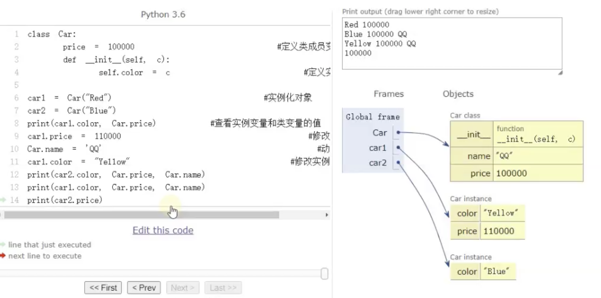

[TOC]

# Chapter 1

```python
# 单行输入多个数字
a, b, c = map(int, input().split())

# type()显示变量类型

# +@, -@是sign运算，+-@,-+@同-@；++@,--@同+@

# 关于int()
>>> int("123.4")
ValueError: invalid literal for int() with base 10: '123.4'
>>> int(-123.9)	# 切掉小数部分
-123

# 关于eval()
>>> eval("12")
12
>>> eval("12.34")
12.34
>>> eval(12)
TypeError: eval() arg 1 must be a string, bytes or code object

# 关于id()
>>> x = 3
>>> print(id(x))
>>> x = 7
>>> print(id(x))
4451259600
4451259728

# 关于sum()
sum = sum(1/(2*i-1) for i in range (1, n+1))
```

\! `<<` 优先级低于+/-

UTF-8 是 Unicode 的实现方式之一。是**变长**字符集

类型在使用过程中可以改变：`x = 3; x = '123'`

| 运算符                     | 描述                                                       | Addition                                                     |
| :------------------------- | :--------------------------------------------------------- | ------------------------------------------------------------ |
| `+@, -@`                   | 正负号                                                     |                                                              |
| `**`                       | 指数 (最高优先级)                                          | `3**2**3==6561==3**8`<br />**从右向左**3\^(2\^3)             |
| ~~`~ + -`~~                | ~~按位翻转, 一元加号和减号 (最后两个的方法名为 +@ 和 -@)~~ |                                                              |
| `* / % //`                 | 乘，除，取模和取整除                                       | <u>浮点数(无论是除数还是被除数)整除完还是浮点数</u>：<br />`type(1.1//1)==type(2//1.1)==<class 'float'>` |
| `+ -`                      | 加法减法                                                   |                                                              |
| `>> <<`                    | 右移，左移运算符                                           | 课程不要求                                                   |
| `&`                        | 位 'AND'                                                   | 课程不要求                                                   |
| `^ |`                      | 位运算符                                                   | 课程不要求                                                   |
| `<= < > >=`                | 比较运算符                                                 |                                                              |
| `<> == !=`                 | 等于运算符                                                 |                                                              |
| `= %= /= //= -= += *= **=` | 赋值运算符                                                 |                                                              |
| `is, is not`               | 身份运算符                                                 | 课程不要求                                                   |
| `in, not in`               | 成员运算符                                                 | 课程不要求                                                   |
| `not, and, or`             | 逻辑运算符                                                 | not > and > or                                               |

# Chapter 2

## 浮点、格式

```python
# 保留位数+四舍五入
print("%.2f" % a)
print("f(%.1f) = %.1f" % (x, s))	# 多个
round(a, 2)
print(format(1234.56789, "5.3f"))	# 1234.567	# 超过场宽了
print("Avg is {:.1f}".format(avg))

# 逗号分隔
a, b, c = map(int, input().split(','))

# 列表输入转化
myList = list(map(int,input().split()))

# range()
range(lower_bound, upper_bound, step)
```

各种type见第二章习题

`chr()`返回当前值对于的ASCII字符

~~字符串以\0标志字符串结束~~

**Regax**

```python
>>> import sys
>>> a=complex(1,2); a
(1+2j)
>>> 1+2J # 大小写都可以
(1+2j)
>>> 1+2j
(1+2j)
>>> a.real	# 不是函数没有()；是变量成员？
1.0
>>> a.imag
2.0
```

==单斜杠就是浮点除==

**负数的取整和求余**

* 向左取整`-3 // 2 == -2`
* 向左取余`-9 % 4  ==  3`


==**浮点数**的误差：特别注意取等的判断==

```python
2.1 - 2.0 != 0.1
round(2.1 - 2.0, 1) == 0.1
round(2.675, 2) == 2.67 != 2.68	# 这个也注意

>>> round(18.67, -1)			# !!!!直接输出会保留一位但是还是float
20.0
>>> round(12345.6789, -3)
12000.0
>>> type(round(12345.6789, -3))
<class 'float'>

>>> print("%.32f" % 2.675)
2.67499999999999982236431605997495
```

陷阱

```python
>>> 2 == 2.0
True
>>> 1 == 1.0
True
>>> 2.0 - 1.0 == 1.0
True
>>> 1 - 0.9 == 0.1		# 为什么真的迷惑(能用计租中浮点数格式精确表示的就行了，
False
```


math库

```python
math.pow(x, y)
pow(x, y[, z])	# 自带的，pow(x,y)%z
```


string

```python
# 独特操作是"括'，'括"，转义也可以
# 下标：正向0到n-1，反向-1到-n
>>> str = "abcdefghijklmn"
>>> str[0: 9: 2]	# 
'acegi'
>>> str[-1: -9: -2]	# 注意步长相应变负
'nljh'
>>> str.replace('cde', '12'); str	# 只换第一个
'ab12fghijklmn'
```

## 关系运算、逻辑运算

关系运算符

```python
>>> 1<3<5
True
>>> 3<5>2	# == 3 < 5 and 5 > 2
True
>>> "Hello" > "world" # 'H' < 'w'
False
# 仍然有短路原则，即能确定解就不往下了，所以即使后面有语法错误也不会报错
>>> 3 < 5 and 'a' > 3
False
>>> 3 > 5 or 'a' > 3
  File "<stdin>", line 1, in <module>
TypeError: '>' not supported between instances of 'str' and 'int'
    
>>> ((2>=2) or (2<2)) and 2	# 为什么啊啊啊啊啊啊啊啊啊
2
>>> True and 99
99
```

==关系表达式返回值只有`True`和`False`==

~~==Python中逻辑表达式不再将数作为bool型处理了==~~

| 运算符 | 逻辑表达式 | 描述                                                         | 实例                    |
| :----- | :--------- | :----------------------------------------------------------- | :---------------------- |
| and    | `x and y`  | 布尔"与" - 如果 x 为 False，x and y 返回 False，否则它返回 y 的计算值。<br />在布尔上下文中从左到右演算表达式的值，如果布尔上下文中的**所有值都为真，那么 and 返回最后一个值。**<br/>如果布尔上下文中的**某个值为假，则 and 返回第一个假值** | (a and b) 返回 20。     |
| or     | `x or y`   | 布尔"或" - 如果 x 是非 0，它返回 x 的值，否则它返回 y 的计算值。<br />如果**有一个值为真，or 立刻返回该值**<br/>如果**所有的值都为假，or 返回最后一个假值** | (a or b) 返回 10。      |
| not    | `not x`    | 布尔"非" - 如果 x 为 True，返回 False 。如果 x 为 False，它返回 True。<br />将数视作bool | not(a and b) 返回 False |

Ex.

`0 and 1 or not 2 < True`：`0and1`返回0，`not 2 < True`返回True，`0 or True`返回第一个真值`True`

`ord("")`查询Unicode编码，只能单字符

## 基本语句

关于连等：z已赋值，`x=(y=z+1)`语句是错误语句，但`x=y=z+1`是ok的

### 序列赋值

，以下这种只能给单字符字符串

```python
>>> a, b = "34"
>>> a
'3'
>>> b
'4'

>>> a, b = "123"
ValueError: too many values to unpack (expected 2)
>>> a, b = "1234"
ValueError: too many values to unpack (expected 2)
```

不等长赋值

这里是当作**列表**操作的而不是字符串

```python
>>> i, *j = "1234"
>>> i
'1'
>>> j
['2', '3', '4']


>>> *a, b = [1, 2, 3]
>>> a
[1, 2]
>>> b
3
```


**range**

三个参数都是`int`

start为0可缺省，但此时步长也必须缺省(否则`stop, step`会被当成`start, stop`)

### sum

```python
>>> sum(range(1, 101))
5050
>>> sum([1, 3, 7])
11
>>> sum(1/i for i in range(1,21))
3.597739657143682
>>> sum([1/i for i in range(1,21)])
3.597739657143682
```

### 列表推导式

要加中括号

```python
求6+66+...

tmp = 0
for i in range(1, n+1):
    a += tmp + 6
    tmp *= 10

for i in range(1, n+1):
    a += int('6' * i)

a = sum([int('6' * i) for i in range(1, n+1)])

myList = [2 * number for number in [1,2,3,4,5]]

# 加条件
[expression for item in iterable if condition]
[i for i in range(1,8) if i % 2 == 1]	# 求1到7奇数的列表
[exp1 if condition else exp2 for item in iterable]
# [if condition exp1 else exp2 for item in iterable]本质是这样但是不能这么写，否则condition和exp1会没有keyword分隔
[1 if i%2 == 1 else 0 for i in range(0,10)]

# 二维列表
print([[i for i in range(1+j*3, 4+j*3)] for j in range(0, 3)])
```

换硬币用列表推导式写

```python
n = int(input())
ls = [(i, j, k) for i in range(n//5, 0, -1) for j in range(n//2, 0, -1) for k in range(n, 0, -1) if 5*i+2*j+k==n]
for i in ls:
    print("fen5:%d, fen2:%d, fen1:%d, total:%d" % (i[0], i[1], i[2], i[0]+i[1]+i[2]))
print("count = %d" % len(ls))
```

# Chapter3 数据容器：序列

## 序列操作

| 操作       | **描述**                                 |                                        |
| ---------- | ---------------------------------------- | -------------------------------------- |
| X1+X2      | 联接序列X1和X2，生成新序列               |                                        |
| X\*n       | 序列X重复n次，生成新序列                 |                                        |
| X[i]       | 引用序列X中下标为i的成员                 | -1开始导数                             |
| X[i:j]     | 切片：引用序列X中下标为i到j-1的子序列    |                                        |
| X[i: j: k] | 引用序列X中下标为i到j-1的子序列，步长为k | i，j越界没关系，如果没东西会反应为空集 |
| X[::-1]    | 倒序切片                                 |                                        |
| len(X)     | 计算序列X中成员的个数                    |                                        |
| max(X)     | 序列X中的最大值                          | 字符串的通过Unicode来比较              |
| min(X)     | 序列X中的最小值                          | 可以通过`ord()`查询Unicode             |
| v in X     | 检查v是否在序列X中，返回布尔值           |                                        |
| v not in X | 检查v是否不在序列X中，返回布尔值         |                                        |

访问操作：

```python
>>> print([2, 3, 5, 7, 11, 13][1:-3])
[3, 5]
>>> print([2, 3, 5, 7, 11, 13][2:])
[5, 7, 11, 13]
>>> print([2, 3, 5, 7, 11, 13][:3])
[2, 3, 5]
>>> print([2, 3, 5, 7, 11, 13][:-2])
[2, 3, 5, 7]
>>> print([2, 3, 5, 7, 11, 13][-1:0:-1])
[13, 11, 7, 5, 3]

>>> print([2, 3, 5, 7, 11, 13][3::-1])
[7, 5, 3, 2]
>>> print([2, 3, 5, 7, 11, 13][3:-5:-1])
[7, 5]
>>> print([2, 3, 5, 7, 11, 13][3:-5:1])
[]
>>> print([2, 3, 5, 7, 11, 13][:])
[2, 3, 5, 7, 11, 13]
>>> print([2, 3, 5, 7, 11, 13][])
  File "<stdin>", line 1
    print([2, 3, 5, 7, 11, 13][])
                               ^
SyntaxError: invalid syntax
```


## 字符串

`TypeError: 'str' object does not support item assignment`

==str是只读的数据类型==

`"Hello"`

在前面加r则转义符不工作(实际上是吧`\`变成`\\`)

```python
>>> r"hello\nworld"
'hello\\nworld'
```

### %

```python
>>> print("%4d" % 9)	# 设置场宽，默认右对齐
   9
>>> print("%-4d" % 9)	# 改为左对齐，注意他会补空格
9   
>>> print("%04d" % 9)	# 0表示补0左对齐
0009
>>> print("%+03d" % 9)	# 0表示补0左对齐
+09
>>> print("%-03d" % 9)	# 注意他会补空格
9  
>>> print("%+d" % 9)	# +表示输出sign
+9
>>> print("%+d" % -9)	# +表示输出sign
-9
```


### format

**^**, **<**, **>** 分别是居中、左对齐、右对齐，后面带宽度， **:** 号后面带填充的字符，只能是一个字符，不指定则默认是用空格填充。

**+** 表示在正数前显示 **+**，负数前显示 **-**； （空格）表示在正数前加空格

b、d、o、x 分别是二进制、十进制、八进制、十六进制。

| 数字       | 格式                                                         | 输出                                          | 描述                         |
| :--------- | :----------------------------------------------------------- | :-------------------------------------------- | :--------------------------- |
| 3.1415926  | {:.2f}                                                       | 3.14                                          | 保留小数点后两位             |
| 3.1415926  | {:+.2f}                                                      | +3.14                                         | 带符号保留小数点后两位       |
| -1         | {:+.2f}                                                      | -1.00                                         | 带符号保留小数点后两位       |
| 2.71828    | {:.0f}                                                       | 3                                             | 不带小数                     |
| 5          | {:0>2d}                                                      | 05                                            | 数字补零 (填充左边, 宽度为2) |
| 5          | {:x<4d}                                                      | 5xxx                                          | 数字补x (填充右边, 宽度为4)  |
| 10         | {:x<4d}                                                      | 10xx                                          | 数字补x (填充右边, 宽度为4)  |
| 1000000    | {:,}                                                         | 1,000,000                                     | 以逗号分隔的数字格式         |
| 0.25       | {:.2%}                                                       | 25.00%                                        | 百分比格式                   |
| 1000000000 | {:.2e}                                                       | 1.00e+09                                      | 指数记法                     |
| 13         | {:>10d}                                                      | 13                                            | 右对齐 (默认, 宽度为10)      |
| 13         | {:<10d}                                                      | 13                                            | 左对齐 (宽度为10)            |
| 13         | {:^10d}                                                      | 13                                            | 中间对齐 (宽度为10)          |
| 11         | `'{:b}'.format(11)`<br />`'{:d}'.format(11)` <br />`'{:o}'.format(11)` <br />`'{:x}'.format(11)` <br />`'{:#x}'.format(11)` <br />`'{:#X}'.format(11)` | 1011<br />11<br />13<br />b<br />0xb<br />0xB | 进制                         |

```python
>>> "{1} {0} {1}".format("hello", "world")  # 设置指定位置
'world hello world'

>>> print('value 为: {0.value}'.format(my_value))  # "0" 是可选的
value 为: 6
    
>>> print("{:.2f}".format(3.1415926));
3.14

print("f({0:.1f}) = {1:.1f}".format(x, s))	# ~~不加索引(0, 1)则按顺序~~规范一点好
print("f(%.1f) = %.1f" % (x, s))
```

```python
>>> '{0:*>10}'.format(10)		# 右对齐
'********10'
>>> '{0:*<10}'.format(10)		# 左对齐
'10********'
>>> '{0:*^10}'.format(10)		# 居中对齐
'****10****'
>>> '{0:.2f}'.format(1/3)
'0.33'
>>> '{0:b}'.format(10)			# 二进制
'1010'
>>> '{0:o}'.format(10)			# 八进制
'12'
>>> '{0:x}'.format(10)			# 16进制
'a'
>>> '{:,}'.format(12345678901)	# 千分位格式化
'12,345,678,901'


print(11 * '*')
print('*' + "{:^9}".format("Hello") + "*")	# 居中的妙用
print(11 * '*')
***********
*  Hello  *
***********
```

### 常用函数

| 字符串常用方法或函数           | 解释                                                         |                                                              |
| ------------------------------ | ------------------------------------------------------------ | ------------------------------------------------------------ |
| S.title()                      | 字符串S首字母大写                                            |                                                              |
| S.lower()                      | 字符串S变小写                                                |                                                              |
| S.upper()                      | 字符串S变大写                                                |                                                              |
| S.strip(),S.rstrip(),lstrip()  | 删除前后空格，删除右空格，删除左空格                         |                                                              |
| S.find(sub[,start[,end]])      | 在字符串S中查找sub子串首次出现的位置，找不到则返回-1         | 必须完整出现，且范围为半开半闭的`[start, end)`<br />如`"0123456789".find("678", 6, 8)`输出也是-1 |
| S.replace(old,new)             | 在字符串S中用new子串替换old子串                              |                                                              |
| S.join(X)                      | 将序列X用S连接合并成字符串                                   |                                                              |
| S.split(sep=None)              | 将字符串S拆分成列表<br />缺省参数的话<u>即使多个空格</u>也会被视作一个sep | `>>> '3//11//2018'.split('/')`<br />`['3', '', '11', '', '2018']` |
| S.count(sub[,start[,end]])     | 计算sub子串在字符串S中出现的次数                             |                                                              |
| re.split(" +", sentense)       | 正则表达式匹配多个空格，返回值是列表                         |                                                              |
| re.findall((r".{2}", sentense) | 每两个字符分隔一次(本质是找到长度为2的字符串)                | In [1]: import re                                                               <br/>In [2]: re.findall(r".{2}", "12345")                                             <br/>Out[2]: ['12', '34'] |

还有其他is开头的判断函数，注意有空格的陷阱

https://www.runoob.com/python3/python3-string.html

```python
# 字符串排序新方法，其中join() 方法用于将序列中的元素以指定的字符连接生成一个新的字符串。
print("".join(sorted(dict)))	# 调用sorted()会自动将dict类型转为list

str = "-";
seq = ("a", "b", "c"); # 字符串序列
print str.join( seq );	# a-b-c

```


```python
# *的使用
>>> a = "Hello,"
>>> b = "world!"
>>> print([a, b])
['Hello,', 'world!']
>>> print([*a, *b])
['H', 'e', 'l', 'l', 'o', ',', 'w', 'o', 'r', 'l', 'd', '!']
```

## 列表

`['H', 'e', 'l', 'l', 'o']`

**列表的直接赋值传递指针**，切片用于序列的实拷贝

```python
# 这里是个指针？
>>> a = [2, 3, 5, 7, 11, 13]
>>> b = a
>>> b[0] = 1
>>> a
[1, 3, 5, 7, 11, 13]
# 切片的使用
>>> a = [2, 3, 5, 7, 11, 13]
>>> b = a[:]
>>> b[0] = 1
>>> a
[2, 3, 5, 7, 11, 13]
```

### 常用函数

| **列表的常用方法或函数**              | **描述**                                                   |                              |
| ------------------------------------- | ---------------------------------------------------------- | ---------------------------- |
| **L.append(x)**                       | 在列表L尾部追加x                                           |                              |
| **L.clear()**                         | 移除列表L的所有元素                                        |                              |
| **L.count(x)**                        | 计算列表L中x出现的次数                                     |                              |
| **L.copy()**                          | 列表L的备份                                                |                              |
| **L.extend(x)**                       | 将列表x扩充到列表L中                                       | `a.extend()[1,2])`           |
| ==**L.index(value[,start[,stop]])**== | 计算在指定范围内value的下标，找不到则报错，得先写个`if in` | ==不是find()，这是字符串的== |
| **L.insert(index,x)**                 | 在下标index的位置插入x                                     | 若index不存在，则加到最后    |
| **L.pop(index)**                      | 返回并删除下标为index的元素，默认是最后一个                |                              |
| **L.remove(value)**                   | 删除值为value的第一个元素                                  |                              |
| **L.reverse()**                       | 倒置列表L                                                  |                              |
| **L.sort()**                          | 对列表元素排序                                             |                              |
| **S.join(L)**                         | 用S将L(L中元素必须是string类型)连起来                      |                              |

### 陷阱

```python
# 无穷套娃
>>> b=[1,2,3]
>>> b[2]=b		# 改成b.copy()就可以了
>>> print(b)
[1, 2, [...]]
>>> print(b[2])
[1, 2, [...]]
```


## 二维列表(矩阵)

**创建方式**

```python
m = [[0] * 3] * 4

m = [[0, 0, 0], [0, 0, 0], [0, 0, 0], [0, 0, 0]]

m = [[0 for i in range(3)] for j in range(4)]

# 区别
In [1]: m = [[0] * 3] * 4
In [2]: m[1][2] = 1
In [3]: m
Out[3]: [[0, 0, 1], [0, 0, 1], [0, 0, 1], [0, 0, 1]]	# 看这里

In [4]: m = [[0, 0, 0], [0, 0, 0], [0, 0, 0], [0, 0, 0]]
In [5]: m[1][2] = 1
In [6]: m
Out[6]: [[0, 0, 0], [0, 0, 1], [0, 0, 0], [0, 0, 0]]

In [7]: m = [[0 for i in range(3)] for j in range(4)]
In [8]: m[1][2] = 1
In [9]: m
Out[9]: [[0, 0, 0], [0, 0, 1], [0, 0, 0], [0, 0, 0]]
    
# 为什么呢
In [10]: In [1]: m = [[0] * 3] * 4
In [11]: print(id(m[0]), id(m[1]), id(m[2]), id(m[3]))
4428147840 4428147840 4428147840 4428147840
In [12]: print(id(m[0][0]), id(m[0][1]), id(m[0][2]))
4391345024 4391345024 4391345024
```

用第一种方式创建的矩阵，每行都指向同一个对象

### 矩阵操作

```python
# 找鞍点
n = int(input())
ls = []
found = 0
for i in range(n):
	ls.append(list(map(int, input().split())))
for i in range(n):
	for j in range(n):  #                                👇列的访问方式
		if ls[i][j] == max(ls[i]) and ls[i][j] == min([ls[k][j] for k in range(n)]):
			print(i, j)
			found = 1
if not found:
	print("NONE")
```

## 元组

`('H', 'e', 'l', 'l', 'o')`

==完全只读==

### 常用函数

| 元组常用方法和函数 | 描述                |
| ------------------ | ------------------- |
| T.count(x)         | 计算x元素出现的次数 |
| T.index(x)         | 计算X元素的下标     |

## 随机函数

| **函数名**                                | **含义**                                                     | **示列**                      |
| ----------------------------------------- | ------------------------------------------------------------ | ----------------------------- |
| random.random()                           | 返回一个介于左闭右开[0.0,  1.0)区间的**浮点数**              | random.random()               |
| random.uniform(a,  b)                     | 返回一个介于 [a，b] 的浮点数。                               | random.uniform(1,10)          |
| random.randint(a,b）                      | 返回 [a,b] 的一个随机整整。                                  | random.randint(15,30）        |
| random.randrange(  [start], stop[, step]) | 从指定范围内，获取一个随机数                                 | random.randrange(10,  30, 2)  |
| random.choice(sequence)                   | 从序列中获取一个随机元素                                     | random.choice([3,78,43,7]）   |
| random.shuffle(x)                         | 用于将一个列表中的元素打乱,即将列表内的元素随机排列          | random.shuffle(l)  , l是序列  |
| random.sample(sequence,  k)               | 从指定序列中随机获取长度为k的序列并随机排列                  | random.sample([1,4,5,89,7],3) |
| random.seed(n)                            | 对随机数生成器进行初始化的函数，n代表随机种子。参数为空时，随机种子为系统时间 | random.seed(2)                |

产生随机密码，老师的方法太复杂了，可以这样

```python
import random as rd
import string

pwLength = 10

pool = ""
pool += string.digits
pool += string.ascii_letters
print("".join(rd.sample(pool, pwLength)))
```

# Chapter4 条件、循环等语句

## 条件语句

条件表达式：

```python
y = 10 if x > 20 else 30
```

最小公约数

```python
m, n = map(int ,input().split())

while m % n != 0:
    m, n = n, m % n	# 骚操作
print(str(n))
```


## 循环语句

for/while ... else ...

如果break了就会跳到else之后执行，如果正常结束则会执行else中的内容

```python
for i in ls:
    if i == tar:
        print("Found")
        break;
else:
    print("Not found")
# Or
i = 0
while i < len[ls]:
    if ls[i] == tar:
        print("Found")
        break;
else:
    print("Not found")
```


## 异常

常见异常

| **异常名称**           | **描述**                    |
| ---------------------- | --------------------------- |
| **SystemExit**         | 解释器请求退出              |
| **FloatingPointError** | 浮点计算错误                |
| **OverflowError**      | 数值运算超出最大限制        |
| **ZeroDivisionError**  | 除(或取模)零 (所有数据类型) |
| **KeyboardInterrupt**  | 用户中断执行(通常是输入^C)  |
| **ImportError**        | 导入模块/对象失败           |
| **IndexError**         | 序列中没有此索引(index)     |
| **RuntimeError**       | 一般的运行时错误            |
| **AttributeError**     | 对象没有这个属性            |
| **IOError**            | 输入/输出操作失败           |
| **OSError**            | 操作系统错误                |
| **KeyError**           | 映射中没有这个键            |
| **TypeError**          | 对类型无效的操作            |
| **ValueError**         | 传入无效的参数              |

### try-except

捕获所有异常

```python
try:
    正常的操作
    ......................
except:
    发生(任意)异常，执行这块代码
    ......................
else:
    如果没有异常执行这块代码
```

捕获单个异常

```python
#!/usr/bin/python
# -*- coding: UTF-8 -*-

try:
    fh = open("testfile", "w")
    fh.write("这是一个测试文件，用于测试异常!!")
except IOError:
    print "Error: 没有找到文件或读取文件失败"
else:
    print "内容写入文件成功"
    fh.close()
```

```python
try:
    res = a[i] / b[i]
except IndexError:
    break
except ZeroDivisionError:
    print("b[i]为0")
except TypeError:
    print("Type error")
else:
    print(r)	# 没发生异常执行
```

```python
try:
    res = a[i] / b[i]
except(TypeError, ZeroDivisionError) as e:
    print(e)
else:
    print(r)	# 没发生异常执行
```

```python
In [6]: a = [1, 2, 3] 
   ...: b = [0, 'a', 4] 
   ...: for i in range(3): 
   ...:     try: 
   ...:         res = a[i] / b[i] 
   ...:     except (TypeError, ZeroDivisionError) as e: 
   ...:         print(e) 
   ...:     else: 
   ...:         print(res)    # 没发生异常执行 
   ...:                                                                         
division by zero
unsupported operand type(s) for /: 'int' and 'str'
0.75
```

捕获多个异常：

```python
try:
    正常的操作
    ......................
except(Exception1[, Exception2[,...ExceptionN]]]):
    发生以上多个异常中的一个，执行这块代码
    ......................
else:
    如果没有异常执行这块代码
```

### try-finally 语句

try-finally 语句无论是否发生异常都将执行最后的代码。


# Chapter5 非序列容器

==不是有序容器不能随机访问==

## 集合

底层：Hash(为什么不用RBT>？

元素<u>没有先后顺序</u>，并且元素的<u>值不重复</u>。

集合的字面量用花括号`{}`

<u>可变容器</u>

<u>集合元素可以是任意类型 Flase：集合元素只能是不可变类型(不可变容器？？不然int也是可变类型啊)</u>

### 操作

**创建集合**

```python
fruit = {'apple', 'orange', 'pear', 'banana'}
emp = set()
```

==注：emp = {}会创建空字典==

**操作**

| func                      | func                                    |
| ------------------------- | --------------------------------------- |
| add()                     | 增加元素                                |
| discard()                 | 如果存在则删除，不存在无效果            |
| remove()                  | 如果存在则删除，不存在<u>会抛出异常</u> |
| clear()                   | 删除所有元素，剩下一个空集合            |
| issubset()                | `s1.issubset(s2)` s1是否为s2的子集      |
| issuperset()              | `s1.issuperset(s2)` s1是否为s2的超集    |
| <                         | 真子集？                                |
| **len**, in, max, sum等等 | 所有序列容器都有的操作                  |

| 运算   | 函数                    | 运算符 | 示例           | 结果<br />`s1 = {2,3,5,7,11}`<br />`s2 = {2,3,4,5,6,7}` | 说明                                            |
| ------ | ----------------------- | ------ | -------------- | ------------------------------------------------------- | ----------------------------------------------- |
| 并集   | union()                 | `|`    | `s1.union(s2)` | {2,3,4,5,6,7,11}                                        | 结果是包含两个集合中所有元素的新集合            |
| 交集   | intersection()          | `&`    | `s1 & s2`      | {2,3,5,7}                                               | 交集是只包含两个集合中都有的元素的新集合        |
| 差集   | difference()            | `-`    | `s1 - s2`      | {11}                                                    | s1-s2的结果是出现在s1但不出现在s2的元素的新集合 |
| 对称差 | symmertric_difference() | `^`    | `s1 ^ s2`      | {4,6,11}                                                | 结果是一个除了共同元素之外的所有元素            |

\# 注：运算符或函数都一样的，比如第二个也可以写成`s1.intersection(s2)`

\# 注：其他的顺序都无所谓，但是差集必须注意顺序(特别是函数的时候)

\# 注：这些成员函数不会改变对象的值

```python
In [1]: s1 = {2,3,5,7,11}; s2 = {2,3,4,5,6,7}
In [2]: s2.intersection(s1)
Out[2]: {2, 3, 5, 7}

In [3]: s2
Out[3]: {2, 3, 4, 5, 6, 7}

In [4]: s1
Out[4]: {2, 3, 5, 7, 11}
```

## 字典

底层实现：Hash

用花括号`{ }`来表示，每个元素用冒号分隔**键**和**数据(值)**。

通过键来访问

<u>可变容器</u>

### 操作

**创建**

```python
>>> fac = {}
>>> type(fac)
<class 'dict'> 

>>> fac = dict([("math","0001"), ("python","0002"), ("c","0003")])	# 列表转字典，要加引号
>>> fac
{'math': '0001', 'python': '0002', 'c': '0003'}
>>> fac = dict(math="0001", python="0002", c="0003")	# 注意：这种方式要用标识符，键不用加引号(这是当成对象成员来用了？？

>>> dict(math="0001", python="0002", c="0003")
{'math': '0001', 'python': '0002', 'c': '0003'}

>>> d = {[1,2]:1, [2,3]:2}	# 不能用列表做键
TypeError: unhashable type: 'list'
```

**操作**

|              |                                                       |                                                              |
| ------------ | ----------------------------------------------------- | ------------------------------------------------------------ |
| keys()       | 返回字典所有键的序列                                  | \>\>\> score = {'张三':78, '李四':92}<br/>\>\>\> list(score.keys())<br/>[‘张三, ’李四'] |
| dict[${key}] | 返回键对应的值，没有则报错                            | \>\>\> score = {'张三':78, '李四':92}<br/>\>\>\> print(score['张三'])<br/>78 |
| get(${key})  | 返回键对应的值，没有返回None                          | score.get('张三')                                            |
| values()     | 返回所有值的序列                                      | \>\>\> score = {'张三':78, '李四':92}<br/>\>\>\> score.values()<br/>dict_values([78, 92]) |
| items()      | 返回所有键和值的**元组**                              | \>\>\> score = {'张三':78, '李四':92}<br/>\>\>\> score.items()<br/>dict_items([('张三', 78), ('李四', 92)]) |
|              | 修改/增加<br />有这个键就是修改，没有这个键的则是增加 | score['李四'] = 89<br />score['王五'] = 100                  |
| del          | 只删除                                                | del score['张三']                                            |
| pop(${key})  | 会返回 对应的值                                       | score.pop('张三')                                            |
| clear()      | 删除所有                                              |                                                              |
| len()        |                                                       |                                                              |

**遍历**

```python
for name in score:
    print(name + ':' + str(score[name]))

for item in score.items():	# tuple
    print(item[0] + ':' + str(item[1]))

for key, value in score.items():
    print(key + ':' + str(value))
```

Ex. 计算快递费

```python
import math
a = input().split()
weight = math.ceil(float(a[1]))	# 这个也很重要
f = {'TC':[10, 2, {'Y':5, 'N':0}], 'SN':[12, 3, {'Y':6, 'N':0}], 'SW':[20, 5, {'Y':10, 'N':0}]}
c =f[a[0]][0] + f[a[0]][1] * (w - 1) + f[a[0]][2][a[2]]
print("cost = {} RMB".format(c))
```

**排序**

```python
>>> student = {"101":21, "102":20, "103":19}
>>> 
>>> sorted(student.values())
[19, 20, 21]	
>>> sorted(student.items())		# 按键排序
[('101', 21), ('102', 20), ('103', 19)]
>>> sorted(student.items(), key=lambda age:age[1])	# 按值排序
[('103', 19), ('102', 20), ('101', 21)]
```


# Chapter6 函数

一个推荐的格式

```python
import sys
def foo():
    print("foo()")
    return

def main(argv = sys.argv):
    foo()
    return 0

if __name__ == "__main__":
    sys.exit(main())
```

注意，若是<u>容器作为参数则是可变的</u>

```python
>>> def foo(a):
...     a[0] = 1
...     return
... 
>>> a = [0, 0, 0]
>>> foo(a)
>>> print(a)
[1, 0, 0]
```

## Argv

**关键词参数**

```python
>>> def foo(name, age):
...     print("{} is {}".format(name, age))
...     return
... 
>>> foo(19, name = "S.C.")
TypeError: foo() got multiple values for argument 'name'
>>> foo(age = 19, name = "S.C.")
S.C. is 19
```

**缺省参数**

**不定长参数**

(`*`转化为**tuple**)

```python
>>> def foo(a, *b):
...     print(a, b)
...     returna'a'a'a'a'a'a
... 
>>> foo(1, 2, 3)
1 (2, 3)
>>> foo(1, 2, 3, 4, 5, 6)
1 (2, 3, 4, 5, 6)
```

`**`转化为字典

```python
>>> def foo(a, **b):
...     print(a, b)
...     return
... 
>>> foo(1, 2, 3)
Traceback (most recent call last):
  File "<stdin>", line 1, in <module>
TypeError: foo() takes 1 positional argument but 3 were given
>>> foo(1, x=2, y=3)
1 {'x': 2, 'y': 3}
>>> foo(1, x=2, 2=3)
SyntaxError: keyword can't be an expressio
>>> foo(1, x=2, '2'=3)
SyntaxError: keyword can't be an expression
```

**引用传递**


## Namespace and field

## Recursion

## 其他函数

**sorted()**

```python
Signature: sorted(iterable, /, *, key=None, reverse=False)
Docstring:
Return a new list containing all items from the iterable in ascending order.

A custom key function can be supplied to customize the sort order, and the
reverse flag can be set to request the result in descending order.
Type:      builtin_function_or_method
```

```python
>>> print(sorted({'a':90, 'c':100, 'b':80}))
['a', 'b', 'c']
>>> print(sorted({'a':90, 'c':100, 'b':80}.items()))
[('a', 90), ('b', 80), ('c', 100)]
>>> print(sorted({'a':90, 'c':100, 'b':80}.items(), key=lambda x: x[1]))
[('b', 80), ('a', 90), ('c', 100)]
```

**匿名函数**

```python
>>> f = lambda x: x**2
>>> f(5)
25

```

这些都是类ctor却被当作函数使？？

**map()**

```python
class map(object)
 |  map(func, *iterables) --> map object
 |  
 |  Make an iterator that computes the function using arguments from
 |  each of the iterables.  Stops when the shortest iterable is exhausted.
```

```python
>>> print(list(map(lambda x: x**2, [1, 2, 3, 4])))
[1, 4, 9, 16]
```

**zip()**

```python
class zip(object)
 |  zip(*iterables) --> zip object
 |  
 |  Return a zip object whose .__next__() method returns a tuple where
 |  the i-th element comes from the i-th iterable argument.  The .__next__()
 |  method continues until the shortest iterable in the argument sequence
 |  is exhausted and then it raises StopIteration.
```

```python
>>> print(list(zip([1, 2, 3], [5, 6, 7, 8])))
[(1, 5), (2, 6), (3, 7)]
>>> print(dict(zip([1, 2, 3], [5, 6, 7, 8])))
{1: 5, 2: 6, 3: 7}
```

**eval()**

```python
Signature: eval(source, globals=None, locals=None, /)
Docstring:
Evaluate the given source in the context of globals and locals.

The source may be a string representing a Python expression
or a code object as returned by compile().
The globals must be a dictionary and locals can be any mapping,
defaulting to the current globals and locals.
If only globals is given, locals defaults to it.
Type:      builtin_function_or_method
```

**all()/any()**

全为True/存在True即为True，否则为False

```python
>>> for i in [[1, 2, 3], [0, 1, 2], [0, 0, 0]]:
...     print(all(i), any(i))
True True
False True
False False
```

## sys

sys.argv[0]

sys.path.append();

# Chapter7 文件

**开关**

```python
open(file, mode='r', buffering=-1, encoding=None, errors=None, newline=None, closefd=True, opener=None)
# file要么两个\\，要么一个/，要么一个\和一个不转义标记r

<file>.close()
# 如果用with open的话就可以不用close()
```

| 模式 | 描述                                                |
| ---- | --------------------------------------------------- |
| r    | 只读。文件不存在则异常FileNotFoundError，**缺省**   |
| w    | 覆盖写模式。不存在则创建                            |
| x    | 创建写模式。不存在则创建，存在则异常FileExistsError |
| a    | 追加写模式。不存在则创建                            |
|      | 以下为共用模式                                      |
| b    | 二进制文件模式                                      |
| t    | 文本文件模式，**缺省**                              |
| +    | 同时读写                                            |

**读**

```python

<file>.read()
# 从文件中读入整个文件内容，如果给出参数，读入前size长度的字符串或字节流

<file>.readline()
# 从文件中读入一行内容，如果给出参数，读入该行前size长度的字符串或字节流

<file>.readlines()
# 从文件中读入所有行，以每行为元素形成一个列表，如果给出参数，读入hint行
```

**写**

```python
<file>.write(s)
# 向文件写入一个字符串或字节流

<file>.writelines(lines)
# 将一个元素为字符串的列表写入文件

<file>.seek(offset)
# 改变当前文件操作指针的位置，offset的值：
# 0：文件开头； 1: 当前位置； 2: 文件结尾
```

# Chapter8 Class

```python
class Cat:
    界 = "动物界"
    门 = "脊索动物门"
    目 = "食肉目"
    科 = "猫科"
    def __init__(self, name, color):
        self.color = color
        self.name = name
    def sit(self):
        print(self.name + " is sitting")
    def jump(self):
        print(self.name + " is jumping")
        
myCat = Cat("喵喵", "#FFFFFF")
```

类变量可以通过类访问，也可通过对象访问(但是如果对象有同名变量则优先用对象的)，直接写在类里；对象变量写在函数定义中(即使同名也是)

```python
>>> class Class:
...     classVar = 1
... 
>>> a = Class()
>>> a.classVar
1
>>> a.classVar = 2
>>> a.classVar
2
>>> b = Class()
>>> b.classVar
1
```



你看这里他给car1弄了个price于是就有了个对象变量，且独立于类变量存在

两个下划线(\_\_)定义私有成员，实际上是以`_ClassName__MemberName`的形式存储

```python
class A:
    def __init__(self):
        self.x = 1
        self.__y = 1

    def getY(self):
        return self.__y


a = A()
try:
    print(a.__y) # 'A' object has no attribute '__y'
except:
    print("ERROR")
print(a._A__y)   # 输出1
a.__y = 45		 # 这里为什么可以？？？？
print(a.getY())  # 输出是1不是45
# 这时a有三个成员变量，x=1, _A__y=1, __y=45
print(a.__y)     # 不报错了，输出45
```


# Apppppppendix

```python
import math
math.fabs(x)	# 浮点绝对值
```

## 容器分类

**可写？**

* 可变容器：列表、集合、字典(可修改不可加键)
* 不可变容器：字符串、元组

**可随机访问？**

* 有序：字符串、列表、元组
* 无序(唯一性)：集合、字典

## print

```python
print(...)
    print(value, ..., sep=' ', end='\n', file=sys.stdout, flush=False)
    
    Prints the values to a stream, or to sys.stdout by default.
    Optional keyword arguments:
    file:  a file-like object (stream); defaults to the current sys.stdout.
    sep:   string inserted between values, default a space.
    end:   string appended after the last value, default a newline.
    flush: whether to forcibly flush the stream.
```


加`*`可以以空格格式输出容器

```python
>>> a = *[1, 2, 3]
SyntaxError: can't use starred expression here
>>> print(a)
NameError: name 'a' is not defined
>>> print(*[1, 2, 3])
1 2 3
>>> print(*(1, 2, 3))
1 2 3
```

