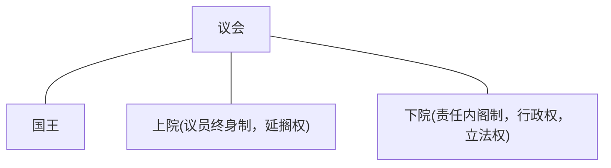
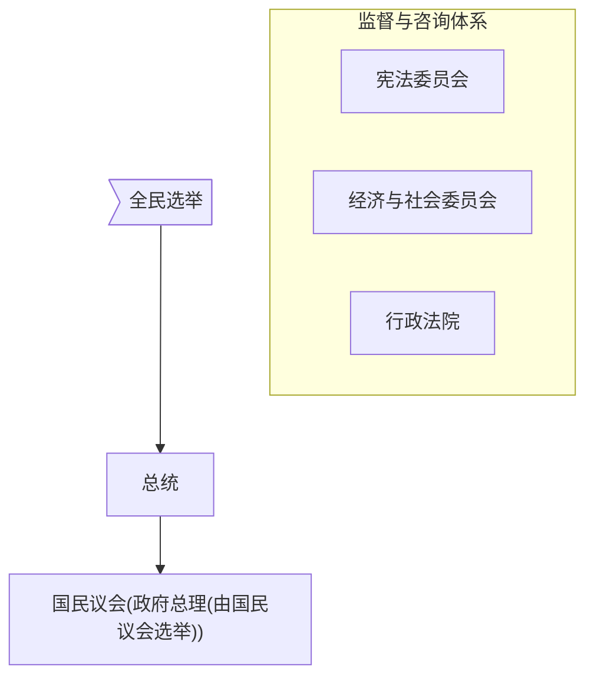

[TOC]

# 启蒙运动

## Intro

**何为启蒙**

* 德国哲学家康德认为：启蒙就是人们脱离自己所加之于自己的不成熟状态。
* 不成熟状态就是不经别人的引导对自己的理智就无能为力。其原因不是缺乏理智，而在于没有勇气运用理智。
* 启蒙的口号：“勇敢地运用你自己的理智！”、“迈向哲学的第一步是怀疑”

**启蒙的路径**

* 英国：开启思想启蒙的帷幕 
* 法国：欧洲启蒙运动的中心
* 德国：启蒙运动走向尾声

**为何会有一场思想的启蒙？**

* 关乎18世纪的时代特征
* 科学进步与启蒙发展的关系？

### 18世纪的时代特征

* 宗教改革与自然科学产生对社会产生影响
* 中产阶级与市民力量增长
* 人们的知识与视野开阔
* 欧洲大陆：封建制度没落，专制政治危机
* 英国：君主立宪确立，工业革命开始
    （以上成为启蒙运动时代背景）

> 路易十五：我死后哪管洪水滔天

🇬🇧和🇫🇷面临的启蒙运动任务是不一样的，🏴󠁧󠁢󠁥󠁮󠁧󠁿和🏴󠁧󠁢󠁳󠁣󠁴󠁿又不同

科技

伽利略🔭，牛顿三定律

## 🇬🇧

### 特色：经验理性

### 🏴󠁧󠁢󠁥󠁮󠁧󠁿

#### 霍布斯

* 现代人之父
* 《利维坦》
* 主要观点
    * 人性恶(evil)
        * 不同于马基雅维利
        * 属于一种自然属性 (社会还没形成的时候人性恶)
    * 自然状态与社会契约：交出自己的权力建立社会契约
    * 主权说：君主主权
        * 适逢英国在反君主
    * 国家机器的最终目的：保护个体的平等权利
    * 君主职责：保护和平，促进生成，保护个人权利
    * <u>霍布斯丛林法则</u>(弱肉强食)：保护弱者

#### 约翰·洛克

* 自由主义鼻祖
* 《政府论》《人类理智论》
* 主要观点
    * 强调感性经验是人类知识的来源
    * 系统论证自然权利理论（每个人都是平等的，拥有私有财产的权利）
    * 自然法和社会契约（个人权利与财产权先于政府存在）
    * 三种政体：民主政体、寡头政体、君主政体
    * 分权理论：立法权、执行权、对外权
        * 和孟德斯鸠的不一样
    * 他的理论对法国启蒙、苏格兰启蒙与美国独立时期的思想家都有极大影响

### 🏴󠁧󠁢󠁳󠁣󠁴󠁿

#### 休谟

* 英国经验主义哲学代表
* 《人性论》、《人类理解论》、《道德原理研究》（另：长达100多万字的《大不列颠史》在当时成为英格兰历史学界的基础著作长达60-70年
* 思想
    * 经验主义怀疑论哲学
        * 对感觉印象来源、理性演绎、因果关系等现象的不确定性的理解，即所谓的“休谟问题”（“是”是否可以导向“应该”，康德称这些反思就是“休谟问题”）
        * 怀疑所谓的理性演绎 ：尽管演证性科学中的规则都是确定的和无误的。但是当人们应用它们的时候,易误的、不准确的官能却很容易违背这些规则,而陷入错误之中。
    * 只有不确定性是确定的，其它都值得怀疑
    * 休谟问题

#### 斯密

* 西方古典政治经济学的奠基人
* 作品
    * 经济学：《国民财富的性质与原因研究》(严复翻译成《国富论》不太准确)
    * 伦理学(市场分工中的个体)：《道德情操论》
* 思想
    * 人类具有六种基本情感：自爱、同情、追求自由、正义感、劳动习惯、交换
    * 论证寻求个人利益的合理性：“经济人”概念
    * 提倡自由竞争，放任政策：“市场经济”的概念
    * 揭示劳动价值论：利润

#### 苏格兰特色

* 以爱丁堡、阿伯丁、格拉斯哥等城市为中心的精英运动
* 政界、学界、商界紧密结合，贴近社会实际
* 强调经验、尊重传统与习俗

## 🇫🇷

* 沙龙文化为运动的展开提供了阵地
* 主要任务：为即将到来的新社会呼风唤雨　
* 启蒙思想家的哲学基础：怀疑论、自然神论、无神论

### 沙龙文化

* “沙龙”是法语Salon一字的译音,原指法国上层人物住宅中的豪华会客厅。中世纪以来特别是1667年路易十四在卢浮宫的阿波罗沙龙举办皇家绘画雕塑学院院士的作品展后，沙龙文化方兴未艾
* 特征：雅致聪慧的女主人、三观相对一致的风雅人士 (比如伏尔泰和卢梭是死对头)
* 后风传延伸到俱乐部、咖啡馆、书店甚至街头
* 是一种重要的社交场所，可以说是早期信息社会的一种表征

### 人物

* **伏尔泰**
    * 伏尔泰：《哲学通讯》，理性是一切的动力
    * 主张开明专制，崇尚言论自由
    * “开启民智的精神导师  被誉为法兰西思想之父、欧洲的良心”
* **孟德斯鸠**：《论法的精神》，提倡三权分立，倡导君主立宪
* **狄德罗**：主编《百科全书》，分门别类记录知识，知识之间的有机联系“知识树”
    * 提倡共和
* **卢梭**：
    * 主要代表小资产阶级
    * 《社会契约论》，《论人类不平等的起源》 ， 主张天赋人权，主权在民
        《忏悔录》、《爱弥尔》、《新爱洛伊丝》，《论科学与艺术》，崇尚自然、强调德性
    * 双重人格

#### 主要思想

* 自然状态与社会契约说
* 普遍人性与普遍理性说
* 天赋人权与人民主权
* 自由与平等理念
* 三权分立与相互制衡
* 进步主义的观念

## 总结

**启蒙的作用和意义**

* 西欧观念变革的集大成者：人权、民主自由、市场经济、权力分散与制衡、社会进步
* 为即将建构的新政体提供了某种框架
* 英式启蒙（强调经验）与法式启蒙（强调理性）都给后世以启示
* 中国的“五四运动”更多地有法式启蒙的特征，充分显示了中国特色

# 政治革命和政体变革

## Intro

### 思考

1. 革命会在怎样的情形下发生？
2. 革命是因为理想还是利益？
3. 革命中精英与民众的关系，彼此的作用？
4. 革命与改革的关系

 **为什么以革命的方式?**
(相关的革命理论)
• 阶级斗争理论:阶级矛盾与斗争 , 反抗压迫，推动革命
• 聚合-心理学理论:革命起源于人们的情绪活动— —某种发泄不满、改变现状的途径
• 政治-冲突理论:各利益集团之间为获取权力而展 开竞争——一种权力转移的方式

## 🇬🇧资产阶级革命(1640-1688)

### 17世纪前后社会结构变化

* 英国封建社会内部，资本主义有了长足的发 展(新的经济因素在农村生长，是英国资本主义发 展最主要的特点之一)新经济发展，英国出 现了新阶层 (“新贵族”、农业资本家)
* 16 世纪末的清教运动(反国教(安立甘宗))，引发社会 观念的变化与分化 , 有人称为“清教徒革 命”
* 新专制政治与议会传统的矛盾:鼓吹“君权 神授”，不合时宜的内外政策(滥征捐税、 强迫信仰国教 , 要苏格兰教会用圣公会的 “公祷书”等)
* 查理一世征税问题引发的普遍不满：古典财政的悲剧

### 革命进程

* 革命的准备时期 (1640-1642)
* 内战时期 (1642-1649 )
* 革命发展时期( 1649-1653)
* 独裁到君主立宪 (1653-1688)

#### 进程解读

英国革命既有议会斗争，又有暴力革命

* 苏格兰反对英格兰干涉自身事务( 1639 年起义)，查理一世筹措 军费(征税)召开国会
* 国王与国会为自身权力(利)展开纷争，史界把 1640 年 8 月“长期国会”的召开视为革命开始
* 内战中，国会人、财、物占尽优势，国王查理一世被克伦威尔处死
* 共和国( 1649-1653 )与独裁( 1653-1688 )成为英国历史上短暂的记忆
    * 克伦威尔 查理二世(查理一世之子，欢乐王，天主教)
    * 詹姆斯二世(查理二世之弟，天主教)(辉格党、托利党两党制开启)
* 革命最终以议会斗争( 1688 年“光荣革命”，流放了詹姆斯二世)的协商与妥协方式结束 玛丽二世 威廉三世

#### 英国宪政体制的建立

* 从根本上说，英国革命所要解决的问题在于:国王 和议会，谁掌握国家主权? 英国的君主立宪制是一个自然演进的过程:
* 1066 年，诺曼征服英国时，御前会议
* 等级议会制:( 1215 年自由大宪章)开始王在法 下
* 1688 年光荣政变后的《权利法案》(1689 年)、《王位继承法》(1701 年)要求国王只能依据宪 法和法律进行统治。
* 议会享有立法权、决定预算和其他国家重大事务的权力 
* 英国建立了世界上第一个宪政民主政体

## 🇫🇷大革命

* 法国大革命是欧洲历史上的一次规模与影响都较大、具有特殊意义的革命
* 特别是革命过程中提出的“自由、平等、博 爱”的口号，对于欧洲整个 19 世纪文明的发展 ，乃至人类的进步，都具有无限的想像力。
* 1789 年 7 月 14 日，攻占巴士底狱，标志大革命的开始

### 革命前的法国

* 旧制度的危机与新因素的增长 (资本主义工商业、尤其是奢侈品业、银行业十分发
     达)
* 社会等级分层与流动 (贵族、僧侣、第三等级 [纳税阶级] ，贫富分化严重)
    * 英国似乎没有这么严重
    * 买官制度
* 财务危机与等级冲突 (从路易十四以来，国债高位运行。路易十六支持美国独立战争发行了大量国债，缓解危机需要大量税收，引起工商业资产阶级强烈不满)
    * 税收是三个阶级都对国王不满
* 自然灾难，粮食欠收，底层民众生活困苦不堪忍受

###  法国革命的历程

**分期**

* 斐扬派时期(1789-1792.8.10)：资产阶级上层，人权宣言
* 吉伦特派时期(1792.8.10-1793.6.4)：工商资产阶级，共和国
* 雅各宾派时期(1793.6.4-1794.7.27)：下层资产阶级，统制
* 督政府时期(1795-1799)：拨乱反正，过渡转型
* 拿破仑时代(1799-1815)：巩固成果，帝国遗产

**分析**

* 革命渐次激进，直至恐怖
    * 开始还有和解的可能，后来国王出逃，就难逃一死了
* 民众参与度很高
* 《八月法令》：废除全部封建义务
* 《人权与公民权宣言》：人们生来是而始终是自由 、平等的。
* 派系纷杂，斗争激烈
* 追求自由与平等，最终换来了专制与混乱
* 拿破仑成了大革命遗嘱的执行者

### Napoleon

**帝国**

* 1799 年雾月 18 日( 11 月 9 日)发动了军事政变， 成为共和国的执政官， 1804 年自封为法兰西皇帝
* 拿破仑在法国执政了约 16 年，可分两个时期  执政府时期( 1799 年 11 月- 1804 年 12 月)  第一帝国时期( 1804 . 12 - 1815 . 6 )
* 期间，拿破仑叱咤风云，成就卓著且影响深远，故这一时期也被称为“拿破仑时代”。

**贡献**

* 对外战争客观上传播了大革命的原则与思想
* 建立了法国的现代教育体制(从大学校到初级学校)
* 颁布《拿破仑法典》，成为大陆法系经典
    * “我真正的光荣并非打了四十次胜仗，滑铁 卢之战抹去了关于这一切的记忆。但是有 一样东西是不会被人忘却的，它将永垂不朽——那就是我的民法典。”

### 大革命

 **大革命的历史地位**

* 法国大革命已经过去两个多世纪了，而对其 是非功过的评价至今仍然聚讼纷纭
* 革命试图从根本上与旧制度决裂 , 使法国的社会与精神生活、风俗习惯都发生了变化
* 大革命对世界先进思想的发展也起了巨大的鼓舞和鞭策作用
* 革命中的非理性群众运动和扩大化的恐怖统治，都对法国造成了极大的危害
* 革命后的法国政局依然动荡(两次共和、两次帝制)，直至 1875 年第三共和国成立

**百年动荡**

* 第一帝国后，路易十八复辟(波旁王朝( 181 5-1830 )
* 1830 年 7 月革命，路易 · 菲力普“七月王 朝”( 1830-1848 )
* 1848 年 2 月革命，法兰西第二共和国( 1848- 1852 )
* 1851 年 12 月路易 · 波拿巴政变，法兰西第二帝国( 1852-1870 )
* 1870 年普法战争失败，巴黎公社革命，法兰西第三共和国( 1870-1940 )

**政体**

跳跃式发展，半总统制(1958，戴高乐)

# 英国工业革命和西方工业化

**工业革命与工业化(现代化的核心)**

* ~~“ 工业革命” ( The Industrial Revolution ）一词据说是由法国人一词据说是由法国人 阿道夫•布朗基最先使用的。也称产业革命，特指西欧工业化早布朗基最先使用的。也称产业革命，特指西欧工业化早 期( 18-19 世纪）一词据说是由法国人的历程，**即手工工场向大机器的过渡阶段**。~~ 最早形容机器的变革
* 历史学家汤因比赋予其**社会变迁**的意义(“英国工业革命讲座”）一词据说是由法国人
    农业社会向工业社会的变迁是一种渐进的过程，用“革命”似有不妥。有学者倾向用“工业化”( Industrialization)
* 现代化( Modernization) 是一种新的文明形式 ( 工业文明 ) 逐渐确立的过程，它包含着整体的社会变动。
* 经典现代化的指标:
    * 民主化、 **工业化**、 都市化
    * 教育普及化 、社会生活世俗化、多元化

## 🇬🇧工业革命

### 条件

* 社会政治较为自由、宽松，没有大规模的战争史称 :快乐的英格兰(君主立宪，新教国家)
* 资本原始积累 ( 圈地运动，商业扩张 ) ，国债制度 、股份公司、银行建立起来。富人增多，投资实业成为风尚
* 依靠商业与航海较早地建构了世界市场
* <u>人口的增殖与消费方式的变化</u>
* 实验科学的发展 ，鼓励发明与创新(月光社)
* 优越的地理条件 :航 ( 河)道便利，煤炭资源丰 富
* 总之：社会相对自由、资本与劳动力充足

**例：人口革命**

* 1741-1751 年，人口增长率为 3.5%
* 1751-1761 年，人口增长率为 7%
* 1780-1790 年，人口增长率为 11%
* 1811-1821 年，人口增长率为 18%
* 在英国历史上称为“人口革命

**例：棉布消费与保护主义**

* 17 世纪末期，英国东印度公司的棉布贸易要占进口总额的 60%—70% 。印度棉 布的大量涌入推动了英国大众服饰质地的 变化。
    * 本来是麻和毛，又贵又不容易染色，因此贵族和平民服装差异很大

* 1719 年，一个作者这样描述英国人的服饰:“所有卑微的人，包括女仆都穿上了 棉布服饰，因为这类服饰价格低廉、质地轻薄、色彩明快，不论是大街上玩耍的穷 人家的小孩还是寄宿学校富有家庭的小孩 都穿着棉布和亚麻布服饰。”
* 1701 年，议会通过“鼓励本国的制造业发展让穷人更有效地就业”的法案，限制所有 加工过的蚕丝、织品和原丝，以及来自波斯 、中国、印度生产的蚕丝进口，禁止穿着从 那些国家进口的印花，印染或着色的白棉布 制作的衣服
* 1721 年《白棉布法案》 , 规定 1722 年 12 月 25 日后，大不列颠无论何人使用进口的 各种印染、印花、白布做成的毯子，或是穿 着这类衣服，都将不再合法“

### 历程

工具机的发明是产业革命的导火线

工业化的第一个先导部门:棉纺织业(纺纱机)

为什么?

1. (毛纺织业)传统民族工业有技术基础，起点高。而熟练工人的经验、纺织技术可资利用
2. 棉布消费有市场，预期利润空间大
3. 广大的殖民地，棉花供应(生产资源)有保障
    * 肯定比羊毛充足
4. 新兴的独立行业，较少行会规章等约束，利于创新
    * 毛纺织业是传统行业，有行规

**纺织机器创新**

* 纺与织的产业结构矛盾，激发人们发明与创新
* 1733 年，英国钟表匠开伊发明“飞梭”(安 装在滑槽里带有小轮的梭子，滑槽两端装上弹 簧，使梭子可以极快地来回穿行。飞梭的发明 使织布速度变快，大大提高了织布效率)
* 1764 年，织布工人哈格里夫发明“珍 妮纺车”(手摇纺纱机， 8 个纱锭。 它一次可以纺出许多根棉线) , 功效 提高 8 倍。
    * 刚开始，珍妮机受到排斥， 1768 年获 得专利
        * 抢夺了同乡的生意，又因为专利所以人家买不起
    * 到 1784 年，珍妮机有 80 个纱锭
    * 到 1790 年左右，英国有珍妮机超过 2 万台
* 1769 年，理发师兼钟表匠阿克莱特 ( 近代工 厂之父 ) 制成水力纺纱机，建立了纺纱厂
* 1785 年，牧师卡特莱特发明水力织布机 ( power loom )，织布功效提高 40 倍，且因为功率均匀因此质量较好

**纺织业机器代替手工**

* 18 世纪末，英国的纺织业基本已用机器代替了手 工劳动
* 值得一提的是政府十分重视发明的专利保护 1624 年，英国就确立的专利制度
* 1852 年，《专利法修改法令》进一步完善
    * 持有专利40年

**改良蒸汽机，英国工业革命完成 **

本来的蒸汽机是矿上用的，热效率非常低，瓦特将X和X分开了，提高了热效率

* 瓦特发明 ( 改良 ) 的蒸汽机( 1784 年， 获得专 利)，解决了动力问题， 引发第一次技术革命
* “ 蒸汽机武装了人类，使虚弱无力的双手变得力 大无穷，健全了人类的大脑以处理一切难题。它 为机械动力在未来创造奇迹打下了坚实的基础， 将有助并报偿后代的劳动。”(瓦特的讣文)
* 为了纪念瓦特这位伟大的发明家，人们把常用的 功率单位定为瓦特，简称瓦
* 瓦特号称“工业革命之父”，是影响世界的 100 位人物之一

**机器推动机器，引发连锁反应**

* 1807 年，美国人富尔顿的“克莱蒙特号”汽船在哈得逊湾 下水( 1803 年在巴黎塞纳河试水失败)
* 1814 年，英国人史蒂芬孙成功将蒸汽机安置在运行的车上， 第一台蒸汽机车(火车)问世，“旅行号”时速 29 公里
* 1825年英国建造第一条铁路(利物浦-曼彻斯特 )
* 1829 年铁路通车，由史蒂芬孙设计的火车头(火箭号）牵引，最高时速 45 公里。史蒂芬孙被称为铁路机车之父
* 19 世纪 50 年代，英国的主要铁路干线均已完成
* 人类进入铁路时代

### 英国进入工业时代

* **产业结构**发生变化:农业在国民经济中的比重下降，第二、三产业成为新的经济增长点。( 1811 年，农业职业人 口在全国职业人口的比重为35% ，1835年英国棉纺织业已有23.7 万工人 ;毛纺织厂已达 1300 个，工人 7.1 万人 )
* **经济面貌**发生了变化 , 西北部借助充沛的能源—煤炭，迅速 崛起，曼彻斯特、伯明翰等城市的人流与物流都欣欣向荣
* **城市化进程开始**， 1851 年人口 10 万以上的城市 10 个。城市 人口占全国人口的 52%
* **社会阶级关系复杂化**，企业主脱颖而出(如阿克莱特，从一名理 发师发达为资产 20 万镑的资本家，被英王封为爵士)
* 一些新问题开始出现，比如环境问题、童工问题西方文明浙大通核

## 🇫🇷工业革命

**政治动荡**

* 1815-1830 年，波旁王朝复辟
* 1830-1848 年，金融王朝(七月王朝)当政
* 1848-1852 年，法兰西第二共和国
* 1852-1870 年，法兰西第二帝国 1870-1871 年，巴黎公社革命
* 1875 年确立共和体制(法兰西第三共和国)
* 从大革命开始至今，法国两个君主立宪、二个帝国、五个共和国

**政局稳定后催生工业化加速**

* 1830 年七月革命后工业革命真正开始
* 1820-1840 年，第一阶段，纺织部门大量使用机器，完成了 3000 公里的铁路线
* **第二帝国**时期产业革命发展，为第二阶段
* 重工业发展迅速，煤铁产量提高了两倍， 1870 年铁路总长: 17924 公里，基本完成主干线建设
* 拿破仑三世大力改造巴黎市政建设(设计具体者:乔治 · 尤金 · 奥斯 曼“男爵”，拆毁了巴黎 60% 的建筑 , 借贷了 5 万多亿法郎，打造了 一个现代化的巴黎)
* 19 世纪 60-70 年代工业革命基本完成
* 法国“两个拿破仑”对法国的发展有重要贡献

**法国工业化的弱点**

* 小农经济活跃，小土地大量存在
* 城市化进展相对缓慢，人口增长缓慢
* 工业结构不甚合理 ，中小企业占优 势
* 企业家缺乏创新意识，资金投入不足
* 这些弱点严重影响了法国发展与日后
    在资本主义世界的地位

## 二次工业革命

19 世纪 60-70 年代，以电力、电动机和内燃机发明 为主要特征
为什么欧美会再次掀起工业革命?
50-60 年代欧美的民主化有了新的进展
(美国内战后解决了奴隶制问题、英国议会与文官制 度改革......
科技有了新的突破
(电磁学理论日臻完善，化学、冶金技术，进化论...

### 主要成就:电及其应用

1732 年，美国政治家、发明家富兰克林首次提出了电流的概念 ，并通过风筝试验，发明了避雷针( 1752 年）一词据说是由法国人
1821 英国人法拉第发现一块磁铁穿过一个闭合线路时，线路内 就会有电流产生，这个效应叫电磁感应。据此 1831 年，法拉第 制出了世界上最早的第一台发电机。
1866 年德国西门子发明工业用发电机
1875 年，世界上第一座发电厂(专供弧光灯照明用电的巴黎北
火车站电厂）一词据说是由法国人建成
1882 年，纽约爱迪生珍珠街电厂是世界上第一座比较正规的发 电厂
 1879 年德国造了世界上第一台电机机车
19 世纪末，电动机开始排挤蒸汽机，人类进入“电气时代”
美国和德国是第二次技术革命的两个发源地和“中心”

**爱迪生与发明**

利用科学原理与实验室相结合的方式

发明的留声机、电影摄影机、电灯对世界有极大影响。他一生的发明共有 2000 多项，拥有专利 1000 多项

极大地丰富和改善了人类的文明生活

 **通讯技术的发明:电话、电报**

19 世纪 70 年代，美国人贝尔发明了电话(闻 名于世的贝尔实验室与贝尔电报公司有渊源)
19 世纪 90 年代，意大利人可尼试验无线电 报取得了成功
加强了世界各地的经济与文化联系

**各国产业革命大体始末年代**

* 英国: 1760 - 1830 年
* 法国: 1830 - 1860 年
* 德国: 1840 - 1875 年
* 美国: 1865 - 1890 年
* 日本: 1865 - 1900 年。
* 划分上述时期的主要根据是有没有建立大机 器的工业生产体制，工业资本是否在经济事 业中占优势。

|          | 第一次工业革命                              | 第二次工业革命              |
| -------- | ------------------------------------------- | --------------------------- |
| 时间     | 18 世纪 -19 世纪中期，从开始到完成约 100 年 | 1870-20 世纪初，约 30 年    |
| 开始部门 | 纺织业 ---- 轻工业                          | 电力 --- 重工业             |
| 发明者   | 工匠、技师                                  | 科学家、工程师              |
| 发明基础 | 生产、生活实践的总结                        | 自然科学成果的应用          |
| 范围     | 英国—法美—德                                | 几国同时开始                |
| 重要标志 | 蒸汽机 ----- 蒸汽时代                       | 电力的广泛应用 --- 电气时代 |

## 西方工业化特色

* 英、美、法自由主义式
    * 传统社会内部自发地产生推动工业化的因素
    * 通过自由市场的杠杆作用推动发展
    * 工业化为内生型的
* 德国(日本)统制主义式
    * 社会条件与工业化要求不够兼容
    * 通过自上而下的政府推动
    * 工业化为诱发型的

# 工业文明下的西欧

## 思想与文化

空想社会主义

国家主义

现实主义

浪漫主义

**四个基本价值观**

* 个性
* 理性
* 人性
* 诗性

## 西欧的强盛与战争(1950-1945)

按全球通史的划分，1500前东方富裕：富庶(丝绵瓷等)，人口多(前十基本上都是东方国家)

从陆权转向海权

* 近代西欧霸权国家都是有制海权的
    * 16世纪：葡萄牙 西班牙
    * 17世纪：荷兰 击败无敌舰队
    * 18世纪：英国
    * 1920s：拿破仑 维也纳体系
    * 20世纪：美国

国力强大不必然导致扩张

* 伏尔泰：蒙古人只留下了马粪
* 英国变强也不仅是靠扩张，还有资源整合能力等

欧盟

* 为什么是在欧洲
    * 版图小，国家多
    * 为了争夺资源争端多：伯罗奔尼撒开始一直打打到两次世界大战