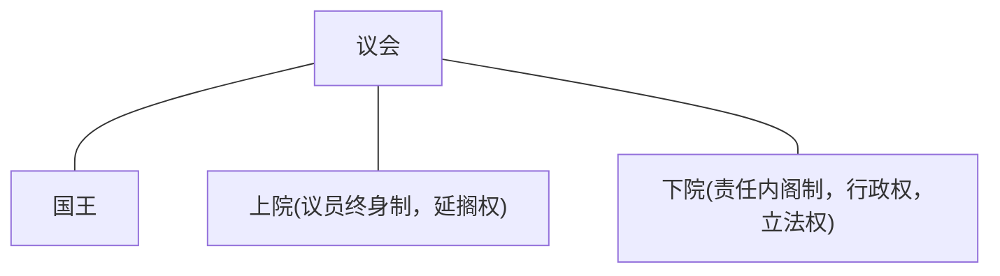

# 启蒙运动

## Intro

**何为启蒙**

* 德国哲学家康德认为：启蒙就是人们脱离自己所加之于自己的不成熟状态。
* 不成熟状态就是不经别人的引导对自己的理智就无能为力。其原因不是缺乏理智，而在于没有勇气运用理智。
* 启蒙的口号：“勇敢地运用你自己的理智！”、“迈向哲学的第一步是怀疑”

**启蒙的路径**

* 英国：开启思想启蒙的帷幕 
* 法国：欧洲启蒙运动的中心
* 德国：启蒙运动走向尾声

**为何会有一场思想的启蒙？**

* 关乎18世纪的时代特征
* 科学进步与启蒙发展的关系？

### 18世纪的时代特征

* 宗教改革与自然科学产生对社会产生影响
* 中产阶级与市民力量增长
* 人们的知识与视野开阔
* 欧洲大陆：封建制度没落，专制政治危机
* 英国：君主立宪确立，工业革命开始
    （以上成为启蒙运动时代背景）

> 路易十五：我死后哪管洪水滔天

🇬🇧和🇫🇷面临的启蒙运动任务是不一样的，🏴󠁧󠁢󠁥󠁮󠁧󠁿和🏴󠁧󠁢󠁳󠁣󠁴󠁿又不同

科技

伽利略🔭，牛顿三定律

## 🇬🇧

### 特色：经验理性

### 🏴󠁧󠁢󠁥󠁮󠁧󠁿

#### 霍布斯

* 现代人之父
* 《利维坦》
* 主要观点
    * 人性恶(evil)
        * 不同于马基雅维利
        * 属于一种自然属性 (社会还没形成的时候人性恶)
    * 自然状态与社会契约：交出自己的权力建立社会契约
    * 主权说：君主主权
        * 适逢英国在反君主
    * 国家机器的最终目的：保护个体的平等权利
    * 君主职责：保护和平，促进生成，保护个人权利
    * <u>霍布斯丛林法则</u>(弱肉强食)：保护弱者

#### 约翰·洛克

* 自由主义鼻祖
* 《政府论》《人类理智论》
* 主要观点
    * 强调感性经验是人类知识的来源
    * 系统论证自然权利理论（每个人都是平等的，拥有私有财产的权利）
    * 自然法和社会契约（个人权利与财产权先于政府存在）
    * 三种政体：民主政体、寡头政体、君主政体
    * 分权理论：立法权、执行权、对外权
        * 和孟德斯鸠的不一样
    * 他的理论对法国启蒙、苏格兰启蒙与美国独立时期的思想家都有极大影响

### 🏴󠁧󠁢󠁳󠁣󠁴󠁿

#### 休谟

* 英国经验主义哲学代表
* 《人性论》、《人类理解论》、《道德原理研究》（另：长达100多万字的《大不列颠史》在当时成为英格兰历史学界的基础著作长达60-70年
* 思想
    * 经验主义怀疑论哲学
        * 对感觉印象来源、理性演绎、因果关系等现象的不确定性的理解，即所谓的“休谟问题”（“是”是否可以导向“应该”，康德称这些反思就是“休谟问题”）
        * 怀疑所谓的理性演绎 ：尽管演证性科学中的规则都是确定的和无误的。但是当人们应用它们的时候,易误的、不准确的官能却很容易违背这些规则,而陷入错误之中。
    * 只有不确定性是确定的，其它都值得怀疑
    * 休谟问题

#### 斯密

* 西方古典政治经济学的奠基人
* 作品
    * 经济学：《国民财富的性质与原因研究》(严复翻译成《国富论》不太准确)
    * 伦理学(市场分工中的个体)：《道德情操论》
* 思想
    * 人类具有六种基本情感：自爱、同情、追求自由、正义感、劳动习惯、交换
    * 论证寻求个人利益的合理性：“经济人”概念
    * 提倡自由竞争，放任政策：“市场经济”的概念
    * 揭示劳动价值论：利润

#### 苏格兰特色

* 以爱丁堡、阿伯丁、格拉斯哥等城市为中心的精英运动
* 政界、学界、商界紧密结合，贴近社会实际
* 强调经验、尊重传统与习俗

## 🇫🇷

* 沙龙文化为运动的展开提供了阵地
* 主要任务：为即将到来的新社会呼风唤雨　
* 启蒙思想家的哲学基础：怀疑论、自然神论、无神论

### 沙龙文化

* “沙龙”是法语Salon一字的译音,原指法国上层人物住宅中的豪华会客厅。中世纪以来特别是1667年路易十四在卢浮宫的阿波罗沙龙举办皇家绘画雕塑学院院士的作品展后，沙龙文化方兴未艾
* 特征：雅致聪慧的女主人、三观相对一致的风雅人士 (比如伏尔泰和卢梭是死对头)
* 后风传延伸到俱乐部、咖啡馆、书店甚至街头
* 是一种重要的社交场所，可以说是早期信息社会的一种表征

### 人物

* **伏尔泰**
    * 伏尔泰：《哲学通讯》，理性是一切的动力
    * 主张开明专制，崇尚言论自由
    * “开启民智的精神导师  被誉为法兰西思想之父、欧洲的良心”
* **孟德斯鸠**：《论法的精神》，提倡三权分立，倡导君主立宪
* **狄德罗**：主编《百科全书》,分门别类记录知识，知识之间的有机联系“知识树”
    * 提倡共和
* **卢梭**：
    * 主要代表小资产阶级
    * 《社会契约论》，《论人类不平等的起源》 ， 主张天赋人权，主权在民
        《忏悔录》、《爱弥尔》、《新爱洛伊丝》，《论科学与艺术》，崇尚自然、强调德性
    * 双重人格

#### 主要思想

* 自然状态与社会契约说
* 普遍人性与普遍理性说
* 天赋人权与人民主权
* 自由与平等理念
* 三权分立与相互制衡
* 进步主义的观念

## 总结

**启蒙的作用和意义**

* 西欧观念变革的集大成者：人权、民主自由、市场经济、权力分散与制衡、社会进步
* 为即将建构的新政体提供了某种框架
* 英式启蒙（强调经验）与法式启蒙（强调理性）都给后世以启示
* 中国的“五四运动”更多地有法式启蒙的特征，充分显示了中国特色

# 政治革命和政体变革

## Intro

### 思考

1. 革命会在怎样的情形下发生？
2. 革命是因为理想还是利益？
3. 革命中精英与民众的关系，彼此的作用？
4. 革命与改革的关系

 **为什么以革命的方式?**
(相关的革命理论)
• 阶级斗争理论:阶级矛盾与斗争 , 反抗压迫，推动革命
• 聚合-心理学理论:革命起源于人们的情绪活动— —某种发泄不满、改变现状的途径
• 政治-冲突理论:各利益集团之间为获取权力而展 开竞争——一种权力转移的方式

## 🇬🇧资产阶级革命(1640-1688)

### 17世纪前后社会结构变化

* 英国封建社会内部，资本主义有了长足的发 展(新的经济因素在农村生长，是英国资本主义发 展最主要的特点之一)新经济发展，英国出 现了新阶层 (“新贵族”、农业资本家)
* 16 世纪末的清教运动(反国教(安立甘宗))，引发社会 观念的变化与分化 , 有人称为“清教徒革 命”
* 新专制政治与议会传统的矛盾:鼓吹“君权 神授”，不合时宜的内外政策(滥征捐税、 强迫信仰国教 , 要苏格兰教会用圣公会的 “公祷书”等)
* 查理一世征税问题引发的普遍不满：古典财政的悲剧

### 革命进程

* 革命的准备时期 (1640-1642)
* 内战时期 (1642-1649 )
* 革命发展时期( 1649-1653)
* 独裁到君主立宪 (1653-1688)

#### 进程解读

英国革命既有议会斗争，又有暴力革命

* 苏格兰反对英格兰干涉自身事务( 1639 年起义)，查理一世筹措 军费(征税)召开国会
* 国王与国会为自身权力(利)展开纷争，史界把 1640 年 8 月“长期国会”的召开视为革命开始
* 内战中，国会人、财、物占尽优势，国王查理一世被克伦威尔处死
* 共和国( 1649-1653 )与独裁( 1653-1688 )成为英国历史上短暂的记忆
    * 克伦威尔 查理二世(查理一世之子，欢乐王，天主教)
    * 詹姆斯二世(查理二世之弟，天主教)(辉格党、托利党两党制开启)
* 革命最终以议会斗争( 1688 年“光荣革命”，流放了詹姆斯二世)的协商与妥协方式结束 玛丽二世 威廉三世

#### 英国宪政体制的建立

* 从根本上说，英国革命所要解决的问题在于:国王 和议会，谁掌握国家主权? 英国的君主立宪制是一个自然演进的过程:
* 1066 年，诺曼征服英国时，御前会议
* 等级议会制:( 1215 年自由大宪章)开始王在法 下
* 1688 年光荣政变后的《权利法案》(1689 年)、《王位继承法》(1701 年)要求国王只能依据宪 法和法律进行统治。
* 议会享有立法权、决定预算和其他国家重大事务的权力 
* 英国建立了世界上第一个宪政民主政体

## 🇫🇷大革命

